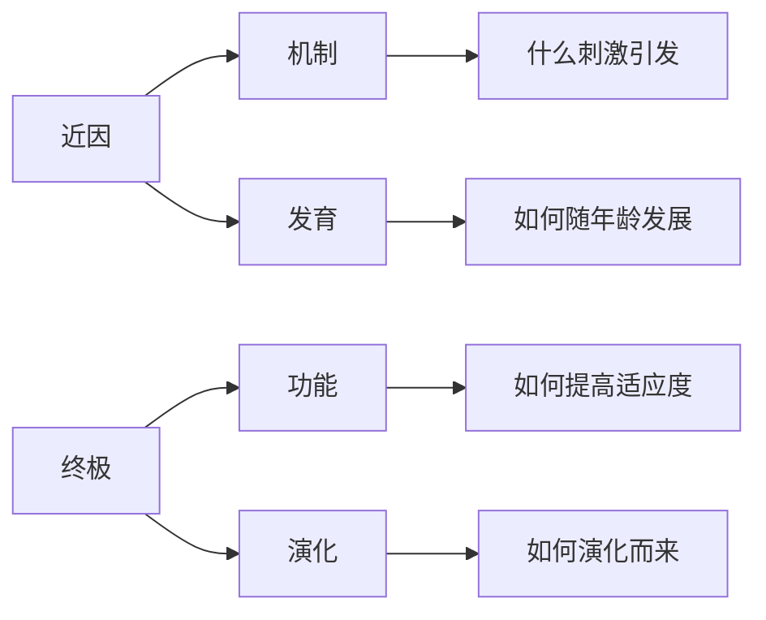

# 动物行为学

动物行为学（Ethology / Animal Behavior）是研究动物行为的原因、机制、发展和演化意义的科学。它融合了生物学、心理学、神经科学和演化生物学，研究动物在自然环境中如何行动以及为什么这样行动。

## 什么是动物行为

动物行为（Animal Behavior）是动物对外部刺激或内部状态做出的可观察反应。行为是有机体与其环境互动的基本方式。

$$ \text{Behavior} = f(\text{Genetics}, \text{Environment}, \text{Experience}) $$

## Tinbergen 的四层次分析框架

诺贝尔生理学奖得主 Niko Tinbergen 提出了理解动物行为的经典框架：

| 问题 | 层面 | 具体提问 | 示例：知更鸟攻击红色物体 |
|------|------|---------|------------------------|
| 机制（Mechanism） | 近因 | 什么刺激引发行为？| 红色羽毛的颜色刺激视觉系统 |
| 发育（Ontogeny） | 近因 | 行为如何随年龄出现？| 幼鸟在第一次繁殖季节后才表现出攻击性 |
| 功能（Function） | 终极 | 行为如何提高适应度？| 驱逐雄性竞争者以保护领地资源 |
| 演化（Phylogeny） | 终极 | 行为如何演化而来？| 领地行为在雀形目鸟类中普遍存在 |

## 先天性行为与后天学习

### 先天性行为（Innate Behavior）
不受经验影响、与生俱来的行为：
- **趋性**（Kinesis/Taxis）：朝或离刺激方向的运动——正趋光性（飞蛾扑火）、负趋地性
- **反射**（Reflex）：简单的自动反应——膝跳反射、缩手反射
- **本能/固定动作模式**（Fixed Action Pattern, FAP）：如三刺鱼的求偶舞蹈、蜘蛛结网

### 后天的学习（Learned Behavior）
根据经验改变行为的能力：

| 学习类型 | 描述 | 经典示例 |
|---------|------|---------|
| 习惯化（Habituation） | 反复刺激后反应减弱 | 鸟类不再害怕稻草人 |
| 经典条件反射（Classical Conditioning）| 中性刺激与反应关联 | 巴甫洛夫的狗听到铃声分泌唾液 |
| 操作条件反射（Operant Conditioning）| 行为与奖惩关联 | 斯金纳箱：老鼠按杆获得食物 |
| 印随（Imprinting） | 关键期的快速学习 | 刚孵化的幼鸭跟随第一个移动物 |
| 观察学习（Observational Learning）| 模仿同类的行为 | 猴子观察并学会洗食物 |
| 洞察学习（Insight Learning）| 通过理解解决问题 | 黑猩猩叠箱子取高处的香蕉 |

---

## 社会行为（Social Behavior）

### Hamilton 的亲缘选择理论（Kin Selection）
利他行为（Altruism）可以通过亲缘选择来解释：

$$ rB > C $$

- $r$ = 施助者与受益者之间的亲缘系数
- $B$ = 受益者的生殖收益
- $C$ = 施助者的生殖成本

$$ r_{parent-child} = 0.5 $$
$$ r_{sibling} = 0.5 $$
$$ r_{grandparent-grandchild} = 0.25 $$
$$ r_{first\ cousin} = 0.125 $$

### 互惠利他（Reciprocal Altruism）
非亲缘个体之间的相互帮助，基于"你帮我，我下次帮你"的原则。

### 社会性昆虫（Social Insects）
- **真社会性**（Eusociality）：蜂群、蚁群、白蚁
- 特征：生殖分工、世代重叠、合作育幼
- **等级制度**：蜂王、工蜂、雄蜂

### 领地行为（Territorial Behavior）
- 功能：确保食物、配偶、繁殖空间
- 表现形式：鸣叫、展示、攻击、气味标记
- 经济可防御性（Economic Defensibility）：当资源的价值超过防御成本时产生领地

---

## 动物通讯

| 通讯渠道 | 优点 | 缺点 | 示例 |
|---------|------|------|------|
| 视觉信号 | 方向性强、即时 | 需光线、不可绕过障碍 | 孔雀开屏、蜜蜂舞蹈 |
| 听觉信号 | 传播远、可绕过障碍 | 消耗能量、可被拦截 | 鸟鸣、狼嚎、鲸歌 |
| 化学信号 | 持久、可标记 | 传播慢、风影响 | 信息素（蚂蚁的 trail pheromone）|
| 触觉信号 | 近距离可靠 | 距离极短 | 蜜蜂的"摇摆舞"中的触角接触 |

### 蜜蜂的舞蹈语言
- **圆舞**（Round Dance）：食物在 50 米以内
- **摆尾舞**（Waggle Dance）：食物在 50 米以外
  - 摆动方向 → 相对于太阳的角度
  - 摆动时间 → 距离

### 鸟鸣（Bird Song）
- 鸣啭（Song）：雄性繁殖期吸引雌性、保卫领地
- 鸣叫（Call）：警戒、联络、幼鸟乞食
- 学习鸣声的敏感期（Critical Period）

---

## 生殖行为与性选择

### Fisher 的 runaway 选择
雌性偏好某一特征（如雄孔雀的长尾）→ 具有该特征的雄性获得更多交配机会 → 后代同时继承该特征和偏好该特征的基因 → 特征不断扩大。

### 好基因假说（Good Genes Hypothesis）
夸张的雄性特征（如鲜艳的羽毛）是"健康指标"——只有健康的个体才能负担得起这种昂贵的特征。

### 求偶行为（Courtship Behavior）
- 功能：物种识别、同性竞争、雌性选择
- 形式：展示羽毛、建筑求偶场（Bower）、提供聘礼（Nuptial Gift）

### 交配系统（Mating System）

| 类型 | 描述 | 实例 |
|------|------|------|
| **单配制**（Monogamy）| 一雄一雌 | 天鹅、企鹅 |
| **多配制**（Polygamy）| 一雄多雌（Polygyny）或一雌多雄（Polyandry） | 狮子、蜂鸟 |
| **混配制**（Promiscuity）| 无固定配对 | 黑猩猩 |

### 亲代投资（Parental Investment）
- Trivers 理论：投资更多的一方（通常为雌性）成为限制性资源
- 性选择：投资少的一方（通常为雄性）竞争投资多的一方的交配权

---

## 觅食行为（Foraging Behavior）

### 最优觅食理论（Optimal Foraging Theory）
- **目标**：单位时间内获得最大净能量
- **决策**：吃什么、在哪里觅食、觅食多长时间
- **边际值定理**（Marginal Value Theorem）：当当前斑块觅食率下降到环境平均水平时离开

### 捕食策略
- 伏击（Ambush）：静待猎物接近
- 追捕（Pursuit）：主动追逐猎物
- 合作捕食（Cooperative Hunting）：狼群、狮群

### 反捕食策略

| 策略 | 描述 | 示例 |
|------|------|------|
| 隐蔽（Camouflage）| 伪装与环境融为一体 | 竹节虫、变色龙 |
| 警戒色（Warning Coloration）| 鲜艳颜色警告毒性 | 箭毒蛙、蜜蜂 |
| 拟态（Mimicry）| 模拟危险或有毒物种 | 食蚜蝇模仿蜜蜂 |
| 假死（Tonic Immobility）| 装死迷惑捕食者 | 负鼠 |
| 鸣叫警戒（Alarm Call）| 警示同伴危险 | 土拨鼠、猴 |

---

## 动物行为的遗传学基础

- **单基因控制的行为**：如果蝇的求偶舞蹈由 fruitless 基因控制
- **多基因影响的行为**：如小鼠的母性行为受多个基因调控
- **表型可塑性**（Phenotypic Plasticity）：同一基因型在不同环境下可产生不同行为

---

## 高中考点

1. Tinbergen 四层次分析法的理解和应用
2. 先天行为与学习行为的区分与对比
3. 经典条件反射与操作性条件反射的区别
4. Hamilton 亲选择法则（$rB > C$）的简单计算
5. 动物通讯的四种主要方式
6. 固定动作模式（FAP）的特征和实例

## 相关条目

- [[动物分类学]]
- [[INDEX|当前目录索引]]
