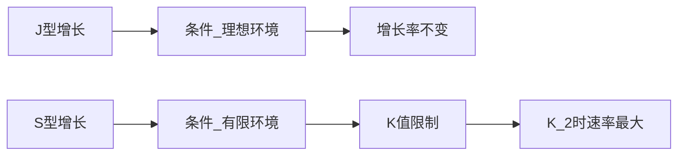
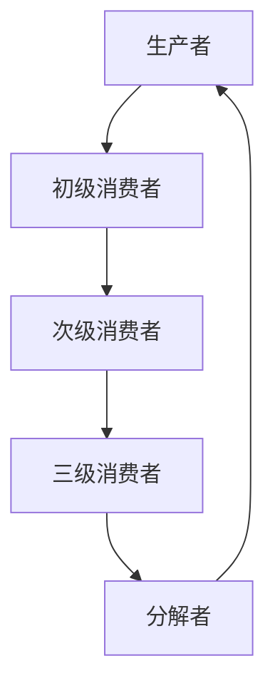

# 高中生物 · 生态与环境

> 必修3 模块 — 生态学（Ecology）

---

## 一、种群（Population）

### 1. 种群的特征

- **种群密度**（Population Density）：单位面积或体积内的个体数
- **出生率/死亡率**（Birth/Mortality Rate）
- **迁入率/迁出率**（Immigration/Emigration Rate）
- **年龄结构**（Age Structure）：增长型、稳定型、衰退型
- **性别比例**（Sex Ratio）

### 2. 种群数量增长模型

**J型增长**（Exponential Growth）：
$$ N_t = N_0 \lambda^t $$

- 条件：理想环境，食物空间充足，无天敌
- 特点：增长率不变，增长速率持续增大

**S型增长**（Logistic Growth）：
$$ \frac{dN}{dt} = rN\left(1 - \frac{N}{K}\right) $$

- 条件：有限环境
- $K$ 值：环境容纳量（Carrying Capacity）
- 特点：$\frac{K}{2}$ 时增长速率最大

### 3. 种群数量的影响因素

- **密度制约因素**（Density-dependent）：食物、竞争、疾病
- **非密度制约因素**（Density-independent）：气候、灾害、污染

### 4. 群落的结构（Community Structure）

| 结构类型 | 描述 | 举例 |
|---------|------|------|
| **垂直结构**（Vertical） | 不同物种在垂直方向的分层 | 森林乔木层、灌木层、草本层 |
| **水平结构**（Horizontal） | 不同物种在水平方向的分布 | 沼泽到林地的渐变 |
| **时间结构**（Temporal） | 物种活动时间的分化 | 昼行性/夜行性动物 |

### 5. 种间关系（Interspecific Relationships）

| 关系类型 | 物种A | 物种B | 实例 |
|---------|-------|-------|------|
| **捕食**（Predation） | + | — | 狼和羊 |
| **竞争**（Competition） | — | — | 两种草争夺水分 |
| **寄生**（Parasitism） | + | — | 蛔虫和人 |
| **互利共生**（Mutualism） | + | + | 根瘤菌和豆科植物 |
| **偏利共生**（Commensalism） | + | 0 | 附生植物和树木 |

---

## 二、生态系统（Ecosystem）

### 1. 生态系统的组成

| 成分 | 功能 | 包含 |
|------|------|------|
| **非生物物质和能量** | 提供基础 | 阳光、水、CO₂、无机盐 |
| **生产者**（Producers） | 固定太阳能 | 绿色植物、藻类、光合细菌 |
| **消费者**（Consumers） | 能量传递 | 草食动物、肉食动物 |
| **分解者**（Decomposers） | 物质循环 | 细菌、真菌 |

### 2. 食物链与食物网（Food Chain & Food Web）

**营养级**（Trophic Level）：
- 第一营养级：生产者
- 第二营养级：初级消费者（草食动物）
- 第三营养级：次级消费者（肉食动物）

**生态金字塔**（Ecological Pyramid）：

| 金字塔类型 | 含义 | 形状 |
|-----------|------|------|
| **数量金字塔** | 各营养级个体数量 | 通常正立，可倒立 |
| **生物量金字塔** | 各营养级有机物总量 | 通常正立 |
| **能量金字塔** | 各营养级能量总量 | 永远正立 |

### 3. 能量流动（Energy Flow）

**林德曼效率**（Lindeman Efficiency）：
$$ \text{传递效率} = \frac{\text{下一营养级同化量}}{\text{上一营养级同化量}} \times 100\% $$

- 一般为 10%—20%
- 未被利用的能量 → 呼吸消耗、分解者利用、未被摄取

**能量流动的特点**：
1. 单向流动（Single Direction）
2. 逐级递减（Gradually Decrease）

### 4. 物质循环（Nutrient Cycle）

**碳循环**（Carbon Cycle）：
$$ CO_2 \xrightarrow{\text{光合作用}} \text{有机物} \xrightarrow{\text{呼吸作用/燃烧}} CO_2 $$

**氮循环**（Nitrogen Cycle）：
$$ N_2 \xrightarrow{\text{固氮}} NH_3 \xrightarrow{\text{硝化}} NO_2^- \xrightarrow{\text{硝化}} NO_3^- \xrightarrow{\text{反硝化}} N_2 $$

| 过程 | 微生物 | 转化 |
|------|--------|------|
| 固氮作用 | 根瘤菌、固氮菌 | $N_2 \to NH_3$ |
| 硝化作用 | 硝化细菌 | $NH_3 \to NO_3^-$ |
| 反硝化作用 | 反硝化细菌 | $NO_3^- \to N_2$ |
| 氨化作用 | 分解者 | 有机物 $\to NH_3$ |

**水循环**（Water Cycle）：蒸发 → 蒸腾 → 降水 → 径流

---

## 三、生态环境的保护

### 1. 生物多样性（Biodiversity）

| 层次 | 定义 | 实例 |
|------|------|------|
| **遗传多样性**（Genetic） | 种内基因变异 | 水稻品种差异 |
| **物种多样性**（Species） | 物种丰富度 | 热带雨林 vs 荒漠 |
| **生态系统多样性**（Ecosystem） | 生境类型 | 森林、湿地、海洋 |

**生物多样性的价值**：
- **直接价值**（Direct Use Value）：食物、药物、木材
- **间接价值**（Indirect Value）：调节气候、水源涵养
- **潜在价值**（Potential Value）：未知的药用和遗传资源

### 2. 生态环境问题

| 问题 | 原因 | 后果 |
|------|------|------|
| **温室效应** | CO₂、CH₄等温室气体增加 | 全球变暖、海平面上升 |
| **酸雨** | SO₂、NOₓ排放 | 土壤酸化、建筑腐蚀 |
| **水体富营养化** | N、P过量排放 | 赤潮、水华 |
| **臭氧层破坏** | Freon等排放 | UV辐射增强 |
| **生物多样性丧失** | 栖息地破坏、过度捕猎 | 物种灭绝 |

### 3. 生态工程（Ecological Engineering）

**基本原理**：
- 物质循环再生原理（Material Recycling）
- 物种多样性原理（Species Diversity）
- 协调与平衡原理（Coordination & Balance）
- 整体性原理（Holism）
- 系统学和工程学原理（System & Engineering）

**实例**：
- 沼气生态农业
- 桑基鱼塘
- 湿地生态恢复

### 4. 可持续发展（Sustainable Development）

**核心**：既满足当代人的需求，又不危及后代人满足其需求的能力

**措施**：
1. 建立自然保护区（Nature Reserve）
2. 退耕还林、还草、还湖
3. 控制人口增长
4. 发展清洁能源（Clean Energy）
5. 减少污染排放

---

## 四、全球生态问题精析

### 温室效应与碳平衡

**碳汇**（Carbon Sink）：吸收CO₂的生态系统（森林、海洋）
**碳源**（Carbon Source）：释放CO₂的生态系统（燃烧、呼吸）

**碳中和**（Carbon Neutrality）：排放量 = 吸收量

### 生态足迹（Ecological Footprint）

- 定义：维持一个人或一个地区生存所需的生物生产性土地面积
- 生态赤字（Ecological Deficit）：足迹 > 承载力
- 生态盈余（Ecological Surplus）：足迹 < 承载力

### 生态恢复（Ecological Restoration）

| 恢复类型 | 方法 | 目标 |
|---------|------|------|
| 退矿复垦 | 覆土、植被重建 | 恢复矿山生态 |
| 湿地恢复 | 补水、植被种植 | 恢复湿地功能 |
| 森林恢复 | 封山育林、人工造林 | 恢复森林生态系统 |

---

## 五、种群与群落的动态精析

### 生态位（Niche）

- **生态位宽度**：物种利用资源的能力范围
- **生态位重叠**：不同物种利用相同资源
- **竞争排除原理**（Competitive Exclusion Principle）：两个物种不能长期占据同一生态位

### 群落演替（Succession）

| 类型 | 起始条件 | 方向 | 实例 |
|------|---------|------|------|
| **初生演替**（Primary） | 无土壤、无生物 | 裸岩→地衣→苔藓→草本→灌木→乔木 | 火山岩上的演替 |
| **次生演替**（Secondary） | 原有植被破坏但土壤保留 | 弃耕农田→杂草→灌木→乔木 | 废弃农田的演替 |

**演替规律**：
- 物种多样性增加
- 群落结构复杂化
- 稳定性增强
- 生物量增加

### 生态系统的稳定性（Ecosystem Stability）

| 稳定性类型 | 含义 | 与物种多样性的关系 |
|-----------|------|-------------------|
| **抵抗力稳定性**（Resistance） | 抵抗干扰保持原状的能力 | 正相关 |
| **恢复力稳定性**（Resilience） | 受到干扰后恢复的能力 | 负相关 |

---

## 实验技能

| 实验 | 要点 |
|------|------|
| 种群密度调查——样方法 | 随机取样、样方大小 |
| 种群密度调查——标志重捕法 | 标记不影响存活、充分混合后再捕 |
| 土壤中小动物类群调查 | 诱虫器、丰富度统计 |
| 探究水族箱中群落的演替 | 生态缸制作、观察记录 |

## 相关条目

[[02_NaturalSciences/Biology/Ecology/INDEX|Ecology]], [[02_NaturalSciences/EnvironmentalScience/INDEX|EnvironmentalScience]], [[02_NaturalSciences/Biology/PopulationBiology/INDEX|PopulationBiology]]
