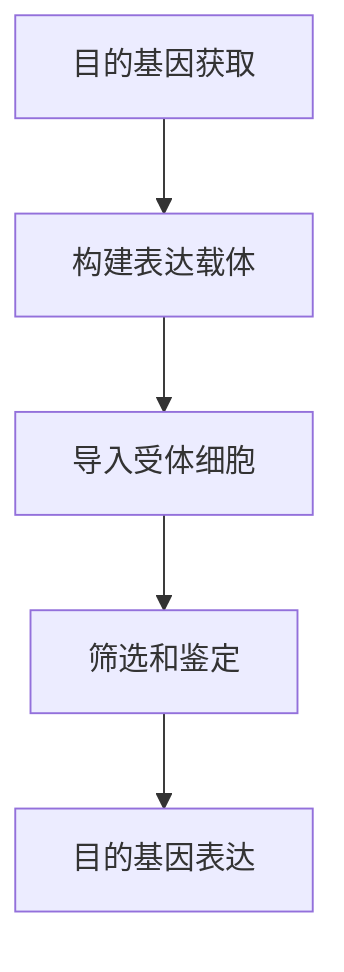
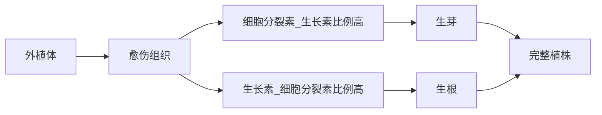

# 高中生物 · 生物技术学

> 选修3 模块 — 现代生物科技专题

---

## 一、基因工程（Genetic Engineering）

### 1. 基因工程的基本工具

**限制性内切核酸酶（Restriction Endonuclease）**：
- 识别特定的 DNA 序列（回文序列）
- 切割磷酸二酯键
- 产生黏性末端或平末端
- 举例：EcoRI（GAATTC）

**DNA 连接酶（DNA Ligase）**：
- 连接两个 DNA 片段
- 恢复磷酸二酯键
- E.coli DNA 连接酶和 T₄ DNA 连接酶

**载体（Vector）**：
- 功能：携带外源 DNA 进入受体细胞
- 要求：能复制、有多个限制酶切位点、有标记基因
- 常见载体：质粒（Plasmid）、噬菌体（Phage）、病毒（Virus）

### 2. 基因工程的基本步骤

**步骤 1：目的基因的获取**
- 从基因文库（Genomic Library）中获取
- cDNA 文库（从 mRNA 逆转录）
- PCR 扩增（Polymerase Chain Reaction）
- 人工化学合成

**步骤 2：表达载体的构建**
- 含目的基因、启动子（Promoter）、终止子（Terminator）、标记基因（Marker Gene）
- 使用同一种限制酶切割载体和目的基因
- 用 DNA 连接酶连接

**步骤 3：导入受体细胞**
- **微生物细胞**：Ca²⁺处理（感受态细胞）
- **植物细胞**：农杆菌转化法（Agrobacterium）、基因枪法（Gene Gun）
- **动物细胞**：显微注射（Microinjection）、病毒介导

**步骤 4：筛选与鉴定**
- 标记基因筛选（抗生素抗性）
- 分子杂交（Southern Blot, Northern Blot）
- 抗原-抗体杂交（Western Blot）
- 个体生物学水平鉴定

### 3. PCR 技术（Polymerase Chain Reaction）

$$ \text{DNA} \xrightarrow{94^\circ C} \text{变性} \xrightarrow{55^\circ C} \text{退火} \xrightarrow{72^\circ C} \text{延伸} \to 2^n \text{拷贝} $$

**所需材料**：
- 模板 DNA
- 引物（Primer，两种）
- Taq DNA 聚合酶（耐高温）
- dNTP 原料
- Mg²⁺ 缓冲液

**循环步骤**：

| 步骤 | 温度 | 作用 | 时间 |
|------|------|------|------|
| 变性 | 94℃ | DNA 双链解开 | 30s |
| 退火 | 50-65℃ | 引物与模板结合 | 30s |
| 延伸 | 72℃ | 新链合成 | 1min/kb |

### 4. DNA 测序（DNA Sequencing）

- Sanger 法（双脱氧测序法）：ddNTP 终止 DNA 合成
- 高通量测序（Next Generation Sequencing, NGS）
- 应用：基因组测序、突变检测、亲缘鉴定

---

## 二、细胞工程（Cell Engineering）

### 1. 植物细胞工程

**植物组织培养（Plant Tissue Culture）**：

- 原理：植物细胞的全能性（Totipotency）
- 条件：无菌、适宜培养基、激素比例
- 应用：快速繁殖、脱毒苗、人工种子

**植物体细胞杂交**：
- 去壁（纤维素酶+果胶酶）→ 原生质体融合（PEG/电融合）→ 杂种细胞 → 杂种植株
- 优点：克服远缘杂交不亲和性

### 2. 动物细胞工程

**动物细胞培养**：
- 原代培养（Primary Culture）→ 传代培养（Subculture）
- 条件：无菌、37℃、5% CO₂、培养基含血清
- 细胞系（Cell Line）与细胞株（Cell Strain）

**动物细胞融合**：
- 方法：PEG、灭活病毒、电融合
- 单克隆抗体（Monoclonal Antibody）制备：
  1. 免疫小鼠 → 取脾细胞
  2. 脾细胞 + 骨髓瘤细胞 → 杂交瘤细胞
  3. HAT 培养基筛选
  4. 单克隆抗体生产

**核移植（Nuclear Transfer / Cloning）**：
- 体细胞核移植 → 重组细胞 → 早期胚胎 → 代孕母体 → 克隆动物
- 实例：多莉羊（Dolly, 1997）

---

## 三、发酵工程（Fermentation Engineering）

### 1. 传统发酵技术

| 产品 | 微生物 | 原理 |
|------|--------|------|
| 果酒 | 酵母菌 | $C_6H_{12}O_6 \to 2C_2H_5OH + 2CO_2$ |
| 果醋 | 醋酸菌 | $C_2H_5OH + O_2 \to CH_3COOH + H_2O$ |
| 腐乳 | 毛霉 | 蛋白酶水解蛋白质 |
| 泡菜 | 乳酸菌 | $C_6H_{12}O_6 \to 2\ \text{乳酸}$ |

### 2. 现代发酵工程

**基本流程**：
菌种选育 → 扩大培养 → 培养基配制 → 灭菌 → 接种 → 发酵控制 → 分离纯化

**发酵罐控制因素**：
- 温度（Temperature）
- pH 值
- 溶氧量（Dissolved Oxygen, DO）
- 搅拌速度
- 营养物质添加速率

**产物类型**：

| 产物类型 | 实例 | 微生物 |
|---------|------|--------|
| 微生物菌体 | 单细胞蛋白（SCP） | 酵母菌 |
| 代谢产物 | 青霉素、味精 | 青霉菌、谷氨酸棒杆菌 |
| 酶制剂 | 淀粉酶、葡萄糖异构酶 | 枯草杆菌 |
| 生物活性物质 | 胰岛素、干扰素 | 工程菌 |

---

## 四、蛋白质工程（Protein Engineering）

### 1. 概念与流程

**定义**：根据蛋白质的结构与功能关系，通过基因改造或合成新基因，定向改造或创造蛋白质。

**与基因工程的区别**：
- 基因工程：改造基因，获得现有蛋白
- 蛋白质工程：设计新蛋白，创造新基因

**基本流程**：
$$\text{预期功能} \to \text{结构设计} \to \text{氨基酸序列预测} \to \text{核苷酸序列设计} \to \text{基因合成} \to \text{表达筛选}$$

### 2. 应用

- 定点突变（Site-directed Mutagenesis）
- 定向进化（Directed Evolution）
- 融合蛋白（Fusion Protein）
- **实例**：改造 TPA（组织纤溶酶原激活剂）延长半衰期

---

## 五、CRISPR/Cas9 基因编辑技术

### 1. 基本原理

- Cas9 蛋白：核酸内切酶（切割 DNA）
- sgRNA（single guide RNA）：引导 Cas9 到目标位点
- PAM 序列（NGG）：识别必需

$$ \text{sgRNA} + \text{Cas9} \xrightarrow{\text{识别PAM}} \text{DNA双链断裂} \xrightarrow{\text{NHEJ/HDR}} \text{基因编辑} $$

### 2. 修复机制

| 修复方式 | 机制 | 结果 |
|---------|------|------|
| **NHEJ**（非同源末端连接）| 直接连接断裂末端 | 小片段插入/缺失（基因敲除）|
| **HDR**（同源重组修复）| 以模板链修复 | 精确碱基替换/基因插入 |

### 3. 应用与伦理

**应用**：
- 基因功能研究
- 疾病模型构建
- 基因治疗（β-地中海贫血、镰状细胞病）
- 作物改良（抗病、高产）

**伦理争议**：
- 生殖细胞编辑（人类胚胎）
- 脱靶效应（Off-target Effects）
- 基因驱动（Gene Drive）对生态系统的影响

---

## 六、生物技术伦理与安全

### 1. 转基因生物的安全性（GMO Safety）

| 关注点 | 问题 | 监管措施 |
|--------|------|---------|
| 食品安全 | 致敏性、毒性 | 实质等同性原则 |
| 环境安全 | 基因漂移、生态影响 | 隔离种植 |
| 标记基因 | 抗生素抗性转移 | 无标记基因技术 |

### 2. 克隆技术的伦理

| 克隆类型 | 伦理状态 | 实例 |
|---------|---------|------|
| 治疗性克隆 | 部分国家允许 | 胚胎干细胞研究 |
| 生殖性克隆 | 全球禁止 | 克隆人 |

### 3. 生物武器（Biological Weapons）

- 《禁止生物武器公约》（Biological Weapons Convention）
- 双重用途研究（Dual-use Research）的管控

---

## 实验技能

| 实验 | 要点 |
|------|------|
| DNA 粗提取与鉴定 | 冷酒精沉淀、二苯胺试剂 |
| PCR 扩增 | 引物设计、退火温度优化 |
| 琼脂糖凝胶电泳 | DNA 片段分离、EB 染色 |
| 大肠杆菌转化 | CaCl₂ 处理、热激法 |
| 果酒果醋制作 | 发酵装置、酒精/醋酸检测 |

## 相关条目

[[02_NaturalSciences/Biology/MolecularBiology/INDEX|MolecularBiology]], [[02_NaturalSciences/Biology/Genetics/INDEX|Genetics]], [[02_NaturalSciences/Chemistry/Biochemistry/INDEX|Biochemistry]], [[02_NaturalSciences/Biology/CellBiology/INDEX|CellBiology]]
