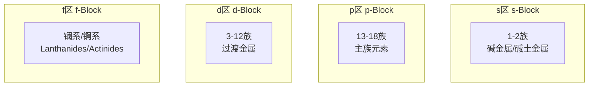
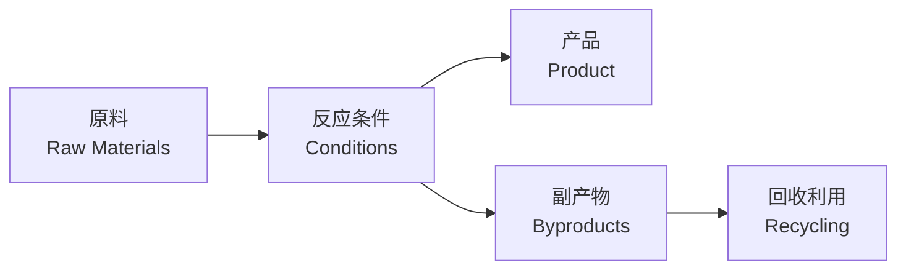

# 元素化合物 (Elements and Compounds)

## 一、元素周期表 (Periodic Table)

### 周期表结构

- **周期 (Periods)**：横向 7 个周期，电子层数相同
- **族 (Groups)**：纵向 18 个族，最外层电子数相同
- **分区 (Blocks)**：s 区、p 区、d 区、f 区

### 周期性规律 (Periodic Trends)

| 性质 | 从左到右 | 从上到下 |
|------|----------|----------|
| 原子半径 (Atomic Radius) | 减小 | 增大 |
| 电离能 (Ionization Energy) | 增大 | 减小 |
| 电负性 (Electronegativity) | 增大 | 减小 |
| 金属性 (Metallic Character) | 减弱 | 增强 |
| 非金属性 (Nonmetallic Character) | 增强 | 减弱 |

## 二、碱金属与碱土金属 (Alkali & Alkaline Earth Metals)

### 碱金属 (Group 1: Li, Na, K, Rb, Cs, Fr)

- **共性**：最外层 1 个电子，强还原性
- **与水反应**：$2M + 2H_2O \rightarrow 2MOH + H_2 \uparrow$
- **递变规律**：从上到下金属性增强，熔沸点降低
- **保存**：煤油中隔绝空气和水

### 碱土金属 (Group 2: Be, Mg, Ca, Sr, Ba, Ra)

- **共性**：最外层 2 个电子
- **与酸反应**：$M + 2HCl \rightarrow MCl_2 + H_2 \uparrow$
- **重要化合物**：CaCO₃（石灰石）、Mg(OH)₂（氢氧化镁）

## 三、卤素 (Halogens, Group 17: F, Cl, Br, I, At)

### 物理性质递变

| 元素 | 状态 (常温) | 颜色 | 熔点 |
|------|-------------|------|------|
| F₂ | 气体 | 淡黄绿色 | 最低 |
| Cl₂ | 气体 | 黄绿色 | 较低 |
| Br₂ | 液体 | 红棕色 | 较高 |
| I₂ | 固体 | 紫黑色 | 最高 |

### 化学性质

- **氧化性递变**：F₂ > Cl₂ > Br₂ > I₂
- **置换反应**：$Cl_2 + 2NaBr \rightarrow 2NaCl + Br_2$
- **与氢气反应**：$X_2 + H_2 \rightarrow 2HX$（剧烈程度递减）
- **卤化银**：AgCl（白）、AgBr（淡黄）、AgI（黄），均感光分解

## 四、氧族元素 (Chalcogens, Group 16)

### 硫及其化合物 (Sulfur and Its Compounds)

- **硫单质**：黄色固体，不溶于水，微溶于酒精
- **二氧化硫**：$S + O_2 \xrightarrow{\Delta} SO_2$
- **硫酸工业 (Contact Process)**：
  $$
  S + O_2 \rightarrow SO_2
  $$
  $$
  2SO_2 + O_2 \xrightarrow{V_2O_5} 2SO_3
  $$
  $$
  SO_3 + H_2O \rightarrow H_2SO_4
  $$

## 五、氮族元素 (Pnictogens, Group 15)

### 氮 (Nitrogen)

- **氮气 N₂**：惰性，含氮氮三键
- **氨气 NH₃**：碱性气体，$NH_3 + H_2O \rightleftharpoons NH_3 \cdot H_2O$
- **工业合成氨 (Haber Process)**：
  $$
  N_2 + 3H_2 \xrightarrow{Fe, \text{高温高压}} 2NH_3
  $$

### 磷 (Phosphorus)

- **白磷 P₄**：剧毒，自燃，易溶于 CS₂
- **红磷 (Red P)**：无毒，稳定，用于安全火柴
- **磷酸 H₃PO₄**：三元中强酸

## 六、碳族元素 (Group 14)

### 碳的同素异形体

| 类型 | 结构 | 性质 |
|------|------|------|
| 金刚石 (Diamond) | 正四面体网状 | 最硬、不导电 |
| 石墨 (Graphite) | 层状结构 | 质软、导电 |
| C₆₀ (Fullerene) | 球状分子 | 分子晶体 |

### 一氧化碳与二氧化碳

- **CO**：无色无味有毒，$2CO + O_2 \rightarrow 2CO_2$
- **CO₂**：温室气体，$CO_2 + Ca(OH)_2 \rightarrow CaCO_3\downarrow + H_2O$

## 七、过渡金属 (Transition Metals)

### 铁 (Iron)

- **炼铁原理**：$Fe_2O_3 + 3CO \xrightarrow{\text{高温}} 2Fe + 3CO_2$
- **铁离子反应**：
  - Fe²⁺（亚铁，浅绿色）：$Fe^{2+} + 2OH^- \rightarrow Fe(OH)_2\downarrow$（白色）
  - Fe³⁺（铁，黄色）：$Fe^{3+} + 3OH^- \rightarrow Fe(OH)_3\downarrow$（红褐色）

### 铜 (Copper)

- **颜色**：紫红色金属
- **铜绿形成**：$2Cu + O_2 + CO_2 + H_2O \rightarrow Cu_2(OH)_2CO_3$

### 铝 (Aluminum)

- **两性 (Amphoteric)**：$Al_2O_3 + 6HCl \rightarrow 2AlCl_3 + 3H_2O$
- **与碱反应**：$Al_2O_3 + 2NaOH \rightarrow 2NaAlO_2 + H_2O$

## 八、常见反应方程式归纳

### 离子反应

- **沉淀反应**：Ag⁺ + Cl⁻ → AgCl↓
- **中和反应**：H⁺ + OH⁻ → H₂O
- **氧化还原**：$2Fe^{3+} + Cu \rightarrow 2Fe^{2+} + Cu^{2+}$

### 重要工业反应

- **氨碱法 (Solvay Process)**：NaCl + NH₃ + CO₂ + H₂O → NaHCO₃ + NH₄Cl
- **电解食盐水 (Chlor-Alkali)**：$2NaCl + 2H_2O \xrightarrow{\text{电解}} 2NaOH + Cl_2\uparrow + H_2\uparrow$

## 九、元素化合物记忆方法

- **分类记忆法**：按族分类，横向对比
- **网络记忆法**：构建元素转化关系图
- **颜色记忆法**：通过物质颜色联想记忆

### 常见物质颜色

| 颜色 | 物质 |
|------|------|
| 黄色 | S、Na₂O₂、AgI |
| 红色 | Cu₂O、Fe₂O₃ |
| 蓝色 | CuSO₄·5H₂O |
| 黑色 | CuO、MnO₂、Fe₃O₄ |
| 绿色 | Cu₂(OH)₂CO₃ |
| 白色 | 大多数盐类 |
