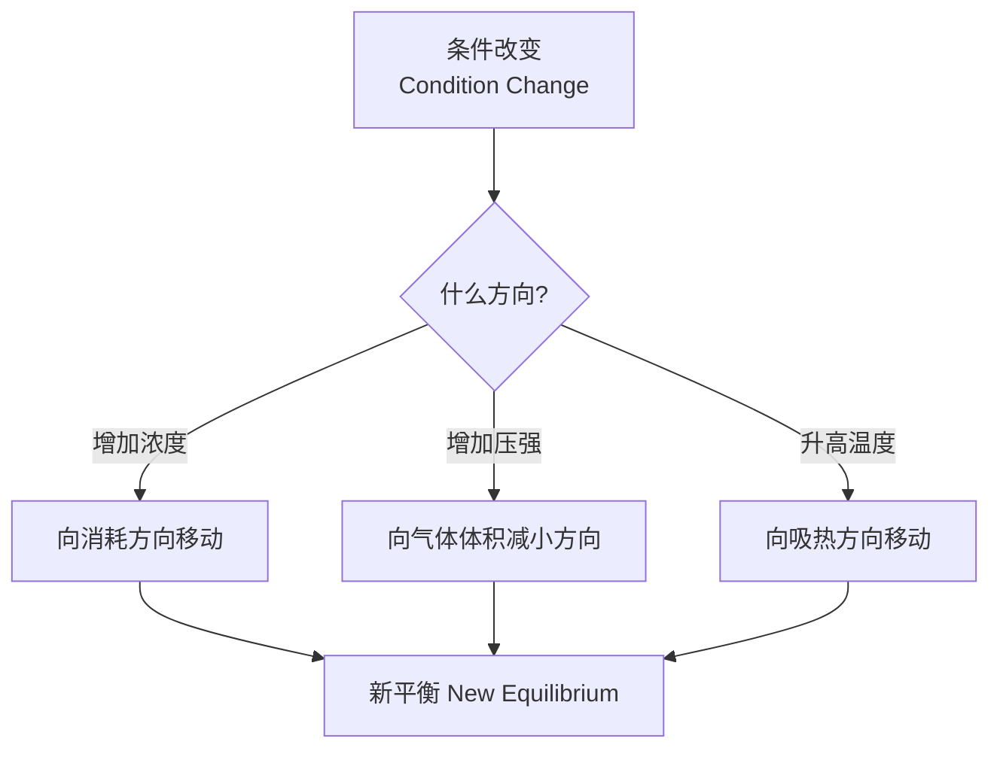
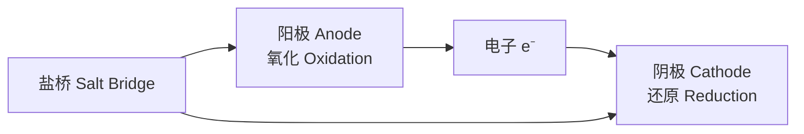

# 化学反应原理 (Chemical Reaction Principles)

## 一、化学反应速率 (Reaction Kinetics)

### 速率定义

反应速率用单位时间内反应物浓度的减少或生成物浓度的增加表示：

$$
v = -\frac{dc_A}{dt} = \frac{dc_B}{dt}
$$

单位：mol/(L·s) 或 mol/(L·min)

### 影响速率的因素

| 因素 | 影响 | 原理 |
|------|------|------|
| 浓度 (Concentration) | ↑浓度 → ↑速率 | 碰撞频率增加 |
| 温度 (Temperature) | ↑温度 → ↑速率 | 有效碰撞比例增加 |
| 压强 (Pressure) | ↑压强(气体) → ↑速率 | 浓度增大 |
| 催化剂 (Catalyst) | 降低活化能 | 改变化学反应路径 |

### 速率定律 (Rate Law)

对于反应 $aA + bB \rightarrow cC + dD$：

$$
v = k[A]^m[B]^n
$$

- **k**：速率常数 (Rate Constant)
- **m, n**：反应级数 (Reaction Orders)，由实验确定

### 阿伦尼乌斯公式 (Arrhenius Equation)

$$
k = Ae^{-\frac{E_a}{RT}}
$$

- A：指前因子 (Pre-exponential Factor)
- Ea：活化能 (Activation Energy)
- R：气体常数 (8.314 J/mol·K)
- T：绝对温度 (K)

## 二、化学平衡 (Chemical Equilibrium)

### 平衡常数 (Equilibrium Constant)

对于可逆反应 $aA + bB \rightleftharpoons cC + dD$：

$$
K_c = \frac{[C]^c[D]^d}{[A]^a[B]^b}
$$

气体反应也可用分压表示：$K_p = \frac{P_C^c \cdot P_D^d}{P_A^a \cdot P_B^b}$

## 三、勒夏特列原理 (Le Chatelier's Principle)

> 当改变平衡体系的条件时，平衡将向减弱这种改变的方向移动。



### 平衡移动示例

- **N₂ + 3H₂ ⇌ 2NH₃ (ΔH < 0)**
  - 升温 → 逆向移动（吸热方向）
  - 加压 → 正向移动（气体体积减小）
  - 加 N₂ → 正向移动

## 四、化学热力学基础 (Chemical Thermodynamics)

### 焓变 (Enthalpy Change)

$$
\Delta H = H_{产物} - H_{反应物}
$$

- **放热反应 (Exothermic)**：ΔH < 0
- **吸热反应 (Endothermic)**：ΔH > 0

### 盖斯定律 (Hess's Law)

热化学方程式的焓变可以相加减：

$$
\Delta H = \sum \Delta H_i
$$

化学反应的热效应只与起始态和终态有关，与路径无关。

### 自由能 (Gibbs Free Energy)

$$
\Delta G = \Delta H - T\Delta S
$$

- **ΔG < 0**：反应自发 (Spontaneous)
- **ΔG = 0**：平衡状态
- **ΔG > 0**：非自发

| ΔH | ΔS | 结果 |
|----|----|------|
| - (放热) | + (熵增) | 任意温度自发 |
| - (放热) | - (熵减) | 低温自发 |
| + (吸热) | + (熵增) | 高温自发 |
| + (吸热) | - (熵减) | 任意温度非自发 |

## 五、电解质与离子平衡 (Electrolytes & Ionic Equilibrium)

### 强弱电解质

| 类型 | 电离程度 | 示例 |
|------|----------|------|
| 强电解质 (Strong) | 完全电离 | HCl、NaOH、NaCl |
| 弱电解质 (Weak) | 部分电离 | CH₃COOH、NH₃·H₂O |

### 电离平衡

弱酸弱碱的电离是平衡过程：

$$
CH_3COOH \rightleftharpoons CH_3COO^- + H^+
$$

$$
K_a = \frac{[CH_3COO^-][H^+]}{[CH_3COOH]}
$$

### 水的离子积 (Ion Product of Water)

$$
K_w = [H^+][OH^-] = 1.0 \times 10^{-14} \ (25^\circ C)
$$

### pH 计算

$$
pH = -\log_{10}[H^+]
$$

- 酸性：pH < 7
- 中性：pH = 7
- 碱性：pH > 7

### 盐类水解 (Salt Hydrolysis)

```
强酸强碱盐 → 中性 (如 NaCl)
强酸弱碱盐 → 酸性 (如 NH₄Cl)
弱酸强碱盐 → 碱性 (如 CH₃COONa)
弱酸弱碱盐 → 取决于 K_a 与 K_b 相对大小
```

## 六、沉淀溶解平衡 (Precipitation-Dissolution Equilibrium)

### 溶度积 (Solubility Product)

$$
A_mB_n(s) \rightleftharpoons mA^{n+} + nB^{m-}
$$

$$
K_{sp} = [A^{n+}]^m[B^{m-}]^n
$$

### 沉淀生成与溶解

- Q > Ksp → 沉淀生成
- Q = Ksp → 饱和溶液
- Q < Ksp → 沉淀溶解

## 七、氧化还原反应 (Redox Reactions)

### 基本概念

| 概念 | 定义 |
|------|------|
| 氧化 (Oxidation) | 失去电子，化合价升高 |
| 还原 (Reduction) | 得到电子，化合价降低 |
| 氧化剂 (Oxidizing Agent) | 使其他物质氧化，自身被还原 |
| 还原剂 (Reducing Agent) | 使其他物质还原，自身被氧化 |

### 电极电位 (Electrode Potential)

标准电极电位 $E^\ominus$ 衡量氧化还原能力：

$$
E^\ominus_{cell} = E^\ominus_{cathode} - E^\ominus_{anode}
$$

### 能斯特方程 (Nernst Equation)

$$
E = E^\ominus - \frac{RT}{nF}\ln Q
$$

在 25°C 时简化为：

$$
E = E^\ominus - \frac{0.0592}{n}\log Q
$$

## 八、电化学 (Electrochemistry)

### 原电池 (Galvanic Cell)



- **锌铜原电池 (Daniell Cell)**：Zn | Zn²⁺ || Cu²⁺ | Cu
- 总反应：$Zn + Cu^{2+} \rightarrow Zn^{2+} + Cu$

### 电解池 (Electrolytic Cell)

- 外加电源驱动非自发反应
- 阳极：氧化反应（连接电源正极）
- 阴极：还原反应（连接电源负极）

## 九、综合应用

### 反应自发性的综合判断

需同时考虑动力学（速率）和热力学（方向）：

- 热力学可行但速率慢 → 需催化剂
- 热力学不可行 → 无法自发进行
- 通过耦合反应 (Coupled Reactions) 可使非自发反应变为可行

### 常见误区

- 平衡常数只与温度有关，与浓度、压强无关
- 催化剂同等降低正逆反应活化能，不改变平衡位置
- 弱电解质电离程度随稀释而增大（但离子浓度减小）
