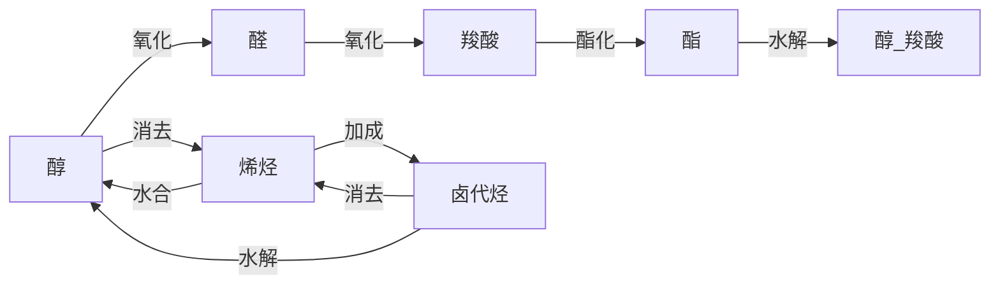

# 高中化学 · 有机化学基础

> 选择性必修3 模块

---

## 一、有机物的分类与命名

### 1. 烃的分类

```
烃（只含 C、H）
├── 链烃（脂肪烃）
│   ├── 烷烃（CₙH₂ₙ₊₂，单键）
│   ├── 烯烃（CₙH₂ₙ，C=C）
│   └── 炔烃（CₙH₂ₙ₋₂，C≡C）
└── 环烃
    ├── 环烷烃（CₙH₂ₙ）
    └── 芳香烃（含苯环）
```

### 2. 官能团

| 类别 | 官能团 | 代表物 |
|------|--------|--------|
| **烷烃** | — | CH₄ |
| **烯烃** | C=C | C₂H₄（乙烯）|
| **炔烃** | C≡C | C₂H₂（乙炔）|
| **芳香烃** | 苯环 | C₆H₆（苯）|
| **卤代烃** | $-X$（F, Cl, Br, I）| C₂H₅Br |
| **醇** | $-OH$（羟基）| C₂H₅OH |
| **酚** | $-OH$（直接连苯环）| C₆H₅OH |
| **醚** | $-O-$（醚键）| C₂H₅OC₂H₅ |
| **醛** | $-CHO$（醛基）| CH₃CHO |
| **酮** | $-CO-$（羰基）| CH₃COCH₃ |
| **羧酸** | $-COOH$（羧基）| CH₃COOH |
| **酯** | $-COO-$（酯基）| CH₃COOC₂H₅ |
| **胺** | $-NH_2$（氨基）| CH₃NH₂ |
| **酰胺** | $-CONH_2$ | CH₃CONH₂ |

### 3. 系统命名法

**烷烃命名步骤**：
1. 选主链（最长碳链）
2. 编号（近支链端）
3. 写名称（取代基位置-数目-名称-母体）

**含官能团有机物命名**：
1. 选含官能团的最长碳链为主链
2. 从近官能团端编号
3. 标明官能团位置

---

## 二、同分异构体

### 常见类型

| 类型 | 说明 |
|------|------|
| **碳链异构** | 碳骨架不同 |
| **位置异构** | 官能团位置不同 |
| **官能团异构** | 官能团不同（如醇和醚）|
| **顺反异构** | 双键两端连不同基团 |
| **对映异构** | 手性碳原子（连四个不同基团）|

### 烷烃同分异构体数目
- 甲烷、乙烷、丙烷：1种
- 丁烷：2种
- 戊烷：3种
- 己烷：5种
- 庚烷：9种

**同分异构体书写口诀**：
1. 主链由长到短
2. 支链由整到散
3. 位置由心到边
4. 排布由邻到间到对

---

## 三、重要的有机反应类型

### 1. 取代反应（Substitution）

- 烷烃卤代：$CH_4 + Cl_2 \xrightarrow{\text{光照}} CH_3Cl + HCl$
- 苯的卤代：$C_6H_6 + Br_2 \xrightarrow{FeBr_3} C_6H_5Br + HBr$
- 苯的硝化：$C_6H_6 + HNO_3 \xrightarrow[\triangle]{浓H_2SO_4} C_6H_5NO_2 + H_2O$
- 酯化反应：$CH_3COOH + C_2H_5OH \xrightleftharpoons[\triangle]{浓H_2SO_4} CH_3COOC_2H_5 + H_2O$
- 水解反应（卤代烃、酯、蛋白质、多糖）

### 2. 加成反应（Addition）

- 烯烃 + Br₂：$CH_2=CH_2 + Br_2 \to CH_2BrCH_2Br$
- 烯烃 + H₂：$CH_2=CH_2 + H_2 \xrightarrow{\text{催化剂}} CH_3CH_3$
- 烯烃 + H₂O：$CH_2=CH_2 + H_2O \xrightarrow{\text{催化剂}} CH_3CH_2OH$
- 炔烃 + 2Br₂：$CH≡CH + 2Br_2 \to CHBr_2CHBr_2$
- 苯 + 3H₂：$C_6H_6 + 3H_2 \xrightarrow[\triangle]{催化剂} C_6H_{12}$
- 醛 + H₂：$CH_3CHO + H_2 \xrightarrow[\triangle]{催化剂} CH_3CH_2OH$

**马氏规则**：HX 加不对称烯烃，H 加到含 H 多的双键 C 上。

### 3. 消去反应（Elimination）

- 醇消去：$C_2H_5OH \xrightarrow[\triangle]{浓H_2SO_4,\ 170^\circ C} CH_2=CH_2\uparrow + H_2O$
- 卤代烃消去：$C_2H_5Br + NaOH \xrightarrow{\text{醇},\ \triangle} CH_2=CH_2\uparrow + NaBr + H_2O$

**条件**：$\beta-C$ 上必须有 H

### 4. 氧化反应（Oxidation）

- 醇 → 醛：$2C_2H_5OH + O_2 \xrightarrow{Cu/Ag,\ \triangle} 2CH_3CHO + 2H_2O$
- 醛 → 羧酸：$2CH_3CHO + O_2 \xrightarrow{\text{催化剂}} 2CH_3COOH$
- 银镜反应（醛）：$CH_3CHO + 2[Ag(NH_3)_2]OH \xrightarrow{\triangle} CH_3COONH_4 + 2Ag\downarrow + 3NH_3 + H_2O$
- 与新制 Cu(OH)₂（醛）：产生砖红色 Cu₂O 沉淀

### 5. 还原反应（Reduction）
- 醛 → 醇：$CH_3CHO + H_2 \xrightarrow[\triangle]{催化剂} CH_3CH_2OH$
- 硝基 → 氨基：$C_6H_5NO_2 + Fe + HCl \to C_6H_5NH_2$

### 6. 加聚反应（Addition Polymerization）
$$ nCH_2=CH_2 \xrightarrow{\text{催化剂}} [-CH_2-CH_2-]_n \ (\text{聚乙烯}) $$

### 7. 缩聚反应（Condensation Polymerization）
- 聚酯：$nHOOC-COOH + nHOCH_2CH_2OH \to \text{聚酯} + 2nH_2O$
- 酚醛树脂：$nC_6H_5OH + nHCHO \to \text{酚醛树脂} + nH_2O$

---

## 四、重要有机物性质对比

### 烷烃 vs 烯烃 vs 炔烃 vs 苯

| 性质 | 烷烃 | 烯烃 | 炔烃 | 苯 |
|------|------|------|------|-----|
| 通式 | CₙH₂ₙ₊₂ | CₙH₂ₙ | CₙH₂ₙ₋₂ | CₙH₂ₙ₋₆ |
| 特征反应 | 取代 | 加成 | 加成 | 取代为主 |
| 酸性 KMnO₄ | 不褪色 | 褪色 | 褪色 | 不褪色 |
| Br₂/CCl₄ | 不褪色 | 褪色 | 褪色 | 萃取不反应 |

### 乙醇 vs 苯酚 vs 乙酸

| 性质 | 乙醇 | 苯酚 | 乙酸 |
|------|------|------|------|
| -OH 类型 | 醇羟基 | 酚羟基 | 羧羟基 |
| 酸性 | 中性 | 弱酸 | 弱酸 |
| 与 Na | 反应（较慢）| 反应（更快）| 反应 |
| 与 NaOH | 不反应 | 反应 | 反应 |
| FeCl₃ 显色 | 不显色 | 紫色 | 不显色 |

---

## 五、有机合成路线

### 常见官能团转化

1. 醇 → 醛/酮：氧化
2. 醇 → 烯烃：消去
3. 烯烃 → 醇：水合
4. 烯烃 → 卤代烃：加成
5. 卤代烃 → 醇：水解
6. 卤代烃 → 烯烃：消去
7. 醛 → 羧酸：氧化
8. 羧酸 → 酯：酯化
9. 酯 → 醇 + 羧酸：水解
10. 苯 → 苯酚：先卤代后水解 / 异丙苯法



### 有机合成原则
- 步骤最少
- 条件可行
- 产率较高
- 污染较少

### 合成路线的选择

**正向合成法**：从起始原料出发，逐步推导到目标产物
**逆向合成法**（Retrosynthesis）：从目标产物逆推到起始原料

---

## 六、常见有机物的检验

| 物质 | 试剂/方法 | 现象 |
|------|----------|------|
| 烯烃/炔烃 | 酸性 KMnO₄ | 紫色褪去 |
| 烯烃/炔烃 | Br₂/CCl₄ | 红褐色褪去 |
| 醛基 | 银氨溶液 | 银镜 |
| 醛基 | 新制 Cu(OH)₂ | 砖红色沉淀 |
| 苯酚 | FeCl₃ 溶液 | 紫色 |
| 淀粉 | 碘水 | 蓝色 |
| 蛋白质 | 浓 HNO₃ | 黄色 |

---

## 七、杂环与生物有机分子简介

### 杂环化合物
- 五元杂环：呋喃（含O）、吡咯（含N）、噻吩（含S）
- 六元杂环：吡啶（含N）

### 生物有机分子
- **单糖**：葡萄糖、果糖
- **二糖**：蔗糖、麦芽糖
- **多糖**：淀粉、纤维素
- **氨基酸**：20种天然氨基酸
- **核苷酸**：DNA和RNA的基本单位

## 八、常见有机反应条件总结

| 反应类型 | 典型条件 |
|---------|---------|
| 烷烃卤代 | 光照（Cl₂/Br₂）|
| 苯环卤代 | FeBr₃催化 |
| 苯环硝化 | 浓H₂SO₄ + 浓HNO₃，水浴加热 |
| 醇消去 | 浓H₂SO₄，170℃ |
| 醇分子间脱水 | 浓H₂SO₄，140℃ |
| 酯化 | 浓H₂SO₄，加热 |
| 醛银镜反应 | 水浴加热 |
| 卤代烃水解 | NaOH水溶液，加热 |
| 卤代烃消去 | NaOH醇溶液，加热 |

## 相关条目

[[02_NaturalSciences/Chemistry/OrganicChemistry/INDEX|OrganicChemistry]], [[02_NaturalSciences/Chemistry/InorganicChemistry/INDEX|InorganicChemistry]], [[02_NaturalSciences/Chemistry/AnalyticalChemistry/INDEX|AnalyticalChemistry]], [[02_NaturalSciences/Chemistry/PhysicalChemistry/INDEX|PhysicalChemistry]]
