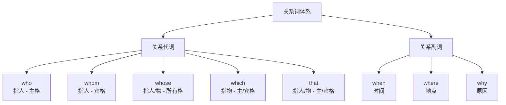

# 定语从句 (Attributive Clauses)

定语从句（Attributive Clauses / Relative Clauses）是高中英语语法的核心板块，在复杂句式理解和写作中占据关键地位。它由一个关系词（Relative Word）引导，在复合句中修饰名词或代词。

## 基本概念

定语从句用来修饰名词或代词（即先行词 Antecedent），关系词引导从句并充当从句的成分：

$$ \text{先行词（Antecedent）} + \text{关系词（Relative Word）} + \text{从句内容（Clause）} $$

$$ \text{例：The book \underline{that I read yesterday} is interesting.} $$

| 成分 | 本例 |
|------|------|
| 先行词 | the book |
| 关系词 | that（指物、作宾语） |
| 从句 | I read yesterday |
| 完整含义 | "我昨天读的那本书很有趣" |

## 关系词分类

## 关系代词用法详解

| 关系词 | 指代 | 从句中成分 | 例句 |
|--------|------|-----------|------|
| who | 人 | 主语 | The man **who** called is my uncle. 打电话的人是我叔叔。 |
| whom | 人 | 宾语 | The man **whom** you met is my uncle. 你见到的人是我叔叔。 |
| which | 物 | 主语/宾语 | The book **which** is on the table is mine. 桌上的书是我的。 |
| that | 人/物 | 主语/宾语 | The book **that** I bought is new. 我买的书是新的。 |
| whose | 人/物 | 定语 | The boy **whose** father is a doctor studies hard. 父亲是医生的那个男孩学习很努力。 |

### whose 的用法注意事项
whose 既有指人的含义也有指物的含义：

$$ \text{指人: The girl whose hair is long} = \text{那个长头发的女孩} $$
$$ \text{指物: The house whose roof is red} = \text{那栋红屋顶的房子} $$

## 关系副词用法详解

| 关系词 | 先行词类型 | 从句中充当 | 等价结构 |
|--------|-----------|-----------|---------|
| when | 时间名词 | 时间状语 | = in/at/on/during which |
| where | 地点名词（含抽象地点） | 地点状语 | = in/at which |
| why | reason | 原因状语 | = for which |

$$ \text{I still remember the day when we first met.} $$
$$ \text{This is the school where I studied for three years.} $$
$$ \text{Can you explain the reason why you were late?} $$

## 限制性与非限制性定语从句

### 限制性定语从句 (Restrictive Relative Clauses)
- 对先行词起限定、识别作用
- 去掉后主句意思不完整或改变
- **不用逗号**与主句隔开
- 关系词在作宾语时可以省略

$$ \text{Students who study hard will succeed.} $$
（不是所有学生，而是那些努力学习的学生）

### 非限制性定语从句 (Non-Restrictive Relative Clauses)
- 对先行词起补充说明作用
- 去掉后主句意思仍然完整
- 必须**用逗号**与主句隔开
- 关系词**不可以**省略
- **不可以**使用 that

$$ \text{My brother, who lives in Beijing, is a doctor.} $$
（我哥是医生这件事不变，"住在北京"是补充信息）

## 只能用 that 的情况

### 必须用 that 的五种情况
1. 先行词为 all, everything, nothing, something, anything, little, much, none, few 等不定代词
2. 先行词被形容词最高级修饰（the best, the most beautiful...）
3. 先行词被序数词修饰（the first, the last, the next...）
4. 先行词被 the very, the only, the same, the last 等修饰
5. 先行词既有人又有物

$$ \text{All \underline{that} glitters is not gold.} $$
$$ \text{This is the best film \underline{that} I have ever seen.} $$
$$ \text{He is the only person \underline{that} I can trust.} $$
$$ \text{I remember the people and places \underline{that} I visited.} $$

### 不能用 that 的情况
1. 非限制性定语从句中
2. 关系代词前有介词时

## 介词 + 关系代词结构

$$ \text{介词} + \begin{cases} \text{which（指物）} \\ \text{whom（指人）} \end{cases} $$

$$ \text{This is the house \underline{in which} Lu Xun once lived.} $$
$$ \text{The person \underline{to whom} you spoke is the manager.} $$

## as 引导的定语从句
as 可引导限制性和非限制性定语从句：

$$ \text{As is known to all, the earth is round.} $$
$$ \text{Such books as I have read are very useful.} $$
$$ \text{He is not the same man as he was.} $$

## than 作关系词

在 more...than 结构中，than 可视为关系代词：

$$ \text{He spent more money than was necessary.} $$
$$ \text{She has more friends than I expected.} $$

## way / time / reason 后的定语从句

| 先行词 | 引导词选择 |
|--------|-----------|
| the way | in which / that / 省略 |
| the time | when / that / 省略 |
| the reason | why / that / 省略 |

$$ \text{I don't like the way (that/in which) he speaks.} $$
$$ \text{That was the reason (why/that) he left.} $$

## 常见考点与易错点

| 考点 | 说明 |
|------|------|
| as 引导定语从句 | as is known to all, such...as, the same...as |
| than 作关系词 | more...than 结构中的 than 可作关系代词 |
| way 后的定语从句 | 可用 in which / that / 省略 |
| 分隔式定语从句 | 先行词与从句被插入语隔开 |
| 关系词的省略 | 作宾语时在限制性从句中可以省略 |
| which 指代整个句子 | 非限制性从句中 which 可指代前文整句 |

## 关系词省略规则汇总

| 省略条件 | 示例 |
|---------|------|
| 关系代词作宾语 | The book (that) I read is good. |
| 关系代词在介词后 | The person to whom 不可省，但 The person (who) 可省 |
| 关系副词在少数情况 | The reason (why) he came is unclear. |
| 非限制性从句 | 任何情况下不可省略 |

## 高考真题示例与解析

1. (2023 新课标 I) The little girl **______** parents were killed in the accident is living with her grandparents.
   - Answer: **whose**（所有格关系代词）

2. (2022 全国卷) This is the factory **______** I worked three years ago.
   - Answer: **where**（地点关系副词）

3. (2021 全国卷) I will never forget the days **______** we spent together.
   - Answer: **which/that**（定语从句中 spent 是及物动词，缺宾语）

4. (2020 全国卷) The movie **______** I saw last night was very touching.
   - Answer: **which/that**（作宾语，可省略）

5. (2019 浙江卷) We have entered an age **______** dreams have the best chance of coming true.
   - Answer: **where**（抽象地点，in which）

## 综合练习

判断以下句子应填入的关系词：

1. The man _____ is standing over there is my teacher. (who)
2. The house _____ window is broken is empty. (whose)
3. This is the park _____ we often play. (where)
4. I will never forget the day _____ I first met her. (when)
5. The reason _____ he was late was traffic jam. (why)
6. All _____ glitters is not gold. (that)
7. He is the only student _____ can solve this problem. (that)
8. She has three brothers, all of _____ are doctors. (whom)

## 相关条目

- [[英语语法]]
- [[NounClauses]]
- [[NonFiniteVerbs]]
- [[SubjunctiveMood]]
- [[TenseAndAspect]]
- [[INDEX|当前目录索引]]
