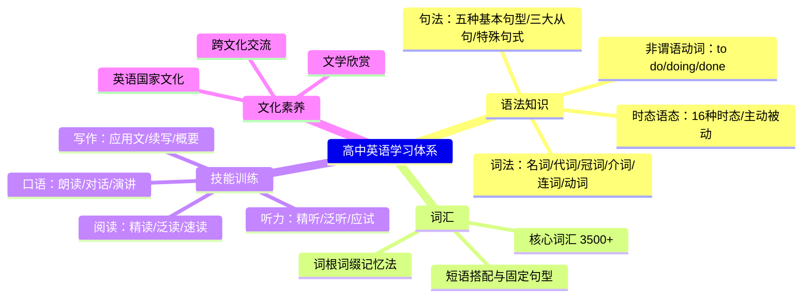
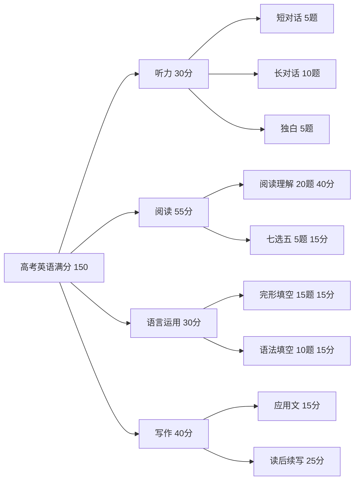

# English

英语（English）作为全球通用语（Lingua Franca），是高中教育的核心科目之一。本笔记汇总高中英语学习的知识框架与方法论。

## 英语语言知识体系

## 高中英语课程结构

### 核心模块与分值分布

| 模块 | 考试题型 | 高考分值占比 | 核心能力 |
|------|---------|------------|---------|
| 听力（Listening） | 短对话/长对话/独白 | 20%（30分） | 听觉辨析、信息提取 |
| 阅读理解（Reading） | 应用文/记叙文/说明文/议论文 | 27%（40分） | 细节定位、推理判断 |
| 七选五 | 语篇填空补全 | 10%（15分） | 语篇衔接、逻辑过渡 |
| 语言知识运用 | 语法填空/完形填空 | 20%（30分） | 语法综合运用 |
| 写作（Writing） | 应用文/读后续写 | 23%（35分） | 语言输出、逻辑建构 |

## 学习阶段规划

### 高一：基础奠基阶段

- 扩大词汇量至 2500-3000 词
- 掌握 8 种核心时态
- 建立语法基本框架
- 培养每日阅读习惯（每天 15 分钟）

### 高二：能力强化阶段

- 词汇量提升至 3500-4000 词
- 掌握三大从句、非谓语动词、虚拟语气
- 开展系统的写作训练
- 开始接触高考真题

### 高三：应试冲刺阶段

- 真题精练与错题回顾
- 限时模拟训练
- 写作模板与技巧强化
- 知识体系结构化复习

## 语言能力培养公式

$$ \text{语言综合能力} = \text{语言知识（Knowledge）} + \text{技能（Skills）} + \text{策略（Strategies）} + \text{文化意识（Cultural Awareness）} $$

### 四项核心技能的关系

$$ \text{输入（Input）: Listening + Reading} \rightarrow \text{内化} \rightarrow \text{输出（Output）: Speaking + Writing} $$

## 高考英语题型分析

## 常见学习误区

1. **重语法轻语感**——语法是工具，语感是能力，两者不可偏废
2. **死记硬背词汇**——在语境中学词优于孤立背词表
3. **忽视听力输入**——听力是输入的核心且最容易被忽略
4. **写作缺乏逻辑**——中文思维导致"中式英语"（Chinglish）
5. **不做错题本**——同样的错误反复出现

## 推荐学习资源

| 类别 | 资源 |
|------|------|
| 教材 | 人教版、外研版 |
| 教辅 | 《五年高考三年模拟》、《高考必刷题》 |
| 词典 | 牛津高阶、柯林斯、朗文 |
| App | 百词斩、墨墨背单词、每日英语听力 |
| 阅读 | 21世纪英语报、China Daily 学生版 |
| 视频 | TED-Ed、BBC Learning English |

## 各题型的提分策略

### 阅读理解

- 细节题：定位原文 → 同义替换
- 推断题：排除绝对化选项，选择"适度推断"
- 主旨题：重点关注首段尾段和首句尾句
- 猜词题：结合上下文语境线索（定义、对比、举例）

### 完形填空

- 先通读全文，了解大意，再逐空选择
- 注意上下文呼应和逻辑关系词
- 重点关注动词搭配、短语固定搭配

### 语法填空

- 有提示词：动词（时态/语态/非谓语）、名词（单复数/词性转换）
- 无提示词：介词、冠词、连词、代词

### 写作

- 应用文：确保覆盖所有内容要点，使用恰当的语气
- 读后续写：协同原文风格，保持情节连贯和情感一致

## 相关条目

- [[英语语法]]
- [[词汇积累]]
- [[高中英语写作]]
- [[英语听力]]
- [[语言习得]]
- [[AttributiveClauses]]
- [[NonFiniteVerbs]]
- [[NounClauses]]
- [[SubjunctiveMood]]
- [[TenseAndAspect]]
- [[INDEX|当前目录索引]]
