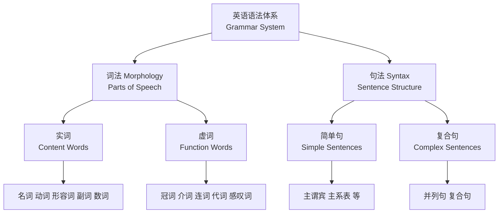
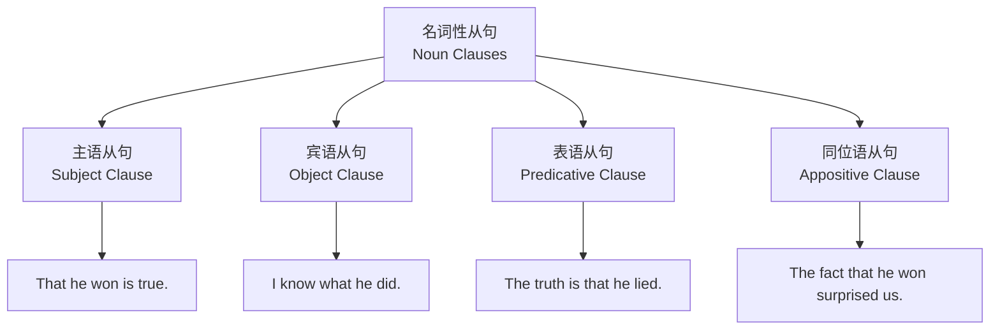
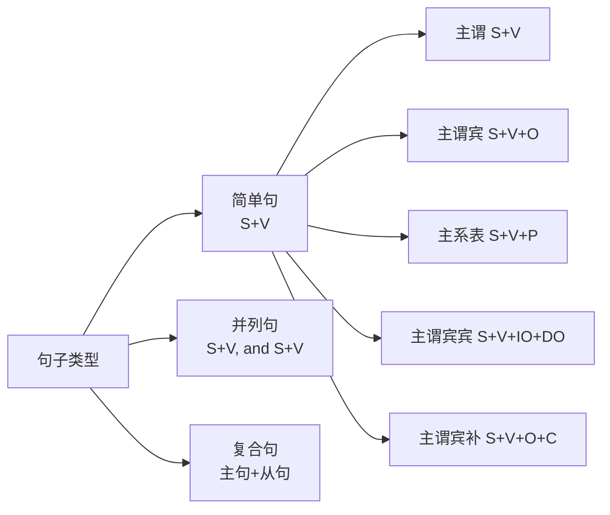

# 英语语法概论 (English Grammar Overview)

## 语法体系概述

英语语法（English grammar）是英语语言的结构规则体系，系统描述词（words）、短语（phrases）、从句（clauses）和句子（sentences）的组织方式。掌握语法体系是听、说、读、写、译准确表达的基础。

## 词类 (Parts of Speech)

英语共有十大词类：

| 词类 | 英文 | 功能 | 示例 |
|------|------|------|------|
| 名词 | Noun | 表示人、事物、地点或概念 | book, knowledge, China |
| 动词 | Verb | 表示动作或状态 | run, is, become |
| 形容词 | Adjective | 修饰名词 | beautiful, large |
| 副词 | Adverb | 修饰动词/形容词/整句 | quickly, very |
| 代词 | Pronoun | 替代名词 | he, she, it, they |
| 介词 | Preposition | 表示关系 | in, on, at, for |
| 连词 | Conjunction | 连接词/句 | and, but, because |
| 冠词 | Article | 限定名词 | a, an, the |
| 数词 | Numeral | 表示数量/顺序 | one, first |
| 感叹词 | Interjection | 表达情感 | oh, wow |

## 动词系统

### 动词分类

| 类别 | 说明 | 示例 |
|------|------|------|
| 及物动词 (Transitive) | 后接宾语 | She reads a book. |
| 不及物动词 (Intransitive) | 不接宾语 | He sleeps. |
| 系动词 (Linking Verb) | 连接主语和表语 | She is a teacher. |
| 助动词 (Auxiliary Verb) | 帮助构成时态/语态 | do, have, will |
| 情态动词 (Modal Verb) | 表示可能性/必要性 | can, must, should |

### 非谓语动词 (Non-finite Verbs)

非谓语动词包括不定式（infinitive）、动名词（gerund）和分词（participle）：

| 形式 | 构成 | 句法功能 |
|------|------|----------|
| 不定式 | to + do | 主语、宾语、定语、状语 |
| 动名词 | doing | 主语、宾语、表语 |
| 现在分词 | doing | 定语、状语、补语 |
| 过去分词 | done | 定语、状语、补语、表语 |

例：**To learn** English is important.（不定式作主语）
例：**Swimming** is good for health.（动名词作主语）
例：The boy **crying** over there is my brother.（现在分词作定语）

## 时态与体 (Tense and Aspect)

### 英语十六种时态体系

| 体 \ 时间 | 一般 (Simple) | 进行 (Continuous) | 完成 (Perfect) | 完成进行 (Perfect Continuous) |
|-----------|---------------|-------------------|----------------|-------------------------------|
| **现在 (Present)** | I write | I am writing | I have written | I have been writing |
| **过去 (Past)** | I wrote | I was writing | I had written | I had been writing |
| **将来 (Future)** | I will write | I will be writing | I will have written | I will have been writing |
| **过去将来** | I would write | I would be writing | I would have written | I would have been writing |

核心时态例句：

- **一般现在时**：The sun rises in the east.（客观真理）
- **现在完成时**：I have lived here for five years.（持续至今）
- **过去完成时**：She had finished her homework before dinner.（先于过去另一动作）
- **将来完成时**：By next year, I will have graduated.（将来某时之前完成）

### 被动语态 (Passive Voice)

被动语态结构：**be + 过去分词 (V-ed)**

$$
\text{Subject} + \text{be (时态)} + \text{Past Participle} + (\text{by Agent})
$$

| 时态 | 主动 | 被动 |
|------|------|------|
| 一般现在 | The cat eats the fish. | The fish is eaten by the cat. |
| 一般过去 | The cat ate the fish. | The fish was eaten by the cat. |
| 现在完成 | The cat has eaten the fish. | The fish has been eaten by the cat. |
| 情态动词 | The cat must eat the fish. | The fish must be eaten by the cat. |

## 从句系统

### 名词性从句 (Noun Clauses)

名词性从句在句中充当主语、宾语、表语或同位语：

### 定语从句 (Attributive Clauses / Relative Clauses)

| 分类 | 功能 | 引导词 | 示例 |
|------|------|--------|------|
| 限制性 (Restrictive) | 限定先行词的必要信息 | who, which, that | The book **that I read** is good. |
| 非限制性 (Non-restrictive) | 补充附加信息 | who, which | My father, **who is 60**, retired. |

关系词的选择：

- **who/whom** — 指人（主格/宾格）
- **which** — 指物
- **that** — 指人或物（只用于限制性从句）
- **whose** — 所属关系
- **when/where/why** — 时间/地点/原因

### 状语从句 (Adverbial Clauses)

| 类型 | 常见引导词 | 示例 |
|------|------------|------|
| 时间 (Time) | when, while, after, before, since | **When** I arrived, she was sleeping. |
| 条件 (Condition) | if, unless, provided that | **If** it rains, I will stay home. |
| 原因 (Reason) | because, since, as | I stayed **because** it was raining. |
| 让步 (Concession) | although, even though, while | **Although** tired, he continued. |
| 目的 (Purpose) | so that, in order that | Study hard **so that** you can pass. |
| 结果 (Result) | so...that, such...that | He was **so** tired **that** he fell asleep. |

## 虚拟语气 (Subjunctive Mood)

虚拟语气用于表达假设、愿望或与事实相反的情况：

### 条件句虚拟

| 类型 | if 从句 | 主句 | 示例 |
|------|---------|------|------|
| 与现在事实相反 | 过去式 (were) | would + do | If I **were** you, I **would** go. |
| 与过去事实相反 | had + done | would + have done | If I **had known**, I **would have come**. |
| 将来不大可能 | should/were to + do | would + do | If it **should rain**, we **would** cancel. |

### 其他虚拟用法

- **wish** + 过去式/过去完成式：I **wish** I **knew** the answer.
- **suggest/insist/order** + that + (should) + do：I suggest that he **(should) leave**.
- **It is necessary/important** + that + (should) + do：It is important that he **(should) attend**.

## 主谓一致 (Subject-Verb Agreement)

主谓一致遵循三个原则：

1. **语法一致** (Grammatical Concord)：主语为单数则动词用单数，复数则用复数。
2. **意义一致** (Notional Concord)：集合名词（如 team, family）根据整体或个体决定单复数。
3. **就近原则** (Proximity)：由 either...or, neither...nor, not only...but also 连接的主语，谓语与最近的主语一致。

| 规则 | 示例 |
|------|------|
| 单数主语 + 单数动词 | **The student is** here. |
| 复数主语 + 复数动词 | **The students are** here. |
| 集合名词（整体） | **The team is** strong. |
| 集合名词（个体） | **The team are** arguing. |
| 就近原则 | **Either** you **or** he **is** wrong. |

## 句子结构类型

## 相关条目

- [[TenseAndAspect|时态与体]]
- [[NonFiniteVerbs|非谓语动词]]
- [[NounClauses|名词性从句]]
- [[AttributiveClauses|定语从句]]
- [[AdverbialClauses|状语从句]]
- [[SubjunctiveMood|虚拟语气]]
- [[SubjectVerbAgreement|主谓一致]]
- [[PassiveVoice|被动语态]]
- [[INDEX|English 索引]]
- [[../../INDEX|TianshangKnowledgeBase 索引]]
