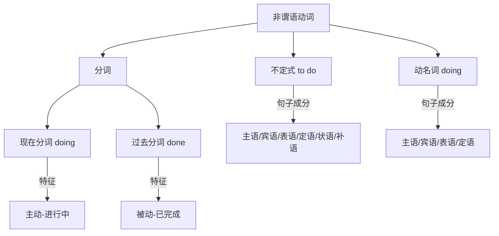

# NonFiniteVerbs

非谓语动词（Non-Finite Verbs）是高中英语语法的难点和重点。它包括不定式（Infinitive）、动名词（Gerund）和分词（Participle，含现在分词和过去分词）。非谓语动词不能单独作谓语，但可以充当其他各种句子成分。

## 非谓语动词体系

$$ \text{非谓语动词形式}: \begin{cases} \text{to do（不定式）} \\ \text{doing（现在分词 / 动名词）} \\ \text{done（过去分词）} \end{cases} $$

### 三大形式对比

## 不定式（Infinitive）

### 时态与语态变化

| 时态形式 | 主动态 | 被动态 | 含义 |
|---------|--------|--------|------|
| 一般式 | to do | to be done | 动作与谓语同时或之后发生 |
| 进行式 | to be doing | — | 动作与谓语同时进行 |
| 完成式 | to have done | to have been done | 动作先于谓语发生 |
| 完成进行式 | to have been doing | — | 动作持续到谓语时间 |

### 句法功能

$$ \text{主语: To learn English is important.} \rightarrow \text{It is important to learn English.} $$
$$ \text{宾语: I want to go. / I find it hard to concentrate.} $$
$$ \text{表语: My goal is to become a doctor.} $$
$$ \text{定语: I have a lot of work to do.} $$
$$ \text{状语: He came to see me.（目的） / She is too young to go.（结果）} $$

### 不带 to 的不定式（Bare Infinitive）

- 情态动词后：can, must, may, should, will
- 使役动词后：make, let, have
- 感官动词后：see, hear, watch, feel, notice
- 固定结构：why not, would rather, had better, cannot but

$$ \text{I saw him \underline{enter} the room.} \quad \text{(主动, 动作全过程)} $$
$$ \text{I saw him \underline{entering} the room.} \quad \text{(进行, 动作正在进行)} $$

## 动名词（Gerund）

### 时态语态

| 时态 | 主动 | 被动 |
|------|------|------|
| 一般式 | doing | being done |
| 完成式 | having done | having been done |

### 句法功能

$$ \text{主语: Reading aloud is important for language learning.} $$
$$ \text{宾语: I enjoy reading. / I am interested in reading.} $$
$$ \text{表语: My hobby is reading.} $$
$$ \text{定语: a reading room（用于阅读的房间）} $$

### 动名词 vs 不定式作宾语

| 只能接动名词 | 只能接不定式 | 两者皆可（含义不同） |
|-------------|-------------|-------------------|
| enjoy, mind, avoid | want, decide, hope | remember to do/doing |
| suggest, finish, practice | refuse, plan, promise | forget to do/doing |
| consider, recommend | afford, learn, agree | stop to do/doing |
| admit, deny, risk | fail, claim, offer | try to do/doing |
| anticipate, postpone | seem, tend, manage | regret to do/doing |
| appreciate, imagine | prepare, arrange | go on to do/doing |

## 分词（Participle）

### 现在分词 vs 过去分词

| 对比项 | 现在分词 doing | 过去分词 done |
|--------|---------------|--------------|
| 语态关系 | 主动关系 | 被动关系 |
| 时间关系 | 进行中 | 已完成 |
| 修饰人 | 感到……的（exciting news） | 感到……的（excited people） |
| 例句对比 | a **falling** leaf（正在下落的叶子） | a **fallen** leaf（已落下的叶子） |

### 作定语

$$ \text{单个分词前置: a \underline{boring} movie, a \underline{broken} window} $$
$$ \text{分词短语后置: the boy \underline{standing there}, the book \underline{written by Lu Xun}} $$

### 作状语（表示时间、原因、条件、让步、伴随等）

$$ \text{时间: \underline{Hearing} the news, he cried. (= When he heard...)} $$
$$ \text{原因: \underline{Being} tired, he went to bed. (= Because he was...)} $$
$$ \text{条件: \underline{Given} more time, I could do better. (= If I were given...)} $$
$$ \text{伴随: He stood there, \underline{waiting} for the bus.} $$

### 独立主格结构（Absolute Construction）

当分词的逻辑主语和主句主语不一致时，需要保留自己的主语：

$$ \text{Noun/Pronoun} + \text{Participle / Adjective / Infinitive / Prepositional Phrase} $$

$$ \underline{Weather \underline{permitting}}, \text{ we will go outing tomorrow.} $$
$$ \underline{The exam \underline{finished}}, \text{ the students left the classroom.} $$

## 常见考点

1. 固定句式：It's no use/good doing... / There is no doing...
2. with 复合结构：with + n. + doing / done / to do
3. 感官动词宾补：see sb do / doing / done（区别：全过程 vs 片段 vs 被动）
4. 悬垂分词：分词逻辑主语必须和主句主语一致
5. 不定式完成式：to have done 表示先于谓语发生

## 非谓语动词的时态和语态综合表

| 形式 | 主动一般 | 主动完成 | 被动一般 | 被动完成 |
|------|---------|---------|---------|---------|
| 不定式 | to do | to have done | to be done | to have been done |
| 动名词 | doing | having done | being done | having been done |
| 现在分词 | doing | having done | being done | having been done |
| 过去分词 | — | — | done | — |

## 高考常见搭配速记

- **接 doing 的动词短语**：look forward to, be used to, get down to, devote...to, object to, pay attention to, contribute to（注意 to 是介词）
- **接 to do 的动词**：afford, agree, aim, appear, arrange, attempt, choose, claim, decide, demand, desire, determine, endeavor, expect, fail, happen, hesitate, hope, learn, long, manage, offer, plan, prepare, pretend, promise, refuse, seem, tend, threaten, want, wish

## 相关条目

- [[TenseAndAspect]]
- [[英语语法]]
- [[AttributiveClauses]]
- [[INDEX|当前目录索引]]
