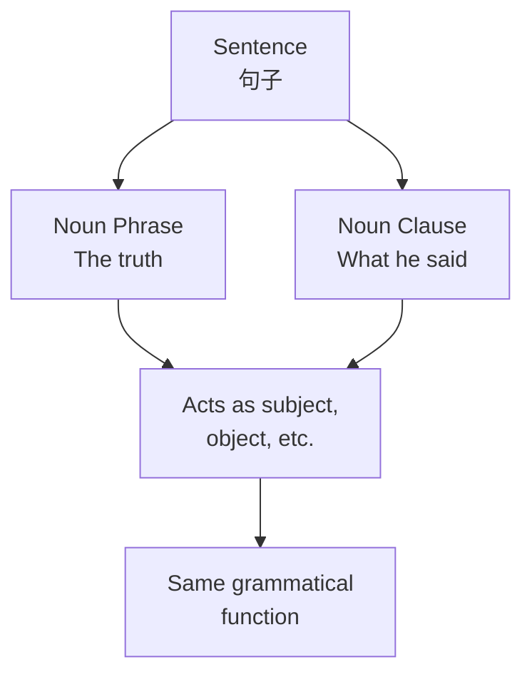
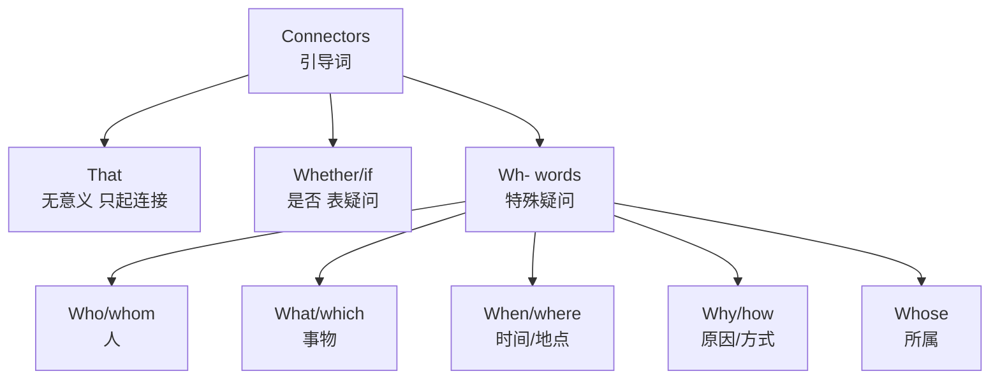

# 名词性从句 (Noun Clauses)

名词性从句（Noun Clauses）是在复合句中充当名词功能的从句。它们可以像名词一样在句子中担任**主语（Subject）**、**宾语（Object）**、**表语（Predicative）** 或**同位语（Appositive）**。

## 概览

### 什么是名词性从句
一个名词性从句本质上是一个完整的句子（主谓结构），被整个「打包」成一个大名词使用：

$$ \text{名词性从句} = \text{[连接词 + 主语 + 谓语]} = \text{一个名词} $$

### 四种名词性从句

| 类型 | 功能 | 引导词 |
|------|------|--------|
| 主语从句 (Subject Clause) | 作主语 | that, whether, wh- |
| 宾语从句 (Object Clause) | 作宾语 | that, if/whether, wh- |
| 表语从句 (Predicative Clause) | 作表语 | that, whether, wh- |
| 同位语从句 (Appositive Clause) | 作同位语 | that, whether, wh- |

## 引导词

### 引导词分类

### That 从句
**That** 在名词性从句中不作成分，也没有词义，只起连接作用：

- 主语从句：**That he passed the exam** is surprising.
- 宾语从句：I know **that he is honest**.
- 表语从句：The truth is **that we were wrong**.
- 同位语从句：The news **that he won** spread quickly.

> **注意**：在主语从句中，that 不能省略。

### Whether 与 If
**Whether** 和 **If** 都表示「是否」：

| 位置 | 可用 | 不可用 |
|------|------|--------|
| 主语从句开头 | Whether | ~~If~~ |
| 介词后 | Whether | ~~If~~ |
| 动词后 | Whether/If | — |
| or not 紧接 | Whether | ~~If~~ |
| 不定式前 | Whether | ~~If~~ |

**例句**：
- **Whether** we go depends on the weather.（主语，只能用 whether）
- I don't know **whether/if** he will come.（宾语）
- It depends on **whether** he agrees.（介词后，不能用 if）

### Wh- 疑问从句
Wh- words 在原问句中作疑问词，但在从句中**不作疑问，而是起连接作用，同时作从句的成分**：

| 引导词 | 在从句中充当 | 示例 |
|--------|-------------|------|
| What | 主语/宾语/表语 | What he said is true. |
| Who | 主语 | Who will come is unknown. |
| Whom | 宾语 | I know whom you met. |
| Which | 定语 | Which book you choose matters. |
| When | 状语 | I remember when we met. |
| Where | 状语 | This is where I live. |
| Why | 状语 | Tell me why you cried. |
| How | 状语 | How it happened is a mystery. |
| Whose | 定语 | I know whose car this is. |

## 主语从句

### 结构

$$ \text{[连接词 + 句子]} + \text{谓语} + \text{其他成分} $$

**示例**：
- **That the earth is round** is a fact.
- **Whether he will come** remains unknown.
- **What you need** is more practice.

### It 作形式主语
当主语从句较长时，通常用 **it** 作形式主语（Formal Subject），将真实从句后置：

$$ \text{It} + \text{be} + \text{adj./n.} + \text{that-clause} $$

| 句型 | 示例 |
|------|------|
| It + be + adj. + that... | It is obvious **that he lied**. |
| It + be + n. + that... | It is a pity **that you can't come**. |
| It + seem/appear + that... | It seems **that she is right**. |
| It + happen + that... | It happened **that I was there**. |

**不可用 it 形式主语的情况**：
- **What** caused the fire remains a mystery.  ✓
- ~~It remains a mystery what caused the fire.~~ ✗（what 引导的主语从句通常不倒装）

## 宾语从句

### 结构

$$ \text{动词/介词} + \text{[连接词 + 句子]} $$

**动词宾语**：
- I believe **that he is telling the truth**.
- She asked **whether I had finished**.
- He didn't know **what she wanted**.

**介词宾语**：
- We talked about **what we should do next**.
- I'm interested in **how you solved it**.

### 时态一致 (Sequence of Tenses)

| 主句时态 | 从句时态 | 示例 |
|---------|---------|------|
| 现在时 | 任意所需时态 | I think **he is/was/will be** right. |
| 过去时 | 相应的过去时态 | I thought **he was right**. |
| 过去时（客观真理） | 一般现在时 | We knew **the earth revolves around the sun**. |

**时态变化规则**（主句过去时）：
$$ \text{现在} \to \text{过去}, \quad \text{现在完成} \to \text{过去完成}, \quad \text{将来} \to \text{过去将来} $$

### 否定转移
当主句谓语是 **think, believe, suppose, expect, imagine** 等动词时，否定转移到主句：
- I **don't think** he can do it.（不译作"我不认为他能做"而译作"我认为他不能做"）
- She **doesn't believe** it will rain.

## 表语从句

### 结构

$$ \text{主语} + \text{系动词} + \text{[连接词 + 句子]} $$

常见系动词（Linking Verbs）：**be, seem, appear, look, sound, feel, remain, become**

**示例**：
- The problem is **that we lack funding**.
- This is **what I meant**.
- It looks **as if it's going to rain**.

### 特殊句式

**The reason... is that...**（不用 because）：
- The reason he was late **was that** his car broke down. ✓
- ~~The reason he was late was because his car broke down.~~ ✗

**It/This/That is because...**：
- He didn't come. **That was because** he was sick.

## 同位语从句

### 结构

$$ \text{抽象名词} + \text{[连接词 + 句子]} $$

常修饰的抽象名词（Abstract Nouns）：

| 名词 | 含义 | 示例 |
|------|------|------|
| fact | 事实 | the fact **that he won** |
| idea | 想法 | the idea **that we should leave** |
| news | 消息 | the news **that the war ended** |
| hope | 希望 | the hope **that he will recover** |
| suggestion | 建议 | the suggestion **that we wait** |
| doubt | 怀疑 | the doubt **whether it's true** |
| question | 问题 | the question **who did it** |

### 同位语从句 vs 定语从句

| 比较维度 | 同位语从句 | 定语从句 |
|---------|-----------|---------|
| 功能 | 解释名词内容 | 修饰名词 |
| that 的作用 | 连接词(不作成分) | 关系代词(作成分) |
| that 能否省略 | 不能 | 宾语时可省 |
| 先行词类型 | 抽象名词 | 任意名词 |

**对比**：
- The news **that he told me** is false.（定语从句，that 作 told 的宾语）
- The news **that he won the game** is false.（同位语从句，that 不作成分）

## 易错点总结

### What 与 That

| | what | that |
|---|------|------|
| 词义 | 「所…的」 | 无意义 |
| 成分 | 作主语/宾语/表语 | 不作成分 |
| 省略 | 不可省略 | 宾语从句中可省 |

**对比**：
- **What** he said surprised me.（他**所说的话**让我惊讶）
- **That** he said something surprised me.（他**说了话**这件事让我惊讶）

### Whether 与 If 再强调

| 位置限制 | 只能用 whether |
|---------|--------------|
| 主语从句开头 | Whether he comes is unknown. |
| 介词之后 | It depends on whether... |
| 带 or not 紧跟 | whether or not... |
| 同位语从句 | The question whether... |

### 虚拟语气在名词性从句中
部分名词从句需使用**虚拟语气（Subjunctive Mood）**：
$$ \text{should + 动词原形} \quad \text{或} \quad \text{动词原形（美国英语）} $$

**建议/要求/命令类**（suggest, recommend, insist, demand, order）：
- I suggest **that he (should) leave now**.
- It is essential **that she (should) be present**.

## 综合练习

识别以下句子中的名词性从句并指出类型：

1. What matters most is your attitude. → 主语从句
2. I doubt whether he will succeed. → 宾语从句
3. The problem is that we don't have enough time. → 表语从句
4. The suggestion that we should postpone is reasonable. → 同位语从句
5. It is clear that she has been working hard. → 主语从句（it 形式主语）
6. I wonder who will win the game. → 宾语从句
7. That she survived the accident is a miracle. → 主语从句
8. My opinion is that we should accept the offer. → 表语从句

## 关键公式速查

| 从句类型 | 公式 | 注意 |
|---------|------|------|
| 主语从句 | That-clause + V... | it 可作形式主语 |
| 宾语从句 | V + that-clause | that 可省 |
| 表语从句 | be + that-clause | reason...is that |
| 同位语从句 | n + that-clause | 解释名词内容 |

---

[[01_K12/SeniorHigh/English/INDEX|当前目录索引]]
