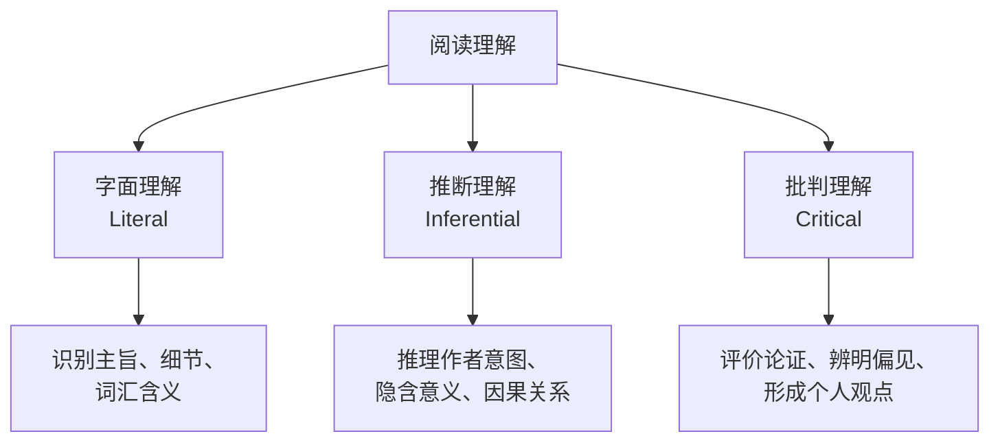

# 阅读理解 Reading Comprehension

> 阅读理解（Reading Comprehension）是英语学习中最核心的语言技能之一，涵盖文本信息的解码、理解、分析与批判性评价。高考英语中阅读理解分值占比最大（约 40%），是决定英语成绩的关键能力。

## 阅读技能层次

根据 Bloom 认知分类法，阅读理解分为三个递进层次：



| 层次 | 认知技能 | 典型问题 |
|:----:|:--------:|:--------:|
| 字面理解 | 识别、回忆 | What / When / Where / Who / How many |
| 推断理解 | 推理、解释 | Why / What can be inferred / What might happen |
| 批判理解 | 评价、创造 | Do you agree / What is the author's bias / Suggest alternatives |

## 阅读技巧

### 扫读 Scanning

快速定位特定信息（数字、人名、日期、关键词）。适用于细节题。

**练习方法**：给定问题和一组文本，计时寻找答案，逐步缩短时间。

### 略读 Skimming

快速获取文章主旨大意和整体结构。适用于主旨大意题。

**略读步骤**：
1. 阅读标题、副标题、小标题
2. 阅读首段和末段
3. 阅读每段首句（主题句 Topic Sentence）
4. 关注转折词和总结词后的内容

### 精读 Intensive Reading

深度理解细节、语义、修辞和逻辑关系。适用于推理判断题和深层理解题。

**精读要素**：

| 关注点 | 具体内容 | 标记方式 |
|:------:|:--------:|:--------:|
| 主题句 | 每段核心观点 | 下划线 |
| 过渡词 | however, therefore, moreover | 圆圈标记 |
| 指代关系 | it, this, such, which 的指代 | 箭头连接 |
| 难句 | 长难句语法结构 | 括号分解 |

## 常见题型与解题策略

### 主旨大意题 Main Idea

**识别标志**：What is the main idea / best title / mainly about / primarily concerned

**解题策略**：
- 区分 main idea 与 supporting details
- 注意首段和末段的概括性表述
- 排除过于宽泛或过于狭窄的选项

$$
\text{主旨位置概率：首段 65\% > 末段 20\% > 段中 15\%}
$$

### 细节理解题 Detail

- 定位关键词，在文中找到对应信息
- 注意同义替换（Paraphrasing）
- 排除选项中与原文不符的干扰项

**常见同义替换类型**：

| 原文 | 选项 | 替换方式 |
|:----:|:----:|:--------:|
| important | crucial / vital / essential | 同义词 |
| not many | few | 否定转换 |
| because | due to / owing to / as a result of | 因果转换 |
| A is bigger than B | B is smaller than A | 比较转换 |

### 推理判断题 Inference

**识别标志**：infer / imply / suggest / conclude / can be learned

**推理逻辑链**：

$$
\text{文本明示信息} \rightarrow \text{常识/背景知识} \rightarrow \text{隐含结论}
$$

**注意事项**：
- 推理 ≠ 主观臆断：答案必须基于文本证据
- 推理 ≠ 直接抄写：需要对原文信息进行一步或两步推导
- 强语气词（must / always / never）通常不是推理题答案

### 词义猜测题 Word Guess

**猜测线索**：

| 线索类型 | 提示词/特征 | 示例 |
|:--------:|:-----------:|:----:|
| 定义法 | is / means / refers to / is called | An ecosystem is a community... |
| 对比法 | but / however / unlike / on the other hand | Unlike his frugal mother, he was extravagant. |
| 因果法 | because / so / therefore / since | He was so parsimonious that he never ate out. |
| 举例法 | such as / for example / like | Arboreal animals, such as monkeys and squirrels... |
| 构词法 | 前缀/后缀/词根 | unpredictable = un + pre + dict + able |

## 阅读速度与效率

### 常见阅读误区

| 误区 | 问题 | 改进方法 |
|:----:|:----:|:--------:|
| 逐词阅读 | 速度慢、理解碎片化 | 按意群阅读（Chunking） |
| 回读（Regression） | 频繁回看已读内容 | 手指/笔尖引导阅读 |
| 心中默读 | 出声或唇动 | 强制加速阅读 |
| 过度依赖词典 | 打断阅读流畅性 | 先猜后查 |

### 速度训练指标

| 年级/水平 | 目标速度（词/分钟） | 理解率 |
|:---------:|:------------------:|:------:|
| 高一 | 80–100 | ≥ 70% |
| 高二 | 100–120 | ≥ 70% |
| 高三 | 120–150 | ≥ 70% |
| 高考要求 | ≥ 100 | ≥ 65% |

## 长难句分析

### 五种基本句型

| 句型 | 结构 | 示例 |
|:----:|:----:|:----:|
| 主—谓 | S + V | Birds fly. |
| 主—谓—宾 | S + V + O | She reads books. |
| 主—系—表 | S + V + C | He is a teacher. |
| 主—谓—间宾—直宾 | S + V + IO + DO | He gave me a gift. |
| 主—谓—宾—宾补 | S + V + O + OC | They made him captain. |

### 分析方法

```
[主句] The theory [定语从句] that he proposed,
[状语] despite initial skepticism,
[谓语动词] has revolutionized
[宾语] our understanding of [介词宾语] quantum mechanics.
```

## 词汇积累策略

- **学术词汇表（AWL, Academic Word List）**：570 个高频学术词族，覆盖学术文本 10% 词汇
- **词根词缀法**：以已知词根推测未知词义
- **语境记忆法**：在真实阅读语境中记忆词汇
- **间隔重复系统（SRS, Spaced Repetition System）**：利用遗忘曲线规律

遗忘曲线（Ebbinghaus Forgetting Curve）：

$$
R(t) = e^{-t/S}
$$

其中 $R(t)$ 为保留率，$t$ 为时间，$S$ 为记忆强度。

## 考试策略

**时间分配（高考 40 分钟 / 5 篇文章）**：

| 阶段 | 时间 | 内容 |
|:----:|:----:|:----:|
| 浏览题目 | 5 min | 标注问题类型和关键词 |
| 扫读定位 | 3 min/篇 | 快速定位细节题答案 |
| 精读推理 | 10 min | 深度处理推理题和主旨题 |
| 检查复核 | 5 min | 确认答案与原文一致性 |

## 相关条目

- [[EnglishGrammar]]
- [[EnglishVocabulary]]
- [[EnglishListening]]
- [[EnglishWriting]]
- [[EnglishSpeaking]]
- [[English]]
