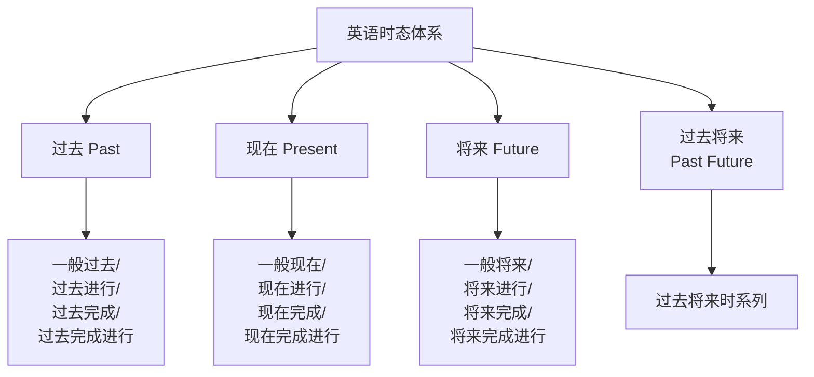
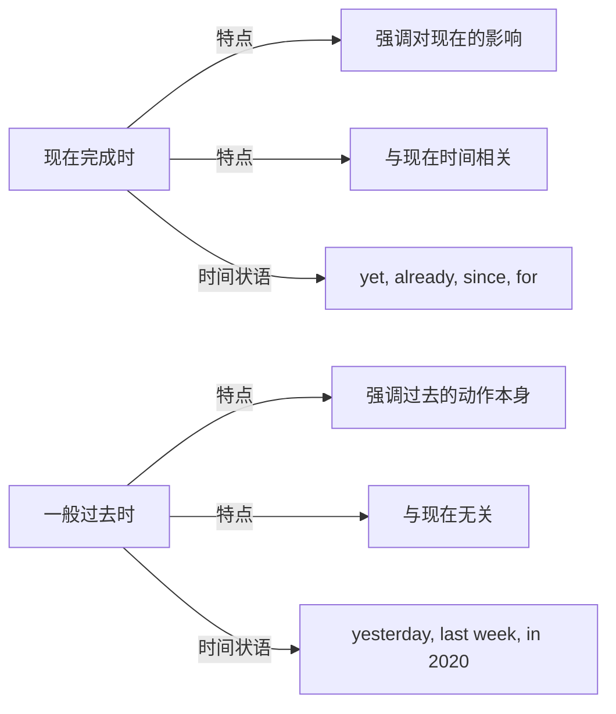

# 时态与语态 (Tense and Aspect)

英语时态（Tense and Aspect）通过动词形态变化来表达动作发生的时间（Time）和状态（Aspect/State），是英语动词的核心语法范畴。理解和掌握时态体系是学好英语语法的关键。

## 时态的基本框架

时态由两个维度组合而成：
- **时间（Tense）**：过去（Past）、现在（Present）、将来（Future）
- **方面（Aspect）**：一般（Simple）、进行（Continuous/Progressive）、完成（Perfect）、完成进行（Perfect Continuous）

$$ \text{16 种时态} = 3 \text{ 时间} \times 4 \text{ 方面} + 4 \text{ 过去将来时} $$

## 核心时态详解

### 一般现在时 (Simple Present)
公式：$V$ / $V_s$（第三人称单数）

| 用法 | 示例 |
|------|------|
| 客观真理 / 自然规律 | The earth **revolves** around the sun. |
| 习惯性动作 / 反复发生 | I **get up** at 7 every morning. |
| 状态 / 感觉 / 心理活动 | She **likes** pop music. |
| 格言 / 谚语 | Time and tide **wait** for no man. |
| 时间 / 条件状语从句中表将来 | If it **rains**, I will stay at home. |

### 一般过去时 (Simple Past)
公式：$V_{ed}$ / 不规则变化

| 用法 | 示例 |
|------|------|
| 过去某时间发生的具体动作 | I **met** him yesterday afternoon. |
| 过去的习惯动作 | I **played** tennis every week in high school. |
| 过去存在的状态 | She **was** a teacher before retirement. |

### 一般将来时 (Simple Future)
多种表达方式及其区别：

| 形式 | 用法侧重 | 示例 |
|------|---------|------|
| will + do | 预测/临时决定/意愿 | I **will help** you with your homework. |
| be going to + do | 事先计划/有迹象将要发生 | Look at the clouds! It **is going to** rain. |
| be to + do | 正式计划/命令/约定 | The meeting **is to** start at 9:00. |
| 现在进行时 | 已安排好的将来事件 | I **am flying** to Beijing next Monday. |
| 一般现在时 | 时刻表/日历安排 | The train **leaves** at 6:00 tomorrow. |

## 进行体 (Continuous Aspect)
表达动作**正在进行、尚未完成**的含义：

$$ \text{be} + V_{ing} $$

- **现在进行**：此刻正在发生（I am reading now.）
- **过去进行**：过去某时刻正在发生（I was reading when you called.）
- **将来进行**：将来某时刻正在发生（I will be flying to Beijing at this time tomorrow.）
- **过去将来进行**：从过去视角看将来某刻正在发生（He said he would be waiting for us.）

## 完成体 (Perfect Aspect)
表达动作**已经完成或持续到某个时间点**：

$$ \text{have/has} + V_{ed} \quad (\text{现在完成时}) $$
$$ \text{had} + V_{ed} \quad (\text{过去完成时}) $$
$$ \text{will have} + V_{ed} \quad (\text{将来完成时}) $$

### 现在完成时 vs 一般过去时

| 比较 | 现在完成时 | 一般过去时 |
|------|-----------|-----------|
| 含义 | He **has lost** his key.（现在没钥匙了） | He **lost** his key yesterday.（单纯叙述过去） |
| 时间关联 | 与现在有联系 | 与现在无关 |
| 使用时间状语 | 不能与具体过去时间连用 | 可以与具体过去时间连用 |

## 完成进行体 (Perfect Continuous Aspect)
强调动作的**延续性**，兼具完成和进行的双重含义：

$$ \text{have/has been} + V_{ing} $$

- **现在完成进行**：I have been waiting for two hours.（强调等待的持续，可能还会继续）
- **过去完成进行**：He had been working here for ten years before I arrived.
- **将来完成进行**：By next year, I will have been studying English for 10 years.

## 被动语态 (Passive Voice)

$$ \text{be} + V_{ed} $$

| 时态 | 主动形式 | 被动形式 |
|------|---------|---------|
| 一般现在 | write/writes | am/is/are written |
| 一般过去 | wrote | was/were written |
| 一般将来 | will write | will be written |
| 现在进行 | am/is/are writing | am/is/are being written |
| 过去进行 | was/were writing | was/were being written |
| 现在完成 | have/has written | have/has been written |
| 过去完成 | had written | had been written |
| 情态动词 | can write | can be written |

## 时态呼应 (Sequence of Tenses)
在主从复合句中，从句的时态通常受主句时态的影响：

$$ \text{主句现在时/将来时} \rightarrow \text{从句时态依实际需要而定} $$
$$ \text{主句过去时} \rightarrow \text{从句一般调整为相应的过去时态} $$

### 时态调整规则

| 原本时态 | 主句过去时后的变化 |
|---------|-----------------|
| 一般现在 | 一般过去 |
| 现在进行 | 过去进行 |
| 一般将来 | 过去将来（would do） |
| 现在完成 | 过去完成 |
| 一般过去 | 过去完成 |

例外：客观真理或格言即使主句过去时，从句仍用一般现在时。

## 常见易混时态对比

| 对比组 | 关键区别 |
|-------|---------|
| have been to vs have gone to | 去过（已回）vs 去了（没回） |
| has been doing vs has done | 强调延续 vs 强调完成 |
| will do vs be going to do | 临时决定 vs 事先计划 |
| was doing vs did | 背景动作 vs 主要动作 |

## 高考高频时态考点

1. **现在完成时与一般过去时的区别**：是否有明确过去时间状语
2. **过去完成时的"过去的过去"**：需有一个过去时间作参照
3. **进行时与 always 连用表情绪**：He is always complaining.
4. **将来时的多种表达**：will / be going to / be about to / be to
5. **时间状语从句中的"主将从现"**：I will call you when he arrives.

## 不规则动词时态变化速记表

| 原形 | 过去式 | 过去分词 |
|------|--------|---------|
| begin | began | begun |
| break | broke | broken |
| bring | brought | brought |
| buy | bought | bought |
| choose | chose | chosen |
| come | came | come |
| drink | drank | drunk |
| drive | drove | driven |
| eat | ate | eaten |
| fall | fell | fallen |
| fly | flew | flown |
| forget | forgot | forgotten |
| give | gave | given |
| go | went | gone |
| grow | grew | grown |
| know | knew | known |
| ride | rode | ridden |
| ring | rang | rung |
| rise | rose | risen |
| sing | sang | sung |
| speak | spoke | spoken |
| swim | swam | swum |
| take | took | taken |
| throw | threw | thrown |
| wear | wore | worn |
| write | wrote | written |

## 综合练习

填入正确的时态形式：

1. By the time we arrived, the movie _____ (already start).
2. She _____ (study) English for five years before she moved to London.
3. Look! It _____ (rain) outside.
4. I _____ (never see) such a beautiful sunset in my life.
5. This time next week, I _____ (lie) on a beach in Hawaii.
6. Water _____ (boil) at 100 degrees Celsius.
7. He _____ (repair) his car when I called him yesterday.
8. The new hospital _____ (build) since last year.

**Answers**: 1. had already started, 2. had been studying, 3. is raining, 4. have never seen, 5. will be lying, 6. boils, 7. was repairing, 8. has been being built

## 相关条目

- [[SubjunctiveMood]]
- [[NonFiniteVerbs]]
- [[英语语法]]
- [[NounClauses]]
- [[INDEX|当前目录索引]]
