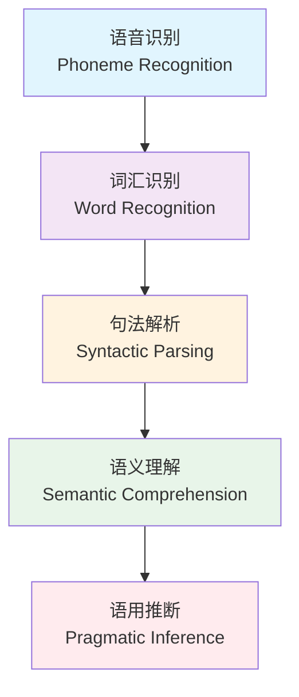

# 英语听力

英语听力（English Listening Comprehension）是语言输入的核心渠道，在高考英语中约占 20% 的分值（30 分/150 分），同时也是实际交际中最基本的能力之一。

## 听力能力的层次模型

## 高考听力题型分析

### 题型结构

| 题型 | 题量 | 形式 | 考查重点 |
|------|------|------|---------|
| 短对话（Short Conversation） | 5 题 | 1 轮对话 + 1 个问题 | 基本信息获取 |
| 长对话（Long Conversation） | 10 题 | 2-5 轮对话 + 2-3 个问题 | 理解与推理 |
| 独白（Monologue / Passage） | 5 题 | 1 段独白 + 3-4 个问题 | 综合理解 |

### 考点类型

$$ \text{主旨题（Main Idea）: What are the speakers mainly talking about?} $$

$$ \text{细节题（Detail）: Where does the conversation take place?} $$

$$ \text{推断题（Inference）: What can we learn from the conversation?} $$

$$ \text{态度题（Attitude）: How does the man feel about...?} $$

$$ \text{数字题（Number）: What time / How much / How many?} $$

## 语音知识基础

### 连读现象（Liaison / Connected Speech）

$$ \text{C-V 连读: not\_at\_all} \rightarrow /\text{nQta"tO"l}/ $$

$$ \text{r-linking: far\_away} \rightarrow /\text{fQ"r@"weI}/ $$

$$ \text{元元连读: go\_on} \rightarrow /\text{g@U"wQn}/ $$

### 弱读形式（Weak Forms）

| 单词 | 强读 | 弱读 |
|------|------|------|
| to | /tu:/ | /t@/ |
| and | /{nd/ | /@nd/, /@n/ |
| for | /fO:r/ | /f@r/ |
| can | /k{n/ | /k@n/ |
| should | /SUd/ | /S@d/ |
| from | /frQm/ | /fr@m/ |

### 失去爆破与同化

$$ \text{失去爆破: goo(d) boy, bla(ck) cat, ho(t) day} $$

$$ \text{同化: don't you} \rightarrow /\text{d@UntSu:/}, \text{ would you} \rightarrow /\text{wUdZu:/} $$

## 系统训练方法

### 精听训练（Intensive Listening）

1. **全文听写**（Dictation）：逐句暂停听写，训练音素识别能力
2. **影子跟读**（Shadowing）：同步跟读音频，训练语流感知和发音
3. **复述**（Retelling）：听完一段后用英语复述内容

### 泛听训练（Extensive Listening）

- 有声书：利用上下学通勤时间
- 英语播客：6 Minute English, EnglishPod, This American Life
- 影视材料：先开英文字幕 → 关英文字幕 → 关中文字幕

### 应试技巧

## 常见问题与对策

| 问题 | 原因 | 对策 |
|------|------|------|
| 听不清单词 | 词汇量不足 / 连读不识别 | 积累高频听力词、掌握连读规则 |
| 反应速度慢 | 听觉词汇与阅读词汇脱节 | 多听有声单词表、增加泛听量 |
| 记得住但理解不了 | 短期记忆压力大 | 练习速记符号、注意逻辑词 |
| 紧张失误 | 考试焦虑 | 模拟训练 + 呼吸放松法 |
| 混淆类似音 | 音素辨析力不足 | 最小对训练（ship/sheep）|

## 训练计划建议

| 频率 | 内容 | 时长 |
|------|------|------|
| 每日 | 泛听一则（播客/新闻）+ 跟读 5 分钟 | 15 分钟 |
| 每周 | 精做 2 套真题听写训练 | 2 x 30 分钟 |
| 考前 | 每日一套真题完整模拟 | 20 分钟 |

## 推荐资源

- **教材**：Step by Step, Listen to This
- **App**：每日英语听力、轻听英语、喜马拉雅
- **网站**：BBC Learning English, VOA, NPR, ESL Lab
- **真题**：历年高考听力真题汇编

## 听力中的信号词

信号词（Signpost Words）帮助你预测接下来的内容方向：

- **转折关系**：but, however, actually, in fact, to tell the truth
- **因果关系**：because, since, as, therefore, so, as a result
- **顺序关系**：first, then, next, after that, finally, meanwhile
- **强调关系**：especially, in particular, importantly, above all
- **解释关系**：that is, in other words, which means, namely

## 听力笔记速记符号

- ↑ 上升/增加/提高
- ↓ 下降/减少/降低
- → 导致/引起/指向
- ← 来源于/来自
- ∵ 因为
- ∴ 所以
- ≈ 大约/近似
- ≠ 不等于/不同
- + 加上/以及
- vs 对比/对抗
- e.g. 例如
- i.e. 即/也就是说

## 相关条目

- [[语言习得]]
- [[词汇积累]]
- [[English]]
- [[高中英语写作]]
- [[INDEX|当前目录索引]]
