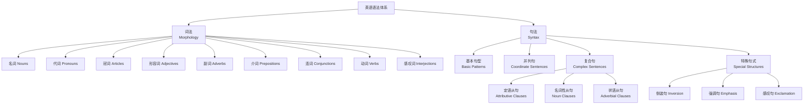

# 英语语法 (English Grammar)

英语语法（English Grammar）是语言系统的组织规则，包括词汇形态（Morphology）和句式结构（Syntax）两个层面，是高中英语学习的基础。

## 语法知识体系总览

## 词法 (Morphology)

### 动词 (Verbs)

**动词分类**：
- 实义动词（Notional Verbs）：及物动词（vt.）与不及物动词（vi.）
- 系动词（Linking Verbs）：be, become, seem, appear, feel, look, sound, taste, smell
- 助动词（Auxiliary Verbs）：be, do, have
- 情态动词（Modal Verbs）：can, could, may, might, must, shall, should, will, would

### 名词 (Nouns)
- **可数名词**（Countable）：单复数变化（规则 + 不规则）
- **不可数名词**（Uncountable）：物质名词、抽象名词
- **名词所有格**：'s 所有格与 of 所有格的区别
- **名词的功能**：主语、宾语、表语、定语、同位语

### 代词 (Pronouns)

| 类型 | 列表 | 功能 |
|------|------|------|
| 人称代词（主格/宾格） | I/me, you/you, he/him, she/her, it/it, we/us, they/them | 替代名词 |
| 物主代词（形容词性/名词性） | my/mine, your/yours, his/his, her/hers, its/its, our/ours, their/theirs | 表示所属 |
| 反身代词 | myself, yourself, himself, herself, itself, ourselves, themselves | 反射/强调 |
| 不定代词 | some, any, all, both, either, neither, none, each, every | 泛指 |
| 相互代词 | each other, one another | 相互关系 |

### 冠词 (Articles)

$$ \text{定冠词 the: 特指、前文提到、独一无二的事物、最高级前} $$
$$ \text{不定冠词 a/an: 泛指、首次提到、数量"一"} $$
$$ \text{零冠词: 泛指复数、专有名词、三餐球类、学科等} $$

### 形容词与副词 (Adjectives & Adverbs)

$$ \text{比较级: } adj_{er} / more + adj + than $$
$$ \text{最高级: } adj_{est} / most + adj $$

**形容词排序**（Osascomp 规则）：大小-形状-新旧-颜色-国籍-材料-用途

**形容词排序示例**：a beautiful **big old round red Chinese wooden** table

### 介词 (Prepositions)

$$ \text{时间: at（点）, on（天）, in（月/年/世纪）, since, for, by} $$
$$ \text{地点: at（小地方）, on（表面）, in（大空间/内部）} $$
$$ \text{方式: by + 交通工具, with + 工具, in + 语言} $$

### 连词 (Conjunctions)

**并列连词**：and, but, or, so, for, yet, nor, while, whereas

**从属连词**：
- 时间：when, while, as, before, after, until, since
- 条件：if, unless, provided that, as long as
- 原因：because, since, as, now that
- 让步：although, though, even though, while
- 目的：so that, in order that, lest
- 结果：so...that, such...that

## 句法 (Syntax)

### 五种基本句型 (Basic Sentence Patterns)

| 句型 | 结构 | 示例 |
|------|------|------|
| 主谓 | S + V（不及物） | Birds fly. |
| 主谓宾 | S + V + O（及物） | I like English. |
| 主系表 | S + V + P（系动词） | She is a teacher. |
| 主谓 + 双宾 | S + V + IO + DO | He gave me a book. |
| 主谓 + 宾 + 宾补 | S + V + O + C | I find it interesting. |

### 复合句体系

**三大复合句类型**：

1. **定语从句**：修饰名词（关系代词/关系副词引导）
   - 限制性定语从句（Restrictive）
   - 非限制性定语从句（Non-Restrictive）
   - 详情见 [[AttributiveClauses]]

2. **名词性从句**：充当名词成分
   - 主语从句、宾语从句、表语从句、同位语从句
   - 详情见 [[NounClauses]]

3. **状语从句**：修饰动词/形容词/副词
   - 时间、地点、原因、条件、让步、目的、结果、方式、比较

### 状语从句分类

| 类型 | 常用连词 | 示例 |
|------|---------|------|
| 时间 | when, while, as, before, after, until | I will call you when I arrive. |
| 地点 | where, wherever | Put it where you found it. |
| 原因 | because, since, as, now that | He was late because he got up late. |
| 条件 | if, unless, as long as, provided | If it rains, we will stay home. |
| 让步 | although, though, even though, while | Although he is old, he is healthy. |
| 目的 | so that, in order that | He got up early so that he could catch the train. |
| 结果 | so...that, such...that | He ran so fast that he won the race. |
| 方式 | as, as if, as though | She treats me as if I were her son. |
| 比较 | than, as...as | She is as tall as her brother. |

## 特殊句式

### 倒装句 (Inversion)
- **完全倒装**：Here/There/Now/Then + V + S
- **部分倒装**：否定词/Only/So/Such + 助动词 + S + V

$$ \text{Never have I seen such a beautiful view.} $$
$$ \text{Only after the exam did he realize his mistake.} $$
$$ \text{So quickly did he run that he won the race.} $$

### 强调句 (Emphasis)

$$ \text{It is/was + 被强调部分 + that/who + 剩余部分} $$

$$ \text{It was John who/that broke the window.} $$
$$ \text{It was in this room that we first met.} $$

### 感叹句 (Exclamation)

$$ \text{What (+ a/an) + adj + n + S + V!} $$
$$ \text{How + adj/adv + S + V!} $$

$$ \text{What a beautiful day it is!} $$
$$ \text{How beautifully she sings!} $$

## 主谓一致规则

| 规则 | 示例 |
|------|------|
| 主语 + with/together with + 单数动词 | The teacher, together with his students, **is** going. |
| either...or / neither...nor → 就近原则 | Neither the teacher nor the students **are** wrong. |
| not only...but also → 就近原则 | Not only he but also I **am** invited. |
| each / every + 单数动词 | Each student **has** submitted the report. |
| 集合名词（family/team）→ 视整体或个体 | The family **is** large. / The family **are** arguing. |

## 非谓语动词对比

| 形式 | 功能 | 示例 |
|------|------|------|
| 不定式 (to do) | 目的/将来/具体动作 | I want **to go**. |
| 动名词 (-ing) | 习惯/抽象/主语 | **Swimming** is fun. |
| 现在分词 (-ing) | 主动/进行 | I saw him **running**. |
| 过去分词 (-ed) | 被动/完成 | I had my hair **cut**. |

## 语法学习方法

1. 理解规则后再记忆——语法规则背后有逻辑
2. 在语境中感知语法——阅读中注意时态和句式
3. 建立错题本——记录并分析语法错误
4. 模仿造句——每个语法点造 3-5 个句子

## 高频语法错误 TOP 10

| 排名 | 错误类型 | 错误示例 | 正确示例 |
|------|---------|---------|---------|
| 1 | 主谓不一致 | The boy with his friends are here. | The boy with his friends is here. |
| 2 | 时态混淆 | I go to the park yesterday. | I went to the park yesterday. |
| 3 | 非谓语误用 | I enjoy to read books. | I enjoy reading books. |
| 4 | 冠词缺失 | She is teacher. | She is a teacher. |
| 5 | 介词搭配错误 | I am good in math. | I am good at math. |
| 6 | 定语从句关系词误用 | This is the house which I live. | This is the house where I live. |
| 7 | 虚拟语气时态错误 | If I was you, I would go. | If I were you, I would go. |
| 8 | 倒装句语序错误 | Never I have seen such beauty. | Never have I seen such beauty. |
| 9 | 名词单复数错误 | I have many informations. | I have much information. |
| 10 | 连词重复 | Although...but... | Although... 或 ...but... |

## 相关条目

- [[AttributiveClauses]]
- [[NounClauses]]
- [[NonFiniteVerbs]]
- [[SubjunctiveMood]]
- [[TenseAndAspect]]
- [[词汇积累]]
- [[语法练习]]
- [[INDEX|当前目录索引]]
