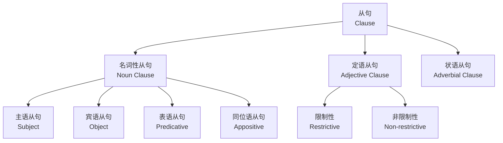
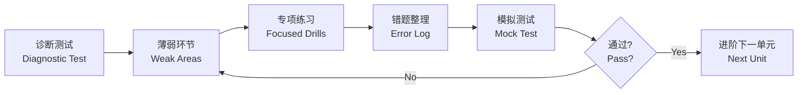

---
aliases:
  - Grammar Practice
  - 语法练习
tags:
  - english
  - grammar
  - k12
  - senior-high
  - exercises
---

# 语法练习 (Grammar Practice)

## 一、概述 (Overview)

语法练习旨在通过系统化的训练帮助学生巩固英语语法知识，涵盖词法 (Morphology) 与句法 (Syntax) 两大板块。练习形式包括改错 (Error Correction)、句型转换 (Sentence Transformation)、完形填空 (Cloze) 与综合复习 (Comprehensive Review)。

## 二、词法练习 (Morphology Exercises)

### 2.1 时态与语态 (Tense and Voice)

| 时态 | 主动语态 | 被动语态 | 标志词 |
|------|----------|----------|--------|
| 一般现在时 | V / V-s | am/is/are + V-p.p. | always, usually |
| 一般过去时 | V-ed | was/were + V-p.p. | yesterday, last |
| 现在完成时 | have/has + V-p.p. | have/has been + V-p.p. | since, already |
| 过去完成时 | had + V-p.p. | had been + V-p.p. | by the time |
| 将来时 | will + V | will be + V-p.p. | tomorrow, next |

### 2.2 虚拟语气 (Subjunctive Mood)

- 与现在相反 (Present Unreal)：If + 主语 + V-ed ... , 主语 + would + V
- 与过去相反 (Past Unreal)：If + 主语 + had + V-p.p. ... , 主语 + would have + V-p.p.
- 与将来相反 (Future Unreal)：If + 主语 + were to + V ... , 主语 + would + V

$$
\text{If I were you, I would accept the offer.}
$$

## 三、句法练习 (Syntax Exercises)

### 3.1 从句类型 (Clause Types)



### 3.2 非谓语动词 (Non-finite Verbs)

| 形式 | 功能 | 例句 |
|------|------|------|
| to do (不定式) | 目的、原因、结果 | I went there **to see** him. |
| doing (动名词) | 主语、宾语、表语 | **Swimming** is fun. |
| done (分词) | 被动、完成 | **Given** more time, I could do better. |

### 3.3 强调句与倒装句 (Emphasis and Inversion)

**强调句 (Cleft Sentence)**：
$$
\text{It is/was + 被强调部分 + that/who + 剩余部分}
$$

**倒装句 (Inversion)**：
- 完全倒装 (Full Inversion)：Here comes the bus.
- 部分倒装 (Partial Inversion)：Never have I seen such a sight.

## 四、改错练习 (Error Correction)

常见错误类型 (Common Error Types)：

1. 主谓一致 (Subject-Verb Agreement)
2. 时态错误 (Tense Error)
3. 代词指代 (Pronoun Reference)
4. 平行结构 (Parallel Structure)
5. 冠词误用 (Article Misuse)
6. 介词搭配 (Preposition Collocation)

```
原句 (Original):  He don't like playing basketball.
改后 (Corrected): He doesn't like playing basketball.
```

## 五、句型转换 (Sentence Transformation)

**主动转被动 (Active to Passive)**：

$$
\text{Active: The cat chased the mouse.}
$$
$$
\text{Passive: The mouse was chased by the cat.}
$$

**直接引语转间接引语 (Direct to Indirect Speech)**：

| 直接引语 | 间接引语 |
|----------|----------|
| "I am tired." | He said (that) he was tired. |
| "Will you come?" | She asked if I would come. |
| "Don't go!" | He told me not to go. |

## 六、完形填空技巧 (Cloze Strategies)

1. 通读全文 (Read for Gist) — 把握主旨
2. 上下文线索 (Context Clues) — 前后照应
3. 固定搭配 (Collocations) — 词组优先
4. 语法排除 (Grammar Elimination) — 去掉明显错误
5. 逻辑关系 (Logical Relationship) — 因果、转折、并列

## 七、综合复习 (Comprehensive Review)

推荐复习流程 (Review Workflow)：



## 八、常见错误记忆口诀 (Memory Mnemonics)

- 时态一致 (Tense Consistency)：主从句时态要呼应
- 主谓一致 (S-V Agreement)：单数主语配单数动词
- 双谓语错误 (Double Predicate)：一个句子一个谓语
- 悬垂分词 (Dangling Modifier)：分词逻辑主语要明确

## 九、进阶资源 (Advanced Resources)

- 剑桥英语语法 (Cambridge Grammar of English)
- Oxford Practice Grammar
- 葛传槼《英语写作》
- Grammarly 语法检查工具
