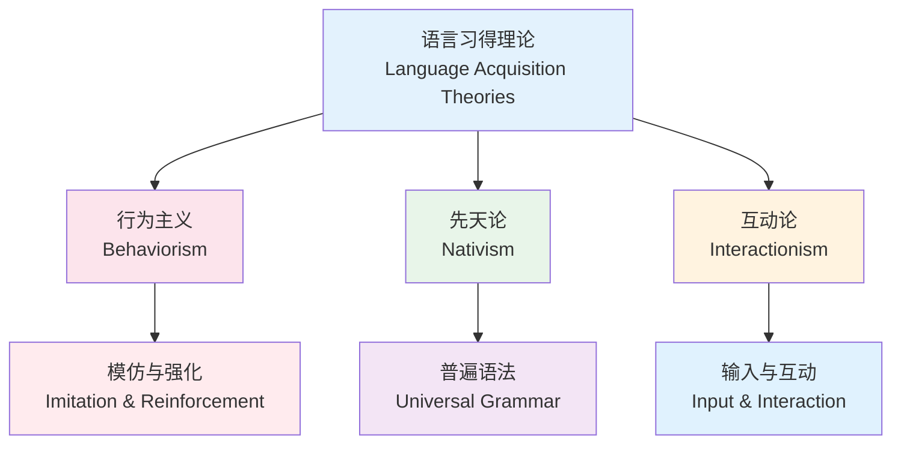
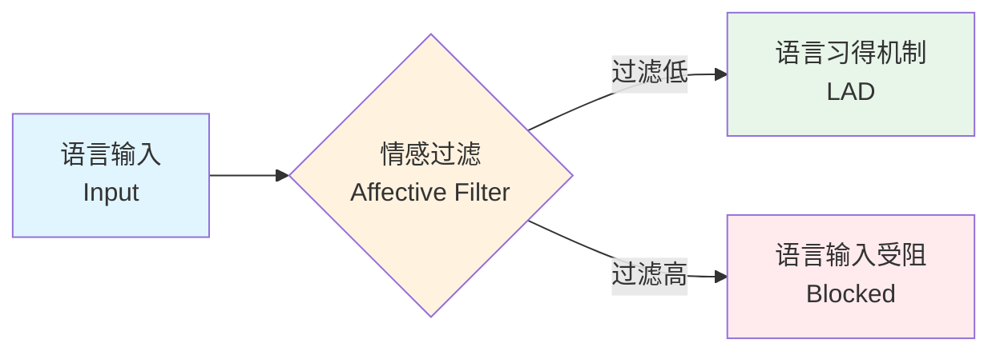

# 语言习得

语言习得（Language Acquisition）研究人类如何获得和理解一门语言。对于高中生和语言学习者而言，理解习得原理有助于优化英语学习策略，从"死记硬背"转向更加科学高效的学习方式。

## 语言习得的主要理论

## Krashen 的二语习得理论

Stephen Krashen 的二语习得五大假说是最具影响力的理论框架。

### 1. 习得-学得假设（Acquisition-Learning Hypothesis）

$$ \text{习得（Acquisition）} \neq \text{学得（Learning）} $$

| 维度 | 习得（Acquisition） | 学得（Learning） |
|------|-------------------|----------------|
| 心理过程 | 潜意识、自然 | 有意识、正式 |
| 类似过程 | 儿童学习母语 | 传统课堂教学 |
| 关注内容 | 沟通的意义 | 语言的规则形式 |
| 感知结果 | "语感"（直觉） | "元语言知识"（语法规则能说清）|

### 2. 自然顺序假设（Natural Order Hypothesis）

语法形态的习得顺序是相对固定的：

$$ \text{-ing(进行) } \rightarrow \text{ 复数 -s } \rightarrow \text{ be 动词 } \rightarrow \text{ 冠词 } \rightarrow \text{ 不规则过去时 } \rightarrow \text{ 规则过去时 -ed } \rightarrow \text{ 三单 -s } \rightarrow \text{ 所有格 's} $$

### 3. 监控假设（Monitor Hypothesis）

学得的知识担任"监控器"角色，在三个条件同时满足时发挥作用：

- **有充足时间**：如正式写作而非口语对话
- **关注语言形式**：注意力放在语法上
- **知道相关规则**：确实学过且记住了

过度使用监控（时时想语法）会严重影响流利度。

### 4. 输入假设（Input Hypothesis）— 核心

$$ i + 1 $$

学习者通过理解略高于当前水平的输入（Comprehensible Input）来习得语言：

- $i$ = 当前的能力水平
- $1$ = 略高于当前水平的输入

**有效输入的条件**：

1. **可理解**（Comprehensible）：能够大致理解含义
2. **足够的量**（Abundant）：需要大量的输入积累
3. **情感过滤低**（Low Affective Filter）：不焦虑、有自信

### 5. 情感过滤假设（Affective Filter Hypothesis）

情感因素影响语言输入的接收效率：

## Swain 的输出假设（Output Hypothesis）

Merrill Swain 强调输出同样不可忽视，输出促进习得的三重功能：

$$ \text{Output} \rightarrow \begin{cases} \text{① 注意功能（Noticing）: 输出时意识到"我不会表达"} \\ \text{② 假设检验（Hypothesis Testing）: 尝试表达并获取反馈} \\ \text{③ 元语言反思（Metalinguistic Reflection）: 思考语法规则} \end{cases} $$

## 关键期假设（Critical Period Hypothesis）

语言习得存在最佳时间的敏感期（Sensitive Period）。青春期前开始学习第二语言更容易达到母语水平。但这**不是**说成人就学不好——成人有其他优势（元认知能力、学习策略）。

## 对中国高中生的实践启示

### 优化输入策略

1. **大量听读**：每天保证 30 分钟以上英语输入
2. **选择 i+1 材料**：不要总是看过度简单的材料也不要从逐句查词典的太难材料
3. **精泛结合**：精听精读 + 大量泛听泛读

### 增加输出机会

1. **口头输出**：朗读课文、复述故事、自言自语描述日常
2. **书面输出**：英语日记、段落写作、笔记整理
3. **互动输出**：课堂回答、英语角、在线交流

### 降低情感过滤

1. 建立成长型思维——允许犯错，视错误为学习的一部分
2. 设置微目标——每天 15 分钟，坚持比强度重要
3. 创造舒适的学习环境——减少焦虑感

$$ \text{最佳策略} = \text{大量输入（习得）} + \text{语法学习（学得）} + \text{积极输出（强化）} $$

## 动机理论（Motivation in SLA）

### 二语动机自我系统（Dornyei, 2005）

$$ \text{L2 Motivation} = \text{Ideal L2 Self（理想二语自我）} + \text{Ought-to L2 Self（应然二语自我）} + \text{L2 Learning Experience（学习经历）} $$

### 动机维护策略

1. 设立短期可达成的小目标（如：本周背完 50 个词）
2. 记录进步（如：坚持打卡或用日志记录）
3. 寻找语言社群（如：英语角、线上学习小组）
4. 使学习过程有趣（如：看喜欢的英语视频、玩游戏学英语）

## 相关条目

- [[词汇积累]]
- [[英语听力]]
- [[英语语法]]
- [[English]]
- [[INDEX|当前目录索引]]
