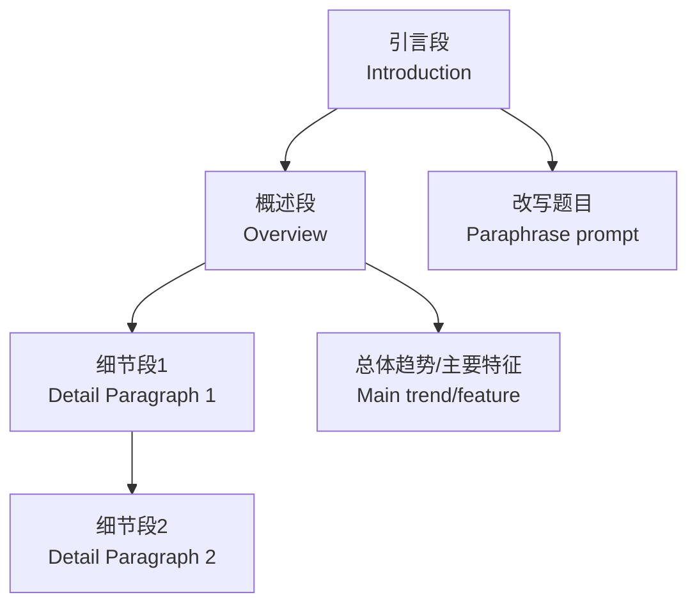

---
aliases:
  - IELTS Writing
  - 雅思英语写作
tags:
  - english
  - ielts
  - writing
  - k12
  - senior-high
---

# 雅思英语写作 (IELTS Writing)

## 一、概述 (Overview)

雅思写作分为 Academic（学术类）和 General Training（培训类）两种类型。考试时间 60 分钟，包含 Task 1 和 Task 2 两篇作文。Task 1 要求 150 词以上，Task 2 要求 250 词以上。

## 二、Task 1 写作 (Task 1 Writing)

### 2.1 题型分类 (Task Types)

**Academic (学术类)**：

| 题型 | 描述 | 常用表达 |
|------|------|----------|
| 折线图 (Line Graph) | 趋势变化 | increase, decrease, fluctuate |
| 柱状图 (Bar Chart) | 数据比较 | higher than, similar to |
| 饼图 (Pie Chart) | 比例分布 | account for, constitute |
| 表格 (Table) | 数据明细 | ranked first, followed by |
| 流程图 (Process Diagram) | 流程描述 | first, then, finally |
| 地图 (Map) | 空间变化 | replaced, expanded |

**General Training (培训类)**：
- 书信 (Letter)：正式/半正式/非正式
  - 投诉信 (Complaint)
  - 请求信 (Request)
  - 感谢信 (Thank-you)

### 2.2 Task 1 结构 (Structure)



## 三、Task 2 写作 (Task 2 Writing)

### 3.1 题型分类 (Essay Types)

| 题型 | 问题形式 | 策略 |
|------|----------|------|
| Opinion (观点类) | Do you agree or disagree? | 明确立场，论证支持 |
| Discussion (讨论类) | Discuss both views | 双方平衡，给出自己观点 |
| Problem/Solution (问题/解决) | What are the causes and solutions? | 原因分析 + 对策 |
| Advantages/Disadvantages (优劣类) | Do advantages outweigh disadvantages? | 比较分析 |
| Double Question (双问题) | Why? What? | 逐个回应 |

### 3.2 文章结构 (Essay Structure)

**四段式 (4-Paragraph Structure)**：

```
第一段 (Introduction)：
  - Hook 引入主题
  - 背景介绍 (Background)
  - 论点陈述 (Thesis Statement)

第二段 (Body 1)：
  - 主题句 (Topic Sentence)
  - 解释 (Explanation)
  - 举例 (Example)
  - 总结 (Concluding)

第三段 (Body 2)：
  - 主题句 (Topic Sentence)
  - 解释 (Explanation)
  - 举例 (Example)
  - 总结 (Concluding)

第四段 (Conclusion)：
  - 重述观点 (Restate Position)
  - 总结要点 (Summarize)
  - 展望/建议 (Outlook/Suggestion)
```

## 四、语法与句型 (Grammar and Sentence Structures)

### 4.1 复杂句 (Complex Sentences)

**定语从句 (Relative Clause)**：
$$
\text{The government, which introduced the policy, aims to reduce pollution.}
$$

**条件句 (Conditional Sentences)**：
$$
\text{If the government invested more in education, literacy rates would rise.}
$$

**倒装句 (Inversion)**：
$$
\text{Not only does education improve job prospects, but it also enhances quality of life.}
$$

### 4.2 连接词 (Cohesive Devices)

| 功能 | 连接词 |
|------|--------|
| 递进 | Moreover, Furthermore, In addition |
| 转折 | However, Nevertheless, On the other hand |
| 因果 | Therefore, Consequently, As a result |
| 举例 | For instance, For example, Such as |
| 总结 | In conclusion, To sum up, Overall |

## 五、词汇资源 (Lexical Resource)

**话题词汇 (Topic-specific Vocabulary)**：

| 话题 | 核心词汇 |
|------|----------|
| 教育 (Education) | curriculum, tuition, tertiary education, literacy |
| 环境 (Environment) | sustainability, carbon footprint, renewable energy |
| 科技 (Technology) | innovation, automation, artificial intelligence |
| 社会 (Society) | urbanization, inequality, welfare, demographics |

**同义替换 (Paraphrasing)**：

| 常见词 | 高级替换 |
|--------|----------|
| important | crucial, vital, essential, paramount |
| problem | issue, challenge, dilemma, obstacle |
| solution | remedy, approach, measure, intervention |
| increase | rise, grow, surge, escalate |

## 六、评分标准 (Assessment Criteria)

| 标准 | 比重 | 考察点 |
|------|------|--------|
| Task Achievement (任务完成度) | 25% | 是否完整回应题目 |
| Coherence & Cohesion (连贯与衔接) | 25% | 逻辑结构、连接词使用 |
| Lexical Resource (词汇资源) | 25% | 词汇丰富度、搭配准确 |
| Grammatical Range & Accuracy (语法) | 25% | 句型多样性、语法正确 |

## 七、备考策略 (Preparation Strategies)

1. 每周至少写 2 篇完整作文
2. 按话题积累语料库 (Corpus)
3. 限时写作 (Timed Practice)
4. 范文研读 (Model Essay Analysis)
5. 修改润色 (Revise and Edit)
6. 寻找写作伙伴 (Peer Review)
