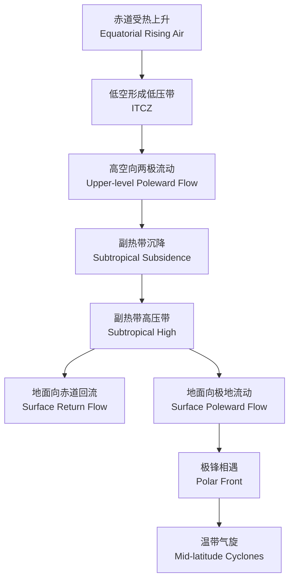

---
aliases:
  - Physical and Human Geography 难点
  - 自然与人文地理学难点
tags:
  - geography
  - physical-geography
  - human-geography
  - k12
  - senior-high
---

# 自然与人文地理学难点 (Physical and Human Geography)

## 一、概述 (Overview)

自然地理学 (Physical Geography) 研究自然环境的组成、结构、演变和分布规律；人文地理学 (Human Geography) 研究人类活动与地理环境的关系。二者的交叉与融合是理解当代地理问题的关键。

## 二、气候系统 (Climate System)

### 2.1 气候带分布 (Climate Zones)

| 气候带 | 特征 | 分布地区 |
|--------|------|----------|
| 热带雨林气候 | 全年高温多雨 | 亚马逊、刚果盆地 |
| 热带草原气候 | 干湿季分明 | 非洲稀树草原 |
| 地中海气候 | 夏干冬雨 | 地中海沿岸、加州 |
| 温带海洋性气候 | 全年温和湿润 | 西欧、新西兰 |
| 温带大陆性气候 | 冬冷夏热，降水少 | 西伯利亚、蒙古 |
| 极地气候 | 全年寒冷 | 南极、格陵兰 |

### 2.2 大气环流 (Atmospheric Circulation)

## 三、地貌过程 (Landform Processes)

### 3.1 内力作用 (Endogenic Processes)

- 板块运动 (Plate Tectonics)：汇聚、分离、平移
- 地震 (Earthquake)：震级、烈度、地震波
- 火山活动 (Volcanism)：盾状火山、层状火山

### 3.2 外力作用 (Exogenic Processes)

| 作用 | 过程 | 地貌 |
|------|------|------|
| 风化 (Weathering) | 物理/化学/生物分解 | 石蛋、风化穴 |
| 侵蚀 (Erosion) | 流水/风/冰川搬运 | V 形谷、雅丹 |
| 搬运 (Transportation) | 悬移、跃移、推移 | 冲积扇 |
| 沉积 (Deposition) | 颗粒沉降 | 三角洲、沙丘 |

## 四、人口地理 (Population Geography)

**人口增长模型 (Demographic Transition Model)**：

| 阶段 | 出生率 | 死亡率 | 自然增长率 | 代表地区 |
|------|--------|--------|------------|----------|
| 前工业化 | 高 | 高 | 低 | 前现代社会 |
| 工业化初期 | 高 | 下降 | 快速上升 | 发展中 |
| 工业化后期 | 下降 | 低 | 下降 | 新兴工业国 |
| 后工业化 | 低 | 低 | 零/负 | 发达国家 |

## 五、城市化 (Urbanization)

**城市化阶段 (Urbanization Phases)**：

**城市问题与对策 (Urban Problems and Solutions)**：

| 问题 | 表现 | 对策 |
|------|------|------|
| 交通拥堵 | 通勤时间长、污染 | 公共交通、限行 |
| 住房短缺 | 房价高、贫民窟 | 保障房、城市更新 |
| 环境污染 | 空气/水/噪声 | 清洁能源、绿化 |
| 社会分异 | 贫富隔离 | 混合社区、公共空间 |

## 六、农业地理 (Agricultural Geography)

**农业区位因素 (Agricultural Location Factors)**：
$$
\text{Agricultural Output} = f(\text{Climate}, \text{Soil}, \text{Topography}, \text{Market}, \text{Transport}, \text{Labor})
$$

**农业类型 (Agricultural Types)**：

- 集约农业 (Intensive Agriculture)：水稻种植、园艺业
- 粗放农业 (Extensive Agriculture)：游牧、放牧
- 商业农业 (Commercial Agriculture)：大型种植园
- 自给农业 (Subsistence Agriculture)：小农耕作

## 七、可持续发展 (Sustainable Development)

**核心原则 (Core Principles)**：

1. 环境承载力 (Carrying Capacity)
2. 代际公平 (Intergenerational Equity)
3. 预防原则 (Precautionary Principle)
4. 污染者付费 (Polluter Pays)

**SDGs 与地理学 (SDGs in Geography)**：

| SDG 目标 | 地理学关联 |
|----------|------------|
| 气候行动 (SDG 13) | 气候变化、碳循环 |
| 可持续城市 (SDG 11) | 城市地理、规划 |
| 清洁水源 (SDG 6) | 水文地理、水资源 |
| 陆地生态 (SDG 15) | 生物地理、土地覆盖 |
