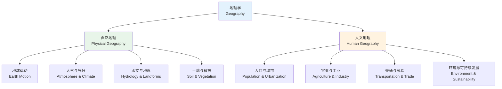

# 自然地理与人文地理重难点

地理学（Geography）是研究地球表层自然和人文现象空间分布及其相互关系的学科。高中地理分为自然地理和人文地理两大板块，本笔记梳理其中的重点与难点知识。

## 地理学知识体系

## 自然地理重难点

### 地球运动

$$ \text{自转周期: 23小时56分4秒（恒星日）} $$

$$ \text{公转周期: 365日6小时9分10秒（恒星年）} $$

$$ \text{昼夜交替: 地球不发光不透明 + 自转 = 昼夜交替} $$

$$ \text{地方时: 每经度15度 = 1小时时差} $$

### 大气受热过程

$$ \text{太阳短波辐射} \rightarrow \text{地面吸收增温} \rightarrow \text{地面长波辐射} \rightarrow \text{大气吸收增温} \rightarrow \text{大气逆辐射（保温作用）} $$

**保温作用**：大气逆辐射将热量返还地面，使地表温度维持在适宜生物生存的范围内。

$$ \text{大气受热的两个"热源": 太阳（根本热源）、地面（直接热源）} $$

### 热力环流

### 三圈环流与气压带风带

$$ \text{赤道低压带} \rightarrow \text{信风带} \rightarrow \text{副热带高压带} \rightarrow \text{西风带} \rightarrow \text{副极地低压带} \rightarrow \text{极地东风带} \rightarrow \text{极地高压带} $$

| 气压带/风带 | 纬度范围 | 垂直气流 | 对气候的影响 |
|------------|---------|---------|------------|
| 赤道低压带 | 0° ± 5° | 上升气流 | 高温多雨 - 热带雨林气候 |
| 信风带 | 5°-30° | — | 干燥 - 热带沙漠 |
| 副热带高压带 | 30° ± 5° | 下沉气流 | 高温少雨 - 沙漠 |
| 西风带 | 30°-60° | — | 温和多雨 - 温带海洋性 |
| 副极地低压带 | 60° ± 5° | 上升气流 | 多雨 - 亚寒带 |
| 极地高压带 | 90° | 下沉气流 | 严寒少雨 |

### 河流地貌

河流侵蚀和沉积作用塑造了多样化的地貌：

$$ \text{溯源侵蚀 + 下蚀} \rightarrow \text{V 形谷（上游）} $$

$$ \text{侧蚀} \rightarrow \text{河曲 / 蛇形河道（中游）} $$

$$ \text{沉积作用} \rightarrow \text{冲积扇 / 冲积平原 / 三角洲（下游）} $$

## 人文地理重难点

### 人口增长模式

$$ \text{出生率 - 死亡率 = 自然增长率} $$

| 模式 | 出生率 | 死亡率 | 自然增长率 | 阶段 | 代表地区 |
|------|--------|--------|-----------|------|---------|
| 原始型 | 高 | 高 | 低 | 工业革命前 | — |
| 传统型 | 高 | 低 | 高 | 发展中 | 非洲多国 |
| 现代型 | 低 | 低 | 低（或负） | 发达 | 西欧、日本 |

### 城市功能分区

$$ \text{商业区（CBD）} \rightarrow \text{住宅区} \rightarrow \text{工业区（由市中心向外围）} $$

地租竞争模型（Bid-Rent Curve）：距离市中心越近，地租越高。商业对地租最敏感（位于市中心），工业对地租最不敏感（位于郊区）。

### 农业区位因素

$$ \text{农业布局} = F(\text{自然条件}, \text{社会经济条件}, \text{技术条件}) $$

- **自然**：气候（光照/热量/降水）、地形、土壤、水源
- **社会经济**：市场（最重要因素之一）、交通、政策、劳动力、科技
- **技术**：灌溉、温室、机械化、良种

### 工业区位因素

$$ \text{工业} \rightarrow \begin{cases} \text{原料导向型: 靠近原料产地（制糖）} \\ \text{市场导向型: 靠近市场（饮料）} \\ \text{动力导向型: 靠近能源（炼铝）} \\ \text{劳动力导向型: 靠近廉价劳动力（纺织）} \\ \text{技术导向型: 靠近高等院校（芯片）} \end{cases} $$

### 3S 地理信息技术

| 技术 | 功能 | 应用场景 |
|------|------|---------|
| RS（遥感） | 远距离感知地表信息 | 气象监测、灾害评估、资源调查 |
| GNSS（全球导航卫星系统） | 定位与导航 | 位置确定、路径导航、测量 |
| GIS（地理信息系统） | 空间分析与可视化 | 城市规划、交通管理、人口分布分析 |

## 常见易错点

1. 地转偏向力方向的判断（北右南左赤道不偏）
2. 气候类型的成因与特征对应
3. 热力环流中的近地面低压 vs 高空的对应对应关系
4. 农业与工业区位类型的判断
5. 等值线图（等高线、等温线、等压线）的判读

## 自然环境的整体性与差异性

### 纬度地带性（Latitudinal Zonality）

$$ \text{赤道} \rightarrow \text{热带雨林} \rightarrow \text{热带草原} \rightarrow \text{热带沙漠} \rightarrow \text{地中海} \rightarrow \text{温带海洋性/大陆性} \rightarrow \text{亚寒带} \rightarrow \text{苔原} \rightarrow \text{冰原} $$

### 垂直地带性（Vertical Zonality）

山地海拔升高 → 气温下降（每升高 1000m，气温下降约 6°C）→ 植被和土壤类型随之变化。

### 干湿度地带性

$$ \text{沿海（湿润）} \rightarrow \text{内陆（干燥）: 森林 } \rightarrow \text{ 草原 } \rightarrow \text{ 荒漠} $$

## 常见气候类型对比

| 气候类型 | 成因 | 特征 | 分布 |
|---------|------|------|------|
| 热带雨林气候 | 赤道低压带控制 | 全年高温多雨 | 亚马孙、刚果盆地、马来群岛 |
| 地中海气候 | 副高+西风交替 | 夏季炎热干燥、冬季温和多雨 | 地中海沿岸、加州、开普敦 |
| 温带海洋性气候 | 全年西风控制 | 全年温和多雨 | 西欧、新西兰 |
| 温带季风气候 | 海陆热力差异 | 夏季暖湿、冬季干冷 | 中国东部、朝鲜、日本 |

## 相关条目

- [[INDEX|当前目录索引]]
