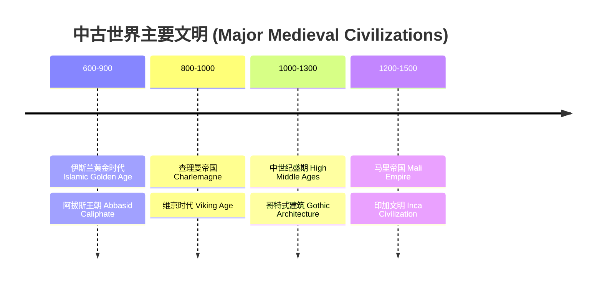
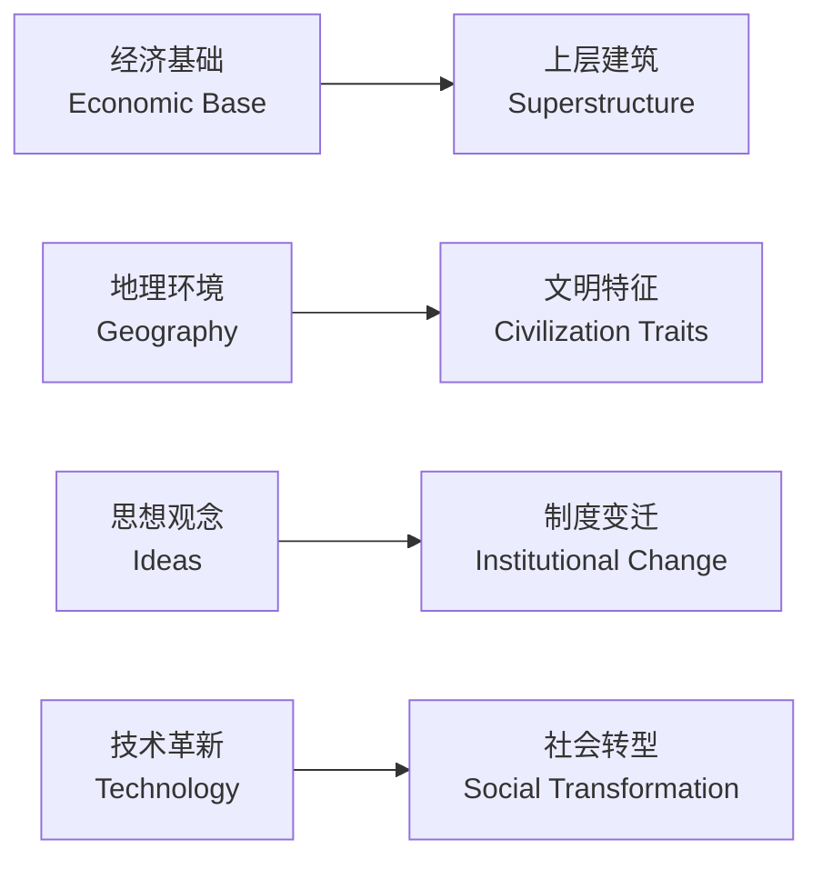

# 世界通史 (World History)

## 一、古代文明 (Ancient Civilizations)

### 四大文明古国

| 文明 | 发源地 | 河流 | 主要成就 |
|------|--------|------|----------|
| 古埃及 (Ancient Egypt) | 北非 | 尼罗河 Nile | 金字塔、象形文字、太阳历 |
| 两河流域 (Mesopotamia) | 西亚 | 底格里斯河/幼发拉底河 Tigris/Euphrates | 汉谟拉比法典、楔形文字 |
| 古印度 (Ancient India) | 南亚 | 印度河 Indus | 种姓制度、佛教起源 |
| 古中国 (Ancient China) | 东亚 | 黄河/长江 Yellow/Yangtze | 甲骨文、青铜器、百家争鸣 |

### 古典文明时期

- **古希腊 (Ancient Greece)**：城邦制、民主政治萌芽、哲学（苏格拉底、柏拉图、亚里士多德）
- **古罗马 (Ancient Rome)**：共和国到帝国、罗马法、基督教国教化
- **波斯帝国 (Persian Empire)**：大流士制度改革、行省制度

## 二、中古时代 (Medieval Period, 约 500–1500)

### 欧洲中世纪

- **封建制度 (Feudalism)**：领主—封臣—农奴的等级体系
- **教会统治 (Papal Supremacy)**：天主教会是精神与世俗权力中心
- **十字军东征 (Crusades, 1096–1291)**：宗教战争兼贸易与文化交流
- **黑死病 (Black Death, 1347–1351)**：欧洲人口减少约三分之一

### 东亚

- **唐宋盛世**：科举制、经济重心南移、海上丝绸之路
- **蒙古帝国 (Mongol Empire)**：元朝建立、欧亚大陆连通

### 其他区域



## 三、近代早期 (Early Modern Era, 1500–1800)

### 大航海时代 (Age of Exploration)

- **地理大发现**：哥伦布到达美洲 (1492)、达·伽马到达印度 (1498)、麦哲伦环球航行 (1519–1522)
- **殖民主义 (Colonialism)**：西班牙、葡萄牙、英国、法国建立全球殖民地
- **三角贸易 (Triangular Trade)**：欧洲—非洲—美洲的奴隶贸易循环

### 文艺复兴与宗教改革

- **文艺复兴 (Renaissance)**：人文主义复兴，达·芬奇、米开朗基罗
- **宗教改革 (Reformation)**：马丁·路德 (1517)、加尔文、英国国教
- **科学革命 (Scientific Revolution)**：哥白尼、伽利略、牛顿

### 重要革命

| 革命名称 | 时间 | 关键成果 |
|----------|------|----------|
| 英国资产阶级革命 | 1640–1688 | 君主立宪制、《权利法案》 |
| 美国独立战争 | 1775–1783 | 《独立宣言》、联邦制 |
| 法国大革命 | 1789–1799 | 《人权宣言》、共和制 |

## 四、工业革命 (Industrial Revolution)

### 第一次工业革命 (约 1760–1840)

- **核心技术**：蒸汽机 (James Watt)、纺织机械
- **社会变革**：城市化、工人阶级形成、贫富分化

### 第二次工业革命 (约 1870–1914)

- **核心技术**：电力、内燃机、石油化工
- **重要发明**：电话 (贝尔)、电灯 (爱迪生)、汽车 (福特流水线)

## 五、世界大战时期 (World Wars Era, 1914–1945)

### 第一次世界大战 (WWI, 1914–1918)

- **导火索**：萨拉热窝事件 (Assassination of Archduke Franz Ferdinand)
- **同盟国 vs 协约国**：Central Powers vs Allied Powers
- **新武器**：坦克、毒气、潜艇
- **结果**：凡尔赛条约、奥匈帝国解体、国际联盟成立

### 战间期 (Interwar Period, 1918–1939)

- **苏联成立 (USSR, 1922)**
- **大萧条 (Great Depression, 1929)**：华尔街股灾引发全球危机
- **法西斯崛起**：希特勒纳粹德国、墨索里尼意大利、日本军国主义

### 第二次世界大战 (WWII, 1939–1945)

```
轴心国 (Axis): 德国、意大利、日本
同盟国 (Allies): 英国、苏联、美国、中国等
关键战役: 斯大林格勒战役、诺曼底登陆(D-Day)、中途岛海战
结局: 原子弹爆炸、雅尔塔体系、联合国(UN)成立
```

## 六、冷战与后冷战 (Cold War & Post-Cold War, 1947–至今)

### 冷战格局 (Cold War)

- **两极格局 (Bipolar System)**：美国 vs 苏联
- **核威慑 (Nuclear Deterrence)**：相互确保摧毁 (MAD)
- **主要事件**：朝鲜战争、古巴导弹危机、越战、阿富汗战争、柏林墙倒塌 (1989)

### 去殖民化 (Decolonization)

- 二战后亚非拉民族独立浪潮
- 印度独立 (1947)、非洲独立年 (1960)

### 全球化 (Globalization)

| 方面 | 表现 |
|------|------|
| 经济 | WTO、跨国公司、全球供应链 |
| 科技 | 互联网、信息技术革命 |
| 文化 | 流行文化全球传播 |
| 问题 | 贫富差距、气候变化、恐怖主义 |

## 七、史学方法论 (Historical Methodology)

- **史料分类**：一手史料 (Primary Sources) 与二手史料 (Secondary Sources)
- **历史解释 (Historical Interpretation)**：不同视角下的历史叙事
- **比较史学 (Comparative History)**：跨文明比较分析

### 重要思想



- **马克思历史唯物主义 (Marxist Historical Materialism)**：生产力决定生产关系
- **年鉴学派 (Annales School)**：长时段 (Longue Durée) 历史研究
- **全球史 (Global History)**：超越民族国家的历史书写
