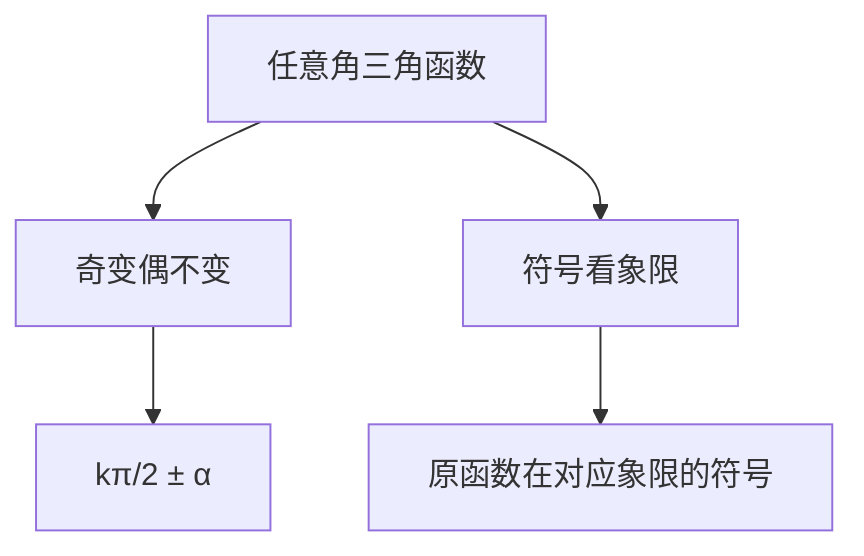

---
aliases:
  - 函数
  - 基本初等函数
  - 三角函数
  - 指数函数
  - 对数函数
  - 复合函数
  - Functions
  - Elementary Functions
  - Trigonometric Functions
  - Exponential Functions
tags:
  - K12
  - SeniorHigh
  - Mathematics
  - Functions
  - Algebra
  - Trigonometry
  - Calculus
---

# 函数

## 一、函数基础

### 函数定义

函数（Function）是从非空数集 $D$ 到非空数集 $Y$ 的映射，记作 $f: D \to Y$，对于 $D$ 中的每一个 $x$，有唯一的 $y \in Y$ 与之对应。

$$ y = f(x), \quad x \in D $$

| 概念 | 定义 | 符号/示例 |
|------|------|-----------|
| 定义域（Domain） | $x$ 的取值范围 | $D_f$ |
| 值域（Range） | $y$ 的取值范围 | $R_f$ |
| 对应法则（Rule） | $x$ 到 $y$ 的映射方式 | $f$ |
| 自变量（Independent Variable） | 输入值 | $x$ |
| 因变量（Dependent Variable） | 输出值 | $y$ |

### 函数的表示方法

1. **解析法（Analytical Representation）**：$f(x) = x^2 + 1$
2. **图像法（Graphical Representation）**：在坐标系中画曲线
3. **列表法（Tabular Representation）**：用表格列出对应值

---

## 二、基本初等函数

### 线性函数（Linear Function）

$$ f(x) = kx + b $$

其中 $k$ 为斜率（Slope），$b$ 为截距（Intercept）。

| $k$ 的符号 | 图像特征 |
|-----------|----------|
| $k > 0$ | 单调递增 |
| $k < 0$ | 单调递减 |
| $k = 0$ | 水平线（常数函数） |

### 二次函数（Quadratic Function）

$$ f(x) = ax^2 + bx + c, \quad a \neq 0 $$

顶点坐标：$\displaystyle \left(-\frac{b}{2a}, \frac{4ac - b^2}{4a}\right)$

对称轴：$x = -\frac{b}{2a}$

判别式：$\Delta = b^2 - 4ac$

| $\Delta$ | $a > 0$ | $a < 0$ |
|----------|---------|---------|
| $\Delta > 0$ | 两个实根，开口向上 | 两个实根，开口向下 |
| $\Delta = 0$ | 一个实根（顶点在 x 轴） | 一个实根（顶点在 x 轴） |
| $\Delta < 0$ | 无实根，开口向上 | 无实根，开口向下 |

### 指数函数（Exponential Function）

$$ f(x) = a^x, \quad a > 0, a \neq 1 $$

$$ f(x) = e^x \quad \text{（自然指数函数）} $$

| 底数 $a$ | 图像特征 |
|----------|----------|
| $a > 1$ | 单调递增，过 $(0, 1)$ |
| $0 < a < 1$ | 单调递减，过 $(0, 1)$ |

### 对数函数（Logarithmic Function）

$$ f(x) = \log_a x, \quad a > 0, a \neq 1, x > 0 $$

$$ f(x) = \ln x \quad \text{（自然对数函数）} $$

指数与对数的互逆关系：

$$ \log_a a^x = x, \quad a^{\log_a x} = x $$

---

## 三、三角函数

### 基本三角函数

| 函数 | 定义 | 周期 | 定义域 | 值域 |
|------|------|------|--------|------|
| $\sin x$ | 对边/斜边 | $2\pi$ | $\mathbb{R}$ | $[-1, 1]$ |
| $\cos x$ | 邻边/斜边 | $2\pi$ | $\mathbb{R}$ | $[-1, 1]$ |
| $\tan x$ | 对边/邻边 | $\pi$ | $x \neq \frac{\pi}{2} + k\pi$ | $\mathbb{R}$ |

### 诱导公式



### 重要恒等式

$$ \sin^2 x + \cos^2 x = 1 $$

$$ \tan x = \frac{\sin x}{\cos x} $$

$$ \sin(\alpha \pm \beta) = \sin\alpha \cos\beta \pm \cos\alpha \sin\beta $$

$$ \cos(\alpha \pm \beta) = \cos\alpha \cos\beta \mp \sin\alpha \sin\beta $$

$$ \sin 2x = 2\sin x \cos x $$

$$ \cos 2x = \cos^2 x - \sin^2 x = 2\cos^2 x - 1 = 1 - 2\sin^2 x $$

---

## 四、函数的性质

### 单调性（Monotonicity）

若 $x_1 < x_2$ 时恒有 $f(x_1) < f(x_2)$，则 $f$ 在区间上单调递增（Strictly Increasing）。

若 $x_1 < x_2$ 时恒有 $f(x_1) > f(x_2)$，则 $f$ 在区间上单调递减（Strictly Decreasing）。

### 奇偶性（Parity）

| 类型 | 定义 | 图像特征 | 示例 |
|------|------|----------|------|
| 奇函数 | $f(-x) = -f(x)$ | 关于原点对称 | $x^3, \sin x$ |
| 偶函数 | $f(-x) = f(x)$ | 关于 y 轴对称 | $x^2, \cos x$ |

### 周期性（Periodicity）

若存在非零常数 $T$，使得 $f(x+T) = f(x)$ 恒成立，则 $T$ 为 $f$ 的周期。

---

## 五、复合函数与反函数

### 复合函数（Composite Function）

$$ (f \circ g)(x) = f(g(x)) $$

定义域：$\{x \mid x \in D_g \text{ 且 } g(x) \in D_f\}$

### 反函数（Inverse Function）

若 $f$ 是一一映射，则存在反函数 $f^{-1}$：

$$ f^{-1}(y) = x \iff f(x) = y $$

$$ f^{-1}(f(x)) = x, \quad f(f^{-1}(y)) = y $$

反函数图像关于直线 $y = x$ 对称。

---

## 六、函数图像变换

| 变换 | 操作 | 效果 |
|------|------|------|
| 平移 | $f(x) \to f(x-h) + k$ | 右移 $h$，上移 $k$ |
| 伸缩 | $f(x) \to A f(\omega x)$ | 纵伸缩 $A$ 倍，横伸缩 $1/\omega$ |
| 对称 | $f(x) \to f(-x)$ | 关于 y 轴对称 |
| 对称 | $f(x) \to -f(x)$ | 关于 x 轴对称 |
| 翻折 | $f(x) \to |f(x)|$ | x 轴以下翻到上方 |

---

## 七、函数与方程

### 零点（Root/Zero）

$f(x) = 0$ 的解称为函数的零点。

### 二分法（Bisection Method）

若 $f(a) \cdot f(b) < 0$，则 $f$ 在 $(a, b)$ 内至少有一个零点。

```mermaid
flowchart TB
    A[选择区间 [a, b]] --> B{计算中点 c = (a+b)/2}
    B --> C{f(c) = 0?}
    C -->|是| D[找到零点]
    C -->|否| E{f(a)·f(c) < 0?}
    E -->|是| F[b = c]
    E -->|否| G[a = c]
    F --> B
    G --> B
```
