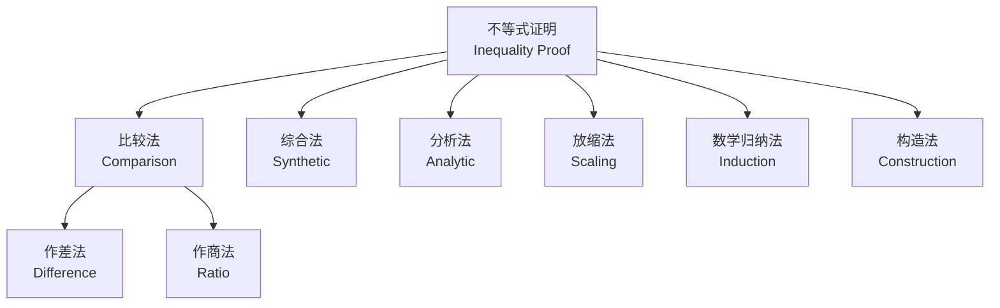

---
aliases:
  - Sequences and Inequalities
  - 数列与不等式
tags:
  - mathematics
  - sequences
  - inequalities
  - k12
  - senior-high
---

# 数列与不等式 (Sequences and Inequalities)

## 一、概述 (Overview)

数列 (Sequences) 与不等式 (Inequalities) 是高中数学的核心内容，二者在数学竞赛和高考压轴题中常常结合出现。本章系统梳理等差数列、等比数列、数列极限以及经典不等式。

## 二、等差数列 (Arithmetic Sequences)

**定义 (Definition)**：
$$
a_{n+1} - a_n = d \quad (\text{常数}, d \in \mathbb{R})
$$

**通项公式 (General Term)**：
$$
a_n = a_1 + (n-1)d
$$

**前 n 项和 (Sum of First n Terms)**：
$$
S_n = \frac{n(a_1 + a_n)}{2} = na_1 + \frac{n(n-1)}{2}d
$$

## 三、等比数列 (Geometric Sequences)

**定义 (Definition)**：
$$
\frac{a_{n+1}}{a_n} = q \quad (\text{常数}, q \neq 0)
$$

**通项公式 (General Term)**：
$$
a_n = a_1 q^{n-1}
$$

**前 n 项和 (Sum of First n Terms)**：
$$
S_n =
\begin{cases}
na_1, & q = 1 \\[1ex]
\dfrac{a_1(1 - q^n)}{1 - q}, & q \neq 1
\end{cases}
$$

## 四、数列极限 (Limits of Sequences)

**定义 (Definition)**：
$$
\lim_{n \to \infty} a_n = L \iff \forall \varepsilon > 0, \exists N \in \mathbb{N}^+, \text{ s.t. } n > N \Rightarrow |a_n - L| < \varepsilon
$$

**常用极限 (Common Limits)**：

| 极限 | 条件 | 结果 |
|------|------|------|
| $\lim_{n\to\infty} q^n$ | $|q| < 1$ | $0$ |
| $\lim_{n\to\infty} \frac{1}{n}$ | — | $0$ |
| $\lim_{n\to\infty} \frac{n}{n+1}$ | — | $1$ |
| $\lim_{n\to\infty} (1 + \frac{1}{n})^n$ | — | $e$ |

## 五、基本不等式 (Basic Inequalities)

### 5.1 均值不等式 (AM-GM Inequality)

对于非负实数 $a_1, a_2, \dots, a_n$：
$$
\frac{a_1 + a_2 + \cdots + a_n}{n} \geq \sqrt[n]{a_1 a_2 \cdots a_n}
$$
等号成立当且仅当 $a_1 = a_2 = \cdots = a_n$。

**二元形式 (Two-variable Form)**：
$$
\frac{a + b}{2} \geq \sqrt{ab}, \quad a, b \geq 0
$$

### 5.2 柯西不等式 (Cauchy-Schwarz Inequality)

$$
(a_1^2 + a_2^2 + \cdots + a_n^2)(b_1^2 + b_2^2 + \cdots + b_n^2) \geq (a_1 b_1 + a_2 b_2 + \cdots + a_n b_n)^2
$$

**向量形式 (Vector Form)**：
$$
|\mathbf{u} \cdot \mathbf{v}| \leq \|\mathbf{u}\| \|\mathbf{v}\|
$$

## 六、不等式证明方法 (Proof Methods)

## 七、数列与不等式综合 (Combined Problems)

**典型题型 (Typical Problems)**：

1. 证明数列有界性 (Prove boundedness)
2. 数列单调性判定 (Monotonicity judgment)
3. 不等式恒成立求参数范围 (Parameter range)
4. 放缩法求数列前 n 项和 (Scaling to estimate sum)

**例 (Example)**：证明 $\frac{1}{2^2} + \frac{1}{3^2} + \cdots + \frac{1}{n^2} < 1$

**证明 (Proof)**：
$$
\frac{1}{k^2} < \frac{1}{k(k-1)} = \frac{1}{k-1} - \frac{1}{k}
$$
求和后裂项相消即可。

## 八、递推数列 (Recursive Sequences)

| 类型 | 形式 | 解法 |
|------|------|------|
| 一阶线性 | $a_{n+1} = pa_n + q$ | 构造等比 |
| 分式递推 | $a_{n+1} = \frac{pa_n + q}{ra_n + s}$ | 不动点法 |
| 二阶齐次 | $a_{n+2} = pa_{n+1} + qa_n$ | 特征方程 |
