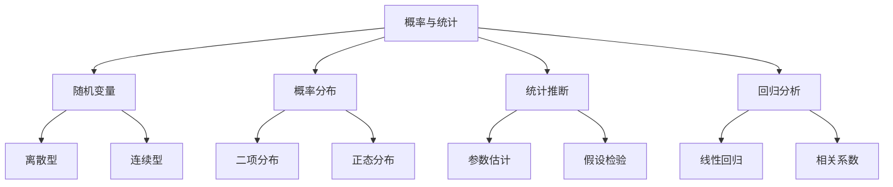
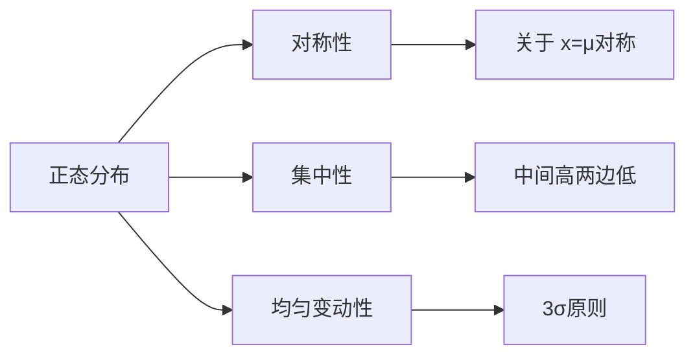
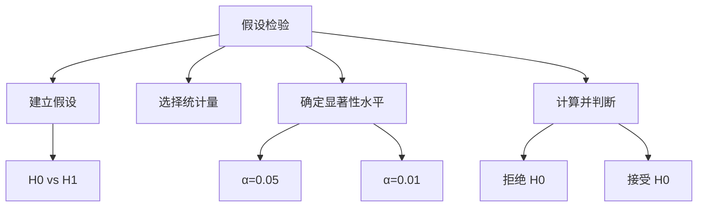
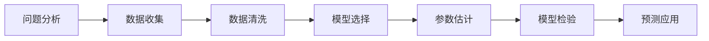

---
aliases:
  - 高中统计
  - 随机变量
  - 假设检验
  - 回归分析
tags:
  - K12
  - 高中数学
  - 概率统计
  - 随机变量
  - 数据分析
---

# 概率与统计 (Probability and Statistics)

## 概述 (Overview)

高中阶段的概率与统计是初中内容的深化与拓展，涵盖**随机变量 (Random Variables)**、**概率分布 (Probability Distributions)**、**统计推断 (Statistical Inference)**、**假设检验 (Hypothesis Testing)** 和**回归分析 (Regression Analysis)** 等高级内容。本模块强调数学建模和数据分析能力的培养。

---

## 一、随机变量及其分布 (Random Variables and Distributions)

### 1.1 随机变量的概念

**随机变量 (Random Variable)** 是定义在样本空间上的实值函数，记作 $X$、$Y$、$Z$ 等。

| 类型 | 定义 | 示例 |
|------|------|------|
| 离散型 (Discrete) | 取值有限或可数 | 掷骰子的点数 |
| 连续型 (Continuous) | 取值充满某个区间 | 测量误差 |

### 1.2 离散型随机变量的分布列

离散型随机变量 $X$ 的**分布列 (Probability Distribution)**：

| $X$ | $x_1$ | $x_2$ | $\cdots$ | $x_n$ |
|-----|-------|-------|----------|-------|
| $P$ | $p_1$ | $p_2$ | $\cdots$ | $p_n$ |

满足条件：

$$p_i \geq 0, \quad \sum_{i=1}^{n} p_i = 1$$

### 1.3 期望与方差

**数学期望 (Expected Value)**：

$$E(X) = \sum_{i=1}^{n} x_i p_i$$

**方差 (Variance)**：

$$D(X) = \sum_{i=1}^{n} (x_i - E(X))^2 p_i = E(X^2) - [E(X)]^2$$

**标准差 (Standard Deviation)**：

$$\sigma = \sqrt{D(X)}$$

---

## 二、常见概率分布 (Common Probability Distributions)

### 2.1 二项分布 (Binomial Distribution)

若 $X \sim B(n, p)$，则：

$$P(X = k) = C_n^k p^k (1-p)^{n-k}, \quad k = 0, 1, 2, \ldots, n$$

其中：

$$E(X) = np, \quad D(X) = np(1-p)$$

### 2.2 超几何分布 (Hypergeometric Distribution)

从 $N$ 件产品中（其中 $M$ 件次品）抽取 $n$ 件：

$$P(X = k) = \frac{C_M^k C_{N-M}^{n-k}}{C_N^n}$$

### 2.3 正态分布 (Normal Distribution)

若 $X \sim N(\mu, \sigma^2)$，则概率密度函数：

$$f(x) = \frac{1}{\sqrt{2\pi}\sigma} e^{-\frac{(x-\mu)^2}{2\sigma^2}}$$

性质：

| 区间 | 概率 |
|------|------|
| $(\mu - \sigma, \mu + \sigma)$ | 68.27% |
| $(\mu - 2\sigma, \mu + 2\sigma)$ | 95.45% |
| $(\mu - 3\sigma, \mu + 3\sigma)$ | 99.73% |

---

## 三、统计推断 (Statistical Inference)

### 3.1 抽样分布

**样本均值 (Sample Mean)** 的分布：

$$\bar{X} \sim N\left(\mu, \frac{\sigma^2}{n}\right)$$

**样本方差 (Sample Variance)**：

$$S^2 = \frac{1}{n-1}\sum_{i=1}^{n}(X_i - \bar{X})^2$$

### 3.2 参数估计

**点估计 (Point Estimation)**：

- 样本均值估计总体均值：$\hat{\mu} = \bar{X}$
- 样本方差估计总体方差：$\hat{\sigma}^2 = S^2$

**区间估计 (Interval Estimation)**：

总体均值 $\mu$ 的 $95\%$ 置信区间：

$$\bar{X} \pm 1.96 \cdot \frac{\sigma}{\sqrt{n}}$$

---

## 四、假设检验 (Hypothesis Testing)

### 4.1 基本思想

**假设检验 (Hypothesis Testing)** 的基本步骤：

1. 建立原假设 $H_0$ 和备择假设 $H_1$
2. 选择检验统计量
3. 确定显著性水平 $\alpha$
4. 计算统计量的值
5. 作出判断

### 4.2 常见检验类型

| 检验类型 | 适用场景 | 检验统计量 |
|----------|----------|-----------|
| Z 检验 | 大样本均值检验 | $Z = \frac{\bar{X} - \mu_0}{\sigma/\sqrt{n}}$ |
| T 检验 | 小样本均值检验 | $t = \frac{\bar{X} - \mu_0}{S/\sqrt{n}}$ |
| 卡方检验 | 独立性检验 | $\chi^2 = \sum\frac{(O-E)^2}{E}$ |

### 4.3 两类错误

| 错误类型 | 定义 | 概率 |
|----------|------|------|
| 第一类错误 | 拒真（$H_0$为真却拒绝） | $\alpha$ |
| 第二类错误 | 取伪（$H_0$为假却接受） | $\beta$ |

---

## 五、回归分析 (Regression Analysis)

### 5.1 线性回归模型

**一元线性回归模型 (Simple Linear Regression)**：

$$Y = a + bX + \varepsilon$$

其中 $\varepsilon$ 为随机误差项，$\varepsilon \sim N(0, \sigma^2)$。

### 5.2 最小二乘法

利用**最小二乘法 (Least Squares Method)** 估计参数：

$$\hat{b} = \frac{\sum_{i=1}^{n}(x_i - \bar{x})(y_i - \bar{y})}{\sum_{i=1}^{n}(x_i - \bar{x})^2}$$

$$\hat{a} = \bar{y} - \hat{b}\bar{x}$$

### 5.3 相关系数

**相关系数 (Correlation Coefficient)**：

$$r = \frac{\sum_{i=1}^{n}(x_i - \bar{x})(y_i - \bar{y})}{\sqrt{\sum_{i=1}^{n}(x_i - \bar{x})^2 \sum_{i=1}^{n}(y_i - \bar{y})^2}}$$

$|r|$ 越接近 1，线性相关程度越强。

### 5.4 回归方程的应用

| 应用场景 | 方法 |
|----------|------|
| 预测 | 代入回归方程计算 |
| 控制 | 反解自变量取值 |
| 分析 | 解释变量间关系 |

---

## 六、综合应用 (Comprehensive Applications)

### 6.1 统计建模流程

### 6.2 常见误区

| 误区 | 正确认识 |
|------|----------|
| 相关即因果 | 相关不等于因果， 需控制混杂因素 |
| 小概率不会发生 | 小概率事件仍可能发生 |
| 样本均值等于总体均值 | 样本均值是估计值， 存在抽样误差 |

---

## 参考文献 (References)

1. 普通高中数学课程标准（2017年版2020年修订）
2. 概率论与数理统计教程
3. 统计学：从数据到结论
