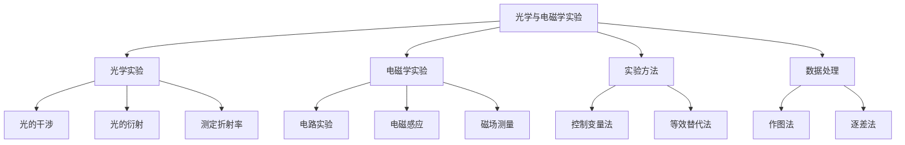
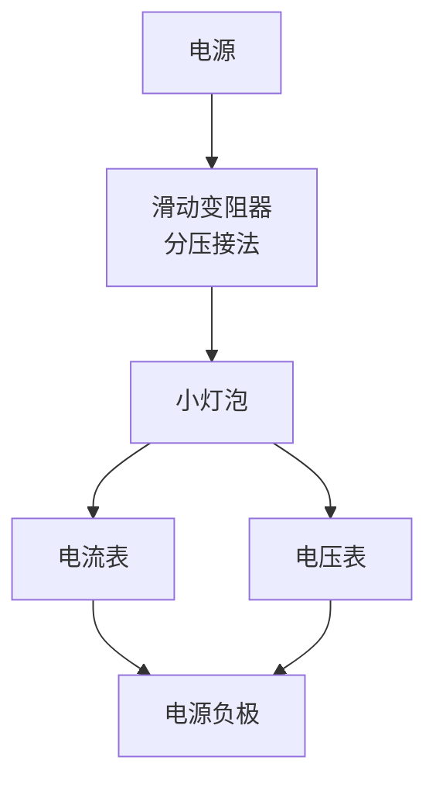
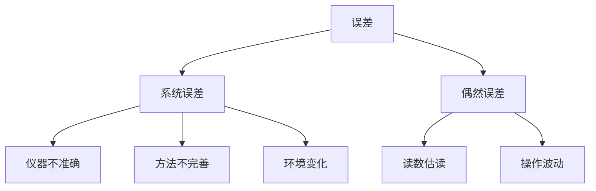

---
aliases:
  - 光学实验
  - 电磁学实验
  - 物理实验方法
  - 实验数据分析
tags:
  - K12
  - 高中物理
  - 光学实验
  - 电磁学实验
  - 物理实验
---

# 光学与电磁学实验 (Optics and Electromagnetism Experiments)

## 概述 (Overview)

光学与电磁学实验是高中物理实验教学的重要组成部分，涵盖**实验方法 (Experimental Methods)**、**仪器使用 (Instrument Usage)**、**数据处理 (Data Processing)** 和**误差分析 (Error Analysis)** 等核心技能。本模块强调科学探究能力和实验操作规范的培养。

---

## 一、实验基础方法 (Basic Experimental Methods)

### 1.1 控制变量法

**控制变量法 (Control Variable Method)**：在研究多个因素对某一物理量的影响时，只改变其中一个因素，保持其他因素不变。

应用示例：

| 实验名称 | 自变量 | 因变量 | 控制变量 |
|----------|--------|--------|----------|
| 探究加速度与力、质量的关系 | 力 $F$、质量 $m$ | 加速度 $a$ | 分别控制 |
| 探究电阻定律 | 长度 $L$、 横截面积 $S$ | 电阻 $R$ | 材料、温度 |
| 研究单摆周期 | 摆长 $L$、 摆球质量 $m$ | 周期 $T$ | 摆角 $< 5°$ |

### 1.2 等效替代法

**等效替代法 (Equivalent Substitution Method)**：在保证效果相同的前提下，将复杂问题转化为简单问题。

常见应用：
- 合力与分力的等效替代
- 电阻的串并联等效
- 平均速度代替变速运动

### 1.3 放大法

**放大法 (Amplification Method)**：将微小量放大以便观察和测量。

| 放大类型 | 实验应用 |
|----------|----------|
| 机械放大 | 螺旋测微器 |
| 光学放大 | 游标卡尺读数装置 |
| 电学放大 | 灵敏电流计 |

---

## 二、常用实验仪器 (Common Experimental Instruments)

### 2.1 测量类仪器

| 仪器名称 | 测量对象 | 精度 | 读数方法 |
|----------|----------|------|----------|
| 毫米刻度尺 | 长度 | 1 mm | 估读到下一位 |
| 游标卡尺 | 长度 | 0.02/0.05 mm | 主尺+游标对齐 |
| 螺旋测微器 | 长度 | 0.001 mm | 主尺+鼓轮读数 |
| 多用电表 | 电压/电流/电阻 | 多量程 | 选择合适量程 |

### 2.2 光学实验仪器

| 仪器 | 用途 | 使用要点 |
|------|------|----------|
| 光具座 | 光学元件定位 | 共轴调节 |
| 分光计 | 测量角度 | 望远镜调焦 |
| 双缝干涉仪 | 观察干涉条纹 | 单缝与双缝平行 |
| 激光器 | 光源 | 注意安全 |

### 2.3 电磁学实验仪器

| 仪器 | 用途 | 注意事项 |
|------|------|----------|
| 电流表 | 测量电流 | 串联，注意量程 |
| 电压表 | 测量电压 | 并联，注意量程 |
| 滑动变阻器 | 调节电流/电压 | 接线方式 |
| 电阻箱 | 提供标准电阻 | 调节前先断电 |

---

## 三、光学实验 (Optics Experiments)

### 3.1 测定玻璃的折射率

**实验原理**：根据折射定律

$$n = \frac{\sin i}{\sin r}$$

**实验步骤**：
1. 将玻璃砖放在白纸上，描出界面
2. 插入两枚大头针 $P_1$、$P_2$ 确定入射光线
3. 透过玻璃砖观察，插入 $P_3$、$P_4$ 确定出射光线
4. 移去玻璃砖，画出光路图
5. 用量角器测量入射角和折射角
6. 计算折射率

**数据处理**：

| 次数 | 入射角 $i$ | 折射角 $r$ | $\sin i$ | $\sin r$ | $n$ |
|------|-----------|-----------|----------|----------|-----|
| 1 | $30°$ | - | - | - | - |
| 2 | $45°$ | - | - | - | - |
| 3 | $60°$ | - | - | - | - |

### 3.2 用双缝干涉测量光的波长

**实验原理**：

$$\Delta x = \frac{L}{d}\lambda$$

其中：
- $d$：双缝间距
- $L$：双缝到屏的距离
- $\Delta x$：相邻亮纹间距

**注意事项**：
- 单缝与双缝平行
- 测量多个条纹间距求平均
- $L$ 测量要准确

### 3.3 测定凸透镜焦距

**方法对比**：

| 方法 | 原理 | 精度 |
|------|------|------|
| 平行光法 | 平行光会聚于焦点 | 较低 |
| 公式法 | $\frac{1}{u} + \frac{1}{v} = \frac{1}{f}$ | 中等 |
| 共轭法 | $f = \frac{L^2 - d^2}{4L}$ | 较高 |

---

## 四、电磁学实验 (Electromagnetism Experiments)

### 4.1 测定金属的电阻率

**实验原理**：

$$R = \rho\frac{L}{S}$$

$$\rho = \frac{RS}{L} = \frac{\pi d^2 R}{4L}$$

**电路选择**：

| 连接方式 | 适用条件 | 误差分析 |
|----------|----------|----------|
| 电流表内接 | 待测电阻较大 | 测量值偏大 |
| 电流表外接 | 待测电阻较小 | 测量值偏小 |

### 4.2 描绘小灯泡的伏安特性曲线

**实验特点**：
- 小灯泡电阻随温度变化
- 伏安特性曲线为非线性

**电路设计**：

### 4.3 测定电源的电动势和内阻

**实验原理**：

$$E = U + Ir$$

**数据处理方法**：

| 方法 | 处理方式 | 优点 |
|------|----------|------|
| 公式法 | 联立方程求解 | 简单直接 |
| 图像法 | $U-I$ 图像 | 减小偶然误差 |

$U-I$ 图像：
- 纵截距：电动势 $E$
- 斜率绝对值：内阻 $r$

### 4.4 电磁感应实验

**探究感应电流方向的实验**：

**楞次定律 (Lenz's Law)**：感应电流的磁场总要阻碍引起感应电流的磁通量的变化。

实验操作要点：
1. 明确原磁场方向
2. 判断磁通量变化（增或减）
3. 根据楞次定律确定感应电流磁场方向
4. 用右手螺旋定则判断感应电流方向

---

## 五、数据处理与误差分析 (Data Processing and Error Analysis)

### 5.1 数据处理方法

| 方法 | 适用场景 | 要点 |
|------|----------|------|
| 列表法 | 原始数据记录 | 标明单位， 有效数字 |
| 作图法 | 寻找规律 | 选标度， 描点连线 |
| 逐差法 | 等间隔测量 | 充分利用数据 |
| 平均值法 | 多次测量 | 减小偶然误差 |

### 5.2 误差分析

**误差分类**：

**减小误差的方法**：
- 校准仪器
- 改进实验方法
- 多次测量取平均
- 图像法处理数据

### 5.3 有效数字

**有效数字 (Significant Figures)** 规则：
- 从第一个非零数字开始计数
- 测量结果的最后一位是估计位
- 运算结果保留的有效数字位数与参与运算的数中有效数字最少的一致

---

## 六、实验设计与创新 (Experimental Design and Innovation)

### 6.1 实验设计原则

1. **科学性**：原理正确，方法可行
2. **安全性**：操作安全，无危险
3. **精确性**：误差小，结果可靠
4. **简便性**：装置简单，操作方便

### 6.2 常见创新实验方法

| 创新方向 | 具体方法 |
|----------|----------|
| 传感器应用 | 用光电门测速度 |
| 数字化实验 | 用计算机采集数据 |
| 替代方案 | 用单摆替代弹簧振子 |

---

## 参考文献 (References)

1. 普通高中物理课程标准（2017年版2020年修订）
2. 高中物理实验教程
3. 物理实验方法与数据处理
