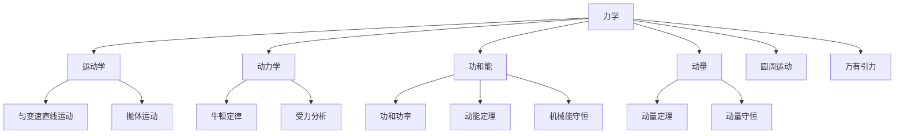
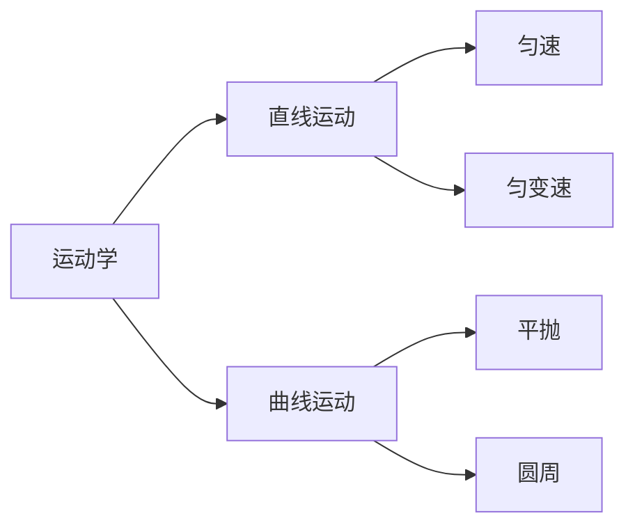
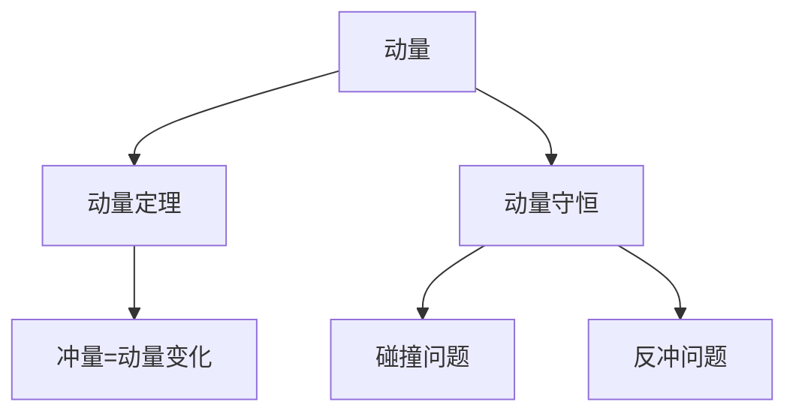
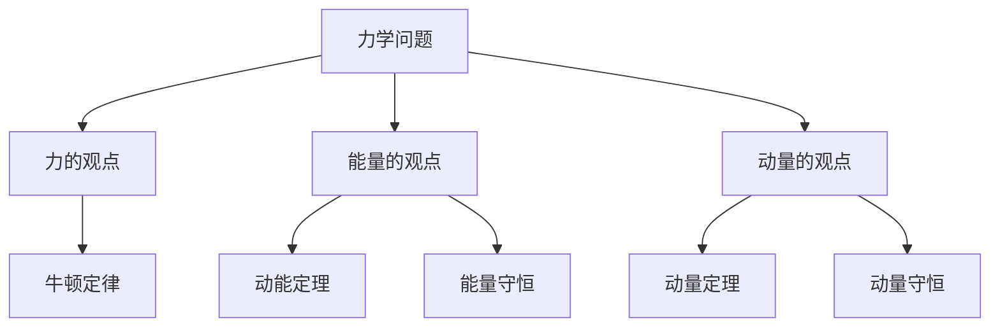

---
aliases:
  - 高中力学
  - 运动学
  - 动力学
  - 能量守恒
tags:
  - K12
  - 高中物理
  - 力学
  - 动力学
  - 能量
---

# 力学 (Mechanics)

## 概述 (Overview)

高中力学是物理学的基础和核心，涵盖**运动学 (Kinematics)**、**动力学 (Dynamics)**、**功与能 (Work and Energy)**、**动量 (Momentum)**、**圆周运动 (Circular Motion)** 和**万有引力 (Gravitation)** 等系统内容。本模块以牛顿运动定律为主线，构建经典力学的完整框架。

---

## 一、运动学 (Kinematics)

### 1.1 质点与参考系

**质点 (Particle)**：忽略物体形状和大小，只考虑质量的理想化模型。

**参考系 (Reference Frame)**：描述物体运动时所选定的参照物体。

### 1.2 运动的描述

| 物理量 | 定义 | 公式 | 单位 |
|--------|------|------|------|
| 位移 (Displacement) | 位置的变化 | $\Delta x = x_2 - x_1$ | m |
| 速度 (Velocity) | 位移的变化率 | $v = \frac{\Delta x}{\Delta t}$ | m/s |
| 加速度 (Acceleration) | 速度的变化率 | $a = \frac{\Delta v}{\Delta t}$ | m/s² |

### 1.3 匀变速直线运动

基本公式：

$$v = v_0 + at$$

$$x = v_0t + \frac{1}{2}at^2$$

$$v^2 - v_0^2 = 2ax$$

平均速度：

$$\bar{v} = \frac{v_0 + v}{2} = \frac{x}{t}$$

### 1.4 自由落体与竖直上抛

**自由落体 (Free Fall)**：

$$v = gt, \quad h = \frac{1}{2}gt^2, \quad v^2 = 2gh$$

**竖直上抛 (Vertical Throw)**：

最大高度：

$$H = \frac{v_0^2}{2g}$$

上升时间：

$$t = \frac{v_0}{g}$$

### 1.5 运动的合成与分解

**运动的独立性原理**：一个运动可以分解为几个独立进行的分运动。

**平抛运动 (Projectile Motion)**：

水平方向：$x = v_0 t$（匀速）

竖直方向：$y = \frac{1}{2}gt^2$（自由落体）

轨迹方程：

$$y = \frac{g}{2v_0^2}x^2$$

---

## 二、动力学 (Dynamics)

### 2.1 牛顿运动定律

**牛顿第一定律**：惯性定律

**牛顿第二定律**：

$$\vec{F} = m\vec{a}$$

分量式：

$$F_x = ma_x, \quad F_y = ma_y$$

**牛顿第三定律**：

$$\vec{F}_{12} = -\vec{F}_{21}$$

### 2.2 常见力的分析

| 力的类型 | 公式 | 特点 |
|----------|------|------|
| 重力 | $G = mg$ | 竖直向下 |
| 弹力 | $F = kx$ | 与形变方向相反 |
| 滑动摩擦力 | $f = \mu N$ | 与相对运动方向相反 |
| 静摩擦力 | $0 \leq f \leq f_{\max}$ | 由平衡条件确定 |

### 2.3 受力分析方法

**整体法与隔离法**：

- 整体法：将多个物体看作整体，分析外力
- 隔离法：隔离单个物体，分析所有作用力

### 2.4 连接体问题

加速度相同的连接体：

$$a = \frac{F_{\text{合}}}{m_1 + m_2 + \cdots + m_n}$$

---

## 三、功和能 (Work and Energy)

### 3.1 功与功率

**功 (Work)**：

$$W = F \cdot s \cdot \cos\theta$$

**功率 (Power)**：

$$P = \frac{W}{t} = F \cdot v \cdot \cos\theta$$

### 3.2 动能与势能

| 能量形式 | 公式 | 特点 |
|----------|------|------|
| 动能 (KE) | $E_k = \frac{1}{2}mv^2$ | 与速度平方成正比 |
| 重力势能 (GPE) | $E_p = mgh$ | 与参考面选择有关 |
| 弹性势能 (EPE) | $E_p = \frac{1}{2}kx^2$ | 与形变量平方成正比 |

### 3.3 功能关系

**动能定理 (Work-Energy Theorem)**：

$$W_{\text{合}} = \Delta E_k = \frac{1}{2}mv_2^2 - \frac{1}{2}mv_1^2$$

**机械能守恒定律**：

$$E_{k1} + E_{p1} = E_{k2} + E_{p2}$$

条件：只有重力或弹力做功。

### 3.4 能量守恒定律

**能量守恒定律 (Law of Conservation of Energy)**：

能量既不会凭空产生，也不会凭空消失，它只会从一种形式转化为另一种形式，或者从一个物体转移到其它物体，而能量的总量保持不变。

---

## 四、动量 (Momentum)

### 4.1 动量与冲量

**动量 (Momentum)**：

$$\vec{p} = m\vec{v}$$

**冲量 (Impulse)**：

$$\vec{I} = \vec{F} \cdot t$$

### 4.2 动量定理

**动量定理 (Impulse-Momentum Theorem)**：

$$\vec{I} = \Delta \vec{p} = m\vec{v}_2 - m\vec{v}_1$$

### 4.3 动量守恒定律

**动量守恒定律 (Law of Conservation of Momentum)**：

$$m_1\vec{v}_1 + m_2\vec{v}_2 = m_1\vec{v}_1' + m_2\vec{v}_2'$$

适用条件：系统所受合外力为零。

### 4.4 碰撞问题

| 碰撞类型 | 特点 | 方程 |
|----------|------|------|
| 弹性碰撞 | 动量守恒，动能守恒 | $p$守恒，$E_k$守恒 |
| 非弹性碰撞 | 动量守恒，动能不守恒 | $p$守恒 |
| 完全非弹性碰撞 | 碰撞后共速 | $v_1' = v_2'$ |

---

## 五、曲线运动与万有引力 (Curvilinear Motion and Gravitation)

### 5.1 匀速圆周运动

| 物理量 | 公式 | 说明 |
|--------|------|------|
| 线速度 | $v = \frac{2\pi r}{T} = \omega r$ | 沿切线方向 |
| 角速度 | $\omega = \frac{2\pi}{T}$ | 单位 rad/s |
| 向心加速度 | $a = \frac{v^2}{r} = \omega^2 r$ | 指向圆心 |
| 向心力 | $F = m\frac{v^2}{r} = m\omega^2 r$ | 指向圆心 |

### 5.2 万有引力定律

**万有引力定律 (Law of Universal Gravitation)**：

$$F = G\frac{Mm}{r^2}$$

其中 $G = 6.67 \times 10^{-11} \, \text{N} \cdot \text{m}^2/\text{kg}^2$

### 5.3 天体运动

**第一宇宙速度 (First Cosmic Velocity)**：

$$v_1 = \sqrt{gR} \approx 7.9 \, \text{km/s}$$

**黄金代换**：

$$GM = gR^2$$

---

## 六、力学综合 (Comprehensive Mechanics)

### 6.1 解决力学问题的三条途径

### 6.2 常见模型

| 模型 | 特点 | 分析方法 |
|------|------|----------|
| 板块模型 | 摩擦力驱动 | 隔离法+相对运动 |
| 传送带模型 | 摩擦力做功 | 功能关系 |
| 弹簧模型 | 变力作用 | 能量守恒 |
| 连接体模型 | 加速度关联 | 整体法+隔离法 |

---

## 参考文献 (References)

1. 普通高中物理课程标准（2017年版2020年修订）
2. 高中物理力学综合训练
3. 经典力学教程
