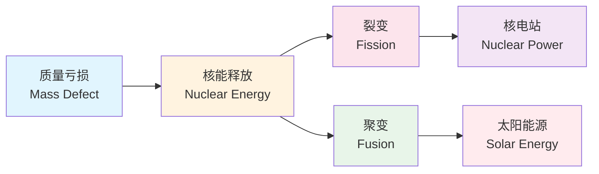

---
aliases: [热学光学近代物理实验, ThermalOpticsModernPhysics]
tags: ['SeniorHigh', 'Physics', 'ThermalPhysics', 'Optics', 'ModernPhysics', 'Experiments']
---

# 高中物理 · 热学 / 光学 / 近代物理 / 实验

---

## 一、热学

### 1. 分子动理论

**基本观点**：

- 物质由大量分子组成
- 分子永不停息地做无规则运动（布朗运动、扩散现象）
- 分子间存在引力和斥力

**阿伏伽德罗常数**：$N_A = 6.02 \times 10^{23} \text{ mol}^{-1}$

**分子大小估算**：

- 固体/液体分子：$d = \sqrt[3]{V_0}$（$V_0$ 为一个分子占据的体积）
- 气体分子间距：$d = \sqrt[3]{V_0}$（分子大小可忽略）

**布朗运动**：

- 悬浮颗粒的无规则运动
- 原因：液体分子撞击不平衡
- 温度越高、颗粒越小，布朗运动越剧烈

### 2. 温度与分子动能

**温度**：分子热运动平均动能的标志

- 物体的内能 $\neq$ 机械能

**分子平均动能**：$\overline{E_k} = \frac{3}{2}kT$（$k$ 为玻尔兹曼常数）

### 3. 分子势能与内能

- 分子势能：由分子间相对位置决定
- 内能：分子动能 + 分子势能（与温度、体积、物质的量有关）

### 4. 热力学定律

**热力学第一定律**（能量守恒）：$\Delta U = Q + W$

| 过程 | $\Delta U$ | $Q$ | $W$ |
|------|----|----|-----|
| 等温膨胀 | 0 | 吸热 | 对外做功 |
| 等容升温 | 增加 | 吸热 | 0 |
| 绝热膨胀 | 减少 | 0 | 对外做功 |
| 等压膨胀 | 增加 | 吸热 | 对外做功 |

**热力学第二定律**：

- 克劳修斯表述：热量不能自发地从低温物体传向高温物体
- 开尔文表述：不可能从单一热源吸热使之完全变成功而不产生其他影响
- 实质：涉及热现象的宏观过程具有方向性（不可逆）

**热力学第三定律**：绝对零度不可达

### 5. 气体实验定律（理想气体）

**玻意耳定律**（等温）：$p_1 V_1 = p_2 V_2$

**查理定律**（等容）：$\frac{p_1}{T_1} = \frac{p_2}{T_2}$

**盖·吕萨克定律**（等压）：$\frac{V_1}{T_1} = \frac{V_2}{T_2}$

**理想气体状态方程**：$\frac{pV}{T} = C$（常数）→ $\frac{p_1 V_1}{T_1} = \frac{p_2 V_2}{T_2}$

**克拉珀龙方程**：$pV = nRT$（$n$ 为物质的量，$R = 8.31 \text{ J/(mol·K)}$）

---

## 二、光学

### 1. 几何光学

**光的反射定律**：反射角 = 入射角（法线两侧）

**光的折射定律（斯涅耳定律）**：$n = \frac{\sin i}{\sin r} = \frac{c}{v}$

**折射率**：

- $n > 1$（真空 → 介质）
- 光密介质折射率大，光疏介质折射率小

**全反射**：

- 条件：光从光密 → 光疏，且 $i \ge C$（临界角）
- $\sin C = \frac{1}{n}$

**棱镜**：光通过棱镜向底面偏折，发生色散

### 2. 物理光学

**光的干涉**：

- 双缝干涉：$\Delta x = \frac{\lambda L}{d}$（亮暗条纹交替）
  - 光程差 $\delta = k\lambda$ → 亮纹
  - 光程差 $\delta = (2k+1)\lambda/2$ → 暗纹
- 薄膜干涉：肥皂泡、油膜上的彩色条纹

**光的衍射**：

- 单缝衍射：中间亮纹最宽最亮，两侧依次变暗
- 条件：障碍物尺寸与波长可比

**光电效应**：

- $E_k = h\nu - W_0$（爱因斯坦光电效应方程）
- 极限频率：$\nu_0 = \frac{W_0}{h}$
- 瞬时性、存在截止频率
- 光电流与光强成正比（频率一定时）

**光的波粒二象性**：

- 光既有波动性又有粒子性
- 波长长 → 波动性显著；波长短 → 粒子性显著
- 物质波（德布罗意波）：$\lambda = \frac{h}{p}$

---

## 三、近代物理

### 1. 原子结构

| 模型 | 提出者 | 要点 |
|------|--------|------|
| 枣糕模型 | 汤姆孙 | 正电荷均匀分布，电子嵌在其中 |
| 核式结构 | 卢瑟福 | $\alpha$ 粒子散射实验 → 原子核小且带正电 |
| 玻尔模型 | 玻尔 | 轨道量子化、能级跃迁 |

**玻尔假设**：

- 定态：电子在特定轨道上运动不辐射能量
- 跃迁：$h\nu = E_m - E_n$
- 轨道量子化：$mvr = \frac{nh}{2\pi}$

**能级与光谱**：

- 基态：$n = 1$，能量最低
- 激发态：$n \ge 2$
- 从高能级跃迁到低能级 → 发光
- 从低能级跃迁到高能级 → 吸收光
- 一群氢原子从 $n$ 能级跃迁，可发射 $C(n,2)$ 种频率的光

### 2. 原子核

**天然放射现象**：

- $\alpha$ 射线：$^4_2\text{He}$ 核，电离能力强，穿透能力弱
- $\beta$ 射线：电子，电离能力中等，穿透能力中等
- $\gamma$ 射线：光子，电离能力弱，穿透能力强
- 三种射线均来自原子核

**衰变**：

- $\alpha$ 衰变：$^A_Z\text{X} \rightarrow ^{A-4}_{Z-2}\text{Y} + ^4_2\text{He}$（质量数减 4，电荷数减 2）
- $\beta$ 衰变：$^A_Z\text{X} \rightarrow ^A_{Z+1}\text{Y} + ^0_{-1}\text{e}$（质量数不变，电荷数加 1）

**半衰期**：半数原子核衰变所需时间，与外界条件无关

**核反应类型**：

| 类型 | 示例 |
|------|------|
| **衰变** | $^{238}_{92}\text{U} \rightarrow ^{234}_{90}\text{Th} + ^4_2\text{He}$ |
| **人工转变** | $^{14}_7\text{N} + ^4_2\text{He} \rightarrow ^{17}_8\text{O} + ^1_1\text{H}$ |
| **裂变** | $^{235}_{92}\text{U} + ^1_0\text{n} \rightarrow ^{144}_{56}\text{Ba} + ^{89}_{36}\text{Kr} + 3^1_0\text{n}$ |
| **聚变** | $^2_1\text{H} + ^3_1\text{H} \rightarrow ^4_2\text{He} + ^1_0\text{n}$ |

**质量亏损与核能**：$\Delta E = \Delta m \cdot c^2$（$\Delta m$：核反应前后质量差）

**比结合能**：结合能/核子数，越大越稳定

---

## 四、物理实验

### 1. 力学实验

| 实验名称 | 原理 | 关键仪器 | 数据处理 |
|---------|------|---------|---------|
| **匀变速运动** | $\Delta x = aT^2$ | 打点计时器、纸带 | 逐差法求 $a$ |
| **验证牛顿第二定律** | $a \propto F$，$a \propto 1/m$ | 打点计时器、小车、轨道 | 图像法（a-F，a-1/m）|
| **探究平抛运动** | 水平匀速、竖直自由落体 | 斜槽、白纸、重锤 | 轨迹描点 |
| **验证机械能守恒** | $mgh = \frac{1}{2}mv^2$ | 打点计时器、重锤 | 比较 $gh$ 与 $v^2/2$ |

**打点计时器**：

- 电磁打点计时器：4-6V 交流电，50Hz
- 电火花计时器：220V 交流电，50Hz
- 打点间隔：0.02s

**纸带处理**：

- 瞬时速度：$v_n = \frac{x_n + x_{n+1}}{2T}$
- 加速度（逐差法）：$a = \frac{(x_4 + x_5 + x_6) - (x_1 + x_2 + x_3)}{9T^2}$

**验证牛顿第二定律实验注意**：

- 平衡摩擦力：倾斜长木板
- 钩码质量远小于小车质量（使 $F \approx mg$）

### 2. 电学实验

| 实验名称 | 原理 | 电路 | 关键 |
|---------|------|------|------|
| **伏安法测电阻** | $R = U/I$ | 内接/外接 | 电表量程选择 |
| **测电源电动势和内阻** | $U = E - Ir$ | 伏安法/安阻法/伏阻法 | 作图处理 |
| **多用电表的使用** | 欧姆定律 | 内置电源 | 调零、选择合适倍率 |
| **描绘小灯泡伏安特性** | I-U 图像 | 分压式接法 | 小电阻用外接 |

**电流表内外接法选择**：

- 外接：$R_x << R_v$（小电阻）→ 测小电阻
- 内接：$R_x >> R_A$（大电阻）→ 测大电阻
- 临界值法：比较 $R_x$ 与 $\sqrt{R_A \cdot R_v}$

**滑动变阻器的接法**：

- 限流式：电路中耗能少，但调节范围有限
- 分压式：调节范围从 0 开始，电压调节范围大

**多用电表**：

- 测电阻前需调零（短接表笔调欧姆零）
- 换倍率后重新调零
- 读数在表盘中央附近最准确

### 3. 实验误差分析

- **系统误差**：仪器不精确、实验方法不完善 → 可减小但不可消除
- **偶然误差**：人为因素、环境因素 → 多次测量取平均可减小
- **有效数字**：可靠数字 + 一位估计数字

### 4. 实验设计的基本原则

1. **科学性**：原理正确
2. **可行性**：仪器和条件满足
3. **安全性**：不超过仪器量程
4. **精确性**：误差尽可能小
5. **可重复性**：实验条件和步骤明确

## 相关条目

[[02_NaturalSciences/Physics/ClassicalMechanics/INDEX|ClassicalMechanics]], [[02_NaturalSciences/Physics/QuantumMechanics/INDEX|QuantumMechanics]], [[04_EngineeringAndTechnology/EngineeringFundamentals/EngineeringThermophysics/Thermodynamics|Thermodynamics]], [[02_NaturalSciences/Physics/Electromagnetism/INDEX|Electromagnetism]]

