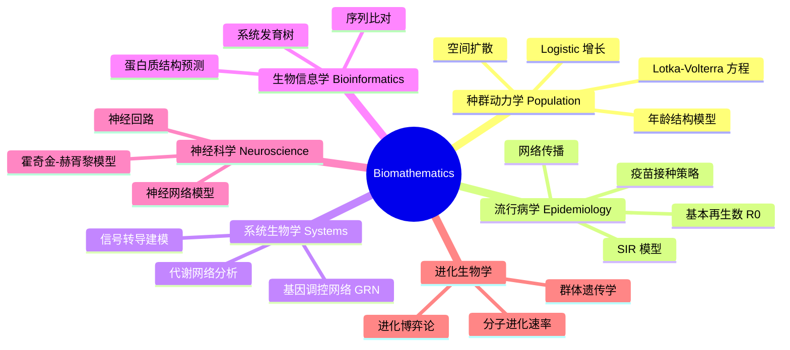

# Biomathematics

## 概述 (Overview)

生物数学 (Biomathematics / Mathematical Biology) 是应用数学工具研究生命现象的交叉学科。它使用微分方程、概率统计、动力系统和计算模型来描述和预测生物系统的行为。从分子水平到生态系统，生物数学为复杂生命过程提供定量的数学框架。

## 生物数学分支

## 种群动力学 (Population Dynamics)

### 单物种增长模型

马尔萨斯模型 (Malthusian Model)：

$$\frac{dN}{dt} = rN$$

解为 $N(t) = N_0 e^{rt}$，当 $r > 0$ 时呈指数增长。

Logistic 模型 (Logistic Model) 引入环境容纳量 (Carrying Capacity) $K$：

$$\frac{dN}{dt} = rN\left(1 - \frac{N}{K}\right$$

解为 $N(t) = \frac{K}{1 + (K/N_0 - 1)e^{-rt}}$

### 捕食者-猎物模型 (Predator-Prey)

Lotka-Volterra 方程：

$$\frac{dx}{dt} = \alpha x - \beta xy$$

$$\frac{dy}{dt} = \delta xy - \gamma y$$

其中 $x$ 是猎物密度，$y$ 是捕食者密度。系统具有周期振荡的特征。

### 年龄结构模型 (Age-Structured Models)

Leslie 矩阵模型将种群按年龄分组：

$$\mathbf{n}_{t+1} = L\mathbf{n}_t$$

其中 $L$ 是 Leslie 矩阵，包含各年龄组的生育率和存活率。稳定年龄分布由 $L$ 的主特征向量决定。

## 传染病建模 (Epidemic Modeling)

### SIR 模型

经典的 SIR 模型将人群分为易感者 S (Susceptible)、感染者 I (Infected) 和康复者 R (Recovered)：

$$\frac{dS}{dt} = -\beta SI$$

$$\frac{dI}{dt} = \beta SI - \gamma I$$

$$\frac{dR}{dt} = \gamma I$$

### 基本再生数 (Basic Reproduction Number)

$$R_0 = \frac{\beta S_0}{\gamma}$$

$R_0 > 1$ 表示疾病可以传播；$R_0 < 1$ 表示疾病自然消退。

### 扩展模型

- SEIR 模型：加入潜伏期 E (Exposed)
- SIS 模型：康复后再次变为易感
- 空间 SIR：考虑扩散项 $\nabla^2 S, \nabla^2 I$
- 随机 SIR：考虑随机效应

## 基因调控网络 (Gene Regulatory Networks)

### 布尔网络模型 (Boolean Network)

每个基因 $i$ 的状态 $x_i \in \{0,1\}$，更新规则由布尔函数决定：

$$x_i(t+1) = f_i(x_{i_1}(t), \ldots, x_{i_k}(t))$$

### 微分方程模型

$$\frac{dx_i}{dt} = f_i(\mathbf{x}) - \gamma_i x_i$$

其中 $f_i$ 是 Hill 函数形式的调控函数：

$$f_i(\mathbf{x}) = \frac{\alpha_i}{1 + (x_j/K)^n} \quad\text{(抑制)}$$

$$f_i(\mathbf{x}) = \frac{\alpha_i (x_j/K)^n}{1 + (x_j/K)^n} \quad\text{(激活)}$$

## 生化反应动力学 (Biochemical Kinetics)

### 米氏方程 (Michaelis-Menten Kinetics)

$$v = \frac{V_{\max}[S]}{K_m + [S]}$$

### 酶催化反应系统

$$E + S \overset{k_1}{\underset{k_{-1}}{\rightleftharpoons}} ES \overset{k_2}{\rightarrow} E + P$$

稳态近似 (Steady-State Approximation)：

$$\frac{d[ES]}{dt} \approx 0$$

### 反应扩散方程

$$ \frac{\partial u}{\partial t} = D_u\nabla^2 u + f(u,v) $$

$$ \frac{\partial v}{\partial t} = D_v\nabla^2 v + g(u,v) $$

图灵不稳定 (Turing Instability) 导致斑图形成 (Pattern Formation)。

## 群体遗传学 (Population Genetics)

### 哈代-温伯格平衡 (Hardy-Weinberg Equilibrium)

$$p^2 + 2pq + q^2 = 1$$

### 选择与漂变

自然选择导致的基因频率变化：

$$\Delta p = \frac{pqs}{1 - qs}$$

其中 $s$ 是选择系数。

### 随机遗传漂变 (Genetic Drift)

赖特-费舍尔模型 (Wright-Fisher Model) 描述有限种群中基因频率的随机波动。固定概率 (Fixation Probability)：

$$P_{\text{fix}} = \frac{1 - e^{-2N_e s p}}{1 - e^{-2N_e s}}$$

## 系统发育学 (Phylogenetics)

### 进化距离 (Evolutionary Distance)

Jukes-Cantor 模型：

$$d = -\frac{3}{4}\ln\left(1 - \frac{4}{3}p\right)$$

### 建树方法

- 最大简约法 (Maximum Parsimony)
- 最大似然法 (Maximum Likelihood)
- 贝叶斯推断 (Bayesian Inference)
- 邻接法 (Neighbor-Joining)

## 神经科学建模 (Neuroscience Modeling)

### 霍奇金-赫胥黎模型 (Hodgkin-Huxley Model)

$$C\frac{dV}{dt} = I_{\text{ext}} - g_{\text{Na}}m^3h(V - E_{\text{Na}}) - g_K n^4(V - E_K) - g_L(V - E_L)$$

门控变量的动力学：

$$\frac{dm}{dt} = \alpha_m(1 - m) - \beta_m m$$

### 整合-发放模型 (Integrate-and-Fire)

$$\tau\frac{dV}{dt} = - (V - V_{\text{rest}}) + RI(t)$$

当 $V \geq V_{\text{th}}$ 时发放脉冲，$V$ 复位。

## 数学生物学软件

| 软件 | 用途 |
|------|------|
| MATLAB | 通用建模与仿真 |
| R | 统计分析与可视化 |
| COPASI | 生化网络模拟 |
| BioNetGen | 规则建模 |
| XPPAUT | 动力系统分析 |
| CellDesigner | 图形化网络编辑 |

## 随机建模在生物学中的应用 (Stochastic Modeling in Biology)

确定性微分方程忽略随机波动，但在小分子数系统中随机效应显著。化学主方程 (Chemical Master Equation) 描述化学反应系统的概率分布演化：

$$\frac{dP(\mathbf{x},t)}{dt} = \sum_j \left[a_j(\mathbf{x}-\mathbf{v}_j)P(\mathbf{x}-\mathbf{v}_j,t) - a_j(\mathbf{x})P(\mathbf{x},t)\right]$$

吉莱斯皮算法 (Gillespie Algorithm) 利用随机模拟求解化学主方程，分为直接法和首次反应法。Langevin 方程在生化反应的随机动力学模拟中增加了噪声项。

## 空间生态学与斑图形成 (Spatial Ecology & Pattern Formation)

反应扩散方程在生态学中描述物种的空间分布。图灵不稳定 (Turing Instability) 导致空间斑图形成。扩散驱动的失稳条件：抑制剂的扩散速率必须快于激活剂。物种迁徙 (Dispersal) 和栖息地破碎化对种群持续性的影响通过空间显式模型研究。生态网络 (Ecological Networks) 中物种相互作用的拓扑结构影响生态系统稳定性。

## 数学生物学中的参数估计 (Parameter Estimation)

从实验数据估计模型参数是生物数学的核心挑战。方法包括：最小二乘法 (Least Squares)、最大似然估计 (MLE)、贝叶斯参数推断 (Bayesian Inference) 使用 MCMC 采样。可辨识性分析 (Identifiability Analysis) 确定参数是否可以从数据中唯一确定。模型选择使用 AIC (Akaike Information Criterion) 和 BIC (Bayesian Information Criterion) 进行。

## 生物数学的主要期刊 (Major Journals)

《Bulletin of Mathematical Biology》、《Journal of Theoretical Biology》、《Mathematical Biosciences》、《PLoS Computational Biology》、《Journal of Mathematical Biology》、《Theoretical Population Biology》、《SIAM Journal on Applied Dynamical Systems》。

## 生物数学在流行病学中的应用 (Epidemiological Applications)

新冠疫情期间，SEIR 模型被广泛用于预测疫情发展和评估干预措施效果。参数 $R_0$ (基本再生数) 和 $R_t$ (有效再生数) 成为公众熟知的科学概念。随机模型解释了超级传播事件 (Super-Spreading Events) 的出现。空间模型模拟了城市间人口流动对疫情扩散的影响。疫苗接种策略优化模型用于最大化免疫覆盖效果。

## 生物数学中的统计学方法 (Statistical Methods in Biomathematics)

生存分析 (Survival Analysis) 使用 Kaplan-Meier 曲线和 Cox 比例风险模型分析时间-事件数据。混合效应模型 (Mixed Effects Models) 处理群体内个体间变异。贝叶斯层次模型 (Bayesian Hierarchical Models) 整合多个数据源的信息。结构方程模型 (SEM) 检验生物变量之间的因果路径。空间统计 (Spatial Statistics) 分析生物地理数据中的空间模式。

## 相关条目

- [[../../INDEX|当前目录索引]]
