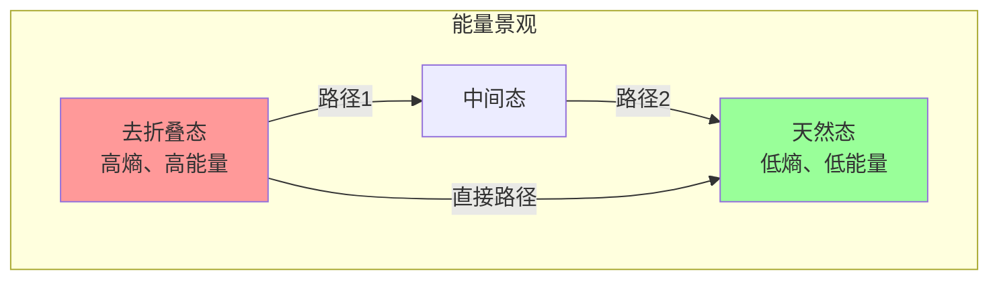

---
aliases: [Biophysics, 生物物理学]
tags: ['02_NaturalSciences', 'Biology', 'Biophysics', 'MolecularBiophysics']
created: 2026-05-17
updated: 2026-05-17
---

# 生物物理学 (Biophysics)

生物物理学是运用物理学的理论、方法和技术研究生物系统的结构与功能的交叉学科。它涵盖从分子到细胞、组织和生态系统等多个层次。

## 生物物理学的核心问题 (Core Questions)

| 层次 | 核心问题 | 物理工具 | 生物学问题 |
|------|---------|---------|-----------|
| 分子 | 蛋白质如何折叠？ | 统计力学、分子动力学 | 结构-功能关系 |
| 分子 | DNA 如何存储和读取信息？ | 单分子力谱、光学镊子 | 转录和复制的力学 |
| 细胞 | 细胞如何运动？ | 微流控、全内反射荧光 | 细胞骨架和分子马达 |
| 细胞 | 膜电位如何产生？ | 膜片钳、电生理 | 离子通道和神经信号 |
| 组织 | 组织如何形成？ | 流变学、连续介质力学 | 形态发生和力学传导 |
| 系统 | 大脑如何计算？ | 神经网络模型、信息论 | 神经编码与动力学 |

## 分子生物物理学 (Molecular Biophysics)

### 蛋白质折叠的热力学

蛋白质折叠的驱动力来自焓和熵的平衡：

$$ \Delta G_{\text{fold}} = \Delta H - T \Delta S $$

| 贡献 | 符号 | 来源 |
|------|------|------|
| 疏水效应 | $\Delta S > 0$ | 非极性基团远离水 |
| 氢键 | $\Delta H < 0$ | 主链和侧链间氢键 |
| 范德华力 | $\Delta H < 0$ | 紧密堆积的原子间 |
| 构象熵 | $\Delta S < 0$ | 折叠后自由度减少 |
| 静电作用 | $\Delta H < 0$ (盐桥) | 带电残基间相互作用 |

**漏斗状能量景观 (Folding Funnel)**：



### 单分子力谱 (Single-Molecule Force Spectroscopy)

| 技术 | 力范围 | 空间分辨率 | 应用 |
|------|-------|-----------|------|
| 光学镊子 (Optical Tweezers) | 0.1–100 pN | 0.1 nm | DNA/RNA 折叠、分子马达 |
| 原子力显微镜 (AFM) | 1–10000 pN | 0.5 nm | 蛋白质去折叠、细胞表面 |
| 磁镊子 (Magnetic Tweezers) | 0.01–100 pN | 1 nm | DNA 超螺旋、拓扑异构酶 |
| 声力谱 (Acoustic Force) | 0.1–1000 pN | 10 nm | 受体-配体相互作用 |

### 分子马达 (Molecular Motors)

| 马达蛋白 | 运动方向 | 步长 | 速度 | 载荷 |
|---------|---------|------|------|------|
| 肌球蛋白 V | 肌动蛋白（+ 端） | 36 nm | ~500 nm/s | 小泡运输 |
| 驱动蛋白 | 微管（+ 端） | 8 nm | ~1 μm/s | 细胞器运输 |
| 动力蛋白 | 微管（− 端） | 8 nm | ~1 μm/s | 鞭毛运动 |
| F₁-ATPase | 旋转 | 120°/步 | ~400 rps | ATP 合成 |

## 膜生物物理学 (Membrane Biophysics)

### 脂质双层的物理性质

| 性质 | 典型值 | 测量方法 |
|------|-------|---------|
| 厚度 | ~4–5 nm | X 射线衍射、中子散射 |
| 侧向扩散系数 | 1–10 μm²/s | FRAP (荧光漂白恢复) |
| 弯曲模量 | 10–100 k_BT | 微管吸吮、波动分析 |
| 电容 | 0.5–1 μF/cm² | 膜片钳电测量 |
| 断裂张力 | 3–30 mN/m | 微管吸吮 |

### 膜相变 (Membrane Phase Transitions)

脂质膜可以经历多种相变：

$$ T_m = \frac{\Delta H}{\Delta S} $$

| 相态 | 温度 | 特征 | 生物学关联 |
|------|------|------|-----------|
| 凝胶相 (L_β) | < T_m | 高度有序，侧向扩散慢 | 降低活性 |
| 液-有序相 (L_o) | ≈ T_m | 胆固醇富集域 (脂筏) | 信号转导聚集 |
| 液-无序相 (L_d) | > T_m | 高度流动，无序 | 正常膜功能 |
| 六角相 | 很高 | 非双层结构 | 膜融合中间态 |

## 电生理学 (Electrophysiology)

### Nernst 方程与膜电位

$$ E_{ion} = \frac{RT}{zF} \ln\frac{[ion]_{out}}{[ion]_{in}} $$

在 37°C 下：$E_{ion} = \frac{61.5}{z} \log_{10}\frac{[\text{ion}]_{out}}{[\text{ion}]_{in}}$ (mV)

**典型离子浓度和平衡电位**：

| 离子 | 细胞内 (mM) | 细胞外 (mM) | 平衡电位 (mV) |
|------|------------|------------|--------------|
| Na⁺ | 15 | 145 | +60 |
| K⁺ | 140 | 5 | −90 |
| Cl⁻ | 10 | 110 | −65 |
| Ca²⁺ | 10⁻⁴ | 2 | +120 |

### Hodgkin-Huxley 模型

动作电位的经典定量模型：

$$ I = C_m \frac{dV}{dt} + g_{Na}(V - E_{Na}) + g_K(V - E_K) + g_L(V - E_L) $$

$$ g_{Na} = \bar{g}_{Na} \cdot m^3 \cdot h $$
$$ g_K = \bar{g}_K \cdot n^4 $$

其中 $m$、$n$、$h$ 是门控变量，满足一阶动力学：

$$ \frac{dm}{dt} = \alpha_m(V)(1 - m) - \beta_m(V) \cdot m $$

## 结构生物学方法 (Structural Biology Methods)

### X 射线晶体学


### 冷冻电子显微镜 (Cryo-EM)

| 对比项 | X 射线晶体学 | NMR | Cryo-EM |
|--------|------------|-----|---------|
| 样品状态 | 结晶 | 溶液 | 快速冷冻溶液 |
| 分子量要求 | 无限制 | < 50 kDa | > 50 kDa |
| 分辨率上限 | ~0.8 Å | ~2 Å | ~1.2 Å |
| 样品用量 | 大量 | 中等 | 少量 |
| 动态信息 | 有限（单一构象） | 丰富 | 可通过分类获得 |

### 单分子追踪荧光成像

```python
import numpy as np
from scipy import optimize

def msd(trajectory, max_lag=20):
    """计算均方位移 (Mean Square Displacement)"""
    n = len(trajectory)
    msd_values = []

    for lag in range(1, min(max_lag + 1, n)):
        displacements = trajectory[lag:] - trajectory[:-lag]
        squared = np.sum(displacements**2, axis=1)
        msd_values.append(np.mean(squared))

    return np.array(msd_values)

def classify_diffusion(msd_values, dt):
    """根据 MSD 曲线分类扩散类型"""
    # MSD = 4Dt^α
    # α = 1: 正常扩散
    # α < 1: 亚扩散（受限制）
    # α > 1: 超扩散（定向运动）
    log_msd = np.log(msd_values)
    log_t = np.log(np.arange(1, len(msd_values) + 1) * dt)

    slope, intercept = np.polyfit(log_t, log_msd, 1)
    alpha = slope

    if alpha < 0.8:
        return "subdiffusion", alpha
    elif alpha < 1.2:
        return "normal diffusion", alpha
    else:
        return "superdiffusion", alpha
```

## 生物系统中的物理现象 (Physical Phenomena in Biology)

### 流体动力学

| 尺度 | Reynolds 数 | 流体特征 | 生物学实例 |
|------|------------|---------|-----------|
| 游动的鲸 | 10⁸ | 惯性主导 | 大动物运动 |
| 游动的鱼 | 10²–10⁴ | 惯性 + 黏性 | 鱼类游动 |
| 精子游动 | 10⁻² | 黏性主导 (Stokes 区) | 精子运动、细菌游动 |
| 细胞质流动 | 10⁻⁴ | 极低雷诺数 | 分子扩散、胞内运输 |

### 布朗运动与热力学

细胞内分子的运动受热涨落驱动：

$$ \langle r^2(t) \rangle = 2dD \cdot t $$

其中 $d$ 是维度，$D$ 是扩散系数。Stokes-Einstein 关系：

$$ D = \frac{k_B T}{6 \pi \eta R} $$

## 相关条目

- [[分子生物学]]
- [[细胞生物学]]
- [[神经科学]]
- [[结构生物学]]
- [[生物力学]]
- [[INDEX|当前目录索引]]

