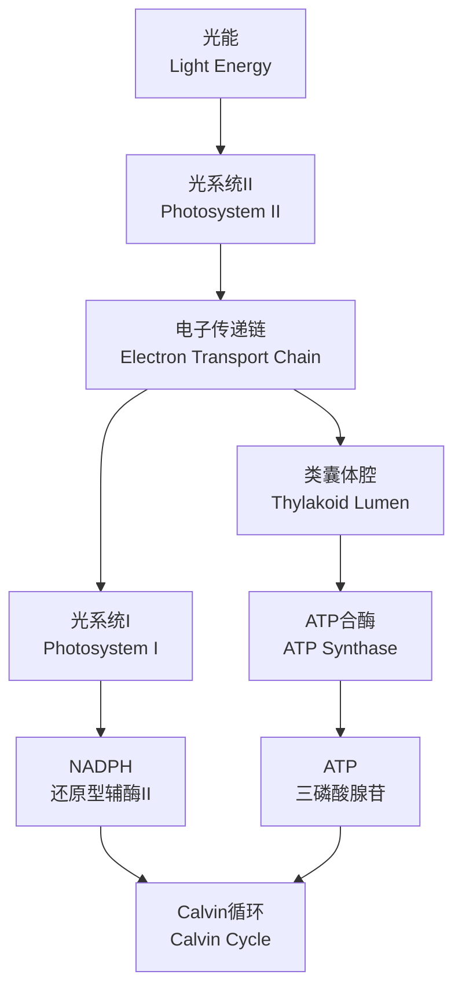
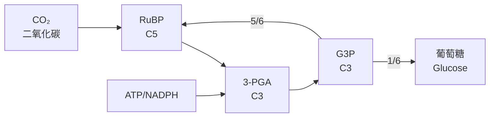
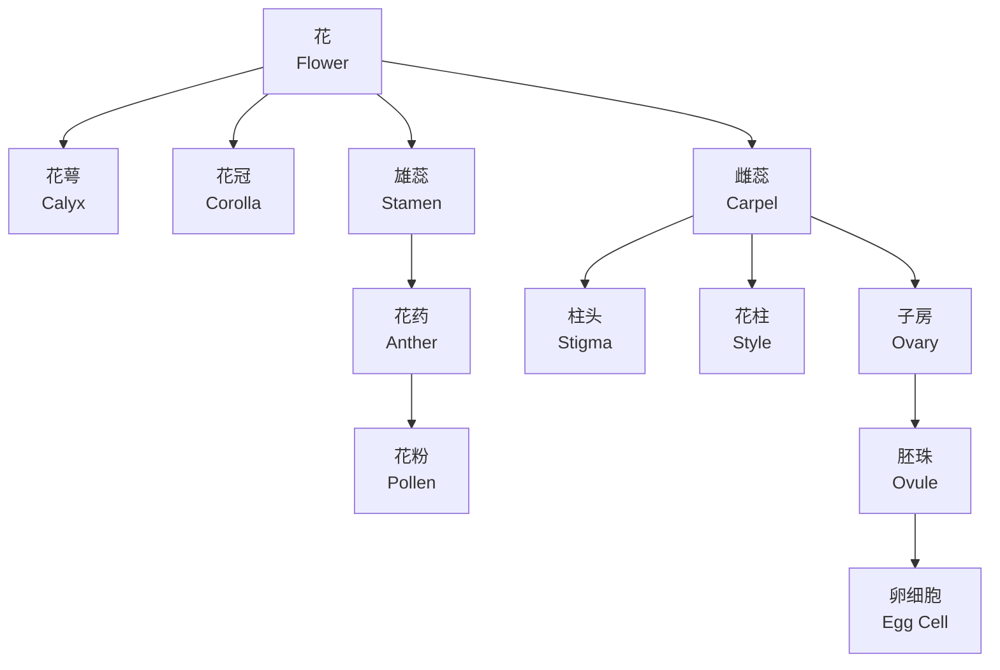

# 光合作用与繁殖 (Photosynthesis and Reproduction)

## 1. 光合作用概述 (Overview of Photosynthesis)

光合作用（Photosynthesis）是植物、藻类和某些细菌利用光能将二氧化碳和水转化为有机物并释放氧气的过程。总反应式为：

$$
6CO_2 + 6H_2O \xrightarrow{光能} C_6H_{12}O_6 + 6O_2
$$

光合作用发生在叶绿体（Chloroplast）中，主要分为光反应（Light Reactions）和暗反应（Dark Reactions, Calvin Cycle）两个阶段。

## 2. 光反应 (Light Reactions)

光反应发生在类囊体膜（Thylakoid Membrane）上，涉及两个光系统（Photosystem）：

### 2.1 光系统II（Photosystem II, PSII）

PSII 吸收波长680nm的光，将水分子光解：

$$
2H_2O \rightarrow 4H^+ + 4e^- + O_2
$$

释放的电子通过质体醌（Plastoquinone, PQ）传递至细胞色素b6f复合体（Cytochrome b6f Complex）。

### 2.2 光系统I（Photosystem I, PSI）

PSI 吸收波长700nm的光，将电子传递至铁氧还蛋白（Ferredoxin, Fd），最终还原NADP⁺为NADPH：

$$
NADP^+ + H^+ + 2e^- \rightarrow NADPH
$$

### 2.3 光合磷酸化（Photophosphorylation）

| 类型 | 电子传递路径 | 产物 |
|------|------------|------|
| 非循环光合磷酸化（Noncyclic） | H₂O → PSII → PQ → Cyt b6f → PC → PSI → Fd → NADP⁺ | ATP + NADPH |
| 循环光合磷酸化（Cyclic） | PSI → Fd → PQ → Cyt b6f → PC → PSI | ATP（无NADPH） |

## 3. Calvin循环（Calvin Cycle）

Calvin循环发生在叶绿体基质（Stroma）中，分为三个阶段：

### 3.1 羧化阶段（Carboxylation）

RuBP（核酮糖-1,5-二磷酸）在Rubisco催化下与CO₂结合，生成两个3-磷酸甘油酸（3-PGA）：

$$
RuBP + CO_2 \xrightarrow{Rubisco} 2 \times 3-PGA
$$

### 3.2 还原阶段（Reduction）

3-PGA 在ATP和NADPH作用下被还原为3-磷酸甘油醛（G3P）：

$$
3-PGA + ATP + NADPH \rightarrow G3P + ADP + NADP^+
$$

### 3.3 再生阶段（Regeneration）

部分G3P用于合成葡萄糖，其余用于再生RuBP：

$$
5 \times G3P + 3ATP \rightarrow 3RuBP + 3ADP
$$

每固定6分子CO₂净生成1分子葡萄糖（Glucose）。

## 4. 影响光合作用的因素 (Factors Affecting Photosynthesis)

| 因素 | 效应 | 机制 |
|------|------|------|
| 光强度（Light Intensity） | 正相关至饱和点 | 影响光反应速率 |
| CO₂浓度（CO₂ Concentration） | 正相关至饱和点 | 影响羧化反应 |
| 温度（Temperature） | 最适25-30°C | 影响酶活性（Rubisco） |
| 水分（Water） | 缺水导致气孔关闭 | 减少CO₂吸收 |

## 5. 植物繁殖 (Plant Reproduction)

### 5.1 有性生殖（Sexual Reproduction）

有性生殖涉及配子（Gamete）融合，产生遗传多样性。

#### 5.1.1 花的结构（Flower Structure）

花由花萼（Calyx）、花冠（Corolla）、雄蕊（Stamen）和雌蕊（Carpel）组成。雄蕊产生花粉（Pollen），雌蕊包含胚珠（Ovule）。

#### 5.1.2 双受精（Double Fertilization）

被子植物（Angiosperm）特有的双受精过程：

1. 花粉管（Pollen Tube）萌发并生长至胚珠
2. 两个精子（Sperm）释放：一个与卵细胞融合形成受精卵（Zygote, 2n），另一个与极核（Polar Nuclei）融合形成胚乳（Endosperm, 3n）

$$
\text{精子} + \text{卵细胞} \rightarrow \text{受精卵 (2n)}
$$
$$
\text{精子} + 2 \times \text{极核} \rightarrow \text{胚乳 (3n)}
$$

### 5.2 无性生殖（Asexual Reproduction）

无性生殖不涉及配子融合，后代与母体基因完全相同（Clone）。

| 类型 | 示例植物 | 特点 |
|------|---------|------|
| 匍匐茎（Stolon） | 草莓（Strawberry） | 水平茎生根 |
| 块茎（Tuber） | 马铃薯（Potato） | 地下茎膨大 |
| 鳞茎（Bulb） | 洋葱（Onion） | 肉质叶存储营养 |
| 根状茎（Rhizome） | 姜（Ginger） | 地下水平茎 |
| 组织培养（Tissue Culture） | 兰花（Orchid） | 离体培养 |

### 5.3 传粉（Pollination）

传粉是花粉从花药传递到柱头的过程：

- **自花传粉（Self-pollination）**：同一朵花或同一植株内的传粉
- **异花传粉（Cross-pollination）**：不同植株间的传粉，增加遗传多样性

传粉媒介（Pollination Vectors）包括昆虫（Insect）、风（Wind）、水（Water）和鸟类（Bird）。

## 6. 种子与果实发育 (Seed and Fruit Development)

受精后，胚珠发育为种子（Seed），子房发育为果实（Fruit）。

种子结构包括：
- **胚（Embryo）**：发育成新植物
- **胚乳（Endosperm）**：提供营养
- **种皮（Seed Coat）**：保护结构

$$
\text{受精卵} \xrightarrow{分裂} \text{胚}
$$
$$
\text{子房壁} \xrightarrow{膨大} \text{果皮}
$$

## 7. 光周期与开花 (Photoperiodism and Flowering)

植物通过光敏色素（Phytochrome）感知日照长度：

| 类型 | 开花条件 | 示例 |
|------|---------|------|
| 长日植物（LDP） | 日照 > 临界长度 | 小麦（Wheat） |
| 短日植物（SDP） | 日照 < 临界长度 | 大豆（Soybean） |
| 日中性植物（DNP） | 与日照长度无关 | 番茄（Tomato） |

光敏色素在红光（660nm）和远红光（730nm）两种状态间可逆转换，调控开花基因表达。

## 8. 植物激素在繁殖中的作用 (Plant Hormones in Reproduction)

| 激素 | 作用 |
|------|------|
| 生长素（Auxin） | 促进果实发育，抑制脱落 |
| 赤霉素（Gibberellin） | 促进种子萌发，茎伸长 |
| 乙烯（Ethylene） | 促进果实成熟，叶片脱落 |
| 脱落酸（Abscisic Acid） | 诱导种子休眠，抑制萌发 |

## 9. 总结 (Summary)

光合作用将光能转化为化学能，为植物生长提供物质基础。植物繁殖通过有性生殖和无性生殖两种方式实现种群延续与扩张。理解光合作用和繁殖机制对农业增产和生态保护具有重要意义。
