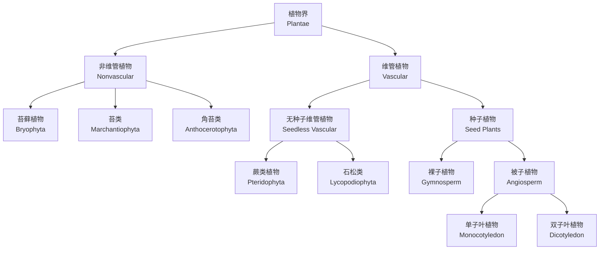
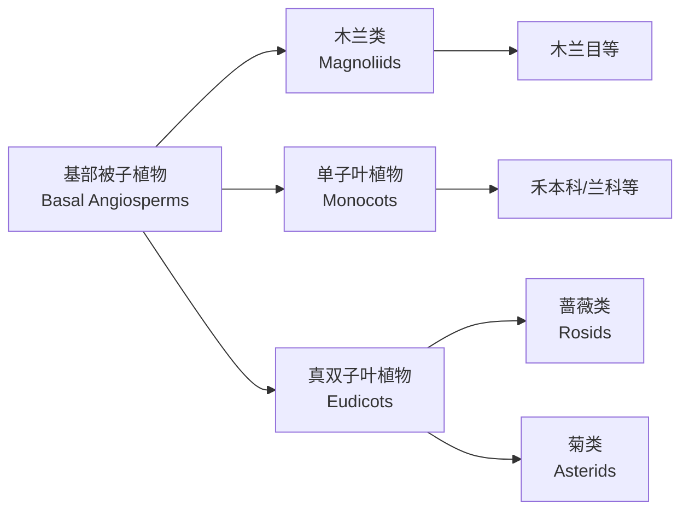

# 植物分类与生态 (Plant Classification and Ecology)

## 1. 植物分类学 (Plant Taxonomy)

植物分类学（Plant Taxonomy）是对植物进行鉴定、命名和分类的科学。分类系统遵循层次结构（Hierarchical Classification）。

### 1.1 分类等级 (Taxonomic Ranks)

| 等级（Rank） | 后缀示例 | 说明 |
|-------------|---------|------|
| 界（Kingdom） | Plantae | 植物界 |
| 门（Division/Phylum） | -phyta | 如被子植物门 Magnoliophyta |
| 纲（Class） | -opsida | 如双子叶植物纲 Magnoliopsida |
| 目（Order） | -ales | 如蔷薇目 Rosales |
| 科（Family） | -aceae | 如蔷薇科 Rosaceae |
| 属（Genus） | — | 如 Rosa（蔷薇属） |
| 种（Species） | — | 如 Rosa chinensis（月季） |

### 1.2 二名法 (Binomial Nomenclature)

由林奈（Linnaeus）建立，每个物种由属名（Genus）和种加词（Specific Epithet）组成：

$$
\text{学名} = \text{属名} + \text{种加词}
$$

例如：*Oryza sativa*（水稻），*Triticum aestivum*（小麦）。

### 1.3 主要植物类群 (Major Plant Groups)

#### 1.3.1 苔藓植物（Bryophytes）

苔藓植物是最早登陆的植物类群，无真正的维管组织（Vascular Tissue）。

| 特征 | 说明 |
|------|------|
| 大小 | 小型，通常1-10cm |
| 维管组织 | 缺乏 |
| 配子体 | 占优势世代（Gametophyte Dominant） |
| 孢子体 | 依赖配子体 |
| 生境 | 潮湿环境 |

#### 1.3.2 蕨类植物（Pteridophytes）

蕨类植物具有维管组织，但以孢子（Spore）繁殖。

$$
\text{孢子} \rightarrow \text{原叶体 (Prothallus)} \rightarrow \text{配子体} \rightarrow \text{受精} \rightarrow \text{孢子体}
$$

#### 1.3.3 裸子植物（Gymnosperms）

裸子植物的种子裸露，无果皮包被，主要包括：

- **苏铁纲（Cycadopsida）**：苏铁（Cycas）
- **银杏纲（Ginkgopsida）**：银杏（Ginkgo biloba）
- **松柏纲（Pinopsida）**：松树（Pinus）、杉树
- **买麻藤纲（Gnetopsida）**：麻黄（Ephedra）

#### 1.3.4 被子植物（Angiosperms）

被子植物具有花和果实，是植物界最进化的类群。

| 特征 | 单子叶植物（Monocots） | 双子叶植物（Eudicots） |
|------|----------------------|----------------------|
| 子叶数 | 1枚 | 2枚 |
| 叶脉 | 平行脉（Parallel） | 网状脉（Netted） |
| 根系 | 须根系（Fibrous） | 直根系（Taproot） |
| 花瓣数 | 3的倍数 | 4或5的倍数 |
| 维管束 | 散生 | 环状排列 |

## 2. 植物系统发育 (Plant Phylogeny)

基于分子系统学（Molecular Phylogenetics）的最新分类系统（APG IV系统）重建了被子植物的演化关系：

## 3. 植物群落 (Plant Communities)

植物群落（Plant Community）是一定区域内所有植物种群的集合。

### 3.1 群落结构 (Community Structure)

| 层次 | 描述 | 示例 |
|------|------|------|
| 乔木层（Tree Layer） | 最高层，>5m | 橡树、松树 |
| 灌木层（Shrub Layer） | 1-5m | 杜鹃、冬青 |
| 草本层（Herb Layer） | <1m | 蕨类、野花 |
| 地被层（Ground Layer） | 贴近地面 | 苔藓、地衣 |

### 3.2 物种多样性 (Species Diversity)

Shannon-Wiener多样性指数：

$$
H' = -\sum_{i=1}^{S} p_i \ln(p_i)
$$

其中 $S$ 为物种数，$p_i$ 为第 $i$ 种的相对多度。

## 4. 生物群系 (Biomes)

生物群系（Biome）是气候决定的全球尺度生态系统类型。

### 4.1 主要生物群系

| 群系 | 气候特征 | 代表性植物 | 分布区域 |
|------|---------|-----------|---------|
| 热带雨林（Tropical Rainforest） | 高温多雨 | 阔叶常绿树 | 赤道附近 |
| 温带落叶林（Temperate Deciduous Forest） | 四季分明 | 橡树、枫树 | 中纬度 |
| 针叶林（Taiga/Boreal Forest） | 寒冷干燥 | 云杉、冷杉 | 北半球高纬度 |
| 草原（Grassland） | 半干旱 | 禾本科植物 | 大陆内部 |
| 荒漠（Desert） | 极度干旱 | 仙人掌、灌木 | 副热带 |
| 冻原（Tundra） | 极寒 | 苔藓、地衣 | 北极地区 |

### 4.2 气候与植被的关系

Whittaker生物群系图显示，年均温和年降水量共同决定群系类型：

$$
\text{植被类型} = f(T_{\text{mean}}, P_{\text{annual}})
$$

## 5. 群落演替 (Succession)

演替（Succession）是群落组成随时间有规律变化的过程。

### 5.1 演替类型

- **原生演替（Primary Succession）**：在无生命存在的裸地上开始，如火山岩
- **次生演替（Secondary Succession）**：在已有土壤基础的干扰地上开始，如弃耕地

### 5.2 演替机制

| 机制 | 描述 |
|------|------|
| 促进（Facilitation） | 早期物种改善环境，利于后期物种 |
| 抑制（Inhibition） | 早期物种抑制后期物种定殖 |
| 耐受（Tolerance） | 后期物种更耐受资源限制条件 |

## 6. 植物与环境的相互作用 (Plant-Environment Interactions)

### 6.1 生态位 (Niche)

植物生态位包括其资源利用方式、环境耐受范围和功能角色。

### 6.2 竞争 (Competition)

植物间竞争资源（光、水、养分），Lotka-Volterra竞争模型：

$$
\frac{dN_1}{dt} = r_1N_1\left(\frac{K_1 - N_1 - \alpha_{12}N_2}{K_1}\right)
$$

其中 $\alpha_{12}$ 是物种2对物种1的竞争系数。

### 6.3 共生关系 (Symbiotic Relationships)

| 关系 | 描述 | 示例 |
|------|------|------|
| 互利共生（Mutualism） | 双方获益 | 菌根真菌与植物根系 |
| 偏利共生（Commensalism） | 一方获益，另一方无影响 | 附生植物与树木 |
| 寄生（Parasitism） | 一方获益，另一方受害 | 菟丝子（Cuscuta） |

## 7. 全球变化与植物生态 (Global Change and Plant Ecology)

### 7.1 气候变化影响

CO₂浓度升高可能产生CO₂施肥效应（CO₂ Fertilization Effect），但伴随的温度升高和干旱加剧可能抵消此效应。

### 7.2 生物入侵 (Biological Invasion)

入侵植物（Invasive Plant）通过竞争优势改变本地群落结构。

## 8. 总结 (Summary)

植物分类学揭示了植物界的演化关系，植物生态学阐明了植物与环境相互作用的基本规律。理解分类与生态知识对生物多样性保护和生态系统管理具有重要实践价值。
