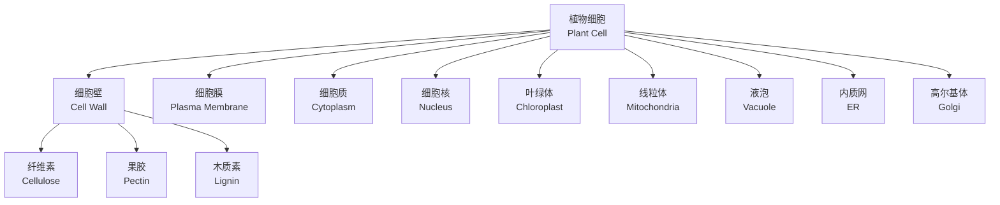
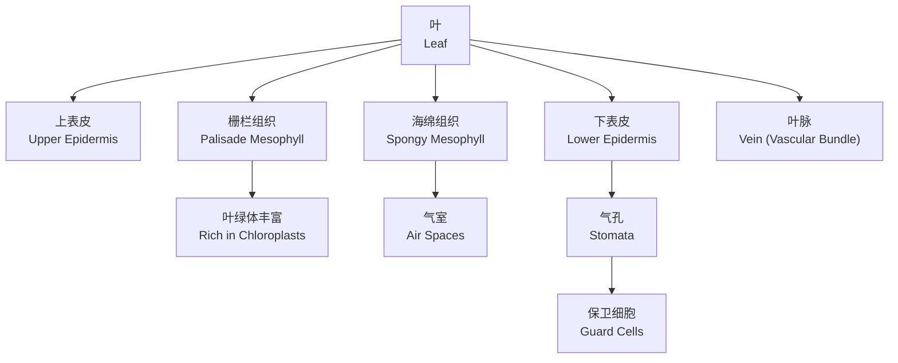

# 植物结构与生理 (Plant Structure and Physiology)

## 1. 植物细胞 (Plant Cell)

植物细胞具有区别于动物细胞的特有结构：细胞壁（Cell Wall）、叶绿体（Chloroplast）和液泡（Vacuole）。

### 1.1 细胞壁结构

细胞壁由初生壁（Primary Wall）和次生壁（Secondary Wall）组成，主要成分为：

| 成分 | 比例 | 功能 |
|------|------|------|
| 纤维素（Cellulose） | 40-60% | 提供机械强度 |
| 半纤维素（Hemicellulose） | 20-30% | 交联纤维素微纤丝 |
| 果胶（Pectin） | 5-10% | 粘合相邻细胞 |
| 木质素（Lignin） | 10-25% | 增加硬度与防水性 |

## 2. 植物组织系统 (Plant Tissue Systems)

植物体由三种组织系统（Tissue Systems）构成：

### 2.1 表皮系统 (Dermal Tissue System)

表皮（Epidermis）覆盖植物表面，气孔（Stomata）由保卫细胞（Guard Cells）组成，调节气体交换：

$$
\text{开度} \propto \text{保卫细胞膨压}
$$

### 2.2 维管系统 (Vascular Tissue System)

维管系统包括木质部（Xylem）和韧皮部（Phloem）。

| 组织 | 组成细胞 | 功能 | 方向 |
|------|---------|------|------|
| 木质部（Xylem） | 导管（Vessel）、管胞（Tracheid） | 水分和矿物质向上运输 | 根→叶 |
| 韧皮部（Phloem） | 筛管（Sieve Tube）、伴胞（Companion Cell） | 有机物双向运输 | 源→库 |

#### 2.2.1 水分运输机制

内聚力-张力理论（Cohesion-Tension Theory）：

$$
\text{蒸腾拉力} > \text{水柱内聚力} > \text{重力}
$$

水势（Water Potential）决定水分流动方向：

$$
\Psi_w = \Psi_s + \Psi_p + \Psi_g
$$

其中 $\Psi_s$ 为溶质势，$\Psi_p$ 为压力势，$\Psi_g$ 为重力势。

### 2.3 基本组织系统 (Ground Tissue System)

包括薄壁组织（Parenchyma）、厚角组织（Collenchyma）和厚壁组织（Sclerenchyma）。

## 3. 根的结构 (Root Structure)

### 3.1 根尖分区

### 3.2 根的横切结构

从外到内：表皮（Epidermis）→ 皮层（Cortex）→ 内皮层（Endodermis）→ 中柱（Stele）。

凯氏带（Casparian Strip）在内皮层控制水分和矿物质进入中柱的途径：

$$
\text{共质体途径 (Symplast)} \rightarrow \text{经细胞质}
$$
$$
\text{质外体途径 (Apoplast)} \rightarrow \text{经细胞壁}
$$

## 4. 茎的结构 (Stem Structure)

### 4.1 双子叶植物茎

| 区域 | 成分 | 功能 |
|------|------|------|
| 表皮 | 单层细胞 | 保护 |
| 皮层 | 薄壁细胞 | 存储 |
| 维管束（Vascular Bundle） | 木质部+韧皮部 | 运输 |
| 形成层（Cambium） | 分裂细胞 | 次生生长 |
| 髓（Pith） | 薄壁细胞 | 存储 |

### 4.2 单子叶植物茎

维管束散生（Scattered），无形成层，无次生生长。

## 5. 叶的结构 (Leaf Structure)

叶片（Leaf Blade）通过叶柄（Petiole）连接茎。

### 5.1 叶横切结构

光合速率与叶肉导度（Mesophyll Conductance）相关：

$$
A = g_m \times (C_i - C_c)
$$

其中 $A$ 为光合速率，$g_m$ 为叶肉导度，$C_i$ 和 $C_c$ 分别为胞间和叶绿体 CO₂浓度。

## 6. 植物激素 (Plant Hormones)

### 6.1 主要激素

| 激素 | 合成部位 | 主要效应 | 运输方式 |
|------|---------|---------|---------|
| 生长素（IAA） | 茎尖分生组织 | 促进细胞伸长，顶端优势 | 极性运输（向基） |
| 赤霉素（GA） | 幼叶、种子 | 茎伸长，种子萌发 | 非极性运输 |
| 细胞分裂素（CK） | 根尖 | 促进细胞分裂 | 向顶运输 |
| 脱落酸（ABA） | 成熟叶 | 抑制生长，诱导休眠 | 维管运输 |
| 乙烯（ETH） | 成熟组织 | 促进果实成熟 | 气体扩散 |

### 6.2 激素相互作用

生长素与细胞分裂素比例决定器官发生方向：

$$
\frac{[\text{生长素}]}{[\text{细胞分裂素}]}
\begin{cases}
\text{高} \rightarrow \text{生根} \\
\text{低} \rightarrow \text{生芽} \\
\text{适中} \rightarrow \text{愈伤组织}
\end{cases}
$$

## 7. 植物运动 (Plant Movements)

| 运动类型 | 刺激 | 机制 | 示例 |
|---------|------|------|------|
| 向光性（Phototropism） | 单向光 | 生长素不对称分布 | 茎向光弯曲 |
| 向地性（Gravitropism） | 重力 | 平衡石沉降 | 根向下生长 |
| 向水性（Hydrotropism） | 水分梯度 | 根向水源生长 | 根向水弯曲 |
| 感性运动（Nastic Movement） | 触摸 | 膨压变化 | 含羞草叶片闭合 |

## 8. 矿质营养 (Mineral Nutrition)

植物必需元素（Essential Elements）根据需要量分为大量元素和微量元素。

### 8.1 大量元素

| 元素 | 吸收形式 | 生理功能 |
|------|---------|---------|
| 氮（N） | NO₃⁻, NH₄⁺ | 蛋白质、核酸组分 |
| 磷（P） | H₂PO₄⁻, HPO₄²⁻ | ATP、核酸组分 |
| 钾（K） | K⁺ | 渗透调节、酶激活 |
| 钙（Ca） | Ca²⁺ | 细胞壁结构、信号转导 |
| 镁（Mg） | Mg²⁺ | 叶绿素核心元素 |

### 8.2 缺素症状

缺氮引起老叶黄化（Chlorosis），缺磷导致叶片暗绿、根系发育不良，缺钾使叶缘焦枯。

## 9. 植物防御 (Plant Defense)

植物通过组成型防御（Constitutive Defense）和诱导型防御（Induced Defense）抵抗病原体和食草动物。

次生代谢产物（Secondary Metabolites）包括生物碱（Alkaloid）、酚类（Phenolic）和萜类（Terpenoid）。

## 10. 总结 (Summary)

植物的根、茎、叶三大营养器官在结构和功能上高度特化，通过维管系统实现物质运输，依靠激素调控生长和发育。这些生理机制使植物能够适应多样的环境条件。
