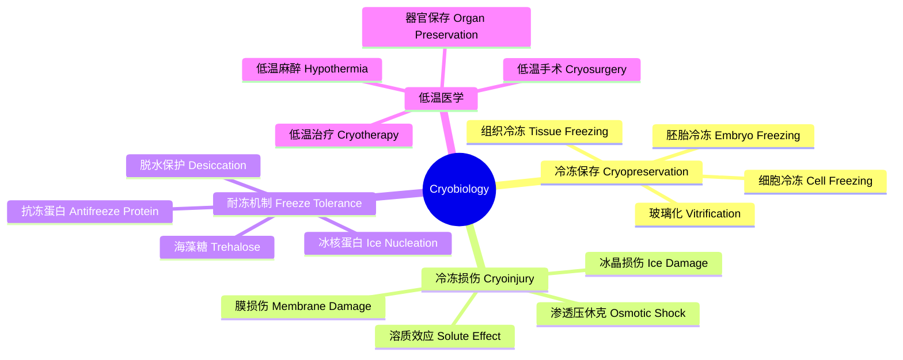
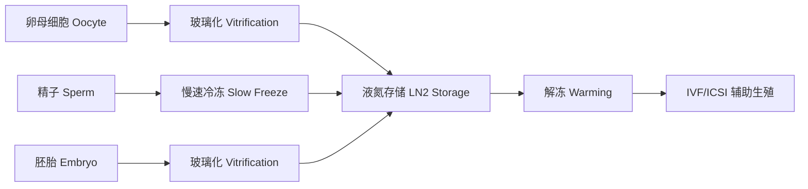

---
aliases: [Cryobiology, LowTemperatureBiology]
tags: ['Biology/Cryobiology', 'CellBiology', 'LowTemperatureBiology']
---

# Cryobiology

## 概述 (Overview)

低温生物学 (Cryobiology) 研究低温对生物体的影响。它涵盖冷冻保存 (Cryopreservation)、冷冻损伤 (Cryoinjury)、耐冻机制 (Freeze Tolerance) 和低温医学应用。低温生物学在辅助生殖、干细胞保存、疫苗储存和组织工程中具有重要的应用价值。

## 低温生物学体系

## 冷冻损伤 (Cryoinjury)

### 冰晶形成 (Ice Crystal Formation)

冰晶是冷冻损伤的主要原因。当温度降至冰点以下时，冰晶在细胞外或细胞内形成。细胞内冰晶 (Intracellular Ice Formation, IIF) 通常是致命的。冰晶的成核速率由下式描述：

$$J = J_0 \exp\left(-\frac{\Delta G^*}{k_B T}\right)$$

其中 $\Delta G^*$ 是临界成核自由能势垒：

$$\Delta G^* = \frac{16\pi\gamma^3}{3(\Delta G_v)^2}$$

### 溶质效应 (Solute Effect)

冰晶形成使未冻液中的溶质浓度大幅升高，导致渗透压休克。冷冻过程中产生的渗透压 $\Pi$ 可由范特霍夫方程描述：

$$\Pi = iMRT$$

细胞在渗透压下的体积变化遵循波义耳-范特霍夫关系 (Boyle-van't Hoff Relation)：

$$V = V_{\text{osm}}\frac{M_{\text{iso}}}{M} + V_b$$

### 膜损伤 (Membrane Damage)

低温导致细胞膜脂质双层发生相变，从液晶相转变为凝胶相。相变温度 $T_m$ 取决于脂质组成：

$$T_m = \frac{\Delta H}{\Delta S}$$

相变过程中膜通透性增加，导致离子泄漏和细胞内容物丢失。胆固醇含量影响膜的低温稳定性。

## 冷冻保护剂 (Cryoprotectants)

冷冻保护剂 (CPA) 是用于减少冷冻损伤的化合物。

### 渗透性 CPA

能够穿透细胞膜，降低细胞内冰点：
- 二甲基亚砜 (DMSO)：最常用，浓度 5-10%
- 甘油 (Glycerol)：常用于红细胞冷冻
- 乙二醇 (Ethylene Glycol)：用于胚胎玻璃化
- 丙二醇 (Propylene Glycol / PROH)

### 非渗透性 CPA

不能穿透细胞膜，通过脱水保护细胞：
- 蔗糖 (Sucrose)
- 海藻糖 (Trehalose)：天然存在于耐冻生物中
- 聚乙烯吡咯烷酮 (PVP)
- 羟乙基淀粉 (HES)
- 聚乙二醇 (PEG)

### CPA 毒性

CPA 在保护细胞的同时也具有化学毒性。毒性可通过以下因素评估：

$$\text{Toxicity} \propto C \cdot t \cdot T$$

其中 $C$ 是 CPA 浓度，$t$ 是暴露时间，$T$ 是温度。降低毒性的策略包括：多种 CPA 组合使用以降低单一浓度、低温下添加 CPA、分步添加减少渗透压冲击。

## 冷冻速率策略 (Cooling Rate Strategies)

### 慢速冷冻 (Slow Freezing)

以约 1°C/min 的速率降温，细胞通过脱水避免细胞内冰晶。两因素假说 (Two-Factor Hypothesis) 由 Mazur 提出：当冷却速率太低时，细胞长时间暴露于高浓度溶质中，溶质损伤主导；当冷却速率太高时，水来不及外流，形成细胞内冰晶。最佳冷却速率由 Mazur 方程描述：

$$B_{\text{opt}} \propto \frac{1}{V_s A} \exp\left(-\frac{E_a}{RT}\right)$$

### 玻璃化 (Vitrification)

玻璃化是将溶液冷却到玻璃化转变温度 ($T_g$) 以下，形成非晶态固体（玻璃态），完全避免冰晶形成。玻璃化需要高浓度 CPA (40-60%) 和极快降温速率（数百至数万 °C/min）。临界冷却速率定义为：

$$R_c = \left(\frac{dT}{dt}\right)_{\text{crit}}$$

对于生物玻璃化，需要确保整个样本同时达到玻璃化状态。

## 解冻 (Thawing)

快速均匀解冻对于减少重结晶损伤至关重要。重结晶 (Recrystallization) 是指解冻过程中小冰晶合并形成大冰晶造成的损伤。解冻速率应尽可能高，以减少冰晶在亚稳区的生长时间。

## 抗冻蛋白 (Antifreeze Proteins, AFPs)

AFPs 来自极地鱼类、昆虫和植物，具有热滞活性 (Thermal Hysteresis Activity)：

$$\text{Thermal Hysteresis} = T_m - T_h$$

其中 $T_m$ 是熔融温度，$T_h$ 是滞后冻结温度。AFPs 可以降低冰点而不显著影响熔点，同时抑制冰晶重结晶。I 型 AFP 来自冬鲽，II 型来自美洲绒杜父鱼，III 型来自南极鳕鱼。

## 耐冻生物 (Freeze-Tolerant Organisms)

某些生物可以在细胞外结冰的情况下存活：
- **木蛙 (Rana sylvatica)**：可承受体重 65% 结冰，尿素和葡萄糖作为冷冻保护剂
- **北极昆虫**：产生大量海藻糖和甘油
- **土壤线虫**：完全脱水后冷冻
- **耐冻植物**：如春小麦通过抗冻蛋白适应低温

## 冷冻保存应用

### 生殖医学

### 干细胞与细胞治疗

间充质干细胞 (MSC)、造血干细胞 (HSC) 和诱导多能干细胞 (iPSC) 的冷冻保存在细胞治疗中至关重要。通常使用含 10% DMSO 的培养基在 -196°C 液氮中长期储存。细胞密度、降温速率和复苏方案影响干细胞存活率和分化潜能。

### 组织与器官保存

组织工程产品的冷冻保存面临更大挑战，因细胞-细胞连接、细胞外基质和多细胞结构的复杂性。器官保存目前仍受限于灌注冷冻保护剂和均匀降温的困难。

## 低温生物学中的热力学参数

| 参数 | 意义 | 单位 |
|------|------|------|
| $T_g$ | 玻璃化转变温度 | K |
| $T_m$ | 熔融温度 | K |
| $T_h$ | 滞后冻结温度 | K |
| $R_c$ | 临界冷却速率 | K/min |
| $L_p$ | 膜水渗透系数 | μm/min/atm |
| $E_a$ | 活化能 | kJ/mol |

## 低温生物学中的数学模型 (Mathematical Models)

Mazur 两因素假说的数学模型：细胞冷冻过程中的体积变化由以下方程描述：

$$\frac{dV}{dt} = L_p A RT \left(\frac{n_s}{V_w} - C_e\right)$$

细胞内水结冰的概率依赖于温度和冷却速率。成核理论结合概率模型预测胞内冰晶形成。玻璃化过程中溶液的临界冷却速率可以用牛顿热传导方程和成核理论计算：

$$R_c \approx \frac{\Delta T}{t_{\text{cool}}}$$

## 低温保存的质量评估 (Quality Assessment)

冷冻/解冻后细胞活力评估方法：台盼蓝排斥 (Trypan Blue Exclusion) 快速检测膜完整性。流式细胞术 (FACS) 使用 Annexin V/PI 双染区分凋亡和坏死。CCK-8 或 MTT 法检测细胞代谢活性。功能学评估包括精子活力评估和胚胎发育能力评估。TEM 观察细胞超微结构损伤。蛋白和基因表达分析评估冷冻损伤的分子机制。

## 低温生物学的伦理与法规 (Ethics & Regulations)

辅助生殖中胚胎冷冻保存的伦理问题包括胚胎的道德地位、冷冻胚胎的处置权和捐赠同意。干细胞库的管理需要遵循 GMP 标准和伦理审查。器官保存方面，器官分配需遵循公平原则。国际法规包括 EU Tissues and Cells Directive、FDA 的细胞和组织产品规定和中国《人类辅助生殖技术管理办法》。

## 低温生物学中的冰晶控制 (Ice Crystal Control)

冰晶控制是冷冻保存成功的关键。慢速冷冻通过控制降温速率平衡细胞脱水和冰晶形成。快速冷冻使水形成玻璃态而非晶体。冰晶成核分为均质成核和异质成核。抗冻蛋白 (AFPs) 通过吸附到冰晶表面抑制冰晶生长，产生热滞 (Thermal Hysteresis) 效应。冰核蛋白 (INPs) 促进冰晶在较高温度下成核。海藻糖 (Trehalose) 作为渗透保护剂的能力由其玻璃化转变温度决定。

## 低温生物学中的器官保存 (Organ Preservation)

器官保存面临的主要挑战：热缺血损伤 (Warm Ischemia) 和冷缺血损伤 (Cold Ischemia)。静态冷保存 (Static Cold Storage) 使用 UW 溶液 (University of Wisconsin Solution) 可保存肾脏 24-36 小时。机器灌注 (Machine Perfusion) 持续提供氧合营养液，延长保存时间并改善移植预后。深低温保存 (Deep Hypothermia, 4-10°C) 降低代谢率至正常的 5-10%。低温对细胞的损伤机制包括 Na/K-ATP 酶抑制导致的细胞肿胀和钙超载。

## 低温生物学中的玻璃化 (Vitrification)

玻璃化实现完全无冰晶的低温保存。临界冷却速率 (Critical Cooling Rate) 决定是否形成冰晶：

$$v_c \approx \frac{\Delta T}{\tau}$$

玻璃化溶液的高浓度渗透保护剂 (6-8 M) 可导致渗透损伤和化学毒性。VS55 和 DP6 是常用的玻璃化溶液。纳米加热 (Nanowarming) 使用磁性纳米颗粒实现均匀快速复温。微滴玻璃化在辅助生殖中实现卵母细胞和胚胎的高存活率保存。

## 低温生物学中的冷冻干燥 (Lyophilization)

冷冻干燥 (Freeze-Drying, Lyophilization) 首先冷冻样品，然后在真空下升华去除冰晶。初干 (Primary Drying) 阶段升华冰晶，温度必须低于塌陷温度。再干 (Secondary Drying) 阶段解吸结合水。冷冻保护剂的玻璃化转变温度决定干燥过程的温度窗口。冷冻干燥在疫苗、药物和生物样本保存中广泛应用。配方和工艺参数影响冻干产品的质量和稳定性。

## 低温生物学中的低温电子显微镜 (Cryo-EM)

冷冻电子显微镜 (Cryo-EM) 在低温下观察生物大分子结构。样品快速冷冻在液态乙烷中形成玻璃态冰，保存天然构象。单颗粒分析 (Single Particle Analysis) 重构蛋白质三维结构。冷冻电子断层扫描 (Cryo-ET) 观察细胞内部的超微结构。冷冻电镜 (Cryo-FIB) 和冷冻超薄切片技术制备薄层样品。2017 年诺贝尔化学奖授予 Cryo-EM 的发展。

## 相关条目

- [[../CellBiology/INDEX|细胞生物学]]
- [[../../Chemistry/Biochemistry/Biochemistry|生物化学]]
- [[../../Chemistry/Biochemistry/MolecularDocking|分子对接]]

## 扩展阅读与参考资料 (Further Reading)

1. **核心教材**：Pegg DE. Principles of Cryopreservation. Methods Mol Biol. 2015.
2. **综述文章**：Mazur P. Freezing of living cells: mechanisms and implications. Am J Physiol. 1984.
3. **专业参考**：Fuller BJ, Lane N, Benson EE. Life in the Frozen State. CRC Press.
4. **研究前沿**：Giwa S et al. The promise of organ and tissue preservation to transform medicine. Nat Biotechnol. 2017.
5. **低温物理**：Fahy GM, Wowk B. Principles of cryopreservation by vitrification. Methods Mol Biol. 2015.

## 参见 (See Also)

- 冷冻生物学中的热力学和传热学基础
- 细胞膜低温相变与膜保护策略
- 临床低温医学中的标准化操作规程
