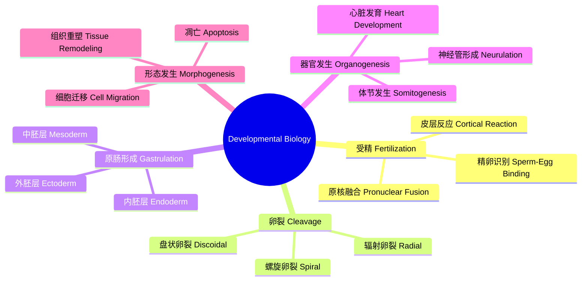

---
aliases: [DevelopmentalBiology]
tags: ['Biology/DevelopmentalBiology', 'CellBiology', 'Embryology']
---

# DevelopmentalBiology

## 概述 (Overview)

发育生物学 (Developmental Biology) 研究生物体从受精卵到成体的发育过程。它探讨细胞分化、形态发生 (Morphogenesis)、模式形成 (Pattern Formation) 和生长调控的分子机制。发育生物学与胚胎学 (Embryology)、遗传学和细胞生物学紧密联系。

## 发育生物学框架

## 受精与卵裂 (Fertilization & Cleavage)

### 受精过程

受精 (Fertilization) 是精子与卵子结合形成受精卵的过程。顶体反应 (Acrosome Reaction) 释放水解酶穿透卵膜。卵膜电位变化触发多精入卵阻滞。皮层颗粒释放形成受精膜：

$$\Delta V_m \approx -10\text{ mV} \rightarrow \text{快阻滞}$$

$$\text{皮层反应} \rightarrow \text{慢阻滞 (permanent)}$$

### 卵裂模式

卵裂 (Cleavage) 类型取决于卵黄分布：

- 均黄卵 (Isolecithal)：完全卵裂，如两栖类和哺乳类
- 端黄卵 (Telolecithal)：盘状卵裂，如鸟类和爬行类
- 中黄卵 (Centrolecithal)：表面卵裂，如果蝇

卵裂速度由细胞周期调控，$G_1$ 和 $G_2$ 期缩短或缺失。

## 原肠形成 (Gastrulation)

### 细胞运动

原肠形成涉及大规模的细胞重排。主要细胞运动类型：

1. **外包 (Epiboly)**：细胞层扩展包被整个胚胎
2. **内卷 (Involution)**：表层细胞向内卷曲
3. **迁入 (Ingression)**：细胞从表层迁移到内部
4. **会聚延伸 (Convergent Extension)**：细胞向中线聚集并沿前后轴延伸

### 胚层形成

三胚层形成 (Germ Layer Formation)：

- 外胚层 (Ectoderm)：神经管和表皮
- 中胚层 (Mesoderm)：肌肉、骨骼、心脏、血液
- 内胚层 (Endoderm)：消化管和呼吸道上皮

### 原肠形成的分子调控

BMP、Nodal 和 FGF 信号通路调控原肠形成。Nieuwkoop 中心诱导中胚层分化：

$$\text{Spemann organizer} \xrightarrow{\text{Chordin, Noggin}} \text{抑制 BMP} \rightarrow \text{神经诱导}$$

## 神经管形成 (Neurulation)

### 初级神经胚形成

神经管形成分为四个阶段：神经板形成、神经板变厚、神经褶隆起和神经沟闭合。神经管缺陷：

$$\text{叶酸缺乏} \rightarrow \text{神经管闭合失败}$$

$$\text{闭合失败率} \propto \frac{1}{[\text{叶酸}]}$$

### 神经嵴细胞

神经嵴 (Neural Crest) 是多能干细胞群，迁移到全身分化为色素细胞、外周神经系统、颅面软骨等：

$$NCC \rightarrow \begin{cases} \text{感觉神经元} \\ \text{交感神经元} \\ \text{黑素细胞} \\ \text{颅面软骨} \end{cases}$$

## 体节发生 (Somitogenesis)

### 体节时钟

体节 (Somites) 从前向后周期性形成。Notch 信号通路的周期性激活构成体节时钟：

$$\frac{d[ \text{Notch} ]}{dt} = \beta \cdot \text{Lunatic-Fringe} - \gamma [\text{Notch}]$$

体节形成周期在鸡胚约为 90 分钟，在小鼠约为 120 分钟，在人类约为 5-6 小时。

### Hox 基因模式

Hox 基因沿前后轴表达形成位置信息。共线性规则 (Colinearity Rule)：Hox 基因在染色体上的排列对应于其在胚胎前后轴的表达域：

$$3' \text{端} \rightarrow \text{前端表达}$$
$$5' \text{端} \rightarrow \text{后端表达}$$

## 肢芽发育 (Limb Bud Development)

### 信号中心

肢芽发育由三个信号中心协调：
1. AER (顶外胚层嵴)：FGF 信号调控近-远轴生长
2. ZPA (极化活性区)：Shh 信号调控前-后轴模式
3. 非AER外胚层：Wnt 信号调控背-腹轴

### 形态梯度

Shh 浓度梯度沿前后轴决定手指身份：

$$[Shh] \propto e^{-x/\lambda}$$

高浓度 Shh 诱导后侧手指（小指），低浓度诱导前侧手指（拇指）。

## 细胞凋亡与发育 (Apoptosis in Development)

### 程序性细胞死亡

发育中的细胞凋亡去除多余结构。线虫 C. elegans 的谱系追踪确定了 131 个程序性死亡细胞。凋亡通路：

$$\text{CED-9} \rightarrow \text{CED-4} \rightarrow \text{CED-3} \rightarrow \text{凋亡}$$

Caspase 级联反应：

$$\text{起始 Caspase} \xrightarrow{\text{剪切}} \text{执行 Caspase} \rightarrow \text{DNA 断裂}$$

### 发育中的凋亡实例

- 手指形成：指间细胞凋亡形成独立手指
- 蝌蚪尾巴退化：甲状腺激素诱导凋亡
- 神经系统：约 50% 神经元的凋亡

## 性别决定 (Sex Determination)

### 哺乳动物性别决定

SRY 基因激活睾丸发育通路：

$$SRY \rightarrow Sox9 \rightarrow \text{Sertoli 细胞分化}$$

$$\text{无 SRY} \rightarrow \text{Wnt4/β-catenin} \rightarrow \text{卵巢发育}$$

### 剂量补偿

X 染色体失活 (X-Inactivation) 由 Xist RNA 介导。Xi 的随机选择由 Xce 位点决定：

$$P(\text{母本 Xi}) = f(\text{Xce}^{\text{mat}}, \text{Xce}^{\text{pat}})$$

## 发育可塑性与再生 (Developmental Plasticity & Regeneration)

### 再生能力

某些生物具有极强的再生能力。蝾螈 (Axolotl) 可再生肢体、尾巴甚至脊髓。斑马鱼可以再生鳍和心脏。哺乳动物再生能力有限，但新生小鼠可再生指尖。

### 再生机制

- 去分化 (Dedifferentiation)：已分化细胞退回多能状态
- 芽基形成 (Blastema Formation)
- 下胚层信号诱导芽基增殖

## 发育生物学技术 (Techniques)

### 模式生物

| 模式生物 | 优势 |
|---------|------|
| 线虫 C. elegans | 细胞谱系完全已知 |
| 果蝇 Drosophila | 遗传工具丰富 |
| 斑马鱼 Zebrafish | 体外发育、透明 |
| 非洲爪蟾 Xenopus | 大胚胎、易于操作 |
| 小鼠 Mouse | 哺乳动物模型 |
| 拟南芥 Arabidopsis | 植物发育模型 |

### 实验技术

- CRISPR/Cas9 基因编辑
- 单细胞 RNA-seq 图谱
- 光遗传学 (Optogenetics)
- 活体成像 (Live Imaging)
- 谱系追踪 (Lineage Tracing)
- 器官芯片 (Organ-on-a-Chip)

## 发育疾病与畸形学 (Developmental Disorders & Teratology)

### 先天畸形

约 3% 的新生儿有主要先天畸形。致畸物包括酒精（胎儿酒精综合征）、维甲酸（颅面畸形）、沙利度胺（肢体畸形）和环境污染物。敏感期是器官发生的关键窗口期。

### 发育基因突变

HOX 基因突变导致肢体和骨骼畸形。SHH 突变导致前脑无裂畸形 (Holoprosencephaly)。PAX6 突变影响眼睛发育。

## 发育生物学中的环境调控 (Environmental Regulation)

环境因素显著影响发育过程。温度依赖性别决定 (TSD) 在爬行动物中常见。营养条件影响昆虫的发育和变态。光周期调控植物开花时间的分子通路。母体应激影响后代发育的表观遗传重编程。环境毒物作为内分泌干扰物影响发育过程。表型可塑性 (Phenotypic Plasticity) 使相同基因型在不同环境中产生不同表型。发育噪声 (Developmental Noise) 导致相同基因型的个体间随机变异。

## 相关条目

- [[../../../INDEX|当前目录索引]]
