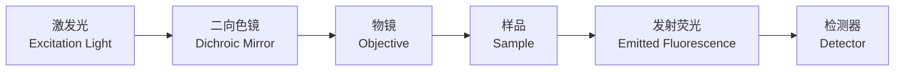
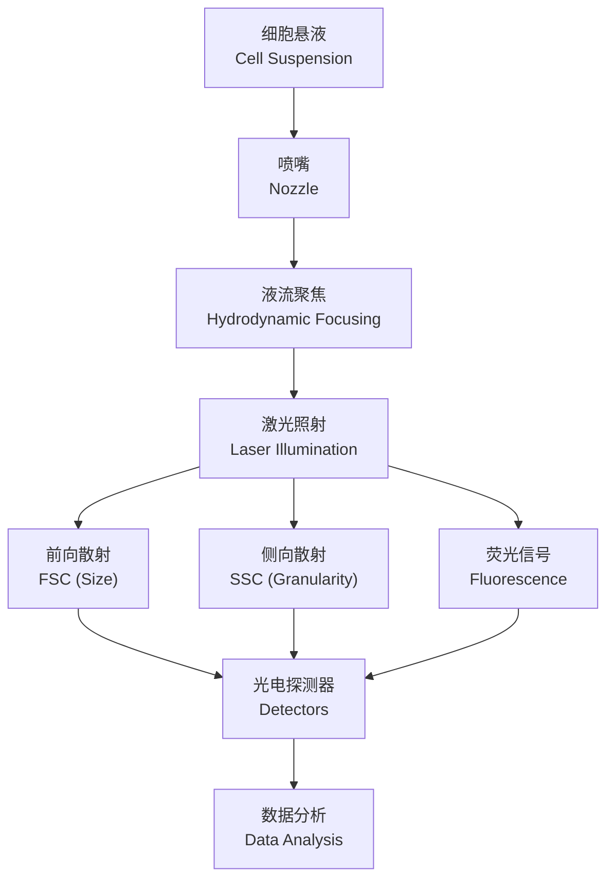

# 细胞生物学技术 (Cell Biology Techniques)

## 1. 显微镜技术 (Microscopy Techniques)

显微镜（Microscope）是细胞生物学最基本的研究工具。

### 1.1 光学显微镜 (Light Microscopy)

光学显微镜使用可见光照明，分辨率极限约为200nm（阿贝极限，Abbe Limit）：

$$
d = \frac{0.61\lambda}{NA}
$$

其中 $d$ 为最小可分辨距离，$\lambda$ 为波长，$NA$ 为数值孔径（Numerical Aperture）。

| 类型 | 原理 | 应用 |
|------|------|------|
| 明场显微镜（Bright-field） | 光直接透过样品 | 染色细胞观察 |
| 相差显微镜（Phase-contrast） | 将相位差转为振幅差 | 活细胞观察 |
| 微分干涉差（DIC） | 偏振光干涉 | 三维成像 |
| 暗场显微镜（Dark-field） | 侧向光照明 | 微小颗粒观察 |
| 荧光显微镜（Fluorescence） | 荧光染料标记 | 特定分子定位 |

### 1.2 荧光显微镜 (Fluorescence Microscopy)

荧光显微镜利用荧光染料（Fluorophore）或荧光蛋白（如 GFP）标记目标分子。

斯托克斯位移（Stokes Shift）：

$$
\lambda_{\text{发射}} > \lambda_{\text{激发}}
$$

### 1.3 共聚焦显微镜 (Confocal Microscopy)

共聚焦显微镜通过针孔（Pinhole）排除焦平面以外的荧光信号，提高分辨率和信噪比：

$$
I(z) = I_0 \times e^{-2(z/z_0)^2}
$$

其中 $z$ 为离焦距离，$z_0$ 为轴向分辨率。

### 1.4 电子显微镜 (Electron Microscopy)

电子显微镜使用电子束（Electron Beam）代替光，分辨率可达0.1nm。

| 类型 | 信号来源 | 应用 |
|------|---------|------|
| 透射电镜（TEM） | 透射电子 | 细胞超微结构 |
| 扫描电镜（SEM） | 二次电子 | 样品表面形貌 |
| 冷冻电镜（Cryo-EM） | 冷冻样品中的电子 | 生物大分子结构 |

德布罗意波长（de Broglie Wavelength）：

$$
\lambda = \frac{h}{\sqrt{2meV}}
$$

其中 $V$ 为加速电压，$h$ 为普朗克常数，$m$ 为电子质量。

### 1.5 超高分辨率显微镜 (Super-resolution Microscopy)

突破衍射极限的技术包括 STED、PALM 和 STORM，分辨率可达20-50nm。

## 2. 细胞培养技术 (Cell Culture Techniques)

### 2.1 细胞培养类型

| 类型 | 来源 | 特点 |
|------|------|------|
| 原代培养（Primary Culture） | 直接从组织分离 | 有限寿命，保留体内特征 |
| 传代细胞系（Cell Line） | 原代培养传代 | 可无限增殖（转化后） |
| 悬浮培养（Suspension Culture） | 血液或肿瘤细胞 | 悬浮生长 |
| 贴壁培养（Adherent Culture） | 大多数实体组织细胞 | 贴附基质生长 |

### 2.2 培养条件

细胞培养需要严格的无菌条件和特定的培养环境：

| 参数 | 标准条件 |
|------|---------|
| 温度（Temperature） | 37°C（哺乳动物细胞） |
| CO₂浓度（CO₂ Concentration） | 5% |
| 湿度（Humidity） | 95% |
| 培养基（Medium） | DMEM/RPMI-1640 + 10% FBS |
| pH | 7.2-7.4 |

### 2.3 细胞计数与活力检测

台盼蓝排斥试验（Trypan Blue Exclusion）：

$$
\text{活力}(\%) = \frac{\text{活细胞数}}{\text{总细胞数}} \times 100\%
$$

## 3. 流式细胞术 (Flow Cytometry)

流式细胞术（Flow Cytometry）可对单个细胞的多种参数进行高通量定量分析。

### 3.1 基本原理

### 3.2 荧光活化细胞分选 (FACS)

FACS（Fluorescence-Activated Cell Sorting）根据荧光信号分选目标细胞：

$$
\text{分选纯度} = \frac{\text{目标细胞数}}{\text{收集总细胞数}} \times 100\%
$$

### 3.3 多参数分析

现代流式细胞仪可同时检测15-50个参数，通过补偿（Compensation）消除荧光光谱重叠。

## 4. 细胞成像与分析 (Cell Imaging and Analysis)

### 4.1 活细胞成像 (Live-cell Imaging)

活细胞成像在培养箱中实时记录细胞动态过程，需要控温、控气和防震。

### 4.2 图像分析 (Image Analysis)

| 方法 | 描述 | 软件工具 |
|------|------|---------|
| 阈值分割（Thresholding） | 基于灰度值分离目标 | ImageJ/Fiji |
| 共定位分析（Colocalization） | 测量两种荧光重叠程度 | Pearson 相关系数 |
| 追踪分析（Tracking） | 追踪细胞/粒子运动 | TrackMate |
| 三维重建（3D Reconstruction） | Z-stack 图像合成3D | Imaris、Amira |

共定位的 Pearson 相关系数：

$$
r = \frac{\sum_{i}(R_i - \bar{R})(G_i - \bar{G})}{\sqrt{\sum_{i}(R_i - \bar{R})^2 \sum_{i}(G_i - \bar{G})^2}}
$$

### 4.3 定量分析指标

| 指标 | 含义 | 公式 |
|------|------|------|
| 荧光强度（Fluorescence Intensity） | 标记分子相对量 | $I = \sum I_{pixel}$ |
| 细胞面积（Cell Area） | 细胞大小 | $A = n_{pixels} \times \text{校准系数}$ |
| 圆形度（Circularity） | 接近圆的程度 | $C = 4\pi A / P^2$ |

## 5. 细胞化学技术 (Cytochemical Techniques)

### 5.1 组织化学染色

| 染色 | 靶标 | 颜色 |
|------|------|------|
| 苏木精-伊红（H&E） | 核（蓝）/ 胞质（粉） | 紫蓝 + 粉红 |
| 吉姆萨染色（Giemsa） | DNA | 紫红色 |
| 糖原染色（PAS） | 多糖 | 品红色 |
| 油红 O（Oil Red O） | 脂滴 | 红色 |

### 5.2 免疫细胞化学 (Immunocytochemistry)

使用抗体（Antibody）特异性检测抗原（Antigen），包括直接法和间接法。

## 6. 细胞分离技术 (Cell Separation Techniques)

### 6.1 密度梯度离心

基于细胞密度差异分离，使用 Ficoll 或 Percoll 梯度介质：

$$
\rho = \frac{m}{V}
$$

### 6.2 磁珠分选 (MACS)

免疫磁珠（Magnetic Beads）结合特异性抗体，在磁场中分离目标细胞。

## 7. 单细胞技术 (Single-cell Technologies)

### 7.1 单细胞测序

单细胞 RNA 测序（scRNA-seq）揭示细胞异质性，分析流程包括：

1. 细胞分离（Cell Isolation）
2. 逆转录（Reverse Transcription）
3. cDNA 扩增（Amplification）
4. 文库构建（Library Construction）
5. 测序与数据分析（Sequencing and Analysis）

### 7.2 单细胞蛋白质组学

包括 CyTOF（质谱流式细胞术）和单细胞 Western blot 等新兴技术。

## 8. 总结 (Summary)

细胞生物学技术涵盖从显微成像到组学分析的多层次方法。光学和电子显微镜提供结构信息，流式细胞术实现定量分析，细胞培养和分离技术为功能研究提供材料。技术的不断进步持续推动细胞生物学的发展。
