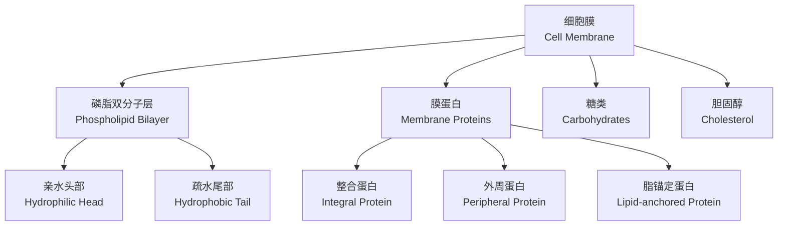
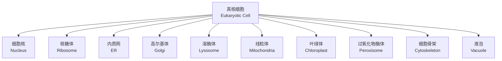

# 细胞膜与细胞器 (Cell Membrane and Organelles)

## 1. 细胞膜结构 (Cell Membrane Structure)

细胞膜（Plasma Membrane）是包围细胞的磷脂双分子层，厚度约7.5-10nm。

### 1.1 流动镶嵌模型 (Fluid Mosaic Model)

由Singer和Nicolson在1972年提出，核心内容包括：

- 磷脂双分子层（Phospholipid Bilayer）构成骨架
- 膜蛋白（Membrane Protein）镶嵌或贯穿其中
- 膜具有流动性（Fluidity）
- 脂筏（Lipid Raft）形成功能微域

### 1.2 磷脂组成

主要膜磷脂（Membrane Phospholipids）：

| 磷脂类型 | 分布倾向 | 特性 |
|---------|---------|------|
| 磷脂酰胆碱（PC） | 外叶 | 最丰富 |
| 磷脂酰乙醇胺（PE） | 内外均有 | 锥形结构 |
| 磷脂酰丝氨酸（PS） | 内叶 | 负电荷，凋亡标志 |
| 磷脂酰肌醇（PI） | 内叶 | 信号传导前体 |
| 鞘磷脂（SM） | 外叶 | 参与脂筏形成 |

### 1.3 膜流动性 (Membrane Fluidity)

膜流动性受多种因素影响：

| 因素 | 效应 | 机制 |
|------|------|------|
| 温度升高（↑Temperature） | 流动性↑ | 脂质运动增强 |
| 不饱和脂肪酸（Unsaturated FA） | 流动性↑ | 双键引入扭结 |
| 胆固醇（Cholesterol） | 双向调节 | 填充空隙，限制运动 |
| 饱和脂肪酸（Saturated FA） | 流动性↓ | 紧密堆积 |

相变温度（Phase Transition Temperature）：

$$
T_m \propto \frac{\text{饱和链长}}{\text{不饱和度}}
$$

## 2. 物质跨膜运输 (Transmembrane Transport)

### 2.1 被动运输 (Passive Transport)

不需要能量，沿浓度梯度（Concentration Gradient）方向运动。

| 类型 | 是否需要载体 | 特点 | 示例 |
|------|------------|------|------|
| 简单扩散（Simple Diffusion） | 否 | 直接穿过脂双层 | O₂, CO₂ |
| 协助扩散（Facilitated Diffusion） | 是 | 载体或通道介导 | 葡萄糖（GLUT） |
| 离子通道（Ion Channel） | 通道蛋白 | 高速选择性 | Na⁺, K⁺通道 |

扩散速率由Fick定律描述：

$$
J = -D\frac{dC}{dx}
$$

其中 $J$ 为通量，$D$ 为扩散系数，$\frac{dC}{dx}$ 为浓度梯度。

### 2.2 主动运输 (Active Transport)

需要消耗ATP，逆浓度梯度运输。

| 类型 | 能量来源 | 示例 |
|------|---------|------|
| 初级主动运输（Primary） | 直接水解ATP | Na⁺/K⁺ ATP酶 |
| 次级主动运输（Secondary） | 离子梯度 | Na⁺/葡萄糖同向转运 |

Na⁺/K⁺ ATP酶每水解1分子ATP运输3个Na⁺出细胞，2个K⁺入细胞。

### 2.3 胞吞与胞吐 (Endocytosis and Exocytosis)

| 类型 | 机制 | 内容物 |
|------|------|---------|
| 吞噬作用（Phagocytosis） | 细胞膜包裹大颗粒 | 细菌、碎片 |
| 胞饮作用（Pinocytosis） | 液体相内吞 | 溶液 |
| 受体介导内吞（Receptor-mediated） | 通过笼形蛋白 | 特定配体 |

## 3. 细胞器概述 (Organelle Overview)

## 4. 细胞核 (Nucleus)

细胞核是遗传信息的储存和控制中心。

| 结构 | 组成 | 功能 |
|------|------|------|
| 核膜（Nuclear Envelope） | 双层膜+核孔复合体 | 核质物质交换 |
| 核仁（Nucleolus） | rRNA+核糖体蛋白 | 核糖体组装 |
| 染色质（Chromatin） | DNA+组蛋白 | 遗传信息存储 |
| 核基质（Nuclear Matrix） | 纤维蛋白网络 | 结构支撑 |

核孔复合体（Nuclear Pore Complex, NPC）分子量约125MDa，由约30种核孔蛋白（Nucleoporin）组成。

## 5. 内质网 (Endoplasmic Reticulum)

### 5.1 粗面内质网 (Rough ER, RER)

表面附着核糖体，负责分泌蛋白和膜蛋白的合成与折叠。

### 5.2 滑面内质网 (Smooth ER, SER)

无核糖体，功能包括：

| 功能 | 描述 |
|------|------|
| 脂质合成（Lipid Synthesis） | 磷脂和固醇类 |
| 糖原代谢（Glycogen Metabolism） | 糖原分解 |
| 钙离子储存（Ca²⁺ Storage） | 钙稳态调控 |
| 药物解毒（Detoxification） | 细胞色素P450系统 |

## 6. 高尔基体 (Golgi Apparatus)

高尔基体由扁平膜囊（Cisterna）堆叠而成，分为顺面（Cis）、中间（Medial）和反面（Trans）。

蛋白质糖基化（Glycosylation）过程：

$$
\text{蛋白} \xrightarrow{\text{顺面}} \text{添加N-连接寡糖} \xrightarrow{\text{中间}} \text{修饰} \xrightarrow{\text{反面}} \text{添加O-连接糖链}
$$

## 7. 溶酶体 (Lysosome)

溶酶体含有约60种酸性水解酶（Acid Hydrolase），最适pH约5.0。

溶酶体酶在TGN被甘露糖-6-磷酸（M6P）标记分选：

$$
\text{酶} + \text{UDP-GlcNAc} \xrightarrow{\text{磷酸转移酶}} \text{酶-M6P}
$$

## 8. 线粒体 (Mitochondria)

线粒体是细胞的能量工厂，具有双层膜结构。

### 8.1 线粒体结构

| 区域 | 特征 | 关键过程 |
|------|------|---------|
| 外膜（OMM） | 通透性高 | 物质交换 |
| 膜间隙（IMS） | 含Cyt c | 凋亡信号 |
| 内膜（IMM） | 折叠成嵴 | 电子传递链 |
| 基质（Matrix） | 含DNA和核糖体 | TCA循环 |

### 8.2 氧化磷酸化

化学渗透假说（Chemiosmotic Theory）：

$$
\Delta p = \Delta \Psi - 2.303\frac{RT}{F}\Delta pH
$$

质子驱动力（Proton Motive Force, PMF）驱动ATP合酶合成ATP：

$$
ADP + P_i \xrightarrow{\text{ATP合酶}} ATP
$$

## 9. 细胞骨架 (Cytoskeleton)

| 成分 | 直径 | 组成亚基 | 功能 |
|------|------|---------|------|
| 微丝（Microfilament） | 7nm | 肌动蛋白（Actin） | 细胞运动、形态 |
| 微管（Microtubule） | 25nm | α/β-微管蛋白（Tubulin） | 物质运输、分裂 |
| 中间纤维（Intermediate Filament） | 10nm | 角蛋白、波形蛋白等 | 机械强度 |

## 10. 小结 (Summary)

细胞膜作为细胞的边界，通过选择透过性调控物质进出。细胞器分工合作，形成完整的细胞功能网络，膜系统的完整性对维持细胞正常生命活动至关重要。
