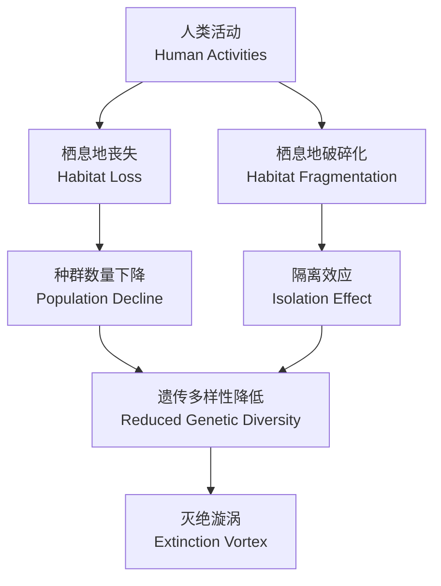

---
aliases:
  - 全球变化
  - 生物多样性丧失
  - Global Change
  - Biodiversity Loss
  - 气候变化
  - Climate Change
tags:
  - ecology
  - biodiversity
  - climate-change
  - conservation
  - global-change
  - extinction
---

# 全球变化与生物多样性

## 1 全球变化概述

### 1.1 定义与范畴

**全球变化**（Global Change）指地球系统在气候、土地利用、生物地球化学循环等方面发生的重大变化。其主要组成部分包括：

- **气候变化**（Climate Change）：由温室气体排放导致的全球升温
- **土地利用变化**（Land-Use Change）：森林砍伐、城市化、农业扩张
- **生物地球化学循环改变**（Biogeochemical Cycle Alteration）：氮、磷、碳循环的失衡
- **生物多样性丧失**（Biodiversity Loss）：物种灭绝速率加速

### 1.2 人类世

当前地质时代被称为 **人类世**（Anthropocene），其标志性特征是人类活动成为影响地球系统的主导力量。自工业革命以来，大气 $CO_2$ 浓度从约 280 ppm 上升至超过 420 ppm。

$$ \Delta T = \lambda \cdot \Delta F $$

其中 $\Delta T$ 为地表温度变化，$\lambda$ 为气候敏感度参数，$\Delta F$ 为辐射强迫变化。

## 2 生物多样性的四个层次

| 层次 | 英文 | 描述 |
|------|------|------|
| 遗传多样性 | Genetic Diversity | 物种内部基因变异的总和 |
| 物种多样性 | Species Diversity | 群落中物种的丰富度和均匀度 |
| 生态系统多样性 | Ecosystem Diversity | 不同生态系统类型的多样性 |
| 景观多样性 | Landscape Diversity | 景观格局和过程的多样性 |

## 3 气候变化对生物多样性的影响

### 3.1 分布区迁移

随着全球温度上升，许多物种的分布区正在向极地和高海拔地区迁移。研究表明，物种分布区平均每十年向极地方向迁移约 16.9 公里（Parmesan & Yohe, 2003）。

### 3.2 物候改变

气候变化导致春季物候提前：

- 植物萌芽时间提前
- 鸟类迁徙时间改变
- 昆虫孵化时间与寄主植物不同步

这种 **物候错配**（Phenological Mismatch）可能破坏食物网结构。

### 3.3 灭绝风险

$$ E = 1 - \frac{K - N}{K} \cdot e^{-rt} $$

其中 $E$ 为灭绝概率，$K$ 为环境容纳量，$N$ 为种群大小，$r$ 为内禀增长率，$t$ 为时间。

## 4 栖息地丧失与破碎化

### 4.1 岛屿生物地理学理论

** MacArthur-Wilson 平衡理论**（Equilibrium Theory of Island Biogeography）预测岛屿上的物种丰富度由迁入率和灭绝率之间的平衡决定：

$$ S = \frac{I}{I + E} \cdot S_P $$

其中 $S$ 为平衡物种数，$I$ 为迁入率，$E$ 为灭绝率，$S_P$ 为物种库大小。

### 4.2 边缘效应

栖息地边缘的环境条件与内部显著不同：

- 温度升高
- 湿度降低
- 光照增强
- 风速增大

## 5 物种灭绝危机

### 5.1 第六次大灭绝

地球历史上经历过五次大规模灭绝事件。当前正在发生的 **第六次大灭绝**（Sixth Mass Extinction）由人类活动驱动。当前灭绝速率是背景灭绝速率的 100-1000 倍。

### 5.2 灭绝债务

**灭绝债务**（Extinction Debt）指由于栖息地破坏已经注定但尚未发生的灭绝事件。即使立即停止栖息地破坏，这些灭绝仍将发生。

## 6 保护生物学策略

### 6.1 原地保护与迁地保护

| 策略 | 英文 | 优点 | 缺点 |
|------|------|------|------|
| 原地保护 | In-Situ Conservation | 维持生态过程 | 受气候变化影响 |
| 迁地保护 | Ex-Situ Conservation | 控制环境条件 | 成本高、适应性差 |

### 6.2 保护区网络设计

保护区网络需要满足 **C-PREP** 标准：

1. **代表性**（Representativeness）
2. **持久性**（Persistence）
3. **弹性**（Resilience）
4. **有效性**（Effectiveness）
5. **完整性**（Completeness）

### 6.3 生态廊道

生态廊道连接破碎化的栖息地斑块，促进基因流动和种群补充。

## 7 基于自然的解决方案

**基于自然的解决方案**（Nature-Based Solutions, NbS）利用生态系统过程应对气候变化：

- 森林恢复与植树造林
- 湿地保护与恢复
- 海洋蓝碳（Blue Carbon）生态系统保护
- 农业生态集约化

## 8 全球生物多样性框架

### 8.1 昆明-蒙特利尔全球生物多样性框架

2022年通过的《昆明-蒙特利尔全球生物多样性框架》设定了 23 个行动目标，其中包括 **30×30 目标**（到 2030 年保护 30% 的陆地和海洋）。

### 8.2 IPBES 评估

**生物多样性和生态系统服务政府间科学政策平台**（IPBES）的全球评估报告指出：

- 约 100 万种动植物面临灭绝威胁
- 75% 的陆地环境已被人类显著改变
- 66% 的海洋环境受到人类活动影响

## 9 生态系统的临界点

### 9.1 气候临界点

气候系统中存在多个 **临界要素**（Tipping Elements），一旦超过阈值将引发不可逆的变化：

| 临界要素 | 阈值升温 | 影响 |
|----------|----------|------|
| 格陵兰冰盖消融 | $1.5-2.0^\circ C$ | 海平面上升 7 米 |
| 亚马逊雨林枯萎 | $3-4^\circ C$ | 碳汇转碳源 |
| 大西洋经向翻转环流减弱 | $3-4^\circ C$ | 欧洲气候剧变 |
| 永久冻土融化 | $1.5-2.0^\circ C$ | 大量温室气体释放 |

### 9.2 生态系统的级联效应

生态系统的变化可能引发级联效应。例如，顶级捕食者的消失会导致中阶捕食者激增，进而影响植物群落结构。这种 **营养级联**（Trophic Cascade）效应在海洋和陆地生态系统中均有广泛记录。

## 10 气候变化减缓与适应的协同

### 10.1 基于生态系统的适应

**基于生态系统的适应**（Ecosystem-Based Adaptation, EbA）利用生态系统服务帮助人类社会适应气候变化：

- 红树林恢复减少风暴潮危害
- 城市绿地缓解热岛效应
- 山地森林防止滑坡和泥石流

### 10.2 碳封存与生物多样性协同

**自然气候解决方案**（Natural Climate Solutions, NCS）通过保护、恢复和改善土地管理来增加碳封存并减少排放，同时保护生物多样性：

- **造林与再造林**（Afforestation and Reforestation）
- **农林复合经营**（Agroforestry）
- **泥炭地恢复**（Peatland Restoration）
- **海草床保护**（Seagrass Meadow Conservation）

## 11 入侵物种与全球变化

### 11.1 生物入侵的生态影响

**外来入侵物种**（Invasive Alien Species, IAS）在全球变化背景下扩散加速：

- 与本地物种竞争资源
- 改变生态系统过程
- 传播新型疾病
- 导致本地物种灭绝

### 11.2 入侵途径

主要入侵途径包括国际贸易、旅游、航运（压舱水）和气候变化驱动的分布区扩张。

## 12 保护经济学

### 12.1 生态系统服务价值

**生态系统服务**（Ecosystem Services）指自然生态系统为人类提供的各种惠益：

$$ \text{全球生态系统服务价值} \approx 125\ \text{万亿美元/年} $$

### 12.2 自然资本核算

将自然资本纳入国民经济核算体系，使生物多样性保护的经济效益得到量化和认可。

## 13 国际环境治理

### 13.1 主要国际公约

- 《生物多样性公约》（Convention on Biological Diversity, CBD）
- 《联合国气候变化框架公约》（UNFCCC）
- 《国际重要湿地公约》（Ramsar Convention）
- 《濒危野生动植物种国际贸易公约》（CITES）

### 13.2 REDD+ 机制

REDD+（减少毁林和森林退化所致排放量）是 UNFCCC 框架下的国际机制，为发展中国家保护森林提供资金激励。

## 14 未来展望

应对全球变化和生物多样性危机需要多层级、跨学科的综合性策略：

1. **减缓**（Mitigation）：大幅减少温室气体排放，实现碳中和目标
2. **适应**（Adaptation）：帮助物种、生态系统和人类社会适应不可避免的变化
3. **恢复**（Restoration）：大规模修复退化的生态系统，恢复生态功能
4. **转型**（Transformation）：改变不可持续的生产和消费模式，重构人与自然关系

只有将生物多样性保护纳入全球治理和经济决策的核心框架，才能实现《生物多样性公约》2050 年愿景——**人与自然和谐共生**（Living in Harmony with Nature）。
