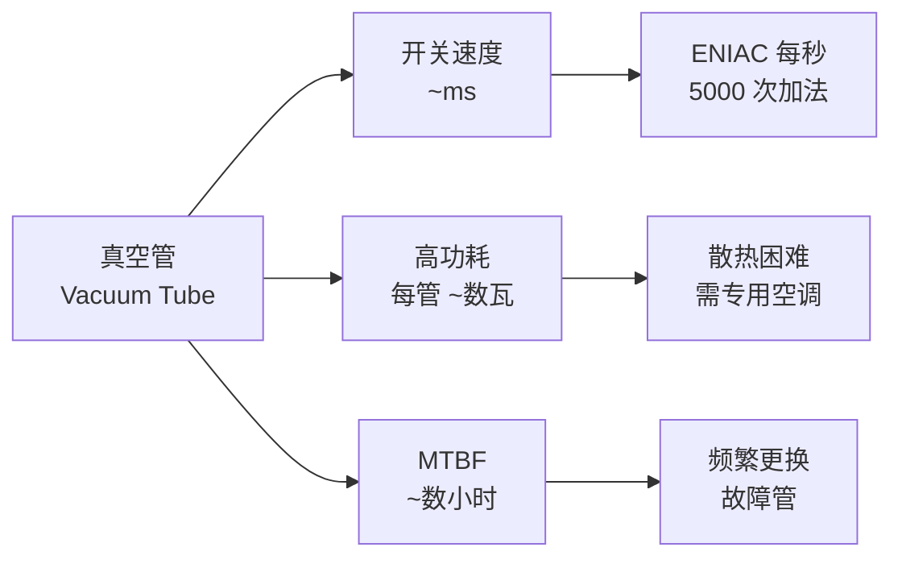
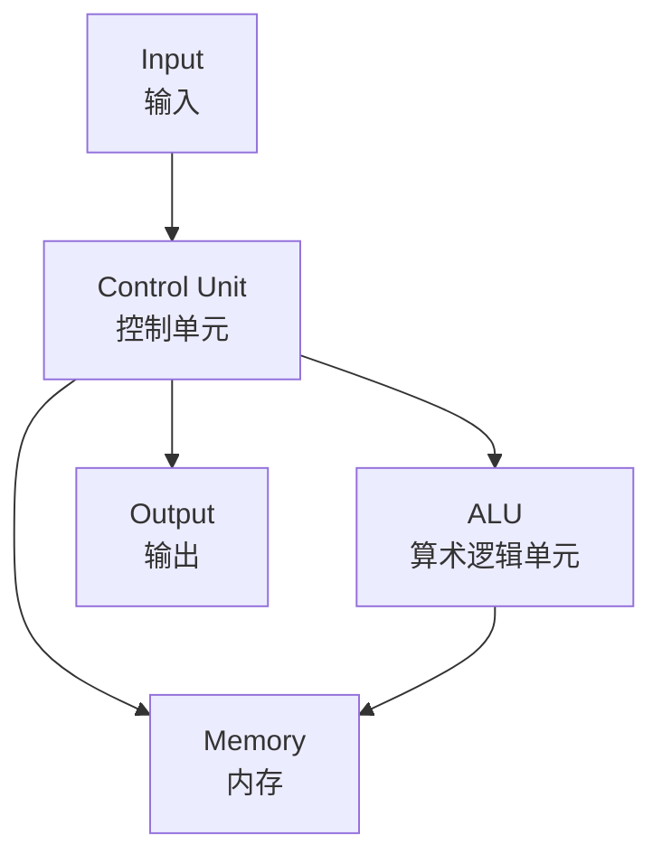

# 计算机进化论 (Evolution of Computing)

计算机进化论研究计算设备从机械装置到电子计算机，再到量子计算的发展历程和范式转变。每一代计算技术都带来了数量级上的性能飞跃和根本性的架构变革。

## 一、计算机世代 (Generations of Computing)

### 1.1 世代演进

| 世代 | 时期 | 关键技术 | 代表系统 | 特征 |
|------|------|---------|---------|------|
| 第零代 | 古代—1940 | 机械计算 | 算盘、差分机 | 人力/机械驱动 |
| 第一代 | 1940–1956 | 真空管 | ENIAC, UNIVAC | 庞大、耗电、易故障 |
| 第二代 | 1956–1963 | 晶体管 | IBM 1401 | 更小、更可靠 |
| 第三代 | 1963–1971 | 集成电路 (IC) | IBM System/360 | 多任务、小型化 |
| 第四代 | 1971—现在 | 微处理器 | PC, 智能手机 | 个人化、网络化 |
| 第五代 | 现在—未来 | AI/量子 | 量子计算机、神经形态 | 智能、并行 |

### 1.2 第一代：真空管时代

ENIAC (1946) 包含约 17,468 个真空管，重 30 吨，功耗 150 kW。编程通过插线板完成。

## 二、晶体管与摩尔定律 (Transistors & Moore's Law)

### 2.1 晶体管发明

1947 年贝尔实验室的 Bardeen、Brattain 和 Shockley 发明了点接触晶体管，标志着固态电子时代的开始。

### 2.2 摩尔定律 (Moore's Law)

Gordon Moore 在 1965 年预测：集成电路上可容纳的晶体管数目大约每两年翻一番。

$$ N(t) = N_0 \cdot 2^{(t - t_0)/2} $$

| 年份 | 工艺节点 | 晶体管数 (典型 CPU) |
|------|---------|-------------------|
| 1971 | 10 μm | 2,300 (Intel 4004) |
| 1985 | 1.5 μm | 275,000 (Intel 80386) |
| 2000 | 180 nm | 37  million (Pentium III) |
| 2015 | 14 nm | 7.2 billion (Skylake) |
| 2024 | 3 nm | ~50 billion (M4) |

### 2.3 后摩尔时代挑战

- 量子隧穿效应：当栅极厚度 < 5 nm 时，电子会隧穿通过
- 功耗密度：单位面积功耗已达 ~100 W/cm²
- 光刻极限：EUV 光刻波长 13.5 nm 接近物理极限

## 三、计算范式 (Computing Paradigms)

### 3.1 冯·诺依曼架构

**冯·诺依曼瓶颈 (von Neumann Bottleneck)**：CPU 与内存之间的数据传输速度远低于 CPU 处理速度。

### 3.2 哈佛架构 (Harvard Architecture)

指令总线和数据总线分离，允许同时取指令和数据访问。广泛用于 DSP 和微控制器。

### 3.3 并行计算 (Parallel Computing)

| 分类 | 描述 | 实例 |
|------|------|------|
| SIMD | 单指令多数据 | GPU 向量化 |
| MIMD | 多指令多数据 | 多核 CPU |
| MISD | 多指令单数据 | 容错系统 |
| SPMD | 单程序多数据 | MPI 集群 |

**Amdahl 定律**：加速比受串行部分限制

$$ S = \frac{1}{(1 - p) + \frac{p}{N}} $$

其中 $p$ 为可并行比例，$N$ 为处理器数量。

## 四、硬件进化 (Hardware Evolution)

### 4.1 存储技术 (Storage Technology)

| 技术 | 容量/TB | 访问时间 | 持久性 | 成本 (per GB) |
|------|--------|---------|--------|-------------|
| SRAM | ~0.001 | 1 ns | 挥发 | $500 |
| DRAM | ~0.1 | 10 ns | 挥发 | $10 |
| NAND SSD | ~100 | 100 μs | 非挥发 | $0.10 |
| HDD | ~10 | 10 ms | 非挥发 | $0.02 |
| 磁带 | ~10 | 分钟级 | 非挥发 | $0.005 |

### 4.2 网络互连 (Network Interconnects)

以太网带宽演进 (10 倍/代)：

| 标准 | 速率 | 年份 | 介质 |
|------|------|------|------|
| Ethernet | 10 Mbps | 1980 | 同轴电缆 |
| Fast Ethernet | 100 Mbps | 1995 | 双绞线 |
| Gigabit Ethernet | 1 Gbps | 1999 | 双绞线/光纤 |
| 10 GigE | 10 Gbps | 2003 | 光纤 |
| 100 GigE | 100 Gbps | 2010 | 光纤 |
| 400 GigE | 400 Gbps | 2017 | 光纤 |

## 五、量子计算 (Quantum Computing)

### 5.1 量子比特 (Qubit)

与经典比特不同，量子比特可以处于 $|0\rangle$ 和 $|1\rangle$ 的叠加态：

$$ |\psi\rangle = \alpha|0\rangle + \beta|1\rangle, \quad |\alpha|^2 + |\beta|^2 = 1 $$

### 5.2 量子门与电路

- Hadamard 门：创建叠加态
- CNOT 门：纠缠两个量子比特
- Toffoli 门：通用量子门

### 5.3 量子算法

| 算法 | 问题 | 经典复杂度 | 量子复杂度 | 加速比 |
|------|------|-----------|-----------|--------|
| Shor | 整数分解 | 指数级 | 多项式级 | 指数级 |
| Grover | 数据库搜索 | O(N) | O(√N) | 二次 |
| QPE | 相位估计 | — | — | 量子基础 |

Shor 算法分解整数 $N$：

$$ O((\log N)^3) \quad \text{(量子)} \quad \text{vs} \quad O(\exp(c \sqrt[3]{\log N})) \quad \text{(经典)} $$

## 六、神经形态计算 (Neuromorphic Computing)

### 6.1 脉冲神经网络 (SNN)

神经形态芯片模拟生物神经元的脉冲发放机制：

$$ V_m(t) = V_{\text{rest}} + \sum_i w_i \cdot K(t - t_i) $$

其中 $K(t)$ 为脉冲响应核函数。

### 6.2 主要神经形态芯片

| 芯片 | 研发机构 | 神经元数 | 功耗 | 特点 |
|------|---------|---------|------|------|
| TrueNorth | IBM | 1M | 70 mW | 超低功耗 |
| Loihi 2 | Intel | 1M | 1 W | 片上学习 |
| SpiNNaker | Manchester | 10M | 10 W | 大规模模拟 |

## 七、未来趋势 (Future Trends)

### 7.1 光计算 (Optical Computing)

用光子替代电子进行运算，理论上可达 THz 频率，功耗降低 1000 倍。

### 7.2 DNA 计算 (DNA Computing)

利用 DNA 分子的并行性进行大规模计算。Adleman (1994) 用 DNA 解决哈密顿路径问题。

### 7.3 生物计算 (Biological Computing)

- 类脑计算：借鉴大脑架构
- 合成生物学计算：基因电路
- 分子计算：化学信号处理

## 相关条目

- [[计算机科学]]
- [[量子力学]]
- [[人工智能]]
- [[INDEX|当前目录索引]]
