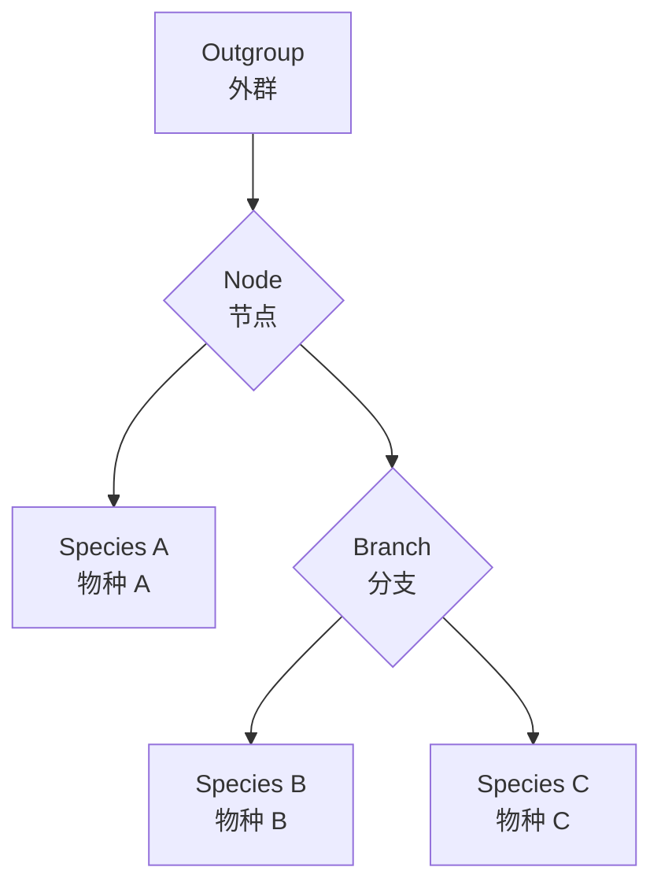

---
aliases:
  - 分子进化
  - 系统发育
  - 分子钟
  - 系统发育树
  - Molecular Evolution
  - Phylogenetics
  - Molecular Clock
  - Phylogenetic Tree
  - 序列比对
tags:
  - molecular-evolution
  - phylogenetics
  - bioinformatics
  - molecular-clock
  - sequence-alignment
  - evolution
---

# 分子进化与系统发育

## 1 分子进化概述

**分子进化**（Molecular Evolution）研究生物大分子（DNA、RNA、蛋白质）在时间尺度上的变化规律。分子进化理论为理解生物之间的进化关系提供了定量基础。

### 1.1 分子进化的核心问题

- 分子序列如何随时间变化？
- 不同物种的同源序列之间有何关系？
- 如何从分子数据重建进化历史？

## 2 分子进化的理论基础

### 2.1 中性理论

**中性理论**（Neutral Theory）由木村资生（Motoo Kimura）于 1968 年提出。该理论认为大多数分子水平的进化变化是由中性或近中性突变随机漂移所致，而非自然选择驱动。

$$ k = \frac{f_0}{2N_e} \cdot \mu \cdot N_e = \frac{f_0 \mu}{2} $$

其中 $k$ 为核苷酸替换率，$f_0$ 为中性突变比例，$\mu$ 为突变率，$N_e$ 为有效种群大小。

### 2.2 分子钟假说

**分子钟**（Molecular Clock）假说认为特定基因或蛋白质的进化速率在时间上大致恒定。其数学表达为：

$$ d = 2 \cdot \mu \cdot t $$

其中 $d$ 为两个序列间的遗传距离，$\mu$ 为每百万年每位点的替换率，$t$ 为分歧时间。

### 2.3 近似分子钟

由于不同谱系的进化速率可能不同，发展了更复杂的 **近似分子钟**（Relaxed Molecular Clock）模型。

## 3 突变与序列替换

### 3.1 突变类型

| 类型 | 英文 | 描述 |
|------|------|------|
| 转换 | Transition | 嘌呤 <-> 嘌呤，嘧啶 <-> 嘧啶 |
| 颠换 | Transversion | 嘌呤 <-> 嘧啶 |
| 插入 | Insertion | 增加一个或多个核苷酸 |
| 缺失 | Deletion | 删除一个或多个核苷酸 |
| 同义替换 | Synonymous | 不改变氨基酸的替换 |
| 非同义替换 | Nonsynonymous | 改变氨基酸的替换 |

### 3.2 选择压力的测量

$dN/dS$ 比率（也称 $\omega$）用于衡量蛋白质编码基因上的选择压力：

- $\omega = 1$：中性进化
- $\omega < 1$：纯化选择（Purifying Selection）
- $\omega > 1$：正向选择（Positive Selection）

## 4 序列比对

### 4.1 双序列比对

**双序列比对**（Pairwise Sequence Alignment）使用动态规划算法寻找最优比对。**Needleman-Wunsch 算法**用于全局比对，**Smith-Waterman 算法**用于局部比对。

$$ S(i, j) = \max \begin{cases}
S(i-1, j-1) + \text{match}(i, j) \\
S(i-1, j) + \text{gap\_penalty} \\
S(i, j-1) + \text{gap\_penalty}
\end{cases} $$

### 4.2 多序列比对

**多序列比对**（Multiple Sequence Alignment, MSA）同时比对三个或更多序列。常用工具包括：

- **Clustal Omega**
- **MAFFT**
- **MUSCLE**
- **T-Coffee**

### 4.3 比对打分矩阵

| 矩阵 | 英文 | 用途 |
|------|------|------|
| PAM | Point Accepted Mutation | 蛋白质序列比对 |
| BLOSUM | Blocks Substitution Matrix | 蛋白质序列比对 |
| NUC | Nucleotide Substitution Matrix | DNA 序列比对 |

## 5 系统发育树

### 5.1 树的拓扑结构

系统发育树的基本组成部分：

- **分支**（Branch/Edge）：代表进化谱系
- **节点**（Node）：代表共同祖先
- **根**（Root）：最早的共同祖先
- **外群**（Outgroup）：用于确定根位置的远缘物种
- **末端**（Tip/Leaf）：现有物种或序列

### 5.2 树的重建方法

| 方法 | 英文 | 特点 |
|------|------|------|
| 最大简约法 | Maximum Parsimony (MP) | 假设最少变化次数 |
| 距离法 | Distance Methods (NJ, UPGMA) | 基于成对遗传距离 |
| 最大似然法 | Maximum Likelihood (ML) | 选择最大似然值的树 |
| 贝叶斯法 | Bayesian Inference (BI) | 使用后验概率 |

### 5.3 最大似然法

最大似然法在给定的替代模型下寻找最可能产生观察数据的树：

$$ L(\text{Tree}) = P(\text{Data} \mid \text{Tree}, \text{Model}) $$

### 5.4 树的可靠性评估

**自举检验**（Bootstrap Test）通过对原始数据重新抽样来评估树节点支持度。通常将 **bootstrap 值** 在 70% 以上视为可靠。

## 6 进化模型

### 6.1 核苷酸替代模型

| 模型 | 英文 | 参数 |
|------|------|------|
| JC69 | Jukes-Cantor | 所有替换等速率 |
| K80 | Kimura 2-parameter | 区分转换与颠换 |
| HKY85 | Hasegawa-Kishino-Yano | 区分转换/颠换 + 碱基频率 |
| GTR | General Time Reversible | 最一般化的可逆模型 |

### 6.2 蛋白质替代模型

- **PAM 矩阵**（Point Accepted Mutation）
- **WAG 矩阵**
- **JTT 矩阵**
- **LG 矩阵**（适用于系统发育基因组学）

## 7 分子系统发育的应用

### 7.1 物种鉴定与条形码

**DNA 条形码**（DNA Barcoding）使用标准基因片段（如 COI、rbcL）进行物种鉴定。

### 7.2 进化发育生物学

**进化发育生物学**（Evo-Devo）研究发育过程的分子机制及其进化。

### 7.3 分子流行病学

利用分子系统发育追踪病原体的传播路径和进化动态。

## 8 比较基因组学

- **直系同源**（Orthologs）：由物种形成事件产生的同源基因
- **旁系同源**（Paralogs）：由基因重复事件产生的同源基因
- **异源同源**（Xenologs）：通过水平基因转移获得的同源基因

## 9 系统发育基因组学

### 9.1 从单基因到基因组

**系统发育基因组学**（Phylogenomics）利用全基因组数据重建进化关系，减少随机误差和系统误差，揭示基因树与物种树的不一致。

### 9.2 基因树与物种树

**不完全谱系分选**（Incomplete Lineage Sorting, ILS）导致基因树和物种树不一致：

$$ P(\text{不一致}) \propto e^{-t / 2N_e} $$

其中 $t$ 为物种分歧时间，$N_e$ 为有效种群大小。

## 10 分子钟的校正

### 10.1 化石校正

**化石校正**（Fossil Calibration）利用化石记录提供时间参考点，包括最小和最大年龄约束。

### 10.2 贝叶斯松散分子钟

贝叶斯方法允许不同谱系的进化速率沿分支变化：

$$ \text{时间} \sim \text{化石约束} + \text{序列数据} + \text{速率模型} $$

## 11 选择压力的检测

### 11.1 位点模型

**位点模型**（Site Models）检测编码序列中经历正向选择的位点：

| 模型 | $\omega$ 分布 |
|------|-------------|
| M1a | $\omega_0 < 1, \omega_1 = 1$ |
| M2a | 增加 $\omega_2 > 1$ |
| M7 | $\beta$ 分布 (0–1) |
| M8 | $\beta$ + $\omega > 1$ |

### 11.2 支点模型

**支点模型**（Branch-Site Models）检测特定谱系中位点的正向选择。

## 12 水平基因转移

**水平基因转移**（Horizontal Gene Transfer, HGT）在原核生物中普遍存在，通过转化、转导和接合实现。检测方法包括分析 GC 含量异常和系统发育不一致。

## 13 比较基因组学

- **直系同源**（Orthologs）：物种形成产生的同源基因
- **旁系同源**（Paralogs）：基因重复产生的同源基因
- **异源同源**（Xenologs）：水平转移获得的同源基因
- **新功能化**（Neofunctionalization）：拷贝获得新功能
- **亚功能化**（Subfunctionalization）：功能分配到两个拷贝

## 14 分子进化的前沿方向

### 14.1 古基因组学

**古基因组学**（Paleogenomics）从古代样本提取 DNA 进行分析。2022 年诺贝尔奖授予帕博，表彰其在古人类基因组研究中的贡献。

### 14.2 病毒进化追踪

利用分子系统发育追踪病毒（如 SARS-CoV-2）的起源和进化。

## 15 结论

分子进化与系统发育学为理解生命之树提供了强大工具。从中性理论到分子钟，从序列比对到系统发育重建，从选择压力检测到比较基因组学，这一领域持续推动着我们对进化过程和机制的认识。
