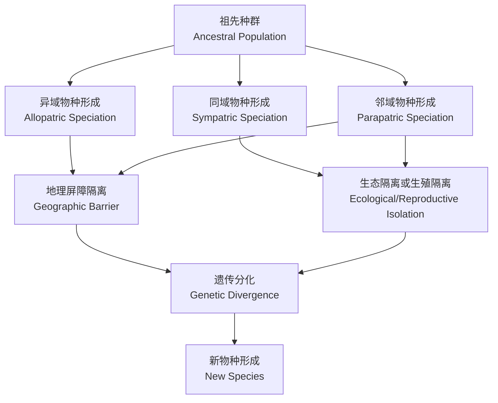
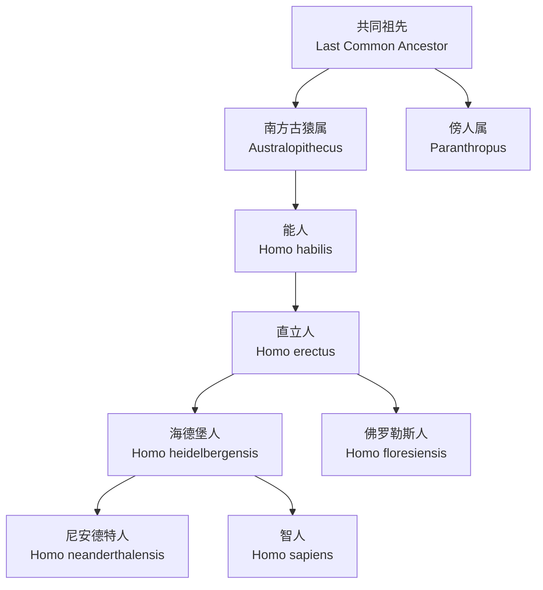
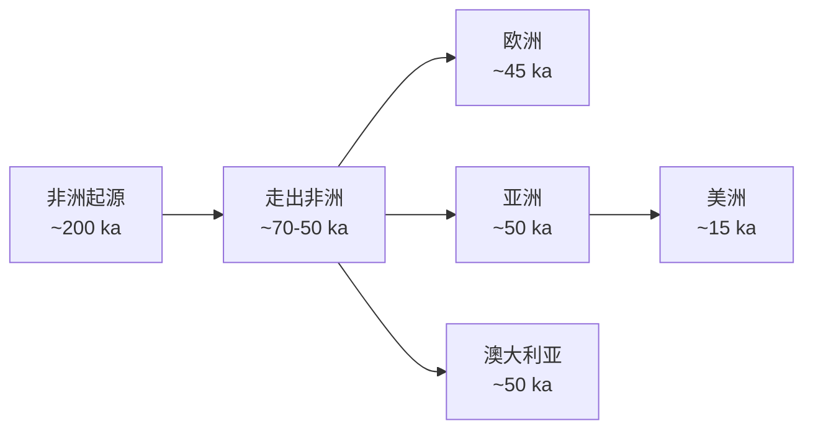

---
aliases:
  - 物种形成
  - 人类进化
  - 人科
  - 古人类
  - Speciation
  - Human Evolution
  - Hominin
  - Human Ancestry
  - 异域物种形成
tags:
  - speciation
  - human-evolution
  - paleoanthropology
  - hominins
  - natural-selection
  - evolution
---

# 物种形成与人类进化

## 1 物种的概念

### 1.1 生物学物种概念

**生物学物种概念**（Biological Species Concept, BSC）由迈尔（Ernst Mayr）提出：物种是能够自然交配并产生可育后代的种群群体，与其他群体之间存在生殖隔离。

### 1.2 其他物种概念

| 概念 | 英文 | 定义标准 |
|------|------|----------|
| 形态学物种 | Morphological Species | 形态特征差异 |
| 系统发育物种 | Phylogenetic Species | 最小可辨识的单系群 |
| 生态学物种 | Ecological Species | 生态位差异 |
| 进化物种 | Evolutionary Species | 独特的进化谱系 |

## 2 物种形成的机制

### 2.1 地理隔离模式

### 2.2 生殖隔离机制

**生殖隔离**（Reproductive Isolation）阻止不同物种间的基因流动，分为两大类：

#### 合子前隔离

- 生境隔离（Habitat Isolation）
- 时间隔离（Temporal Isolation）
- 行为隔离（Behavioral Isolation）
- 机械隔离（Mechanical Isolation）
- 配子隔离（Gametic Isolation）

#### 合子后隔离

- 杂种不活（Hybrid Inviability）
- 杂种不育（Hybrid Sterility）
- 杂种衰退（Hybrid Breakdown）

### 2.3 异域物种形成

**异域物种形成**（Allopatric Speciation）是最常见的物种形成模式。当地理屏障将种群分隔开后，突变、自然选择和遗传漂变导致两个种群在遗传上分化，最终达到生殖隔离。

### 2.4 同域物种形成

**同域物种形成**（Sympatric Speciation）在没有地理隔离的同一地区发生。常见于昆虫的宿主转移和多倍体植物。

## 3 物种形成的遗传学

### 3.1 遗传分化的度量

种群间的遗传分化用 **$F_{ST}$** 衡量：

$$ F_{ST} = \frac{\sigma_p^2}{\bar{p}(1 - \bar{p})} $$

其中 $\sigma_p^2$ 是等位基因频率在不同亚群间的方差，$\bar{p}$ 是平均等位基因频率。

### 3.2 基因流与分化

$$ m_e = \frac{1}{4N_e} \implies F_{ST} \approx \frac{1}{4N_e m + 1} $$

其中 $m$ 为迁入率，$N_e$ 为有效种群大小。当 $N_e m > 1$ 时，基因流足以抵抗遗传漂变的分化作用。

### 3.3 杂交与基因渗入

**杂交**（Hybridization）和 **基因渗入**（Introgression）在物种形成中起重要作用。例如，古人类之间的基因交流丰富了现代人类基因组的多样性。

## 4 人类进化

### 4.1 人科谱系

### 4.2 人科的主要特征

人类进化的标志性特征包括：

1. **双足行走**（Bipedalism）— 约 600-700 万年前出现
2. **脑容量扩大**（Encephalization）— 从 400 cc 到 1400 cc
3. **工具使用与制造**（Tool Use and Manufacture）
4. **语言发展**（Language Development）
5. **文化复杂性**（Cultural Complexity）

### 4.3 脑容量进化

$$ EQ = \frac{E}{0.085 \times W^{0.755}} $$

其中 $EQ$ 为脑化指数（Encephalization Quotient），$E$ 为脑重量，$W$ 为体重。

| 物种 | 脑容量 (cc) | 出现时间 (万年前) |
|------|------------|-----------------|
| 南方古猿 | 400-500 | 400-200 |
| 能人 | 600-700 | 240-160 |
| 直立人 | 800-1100 | 190-14 |
| 尼安德特人 | 1200-1750 | 40-4 |
| 现代智人 | 1300-1500 | 30-至今 |

## 5 走出非洲

### 5.1 走出非洲模型

**走出非洲模型**（Out of Africa Model）认为现代智人起源于 20-30 万年前的非洲，随后扩散到全球，取代了其他古人类种群。

### 5.2 多地区起源模型

**多地区起源模型**（Multiregional Model）提出现代人在全球多个地区由当地古人类连续进化而来。

### 5.3 遗传证据

线粒体 DNA（mtDNA）和 Y 染色体的系统发育分析支持非洲起源假说。所有现代人类的 mtDNA 可追溯到约 20 万年前的一位非洲女性——**线粒体夏娃**（Mitochondrial Eve）。

## 6 自然选择在人类进化中的作用

### 6.1 选择压力

- **耐乳糖**（Lactase Persistence）：牧业文化中的选择
- **高原适应**（High-Altitude Adaptation）：藏族和安第斯人群
- **肤色适应**（Skin Pigmentation）：紫外线强度与维生素 D 合成
- **抗病基因**（Disease Resistance）：镰状细胞贫血与疟疾抵抗

### 6.2 现代人类的进化

$$ s = 1 - \frac{W_{ref}}{W_{mut}} $$

其中 $s$ 为选择系数，$W_{ref}$ 为参考基因型的适应度，$W_{mut}$ 为突变基因型的适应度。

## 7 古DNA 研究

**古DNA**（Ancient DNA, aDNA）研究直接从古代化石中提取 DNA 进行分析。2022 年诺贝尔生理学或医学奖授予斯万特·帕博（Svante Pääbo），表彰其在已灭绝古人类基因组研究中的贡献。

## 8 人类迁徙与种群结构

### 8.1 走出非洲的路线

### 8.2 尼安德特人基因渗入

现代非非洲人群基因组中含有约 $1-2\%$ 的尼安德特人 DNA，影响免疫、肤色和疾病易感性。

### 8.3 丹尼索瓦人

**丹尼索瓦人**（Denisovans）基因在大洋洲和东亚人群中有渗入，巴布亚新几内亚人群含约 $4-6\%$。

## 9 人类适应的遗传基础

### 9.1 高海拔适应

藏族人群的 **EPAS1**、**EGLN1** 基因变异降低血红蛋白浓度，避免血液黏稠，部分源自丹尼索瓦人基因渗入。

### 9.2 饮食适应

| 特征 | 基因 | 选择压力 |
|------|------|----------|
| 乳糖耐受 | LCT | 牧业文化 |
| 淀粉酶增多 | AMY1 | 高淀粉饮食 |
| 酒精代谢 | ADH1B | 农业文化 |

## 10 人类特有的遗传特征

- **ARHGAP11B**：促进基底前体细胞增殖，增大脑容量
- **SRGAP2**：树突棘密度调控
- **FOXP2**：语言相关基因
- 双足行走的骨骼适应：S 形脊柱、碗状骨盆、足弓出现

## 11 物种形成机制的深入研究

### 11.1 生态物种形成

**生态物种形成**（Ecological Speciation）由不同生态环境的选择压力驱动，如慈鲷鱼在非洲大湖中的适应性辐射。

### 11.2 多倍体物种形成

**多倍体物种形成**（Polyploid Speciation）在植物中常见，染色体加倍形成生殖隔离。

### 11.3 环物种

**环物种**（Ring Species）沿地理梯度分布，两端种群间达成生殖隔离但中间可杂交，如绿莺和加州蝾螈。

## 12 物种形成机制的深入研究

### 12.1 生态物种形成

**生态物种形成**（Ecological Speciation）由不同生态环境之间的选择压力驱动。例如，慈鲷鱼（Cichlids）在非洲大湖中的适应性辐射。

### 12.2 多倍体物种形成

**多倍体物种形成**（Polyploid Speciation）在植物中特别常见。多倍体植物（如小麦）由于染色体加倍而与二倍体亲本形成生殖隔离。

### 12.3 环物种

**环物种**（Ring Species）沿地理梯度分布，两端种群之间达到生殖隔离，但中间连续种群之间可以杂交。经典案例包括绿莺（Greenish Warbler）和加州蝾螈（Ensatina）。

## 13 结论

物种形成是进化的核心过程，而人类进化是物种形成研究中最引人入胜的案例。从分子到形态，从化石到基因组，从实验室到野外，多层次的证据共同构建了生命多样性和人类起源的完整图景。
