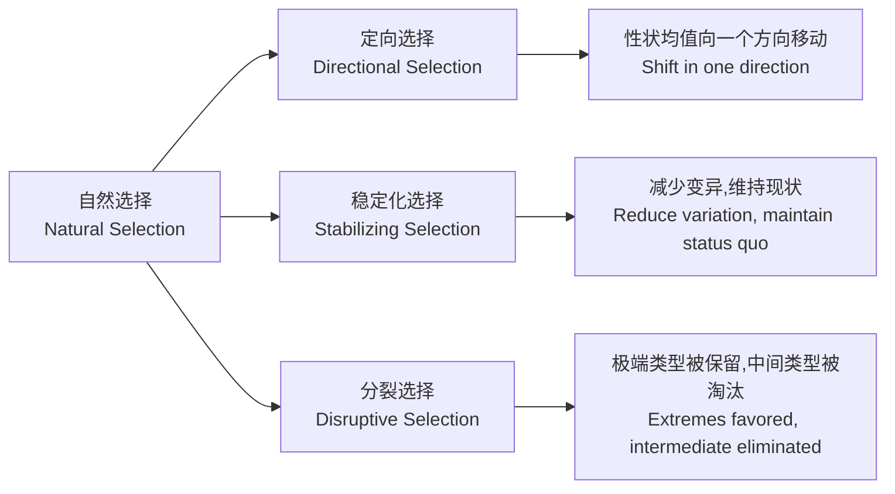
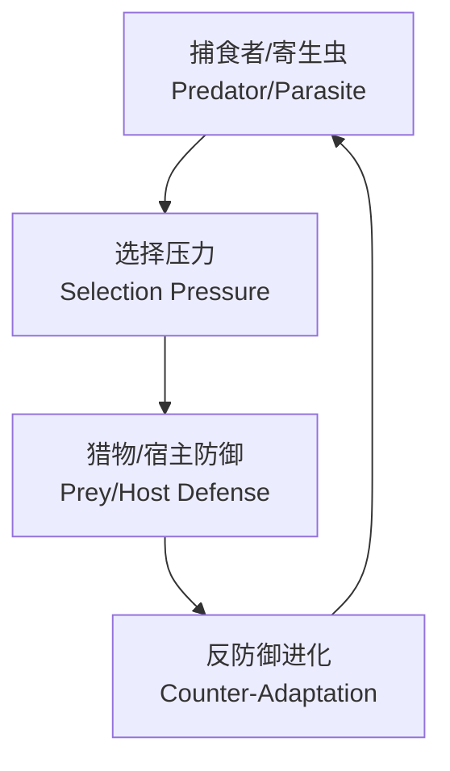

---
aliases:
  - 进化论
  - 自然选择
  - 达尔文
  - 适应
  - Evolution
  - Natural Selection
  - Darwin
  - Adaptation
  - 遗传漂变
  - 适合度
tags:
  - evolution
  - natural-selection
  - darwin
  - population-genetics
  - adaptation
  - evolutionary-biology
---

# 进化论基础

## 1 进化论的历史

### 1.1 前达尔文时期

- **亚里士多德**（Aristotle）：生物阶梯（Scala Naturae）概念
- **居维叶**（Georges Cuvier）：灾变论（Catastrophism）
- **拉马克**（Jean-Baptiste Lamarck）：用进废退（Use and Disuse）
- **莱尔**（Charles Lyell）：均变论（Uniformitarianism）

### 1.2 达尔文与《物种起源》

**查尔斯·达尔文**（Charles Darwin）于 1859 年出版《物种起源》（On the Origin of Species）。其核心论点是自然选择驱动的共同祖先论。

### 1.3 现代综合

**现代综合**（Modern Synthesis）在 20 世纪 30-40 年代将达尔文自然选择理论与孟德尔遗传学结合，代表人物包括费希尔（Fisher）、霍尔丹（Haldane）、赖特（Wright）和迈尔（Mayr）。

## 2 自然选择

### 2.1 自然选择的条件

自然选择需要满足以下条件：

1. **变异的存续**（Variation exists）
2. **变异的遗传**（Variation is heritable）
3. **差异存活与繁殖**（Differential survival and reproduction）

### 2.2 适合度

**适合度**（Fitness）是生物在特定环境中生存和繁殖的相对能力：

$$ W = \text{存活率} \times \text{繁殖率} $$

### 2.3 选择系数

$$ s = 1 - \frac{W_{ref}}{W_{mut}} $$

### 2.4 自然选择的模式

| 模式 | 英文 | 效果 | 例子 |
|------|------|------|------|
| 定向选择 | Directional Selection | 均值移动 | 英国胡椒蛾工业黑化 |
| 稳定化选择 | Stabilizing Selection | 减少变异 | 人类出生体重 |
| 分裂选择 | Disruptive Selection | 两极分化 | 达尔文雀喙形 |

## 3 遗传漂变

### 3.1 遗传漂变的定义

**遗传漂变**（Genetic Drift）是由随机抽样导致的等位基因频率的随机波动，在小种群中效应更显著。

### 3.2 有效种群大小

$$ N_e = \frac{4N_m N_f}{N_m + N_f} $$

其中 $N_e$ 为有效种群大小，$N_m$ 和 $N_f$ 分别为繁殖雄性和雌性数量。

### 3.3 遗传漂变的效应

- 等位基因的随机固定或丢失
- 杂合度降低
- 种群间遗传分化增加
- 有害突变的积累

### 3.4 奠基者效应与瓶颈效应

- **奠基者效应**（Founder Effect）：小群体从大群体中迁出建立新种群
- **瓶颈效应**（Bottleneck Effect）：种群数量急剧下降后恢复

## 4 基因流

**基因流**（Gene Flow）是不同种群间的基因交换：

$$ F_{ST} \approx \frac{1}{4N_e m + 1} $$

$m$ 为迁入率，$N_e$ 为有效种群大小。基因流减少种群间的遗传分化，增加种群内的遗传多样性。

## 5 突变

**突变**（Mutation）是遗传变异的终极来源。突变率通常很低（约 $10^{-8}$ 每代每位点），但考虑到基因组大小和种群规模，新的突变不断出现。

## 6 适应

### 6.1 适应的定义

**适应**（Adaptation）是生物体通过自然选择获得有利于在特定环境中存活和繁殖的特征的过程。

### 6.2 适应的约束

- **历史约束**（Historical Constraint）：进化受已有结构限制
- **发育约束**（Developmental Constraint）：发育途径的限制
- **权衡**（Trade-offs）：一种功能的改善可能损害另一种功能
- **遗传相关性**（Genetic Correlation）：基因多效性

### 6.3 适应度景观

**适应度景观**（Fitness Landscape）由赖特（Sewall Wright）提出：

$$ W = f(g_1, g_2, \ldots, g_n) $$

其中 $W$ 为适应度，$g_i$ 为基因型坐标。种群在适应度景观上"爬山"寻找局部峰值。

## 7 性选择

### 7.1 性选择的类型

| 类型 | 英文 | 描述 |
|------|------|------|
| 性内选择 | Intrasexual Selection | 同性个体间的竞争 |
| 性间选择 | Intersexual Selection | 对异性的选择偏好 |

### 7.2 性二型性

雄性孔雀的尾羽是典型的 **性二型性**（Sexual Dimorphism）案例。斐希尔（Fisher）的 **失控选择模型**（Runaway Selection Model）解释这类特征如何通过雌性偏好进化而来。

## 8 共同进化

**共同进化**（Coevolution）是两个或多个物种之间相互选择的进化过程：

经典例子包括：捕食者-猎物军备竞赛、宿主-寄生虫协同进化、开花植物-传粉者协同进化。

## 9 进化生物学的研究方法

### 9.1 实验方法

- 实验室进化实验（Laboratory Evolution）
- 野外观察与比较研究（Field Observation and Comparative Studies）
- 共同园实验（Common Garden Experiments）
- 驯化实验（Domestication Experiments）

### 9.2 比较方法

- 系统发育比较方法（Phylogenetic Comparative Methods）
- 独立对比法（Independent Contrasts）

### 9.3 基因组学方法

- 全基因组关联研究（GWAS）
- 群体基因组学（Population Genomics）
- 选择扫描（Selective Sweep Detection）

## 10 进化的证据

### 10.1 化石记录

化石记录展示了生命形式随时间变化的模式，包括过渡化石（如始祖鸟、提塔利克鱼）。

### 10.2 比较解剖学

**同源结构**（Homologous Structures）源自共同祖先，**类比结构**（Analogous Structures）源自趋同进化。

### 10.3 分子证据

- 所有生命的通用遗传密码
- 核糖体 RNA 序列保守性
- 假基因（Pseudogenes）和转座子（Transposons）分布

## 11 结论

进化论是生物学的统一理论。从自然选择到遗传漂变，从分子进化到物种形成，进化机制解释了生命多样性的起源和模式。进化论不仅是科学事实，也是理解生命世界的核心框架。
