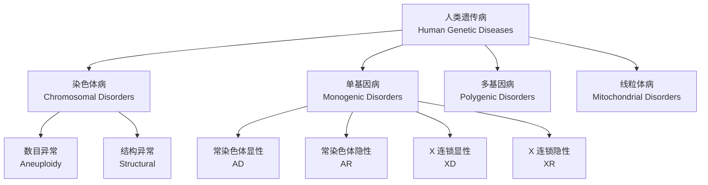
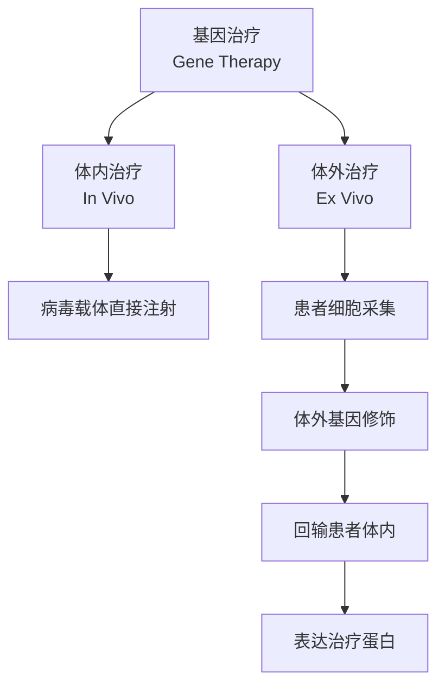

# 人类遗传病与基因诊断 (Human Genetic Diseases and Diagnosis)

## 1. 遗传病概述 (Overview of Genetic Diseases)

遗传病（Genetic Disease）是由基因突变或染色体异常引起的疾病，可分为染色体病、单基因病、多基因病和线粒体病四大类。

### 1.1 遗传病发病率

| 类型 | 发病率 | 示例 |
|------|--------|------|
| 染色体病 | 0.5-1%活产儿 | 唐氏综合征（Down Syndrome） |
| 单基因病 | 约2% | 囊性纤维化（Cystic Fibrosis） |
| 多基因病 | 常见（>1%） | 糖尿病、高血压 |
| 线粒体病 | 约1/5000 | Leber 遗传性视神经病变 |

## 2. 染色体病 (Chromosomal Disorders)

### 2.1 染色体数目异常 (Aneuploidy)

染色体不分离（Nondisjunction）是导致数目异常的主要原因：

$$
\text{正常分离} \rightarrow n + n = 2n
$$
$$
\text{不分离} \rightarrow n+1 + n-1 = 2n \pm 1
$$

| 综合征 | 核型 | 特征 |
|--------|------|------|
| 唐氏综合征（Down Syndrome） | 47,XX,+21 | 智力障碍、特殊面容 |
| 爱德华氏综合征（Edwards Syndrome） | 47,XX,+18 | 严重畸形，存活率低 |
| 帕陶氏综合征（Patau Syndrome） | 47,XX,+13 | 中枢神经系统异常 |
| 特纳氏综合征（Turner Syndrome） | 45,X | 女性性腺发育不全 |
| 克氏综合征（Klinefelter Syndrome） | 47,XXY | 男性不育 |

### 2.2 染色体结构异常

| 类型 | 机制 | 疾病示例 |
|------|------|---------|
| 缺失（Deletion） | 染色体片段丢失 | Cri-du-chat 综合征（5p-） |
| 重复（Duplication） | 片段重复 | Charcot-Marie-Tooth 病 |
| 倒位（Inversion） | 片段方向颠倒 | 通常无症状（平衡携带者） |
| 易位（Translocation） | 片段转移 | 慢性粒细胞白血病（费城染色体） |

## 3. 单基因遗传病 (Monogenic Disorders)

### 3.1 常染色体显性遗传 (Autosomal Dominant, AD)

患者为杂合子（Heterozygote）即可发病，垂直传递（Vertical Transmission）。

$$
\text{患者} \times \text{正常人} \rightarrow 50\% \text{子女患病}
$$

| 疾病 | 致病基因 | 蛋白 | 发病率 |
|------|---------|------|--------|
| 亨廷顿病（Huntington Disease） | HTT | Huntingtin | 1/10000 |
| 马凡综合征（Marfan Syndrome） | FBN1 | Fibrillin-1 | 1/5000 |
| 家族性高胆固醇血症（FH） | LDLR | LDL 受体 | 1/500 |

### 3.2 常染色体隐性遗传 (Autosomal Recessive, AR)

杂合子为携带者（Carrier），纯合子（Homozygote）发病，水平传递（Horizontal Transmission）。

$$
\text{携带者} \times \text{携带者} \rightarrow 25\% \text{患病}, 50\% \text{携带者}, 25\% \text{正常}
$$

哈迪-温伯格平衡（Hardy-Weinberg Equilibrium）：

$$
p^2 + 2pq + q^2 = 1
$$

其中 $q^2$ 为患病率，$2pq$ 为携带者频率。

| 疾病 | 致病基因 | 携带者频率 |
|------|---------|-----------|
| 囊性纤维化（Cystic Fibrosis） | CFTR | 1/25（白种人） |
| 镰状细胞病（Sickle Cell Disease） | HBB | 1/12（非裔） |
| 苯丙酮尿症（PKU） | PAH | 1/50 |
| 地中海贫血（Thalassemia） | HBA/HBB | 1/10（地中海地区） |

### 3.3 X 连锁隐性遗传 (X-linked Recessive, XR)

男性半合子（Hemizygote）发病，女性多为携带者：

$$
\text{携带者母亲} \times \text{正常父亲} \rightarrow 50\%\text{儿子患病}, 50\%\text{女儿携带}
$$

| 疾病 | 致病基因 | 蛋白 |
|------|---------|------|
| 血友病 A（Hemophilia A） | F8 | 凝血因子 VIII |
| 杜氏肌营养不良（DMD） | DMD | Dystrophin |
| 红绿色盲（Color Blindness） | OPN1LW/OPN1MW | 视锥细胞色素 |

### 3.4 线粒体遗传 (Mitochondrial Inheritance)

母系遗传（Maternal Inheritance），因卵细胞提供线粒体：

$$
\text{患病母亲} \rightarrow \text{所有子女都可能患病}
$$

| 疾病 | 突变位点 | 主要症状 |
|------|---------|---------|
| Leber 遗传性视神经病变（LHON） | MT-ND4, MT-ND6 | 急性视力丧失 |
| MELAS 综合征 | MT-TL1 | 线粒体脑肌病 |

## 4. 多基因病 (Polygenic Disorders)

由多个微效基因和环境因素共同决定，符合阈值模型（Threshold Model）：

$$
\text{遗传度} = \frac{V_G}{V_P}
$$

其中 $V_G$ 为遗传方差，$V_P$ 为表型方差。

## 5. 基因诊断技术 (Genetic Diagnostic Techniques)

### 5.1 染色体核型分析 (Karyotyping)

通过 G 显带（G-banding）分析染色体数目和结构。

### 5.2 FISH (Fluorescence In Situ Hybridization)

使用荧光标记探针检测特定 DNA 序列，分辨率达100kb。

### 5.3 基因测序 (Gene Sequencing)

| 技术 | 通量 | 应用场景 |
|------|------|---------|
| Sanger 测序 | 低通量 | 已知突变验证 |
| 二代测序（NGS） | 高通量 | 多基因 panel/全外显子 |
| 全基因组测序（WGS） | 最高 | 未知病因探索 |

### 5.4 基因芯片 (DNA Microarray)

检测拷贝数变异（Copy Number Variation, CNV）：

$$
\log_2 \left(\frac{I_{\text{样本}}}{I_{\text{对照}}}\right) \begin{cases}
> 0.3 \rightarrow \text{重复} \\
< -0.3 \rightarrow \text{缺失}
\end{cases}
$$

### 5.5 PCR 及相关技术

| 技术 | 原理 | 应用 |
|------|------|------|
| 常规 PCR | 扩增特定 DNA 片段 | 突变检测 |
| 实时定量 PCR（qPCR） | 荧光定量 | 基因表达 |
| 数字 PCR（dPCR） | 绝对定量 | 低频突变检测 |
| 多重 PCR（Multiplex PCR） | 多对引物 | 多基因检测 |

## 6. 基因治疗 (Gene Therapy)

### 6.1 策略分类

### 6.2 常用载体

| 载体类型 | 容量 | 整合 | 免疫原性 |
|---------|------|------|---------|
| 腺相关病毒（AAV） | 4.7kb | 非整合 | 低 |
| 慢病毒（Lentivirus） | 8kb | 整合 | 中 |
| 腺病毒（Adenovirus） | 8-36kb | 非整合 | 高 |
| 脂质体（Liposome） | 不限 | 非整合 | 低 |

### 6.3 CRISPR 基因编辑

CRISPR/Cas9系统由 sgRNA 引导 Cas9蛋白切割靶 DNA：

$$
\text{sgRNA} + \text{Cas9} \xrightarrow{\text{PAM 序列识别}} \text{双链断裂 (DSB)}
$$

修复途径：
- **非同源末端连接（NHEJ）**：导致基因敲除
- **同源重组修复（HDR）**：实现基因校正

## 7. 遗传咨询 (Genetic Counseling)

遗传咨询流程包括：
1. 家系分析（Pedigree Analysis）
2. 风险评估（Risk Assessment）
3. 检测方案制定（Test Strategy）
4. 结果解读与心理支持（Result Interpretation）

Bayes 定理在风险评估中的应用：

$$
P(\text{致病}|\text{检测阳性}) = \frac{P(\text{检测阳性}|\text{致病}) \times P(\text{致病})}{P(\text{检测阳性})}
$$

## 8. 伦理问题 (Ethical Issues)

基因检测涉及的伦理考量包括隐私保护（Privacy）、知情同意（Informed Consent）、基因歧视（Genetic Discrimination）和生殖选择（Reproductive Choice）。

## 9. 总结 (Summary)

人类遗传病涵盖染色体、单基因和多基因等多种类型。基因诊断技术的快速发展使更多疾病得以准确诊断。基因治疗和 CRISPR 编辑为遗传病的治疗提供了新希望，但同时也带来伦理挑战。
