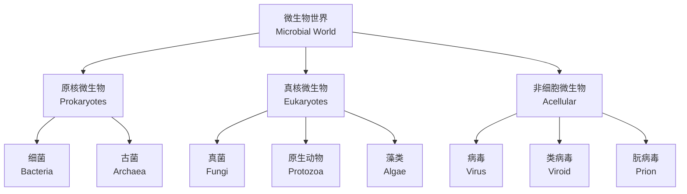
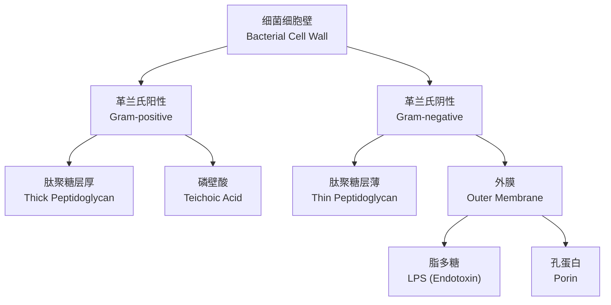

# 微生物形态与生理 (Microbial Morphology and Physiology)

## 1. 微生物概述 (Overview of Microorganisms)

微生物（Microorganism）是肉眼无法直接观察的微小生物体的统称，包括细菌（Bacteria）、古菌（Archaea）、真菌（Fungi）、原生动物（Protozoa）和病毒（Virus）。

## 2. 细菌形态 (Bacterial Morphology)

### 2.1 基本形态

| 形态 | 拉丁名 | 排列方式 | 示例菌属 |
|------|--------|---------|---------|
| 球菌（Coccus） | coccus (pl. cocci) | 单、双、链、四联、八叠、葡萄状 | *Staphylococcus* |
| 杆菌（Bacillus） | bacillus (pl. bacilli) | 单、链、栅栏状 | *Escherichia* |
| 螺旋菌（Spirillum） | spirillum (pl. spirilla) | 单个 | *Spirillum* |
| 弧菌（Vibrio） | vibrio (pl. vibrios) | 单个 | *Vibrio cholerae* |
| 螺杆菌（Helicobacter） | helicobacter | 螺旋状 | *Helicobacter pylori* |

### 2.2 细菌大小

细菌大小通常为0.5-5μm：

$$
V_{\text{球菌}} = \frac{4}{3}\pi r^3
$$

典型大肠杆菌（*E. coli*）大小约为1-2μm × 0.5μm。

### 2.3 细菌细胞壁结构

革兰染色（Gram Staining）的差异基于细胞壁结构：

- **革兰氏阳性（G⁺）**：肽聚糖层厚（20-80nm），保留结晶紫-碘复合物，呈紫色
- **革兰氏阴性（G⁻）**：肽聚糖层薄（2-7nm），有外膜，可被复染成红色

## 3. 古菌形态 (Archaeal Morphology)

古菌虽为原核生物，但在分子水平上更接近真核生物。

| 特征 | 细菌 | 古菌 | 真核生物 |
|------|------|------|---------|
| 核膜 | 无 | 无 | 有 |
| 细胞壁成分 | 肽聚糖（Peptidoglycan） | 假肽聚糖/其他 | 纤维素/几丁质 |
| 膜脂 | 酯键（Ester） | 醚键（Ether） | 酯键 |
| 核糖体 | 70S | 70S | 80S |

## 4. 真菌形态 (Fungal Morphology)

### 4.1 酵母菌 (Yeast)

酵母为单细胞真菌，通过出芽（Budding）繁殖：

$$
\text{母细胞} \rightarrow \text{芽痕} \rightarrow \text{子细胞}
$$

### 4.2 霉菌 (Mold)

霉菌由菌丝（Hypha）构成菌丝体（Mycelium）。

| 菌丝类型 | 特征 | 示例 |
|---------|------|------|
| 无隔菌丝（Coenocytic） | 无横隔，多核 | 毛霉（Mucor） |
| 有隔菌丝（Septate） | 有横隔，单核或多核 | 曲霉（Aspergillus） |

### 4.3 二相性真菌 (Dimorphic Fungi)

可在酵母相和菌丝相之间转换，与温度相关：

$$
25^\circ\text{C} \rightarrow \text{菌丝相 (Mold form)}
$$
$$
37^\circ\text{C} \rightarrow \text{酵母相 (Yeast form)}
$$

## 5. 微生物生理 (Microbial Physiology)

### 5.1 营养类型 (Nutritional Types)

根据碳源和能量来源分类：

| 营养类型 | 碳源 | 能源 | 电子供体 | 示例 |
|---------|------|------|---------|------|
| 光能自养（Photoautotroph） | CO₂ | 光 | H₂O/H₂S/H₂ | 蓝细菌、藻类 |
| 光能异养（Photoheterotroph） | 有机物 | 光 | 有机物 | 紫色非硫细菌 |
| 化能自养（Chemoautotroph） | CO₂ | 无机物氧化 | H₂S/NH₃/Fe²⁺ | 硝化细菌 |
| 化能异养（Chemoheterotroph） | 有机物 | 有机物氧化 | 有机物 | 大多数细菌、真菌 |

### 5.2 微生物生长曲线 (Growth Curve)

在分批培养（Batch Culture）中，细菌生长呈现典型四阶段曲线：

对数期生长速率：

$$
N_t = N_0 \times 2^n
$$

其中 $n$ 为世代数，倍增时间 $g = t / n$。

### 5.3 影响生长的环境因素

| 因素 | 分类 | 嗜极端微生物示例 |
|------|------|-----------------|
| 温度（Temperature） | 嗜冷菌（Psychrophile, <20°C） 嗜温菌（Mesophile, 20-45°C） 嗜热菌（Thermophile, 45-80°C） 超嗜热菌（Hyperthermophile, >80°C） | *Pyrolobus fumarii* (113°C) |
| pH | 嗜酸菌（Acidophile, pH<3） 嗜碱菌（Alkaliphile, pH>9） | *Ferroplasma* (pH 0-1) |
| 渗透压（Osmotic Pressure） | 嗜盐菌（Halophile） | *Halobacterium salinarum* |
| 氧气（Oxygen） | 专性需氧、微需氧、兼性厌氧、耐氧厌氧、专性厌氧 | 见下表 |

氧气关系：

| 类型 | 生长情况 | 代谢方式 |
|------|---------|---------|
| 专性需氧（Obligate Aerobe） | 仅在O₂存在时生长 | 有氧呼吸 |
| 微需氧（Microaerophile） | 低浓度O₂ | 有氧呼吸 |
| 兼性厌氧（Facultative Anaerobe） | 有/无O₂均可 | 有氧/无氧呼吸 |
| 专性厌氧（Obligate Anaerobe） | 仅在无O₂时生长 | 发酵/无氧呼吸 |

## 6. 微生物代谢 (Microbial Metabolism)

### 6.1 产能代谢 (Energy Metabolism)

| 代谢类型 | 最终电子受体 | 产物 | ATP产量 |
|---------|------------|------|---------|
| 有氧呼吸（Aerobic Respiration） | O₂ | H₂O | 36-38 ATP |
| 无氧呼吸（Anaerobic Respiration） | NO₃⁻/SO₄²⁻/CO₂ | N₂/H₂S/CH₄ | 2-36 ATP |
| 发酵（Fermentation） | 有机物中间体 | 乳酸/乙醇等 | 2 ATP |

糖酵解（Glycolysis）净产物：

$$
C_6H_{12}O_6 + 2NAD^+ + 2ADP \rightarrow 2C_3H_4O_3 + 2NADH + 2ATP
$$

### 6.2 次级代谢 (Secondary Metabolism)

次级代谢产物（Secondary Metabolite）在稳定期产生，包括抗生素（Antibiotic）、毒素（Toxin）和色素（Pigment）。

青霉素（Penicillin）由点青霉（*Penicillium notatum*）产生，抑制细菌细胞壁肽聚糖合成。

## 7. 微生物多样性 (Microbial Diversity)

### 7.1 极端微生物 (Extremophiles)

| 类型 | 生存环境 | 代表物种 |
|------|---------|---------|
| 嗜热菌 | 高温热泉 | *Thermus aquaticus* |
| 嗜冷菌 | 南极冰层 | *Polaromonas* |
| 嗜盐菌 | 盐湖 | *Halobacterium* |
| 嗜酸菌 | 酸性矿水 | *Acidithiobacillus* |
| 嗜压菌 | 深海 | *Shewanella* |

### 7.2 微生物共生 (Microbial Symbiosis)

| 关系 | 描述 | 示例 |
|------|------|------|
| 菌根（Mycorrhiza） | 真菌+植物根系 | 丛枝菌根（AMF） |
| 根瘤（Root Nodule） | 固氮菌+豆科植物 | *Rhizobium* |
| 地衣（Lichen） | 真菌+藻类/蓝细菌 |
| 肠道菌群（Gut Microbiota） | 细菌+动物肠道 | 大肠杆菌共生 |

## 8. 总结 (Summary)

微生物在形态上具有高度多样性，从球菌到螺旋菌，从单细胞酵母到多细胞霉菌。生理方面，微生物展现出惊人的代谢灵活性，能够在各种极端环境中生存。理解微生物形态与生理对医学、工业和环境科学具有重要意义。
