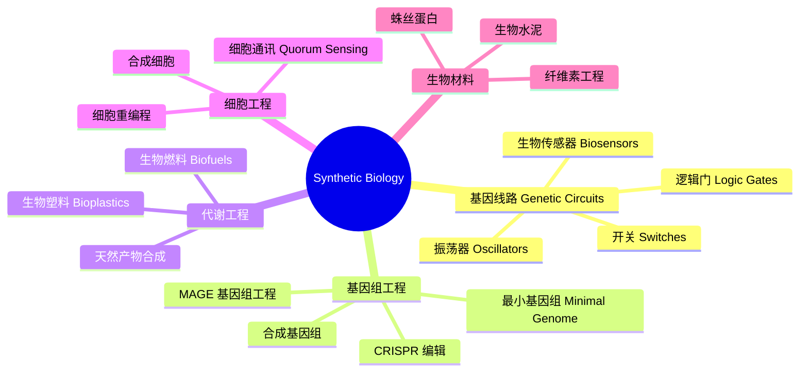

# SyntheticBiology

## 概述 (Overview)

合成生物学 (Synthetic Biology) 是设计和构建新的生物部件、装置和系统，或重新设计现有生物系统以实现有用目的的工程生物学分支。它结合分子生物学、工程学和计算机科学，致力于标准化生物部件的组装和复杂遗传电路的构建。

## 合成生物学体系

## 基因线路设计 (Genetic Circuit Design)

### 基本元件

标准生物部件 (BioBrick) 包括启动子 (Promoter)、核糖体结合位点 (RBS)、编码序列 (CDS) 和终止子 (Terminator)。转录调控的 Hill 方程：

$$\frac{dG}{dt} = \alpha \cdot \frac{K^n}{K^n + [R]^n} - \beta G$$

其中 $\alpha$ 是最大转录速率，$K$ 是解离常数，$n$ 是 Hill 系数，$\beta$ 是降解速率。

### 逻辑门

生物逻辑门输入输出通过转录因子调控实现：

- AND 门：双启动子协同调控
- OR 门：任一激活因子触发表达
- NOT 门：抑制因子阻遏转录
- NOR 门：任意输入抑制输出

$$Y = \overline{A + B} \quad \text{(NOR 门)}$$

## 振荡器 (Oscillators)

### 阻遏振荡器 (Repressilator)

三基因环形抑制网络产生周期性表达。Elowitz 的 repressilator 使用三个转录抑制因子：

$$\frac{dm_i}{dt} = -m_i + \frac{\alpha}{1 + p_j^n} + \alpha_0$$

$$\frac{dp_i}{dt} = -\beta(p_i - m_i)$$

周期 $T \approx 150$ 分钟，受生长速率和温度影响。

### 双稳态开关 (Bistable Switch)

互抑制网络产生双稳态。平衡条件：

$$\frac{dx}{dt} = \alpha_x\frac{1}{1 + y^n} - \beta_x x = 0$$

$$\frac{dy}{dt} = \alpha_y\frac{1}{1 + x^n} - \beta_y y = 0$$

当 $n > 1$ 且 $\alpha_x \neq \alpha_y$ 时存在两个稳定状态。

## 合成基因组 (Synthetic Genomes)

### 最小基因组

J. Craig Venter 研究所合成了最小细菌基因组 JCVI-syn3.0，仅 473 个基因。约 149 个基因功能未知但为生存必需。最小基因组的计算设计：

$$G_{\text{min}} = \{g_i : \text{essential}(g_i) = 1, \forall i\}$$

### 基因组合成

基因组从短寡核苷酸组装。Gibson 组装和 Golden Gate 组装是多片段拼接的常用方法。酵母人工染色体 (YAC) 承载大片段 DNA。

## 代谢工程 (Metabolic Engineering)

### 通路优化

MAGE (Multiplex Automated Genome Engineering) 并行编辑多个靶点。代谢通量的关键方程：

$$J = \frac{V_{\max}[S]}{K_m + [S]} \cdot \prod_i f_i$$

通量平衡分析 (Flux Balance Analysis, FBA) 使用线性规划预测代谢流量：

$$\max Z = c^T v$$
$$\text{s.t. } S \cdot v = 0$$
$$v_{\min} \leq v \leq v_{\max}$$

### 天然产物合成

酵母合成青蒿酸 (Artemisinic Acid) 是代谢工程的里程碑。途径包括甲羟戊酸途径和紫穗槐二烯合成酶 (Amorpha-4,11-diene Synthase)。

## CRISPR 技术 (CRISPR Technology)

### 基因编辑

Cas9 核酸酶在 gRNA 引导下切割目标 DNA：

$$P_{\text{cut}} = \frac{1}{1 + e^{-k(\text{score} - \theta)}}$$

CRISPRi 用于基因抑制，CRISPRa 用于基因激活。碱基编辑 (Base Editing) 实现 A→G 或 C→T 的单碱基转换。

### 基因驱动 (Gene Drive)

合成基因驱动能够迅速将基因传播到整个种群：

$$P_{\text{inheritance}} > 0.5 \rightarrow \text{群体固定}$$

## 细胞通讯与群体行为 (Cell-Cell Communication)

### 群体感应 (Quorum Sensing)

基于酰基高丝氨酸内酯 (AHL) 的群体感应系统。LuxI 合成 AHL，LuxR 结合 AHL 激活 lux 启动子：

$$[AHL]_{\text{threshold}} = \frac{K_m}{K_{cat}} \cdot \mu$$

其中 $\mu$ 是生长速率。

### 合成共生

工程细菌进行细胞间分工 (Division of Labor)。产电细菌 Shewanella 被工程化为生物传感器和生物燃料电池。哺乳动物细胞合成线路用于治疗应用。

## 生物安全与伦理 (Biosecurity & Ethics)

### 安全措施

- 营养缺陷型 (Auxotrophy)：依赖外源营养物
- 杀伤开关 (Kill Switch)：诱导性自杀模块
- 遗传屏障 (Genetic Barrier)：非标准氨基酸系统
- XNA：人工遗传物质替代 DNA

### 伦理考量

合成生物学的伦理框架包括生物安全、生物安保、生物剽窃 (Biopiracy) 和争议性应用。iGEM 竞赛内置了人类实践 (Human Practices) 环节。WHO 发布了合成生物学治理指南。

## 合成生物学工具与数据库

### 软件工具

| 工具 | 用途 |
|------|------|
| Benchling | 分子生物学设计 |
| Cello | 遗传电路自动化设计 |
| SnapGene | 质粒作图与模拟 |
| SBOL Designer | 标准生物部件设计 |
| COPASI | 生化系统模拟 |
| Biopython | 序列分析 |

### 生物部件数据库

- iGEM Registry: 标准生物部件库
- BioBricks Foundation: 开源部件标准
- Addgene: 质粒共享平台
- SynBioHub: 合成生物学设计存储库

## 合成细胞 (Synthetic Cells)

### 人工细胞

磷脂囊泡包裹转录翻译系统 (IVTT) 构建的最小细胞模型。脂质体尺寸控制：

$$R = \sqrt{\frac{3N_{\text{lipid}}a}{4\pi}}$$

其中 $a$ 是脂质分子头面积。

### 无细胞系统

无细胞蛋白合成 (CFPS) 快速体外表达蛋白质。优化的金黄色葡萄球菌裂解液提高表达产量。

## iGEM 竞赛 (iGEM Competition)

国际基因工程机器大赛 (International Genetically Engineered Machine) 是合成生物学领域最负盛名的学生竞赛。每年在 MIT 和巴黎举办决赛。代表性项目包括含羞草模拟植物、低温保存工程和重金属生物传感器。

## 合成生物学产业化 (Industrial Applications)

### 生物制造

- Amyris: 人工酵母合成法尼烯 (Farnesene)
- Ginkgo Bioworks: 定制微生物工厂
- Zymergen: 自动化菌株工程
- Impossible Foods: 大豆血红蛋白 (Leghemoglobin) 工程

### 农业与环境

- 固氮工程菌替代化肥
- 转基因蚊子控制疟疾传播
- 微生物塑料降解与生物修复
- 生物传感器用于环境监测

## 合成生物学在生物医学中的应用 (Medical Applications)

工程化 CAR-T 细胞治疗癌症。合成基因线路用于疾病诊断。可编程药物递送系统靶向肿瘤。合成疫苗平台 (mRNA 疫苗) 快速应对新发传染病。益生菌工程化用于肠道疾病治疗。

## 主要期刊 (Major Journals)

《ACS Synthetic Biology》、《Nature Communications Biology》、《Nature Chemical Biology》、《Synthetic Biology》、《Biotechnology Journal》、《Metabolic Engineering》、《Journal of Biological Engineering》。

## 相关条目

- [[../../../INDEX|当前目录索引]]
