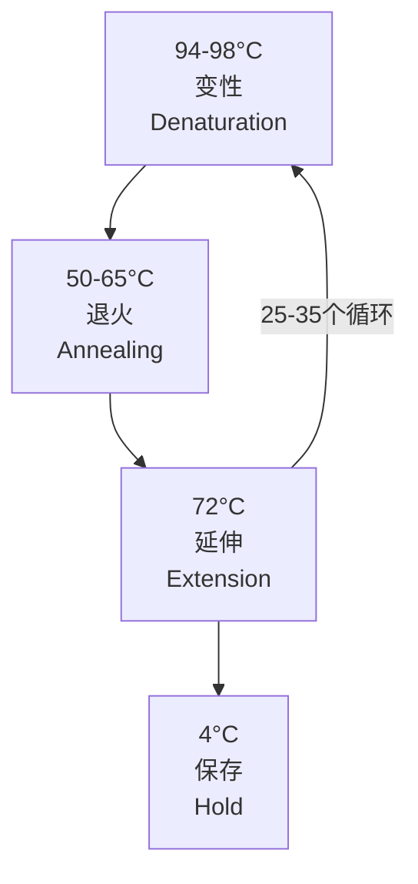
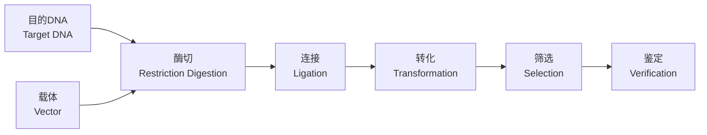
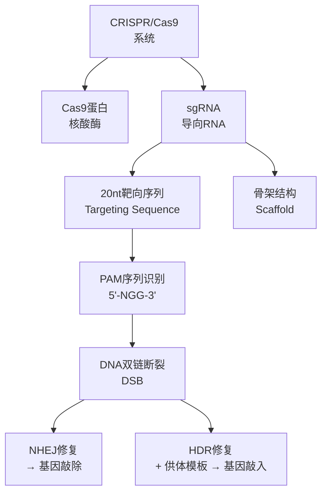
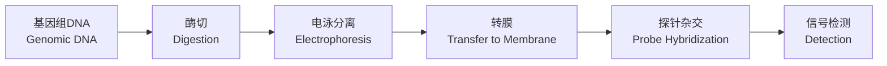

# 分子生物学技术 (Molecular Biology Techniques)

## 1. PCR技术 (Polymerase Chain Reaction)

PCR（聚合酶链式反应）由Kary Mullis在1983年发明，可在体外快速扩增特定DNA片段。

### 1.1 基本原理

PCR通过热循环（Thermal Cycling）实现DNA的指数扩增：

DNA扩增倍数：

$$
N = N_0 \times (1 + E)^n
$$

其中 $E$ 为扩增效率（通常0.8-1.0），$n$ 为循环数。

### 1.2 PCR组分

| 组分 | 功能 | 常用浓度 |
|------|------|---------|
| 模板DNA（Template DNA） | 待扩增序列 | 1-100ng |
| 引物（Primers） | 确定扩增边界 | 0.1-1μM |
| DNA聚合酶（DNA Polymerase） | 催化DNA合成 | 1-2.5U |
| dNTPs | 底物（A/T/C/G） | 200μM each |
| Mg²⁺ | 酶活性辅因子 | 1.5-3mM |
| 缓冲液（Buffer） | 提供适宜pH环境 | 1× |

### 1.3 PCR变体

| 类型 | 特点 | 应用 |
|------|------|------|
| 实时定量PCR（qPCR） | 荧光定量监测 | 基因表达定量 |
| 逆转录PCR（RT-PCR） | RNA→cDNA→扩增 | RNA病毒检测 |
| 巢式PCR（Nested PCR） | 两轮扩增 | 提高特异性 |
| 多重PCR（Multiplex PCR） | 多对引物同时扩增 | 病原体panel |
| 数字PCR（dPCR） | 绝对定量 | 稀有突变检测 |

qPCR定量分析采用 $C_t$ 值（Threshold Cycle）：

$$
\text{相对表达量} = 2^{-\Delta\Delta C_t}
$$

其中 $\Delta\Delta C_t = (C_{t,\text{靶标}} - C_{t,\text{内参}})_{\text{处理}} - (C_{t,\text{靶标}} - C_{t,\text{内参}})_{\text{对照}}$。

## 2. 分子克隆技术 (Molecular Cloning)

分子克隆是将目标DNA片段插入载体（Vector），在宿主细胞中扩增的过程。

### 2.1 克隆流程

### 2.2 限制性内切酶 (Restriction Enzymes)

限制性内切酶识别特定的DNA回文序列并切割。例如EcoRI：

$$
5'-G\downarrow AATTC-3'
$$
$$
3'-CTTAA\uparrow G-5'
$$

### 2.3 载体类型

| 载体 | 插入容量 | 宿主 | 用途 |
|------|---------|------|------|
| 质粒（Plasmid） | <10kb | *E. coli* | 基因克隆、表达 |
| 噬菌体（Phage λ） | 10-20kb | *E. coli* | 基因组文库 |
| 粘粒（Cosmid） | 30-45kb | *E. coli* | 大片段克隆 |
| BAC（Bacterial Artificial Chromosome） | 100-300kb | *E. coli* | 基因组测序 |
| YAC（Yeast Artificial Chromosome） | 100-2000kb | 酵母 | 超大片段克隆 |

### 2.4 筛选标记 (Selection Markers)

常用抗生素筛选标记：

| 抗生素 | 耐药基因 | 作用机制 |
|--------|---------|---------|
| 氨苄青霉素（Ampicillin） | bla (ampR) | 抑制细胞壁合成 |
| 卡那霉素（Kanamycin） | nptII | 抑制30S核糖体 |
| 氯霉素（Chloramphenicol） | cat | 抑制50S核糖体 |

蓝白斑筛选（Blue-White Screening）基于 $\beta$-半乳糖苷酶基因（$lacZ$）的α-互补原理。

## 3. DNA测序技术 (DNA Sequencing)

### 3.1 Sanger测序（第一代）

Sanger测序（链终止法）使用ddNTP终止DNA链延伸：

$$
\text{ddNTP} + \text{dNTP} \rightarrow \text{随机链终止}
$$

### 3.2 二代测序 (Next-Generation Sequencing, NGS)

| 平台 | 原理 | 读长 | 通量/run |
|------|------|------|---------|
| Illumina（SBS） | 边合成边测序 | 150-300bp×2 | 1-20Gb |
| Ion Torrent | 检测H⁺释放 | 200-400bp | 0.1-2Gb |
| MGI（DNBSEQ） | 纳米球+联合探针锚定 | 100-300bp×2 | 0.1-6Tb |

### 3.3 三代测序 (Third-Generation Sequencing)

| 平台 | 原理 | 读长 | 优点 |
|------|------|------|------|
| PacBio（SMRT） | 单分子实时测序 | 10-100kb | 长读长，无GC偏好 |
| Oxford Nanopore | 纳米孔电流变化 | 可达2Mb+ | 超长读长，便携 |

### 3.4 测序数据分析

碱基质量分数（Phred Quality Score）：

$$
Q = -10 \times \log_{10}(P)
$$

其中 $P$ 为错误概率，$Q=30$ 表示99.9%准确率。

## 4. CRISPR基因编辑 (CRISPR Gene Editing)

### 4.1 系统组成

CRISPR/Cas9系统由Cas9核酸酶和sgRNA（Single Guide RNA）组成：

### 4.2 编辑效率评估

基因编辑效率通过T7E1酶切或Sanger测序峰图评估：

$$
\text{编辑效率}(\%) = \frac{\text{编辑后序列峰面积}}{\text{总峰面积}} \times 100\%
$$

### 4.3 CRISPR衍生技术

| 技术 | 修饰的Cas蛋白 | 功能 |
|------|-------------|------|
| CRISPRi（干扰） | dCas9（失活） | 抑制基因转录 |
| CRISPRa（激活） | dCas9-VP64 | 激活基因转录 |
| Base Editing | Cas9-脱氨酶融合 | 单碱基替换 |
| Prime Editing | Cas9-逆转录酶 | 短序列替换 |

## 5. 印迹技术 (Blotting Techniques)

### 5.1 Southern印迹 (Southern Blot)

用于检测特定DNA序列，由Ed Southern发明：

### 5.2 Northern印迹 (Northern Blot)

用于检测特定RNA的表达水平：

$$
\text{表达水平} = \frac{\text{靶标条带信号}}{\text{内参条带信号}}
$$

### 5.3 Western印迹 (Western Blot)

用于检测特定蛋白，使用抗体进行免疫检测：

| 步骤 | 目的 | 时间 |
|------|------|------|
| 蛋白提取（Protein Extraction） | 获得总蛋白 | 30min |
| SDS-PAGE电泳 | 按分子量分离 | 1-2h |
| 转膜（Transfer） | 转移至PVDF膜 | 1-2h |
| 封闭（Blocking） | 减少非特异性结合 | 1h |
| 一抗孵育（Primary Antibody） | 特异结合靶蛋白 | 1h过夜 |
| 二抗孵育（Secondary Antibody） | 信号放大 | 1h |
| 显影（Detection） | 可视化 | 5-30min |

## 6. 核酸杂交技术 (Nucleic Acid Hybridization)

### 6.1 荧光原位杂交 (FISH)

使用荧光标记探针在细胞或组织切片中定位特定核酸序列。

### 6.2 基因芯片 (Microarray)

高通量检测基因表达或基因型，探针密度可达百万级。

## 7. 重组蛋白表达 (Recombinant Protein Expression)

| 表达系统 | 优点 | 缺点 |
|---------|------|------|
| *E. coli* | 产量高、成本低 | 无翻译后修饰 |
| 酵母（*Pichia pastoris*） | 可糖基化 | 糖型与人不同 |
| 昆虫细胞（Sf9） | 接近真核修饰 | 培养成本高 |
| 哺乳动物细胞（CHO） | 人源化修饰 | 产量较低 |

## 8. 总结 (Summary)

PCR技术实现了DNA的体外快速扩增，分子克隆使基因操作成为可能，测序技术揭示了遗传信息的细节，CRISPR提供了精准的基因编辑工具，印迹技术实现了核酸和蛋白的特异性检测。这些技术共同构成了现代分子生物学的方法学基础。
