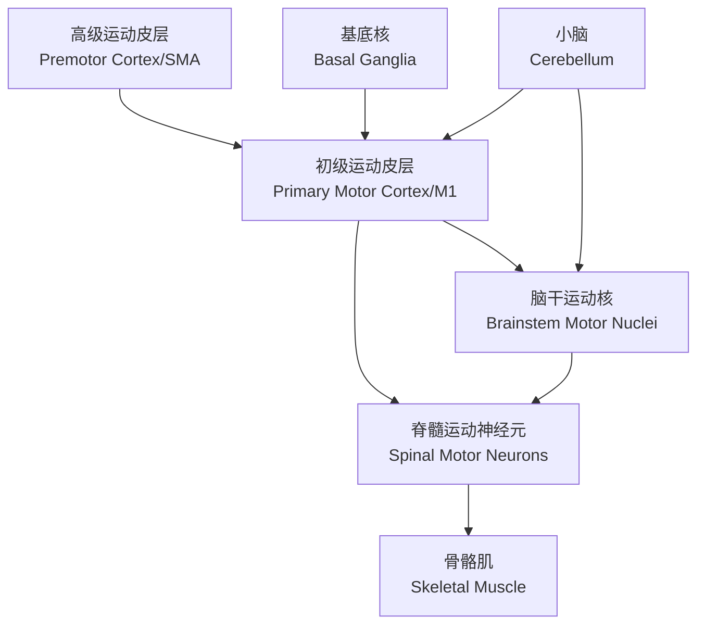

---
aliases:
  - 感觉系统
  - 运动系统
  - 感觉受体
  - 运动皮层
  - Sensory System
  - Motor System
  - Sensory Receptors
  - Motor Cortex
tags:
  - neuroscience
  - sensory-system
  - motor-system
  - somatosensory
  - motor-control
  - reflex
---

# 感觉与运动系统

## 1 感觉系统概述

**感觉系统**（Sensory System）负责检测内外环境刺激并产生感觉。每种感觉系统都包含四个基本组成部分：

1. **刺激**（Stimulus）
2. **感受器**（Receptor）
3. **传导通路**（Conduction Pathway）
4. **感觉皮层**（Sensory Cortex）

## 2 感觉感受器

### 2.1 感受器的分类

| 分类依据 | 类型 | 英文 | 例子 |
|----------|------|------|------|
| 刺激来源 | 外感受器 | Exteroceptor | 皮肤感受器 |
| 刺激来源 | 内感受器 | Interoceptor | 内脏感受器 |
| 刺激来源 | 本体感受器 | Proprioceptor | 肌梭 |
| 刺激性质 | 机械感受器 | Mechanoreceptor | 触觉、压力 |
| 刺激性质 | 温度感受器 | Thermoreceptor | 冷热 |
| 刺激性质 | 伤害感受器 | Nociceptor | 疼痛 |
| 刺激性质 | 光感受器 | Photoreceptor | 视觉 |
| 刺激性质 | 化学感受器 | Chemoreceptor | 味觉、嗅觉 |

### 2.2 感受器电位

感觉刺激引起感受器细胞膜电位变化，称为 **感受器电位**（Receptor Potential）。当感受器电位达到阈值时，触发动作电位。

$$ V_{receptor} = \frac{I_{stim}}{g_m} $$

其中 $V_{receptor}$ 为感受器电位，$I_{stim}$ 为刺激电流，$g_m$ 为膜电导。

## 3 体感系统

### 3.1 触觉通路

精细触觉和本体感觉通过 **后索-内侧丘系通路**（Dorsal Column-Medial Lemniscal Pathway）传递：

### 3.2 痛温觉通路

痛觉和温度觉通过 **脊髓丘脑通路**（Spinothalamic Tract）传递。

### 3.3 体感皮层定位

**彭菲尔德地图**（Penfield Map）显示体感皮层的 **躯体拓扑定位**（Somatotopic Organization）。身体各部位在皮层上的代表区大小与感觉敏感度成正比。

## 4 视觉系统

### 4.1 视网膜结构

视网膜包含五类主要神经元：

1. **光感受器**（Photoreceptors）：视杆细胞（Rods）和视锥细胞（Cones）
2. **双极细胞**（Bipolar Cells）
3. **神经节细胞**（Ganglion Cells）
4. **水平细胞**（Horizontal Cells）
5. **无长突细胞**（Amacrine Cells）

### 4.2 视觉通路

$$ \text{视网膜} \rightarrow \text{视神经} \rightarrow \text{视交叉} \rightarrow \text{视束} \rightarrow \text{外侧膝状体} \rightarrow \text{视放射} \rightarrow \text{初级视皮层 (V1)} $$

## 5 听觉系统

### 5.1 耳的结构

- **外耳**（Outer Ear）：耳廓和外耳道
- **中耳**（Middle Ear）：鼓膜、听小骨（锤骨、砧骨、镫骨）
- **内耳**（Inner Ear）：耳蜗（Cochlea）

### 5.2 听觉传导通路

声波引起基底膜振动，使毛细胞（Hair Cells）纤毛弯曲，产生感受器电位。毛细胞将机械信号转换为电信号。

## 6 嗅觉与味觉

### 6.1 嗅觉系统

嗅觉感受器细胞位于鼻腔上部的嗅上皮中。人类有约 400 种功能性嗅觉受体基因。

### 6.2 味觉系统

五种基本味觉：

- **甜**（Sweet）：糖类
- **咸**（Salty）：钠离子
- **酸**（Sour）：氢离子
- **苦**（Bitter）：多种毒素
- **鲜**（Umami）：谷氨酸

## 7 运动系统

### 7.1 运动系统的层级结构

### 7.2 初级运动皮层

**初级运动皮层**（Primary Motor Cortex, M1）位于中央前回（Brodmann 4 区）。其躯体拓扑定位图是 **运动侏儒**（Motor Homunculus）。

### 7.3 上运动神经元与下运动神经元

| 类型 | 英文 | 位置 | 功能 |
|------|------|------|------|
| 上运动神经元 | Upper Motor Neuron | 皮层和脑干 | 发起运动指令 |
| 下运动神经元 | Lower Motor Neuron | 脊髓前角和脑神经核 | 直接支配肌肉 |

## 8 脊髓反射

### 8.1 牵张反射

**牵张反射**（Stretch Reflex）是最简单的脊髓反射：

$$ \text{肌梭拉伸} \rightarrow \text{Ia 传入纤维} \rightarrow \alpha\text{运动神经元} \rightarrow \text{肌肉收缩} $$

### 8.2 屈肌反射

**屈肌反射**（Flexor Reflex）对伤害性刺激产生防御性退缩反应。

## 9 小脑与基底核

### 9.1 小脑功能

- 运动协调与精细调节
- 运动学习与适应
- 平衡和姿势控制

### 9.2 基底核功能

**基底核**（Basal Ganglia）包括纹状体、苍白球、黑质和丘脑底核。其功能包括：

- 运动选择与启动
- 抑制不想要的运动
- 奖赏相关学习

## 9 前庭系统

**前庭系统**（Vestibular System）位于内耳：**半规管**（Semicircular Canals）检测角加速度，**椭圆囊和球囊**（Utricle & Saccule）检测线加速度。**前庭-眼反射**（VOR）在头部运动时稳定视线。

## 10 运动单位与肌肉收缩

### 10.1 运动单位

**运动单位**（Motor Unit）由一个 $\alpha$ 运动神经元及其支配的全部肌纤维组成：

| 类型 | 英文 | 收缩速度 | 耐力 | 用途 |
|------|------|----------|------|------|
| 慢肌 | Slow (S) | 慢 | 高 | 姿势维持 |
| 快肌抗疲劳 | Fast Fatigue-Resistant (FR) | 快 | 中 | 有氧运动 |
| 快肌易疲劳 | Fast Fatigable (FF) | 快 | 低 | 爆发力动作 |

### 10.2 大小原则

**亨尼曼大小原则**（Henneman's Size Principle）指出运动神经元的募集顺序遵循由小到大的规律：慢肌单位先被募集，快肌单位在需要更大力量时才被募集。

## 11 运动学习

**运动学习**（Motor Learning）涉及新运动技能的形成和完善。其阶段包括：

1. **认知阶段**（Cognitive Stage）：理解任务，动作不协调
2. **关联阶段**（Associative Stage）：优化运动策略，减少错误
3. **自主阶段**（Autonomous Stage）：自动化执行，无需有意识控制

### 11.1 运动学习的神经机制

- 小脑参与 **误差学习**（Error-Based Learning）
- 基底核参与 **强化学习**（Reinforcement Learning）
- 运动皮层参与 **序列学习**（Sequence Learning）

## 12 感觉-运动整合

### 12.1 多感觉整合

**多感觉整合**（Multisensory Integration）将不同感觉通道信息整合为统一感知。**腹语效应**（Ventriloquism Effect）是视觉和听觉的空间整合。

### 12.2 感觉运动反馈

运动皮层接收体感、视觉和前庭系统的反馈信息，实现闭环运动控制。

### 12.3 内部模型

**内部模型**（Internal Model）包括 **前向模型**（预测运动后果）和 **逆模型**（计算运动指令）。

## 13 运动障碍

| 疾病 | 英文 | 病理 | 症状 |
|------|------|------|------|
| 帕金森病 | Parkinson's | 黑质多巴胺缺失 | 运动减少、僵直 |
| 亨廷顿病 | Huntington's | 纹状体萎缩 | 舞蹈样动作 |
| 小脑共济失调 | Cerebellar Ataxia | 小脑损伤 | 运动不协调 |

## 14 康复与神经可塑性

神经损伤后通过康复训练诱导突触重塑和功能重组。**镜像疗法**（Mirror Therapy）和 **运动想象**（Motor Imagery）是常用技术。
