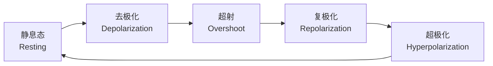

---
aliases:
  - 神经元
  - 突触
  - 动作电位
  - 神经递质
  - Neuron
  - Synapse
  - Action Potential
  - Neurotransmitter
tags:
  - neuroscience
  - neuron
  - synapse
  - electrophysiology
  - synaptic-plasticity
  - neurotransmission
---

# 神经元与突触传递

## 1 神经元的结构

**神经元**（Neuron）是神经系统的结构和功能单位。其基本结构包括：

- **胞体**（Soma）：含有细胞核和细胞器
- **树突**（Dendrites）：接收来自其他神经元的信息
- **轴突**（Axon）：将信息传递给其他细胞
- **轴突终末**（Axon Terminals）：释放神经递质

### 1.1 神经元的分类

| 分类标准 | 类型 | 英文 | 特征 |
|----------|------|------|------|
| 结构 | 单极神经元 | Unipolar | 一个突起 |
| 结构 | 双极神经元 | Bipolar | 两个突起 |
| 结构 | 多极神经元 | Multipolar | 多个突起 |
| 功能 | 感觉神经元 | Sensory Neuron | 传入信息 |
| 功能 | 运动神经元 | Motor Neuron | 传出信息 |
| 功能 | 中间神经元 | Interneuron | 局部连接 |

## 2 静息膜电位

**静息膜电位**（Resting Membrane Potential）约为 $-70 \, \text{mV}$。其形成机制如下：

$$ V_m = \frac{RT}{F} \ln \left( \frac{P_K[K^+]_o + P_{Na}[Na^+]_o + P_{Cl}[Cl^-]_i}{P_K[K^+]_i + P_{Na}[Na^+]_i + P_{Cl}[Cl^-]_o} \right) $$

这是 **Goldman-Hodgkin-Katz 方程**（GHK Equation），其中 $P$ 为通透性，$[ ]_o$ 和 $[ ]_i$ 分别为细胞外和细胞内离子浓度。

### 2.1 离子浓度梯度

| 离子 | 细胞内浓度 (mM) | 细胞外浓度 (mM) | 平衡电位 (mV) |
|------|---------------|---------------|--------------|
| $K^+$ | 140 | 5 | $-89$ |
| $Na^+$ | 15 | 150 | $+60$ |
| $Ca^{2+}$ | 0.0001 | 2 | $+125$ |
| $Cl^-$ | 10 | 110 | $-68$ |

## 3 动作电位

**动作电位**（Action Potential, AP）是神经元快速、可逆的膜电位变化。

### 3.1 动作电位的离子机制

1. **去极化阶段**：电压门控 $Na^+$ 通道快速开放，$Na^+$ 内流
2. **复极化阶段**：$Na^+$ 通道失活，电压门控 $K^+$ 通道开放，$K^+$ 外流
3. **超极化阶段**：$K^+$ 通道持续开放，膜电位低于静息电位
4. **不应期**：
   - 绝对不应期（Absolute Refractory Period）：$Na^+$ 通道失活，无法产生新 AP
   - 相对不应期（Relative Refractory Period）：需要更强的刺激才能产生 AP

### 3.2 动作电位的传导

**跳跃传导**（Saltatory Conduction）发生在有髓鞘的轴突上，动作电位在 **郎飞结**（Nodes of Ranvier）之间跳跃传导，大大提高了传导速度。

$$ v \propto \sqrt{\frac{d}{\rho C_m}} $$

其中 $v$ 为传导速度，$d$ 为轴突直径，$\rho$ 为轴浆电阻率，$C_m$ 为膜电容。

## 4 突触传递

### 4.1 突触的分类

| 类型 | 英文 | 传递方式 |
|------|------|----------|
| 化学突触 | Chemical Synapse | 神经递质介导 |
| 电突触 | Electrical Synapse | 缝隙连接直接传递 |

### 4.2 化学突触传递过程

1. 动作电位到达轴突终末
2. 电压门控 $Ca^{2+}$ 通道开放，$Ca^{2+}$ 内流
3. 突触囊泡与突触前膜融合
4. 神经递质释放到突触间隙
5. 神经递质与突触后膜受体结合
6. 突触后电位产生
7. 神经递质失活或重摄取

### 4.3 突触后电位

- **兴奋性突触后电位**（Excitatory Postsynaptic Potential, EPSP）：去极化
- **抑制性突触后电位**（Inhibitory Postsynaptic Potential, IPSP）：超极化

突触整合（Synaptic Integration）是多个突触后电位的总和：

$$ V_{total} = \sum_{i=1}^{n} EPSP_i + \sum_{j=1}^{m} IPSP_j $$

## 5 神经递质系统

### 5.1 小分子神经递质

| 递质 | 英文 | 主要功能 |
|------|------|----------|
| 谷氨酸 | Glutamate | 主要兴奋性递质 |
| GABA | $\gamma$-氨基丁酸 | 主要抑制性递质 |
| 乙酰胆碱 | Acetylcholine (ACh) | 神经肌肉接头 |
| 多巴胺 | Dopamine (DA) | 奖赏与运动 |
| 5-羟色胺 | Serotonin (5-HT) | 情绪调节 |
| 去甲肾上腺素 | Norepinephrine (NE) | 觉醒与应激 |

### 5.2 神经肽类递质

| 神经肽 | 英文 | 功能 |
|--------|------|------|
| 内啡肽 | Endorphins | 镇痛与奖赏 |
| 物质 P | Substance P | 疼痛传递 |
| 促肾上腺皮质激素释放激素 | CRH | 应激反应 |

## 6 突触可塑性

**突触可塑性**（Synaptic Plasticity）是突触传递效能可调节的特性，是学习和记忆的神经基础。

### 6.1 长时程增强

**长时程增强**（Long-Term Potentiation, LTP）是高频刺激导致突触传递持续增强的现象。海马 CA1 区的 LTP 依赖 NMDA 受体：

$$ \text{LTP}: \Delta EPSP \propto \sum_{t} [Ca^{2+}]_i(t) $$

### 6.2 长时程抑制

**长时程抑制**（Long-Term Depression, LTD）是低频刺激导致突触传递持续减弱的现象。

## 7 离子通道

### 7.1 电压门控离子通道

**电压门控离子通道**（Voltage-Gated Ion Channels）对膜电位变化敏感：$Na_V$ 通道（激活 $-55\ \text{mV}$）产生动作电位上升支，$K_V$ 通道（激活 $-40\ \text{mV}$）产生下降支，$Ca_V$ 通道参与递质释放。

### 7.2 配体门控离子通道

**配体门控离子通道**（Ligand-Gated Ion Channels）直接由神经递质激活：AMPA 受体介导快速兴奋，NMDA 受体为 $Ca^{2+}$ 通透且双门控，GABA$_A$ 受体介导快速抑制，nAChR 在神经肌肉接头传递兴奋。

## 8 第二信使系统

### 7.1 离子通道型受体

**离子通道型受体**（Ionotropic Receptors）直接控制离子通道的开关，反应快速（毫秒级）。例如：AMPA 受体、NMDA 受体、nAChR、GABA$_A$ 受体。

### 7.2 代谢型受体

**代谢型受体**（Metabotropic Receptors）通过 G 蛋白和第二信使系统发挥作用，反应较慢但效应持久。例如：mGluR、GABA$_B$ 受体、多巴胺受体。

## 9 神经递质受体

### 9.1 离子通道型受体

**离子通道型受体**（Ionotropic Receptors）直接控制离子通道的开关，反应快速（毫秒级）。例如：AMPA 受体、NMDA 受体、nAChR、GABA$_A$ 受体。

### 9.2 代谢型受体

**代谢型受体**（Metabotropic Receptors）通过 G 蛋白和第二信使系统发挥作用，反应较慢但效应持久。例如：mGluR、GABA$_B$ 受体、多巴胺受体。

### 9.3 受体脱敏

**受体脱敏**（Receptor Desensitization）是持续暴露于配体时受体反应性下降的现象。这是突触稳态调节的重要机制。

## 10 胶质细胞

### 10.1 星形胶质细胞

**星形胶质细胞**（Astrocytes）在中枢神经系统中承担多项功能：

- 维持离子稳态（$K^+$ 缓冲）
- 摄取和代谢神经递质（谷氨酸-谷氨酰胺循环）
- 营养支持
- 构成血脑屏障的一部分
- 调节突触传递（**三方突触** Tripartite Synapse 假说）

### 10.2 少突胶质细胞

**少突胶质细胞**（Oligodendrocytes）在 CNS 中形成髓鞘。一个少突胶质细胞可以包裹多个轴突节段。髓鞘的 **跳跃传导**（Saltatory Conduction）将传导速度提升至 $50\ \text{m/s}$ 以上。

### 10.3 小胶质细胞

**小胶质细胞**（Microglia）是 CNS 的常驻免疫细胞，参与：

- 突触修剪（Synaptic Pruning）
- 病原体清除
- 损伤修复
- 神经炎症反应

## 11 神经回路

### 11.1 基本回路类型

神经元通过突触连接形成 **神经回路**（Neural Circuits）。基本回路类型包括：

| 回路类型 | 英文 | 功能 |
|----------|------|------|
| 前馈回路 | Feedforward Circuit | 信号放大与汇聚 |
| 反馈回路 | Feedback Circuit | 振荡与稳定 |
| 侧抑制回路 | Lateral Inhibition | 对比增强 |
| 汇聚回路 | Convergent Circuit | 不同来源信息的整合 |
| 发散回路 | Divergent Circuit | 信号广播 |

### 11.2 中枢模式发生器

**中枢模式发生器**（Central Pattern Generator, CPG）是能产生节律性运动输出的神经回路，不依赖感觉反馈即可维持节律活动。例如：呼吸、咀嚼和行走的中枢模式发生器。

## 12 突触传递的调节

### 12.1 突触前抑制与易化

- **突触前抑制**（Presynaptic Inhibition）：通过 GABA$_B$ 受体减少 $Ca^{2+}$ 内流，减少递质释放
- **突触前易化**（Presynaptic Facilitation）：通过增加 $Ca^{2+}$ 内流增强递质释放

### 12.2 突触后调节

- 受体磷酸化改变通道电导
- 受体数量的上调或下调
- 受体亚基组成的变化

## 13 结论

神经元和突触传递构成了神经系统功能的基础。从静息电位到动作电位的产生，从化学突触传递到突触可塑性，从离子通道到胶质细胞，这些机制共同支撑着感觉、运动、学习和记忆等复杂脑功能。理解这些基本过程是探索神经系统奥秘的起点。
