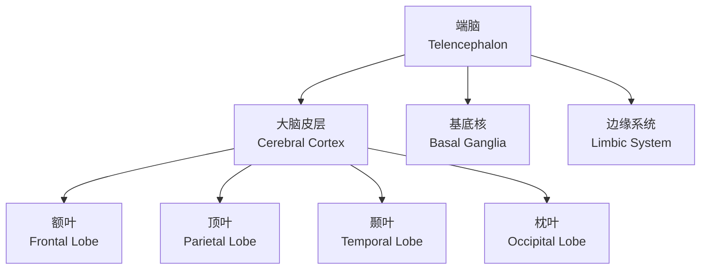
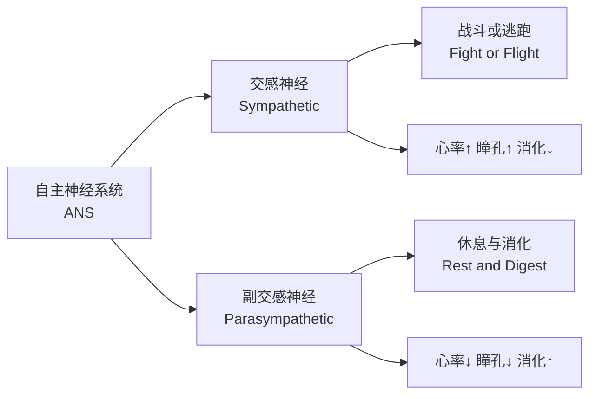

---
aliases:
  - 神经系统
  - 中枢神经系统
  - 周围神经系统
  - Nervous System
  - CNS
  - PNS
tags:
  - neuroscience
  - neuroanatomy
  - nervous-system
  - brain
  - spinal-cord
---

# 神经系统的结构与功能

## 1 神经系统概述

**神经系统**（Nervous System）是人体最复杂的系统，负责接收、处理和传递信息。它主要分为两大部分：

- **中枢神经系统**（Central Nervous System, CNS）：脑和脊髓
- **周围神经系统**（Peripheral Nervous System, PNS）：神经和神经节

### 1.1 神经系统的功能

1. **感觉功能**（Sensory Function）：接收内外环境刺激
2. **整合功能**（Integrative Function）：分析和解释感觉信息
3. **运动功能**（Motor Function）：产生和传递运动指令

## 2 中枢神经系统

### 2.1 大脑的结构

#### 2.1.1 大脑皮层分区

**布罗德曼分区**（Brodmann Areas）根据细胞构筑将大脑皮层分为 52 个区域：

| 区域编号 | 名称 | 功能 |
|----------|------|------|
| BA 4 | 初级运动皮层 | 随意运动控制 |
| BA 17 | 初级视皮层 | 视觉信息处理 |
| BA 41-42 | 初级听皮层 | 听觉信息处理 |
| BA 44-45 | 布罗卡区 | 语言产生 |
| BA 22 | 韦尼克区 | 语言理解 |

### 2.2 间脑

**间脑**（Diencephalon）包括：

- **丘脑**（Thalamus）：感觉信息的中继站
- **下丘脑**（Hypothalamus）：调节自主神经、体温、饥饿、口渴
- **上丘脑**（Epithalamus）：包含松果体，调节昼夜节律
- **底丘脑**（Subthalamus）：参与运动控制

### 2.3 脑干

脑干由三部分组成：

1. **中脑**（Midbrain）：视觉和听觉反射
2. **脑桥**（Pons）：连接大脑与小脑
3. **延髓**（Medulla Oblongata）：调节呼吸、心跳、消化

### 2.4 小脑

**小脑**（Cerebellum）参与：

- 运动协调与平衡
- 运动学习
- 精细运动控制

$$ \text{小脑功能} = f(\text{协调}, \text{平衡}, \text{运动学习}) $$

### 2.5 脊髓

**脊髓**（Spinal Cord）的结构和功能：

- 灰质（Gray Matter）：神经元胞体聚集区
- 白质（White Matter）：轴突束聚集区
- 上行传导束（Ascending Tracts）：传递感觉信息
- 下行传导束（Descending Tracts）：传递运动信息

## 3 周围神经系统

### 3.1 躯体神经系统

**躯体神经系统**（Somatic Nervous System）支配骨骼肌，受意识控制。它包含：

- 感觉神经元（Sensory Neurons）：将信息从感受器传递至 CNS
- 运动神经元（Motor Neurons）：将指令从 CNS 传递至效应器

### 3.2 自主神经系统

**自主神经系统**（Autonomic Nervous System, ANS）调节内脏功能，不受意识控制。

#### 3.2.1 自主神经递质

| 系统 | 节前纤维递质 | 节后纤维递质 |
|------|------------|------------|
| 交感神经 | 乙酰胆碱（ACh） | 去甲肾上腺素（NE） |
| 副交感神经 | 乙酰胆碱（ACh） | 乙酰胆碱（ACh） |

### 3.3 肠神经系统

**肠神经系统**（Enteric Nervous System, ENS）被称为"第二大脑"，包含约 5 亿个神经元，独立调控胃肠功能。

## 4 脑室系统与脑脊液

脑室系统包含四个脑室：

1. 侧脑室（Lateral Ventricles）
2. 第三脑室（Third Ventricle）
3. 中脑导水管（Cerebral Aqueduct）
4. 第四脑室（Fourth Ventricle）

**脑脊液**（Cerebrospinal Fluid, CSF）由脉络丛产生，提供机械保护、营养运输和废物清除。

## 5 脑的血液供应

- **前循环**：颈内动脉系统供应大脑前部和中部
- **后循环**：椎基底动脉系统供应大脑后部、脑干和小脑

**Willis 环**（Circle of Willis）是大脑底部的动脉吻合环，提供侧支循环通路。

## 6 神经系统的保护结构

### 6.1 脑膜

三层脑膜保护脑和脊髓：

1. **硬脑膜**（Dura Mater）：最外层，坚韧
2. **蛛网膜**（Arachnoid Mater）：中间层，蛛网膜下腔含有 CSF
3. **软脑膜**（Pia Mater）：最内层，紧贴脑表面

### 6.2 血脑屏障

**血脑屏障**（Blood-Brain Barrier, BBB）由脑毛细血管内皮细胞的紧密连接形成，选择性限制物质进入脑组织。

## 7 神经系统的发育

- **神经管**（Neural Tube）在第 3-4 周形成
- 前脑泡分化成端脑和间脑
- 中脑泡发育为中脑
- 后脑泡分化成脑桥和小脑

## 8 神经系统疾病

- **阿尔茨海默病**（Alzheimer's Disease）：进行性神经退行性疾病
- **帕金森病**（Parkinson's Disease）：黑质多巴胺能神经元变性
- **多发性硬化**（Multiple Sclerosis）：髓鞘脱失
- **脑卒中**（Stroke）：脑血流中断导致的神经功能缺损

## 9 脑神经

### 9.1 十二对脑神经

| 编号 | 名称 | 英文 | 功能类型 | 主要功能 |
|------|------|------|----------|----------|
| I | 嗅神经 | Olfactory | 感觉 | 嗅觉 |
| II | 视神经 | Optic | 感觉 | 视觉 |
| III | 动眼神经 | Oculomotor | 运动 | 眼球运动 |
| IV | 滑车神经 | Trochlear | 运动 | 眼球下转 |
| V | 三叉神经 | Trigeminal | 混合 | 面部感觉与咀嚼 |
| VI | 外展神经 | Abducens | 运动 | 眼球外展 |
| VII | 面神经 | Facial | 混合 | 面部表情与味觉 |
| VIII | 前庭蜗神经 | Vestibulocochlear | 感觉 | 听觉与平衡 |
| IX | 舌咽神经 | Glossopharyngeal | 混合 | 咽部感觉与运动 |
| X | 迷走神经 | Vagus | 混合 | 内脏感觉与运动 |
| XI | 副神经 | Accessory | 运动 | 肩部肌肉 |
| XII | 舌下神经 | Hypoglossal | 运动 | 舌部运动 |

## 10 神经系统的发育

### 10.1 神经管形成

**神经管**（Neural Tube）在第 3-4 周通过神经板折叠形成。前神经孔和后神经孔的闭合过程至关重要——闭合失败分别导致无脑畸形（Anencephaly）和脊柱裂（Spina Bifida）。

### 10.2 前脑发育

前脑泡分化成端脑和间脑，端脑进一步发育成大脑半球。大脑皮层在胚胎期的发育遵循 **由内向外**（Inside-Out）原则：

1. 室周区（Ventricular Zone）产生神经元
2. 神经元沿放射状胶质细胞迁移
3. 早期形成的神经元位于深层，晚期形成的神经元位于浅层

### 10.3 髓鞘形成

**髓鞘形成**（Myelination）从胚胎期开始，持续到成年早期。前额叶皮层的髓鞘化最晚完成（约 25 岁），这与执行功能的成熟时间一致。

## 11 自主神经的高级调控

### 11.1 下丘脑的整合功能

下丘脑是自主神经系统的最高整合中枢，调节：

- **体温调节**（Thermoregulation）：通过血管舒缩和寒战反应
- **摄食行为**（Feeding Behavior）：饥饿和饱腹感中枢
- **水平衡**（Water Balance）：渗透压感受器和抗利尿激素调节
- **昼夜节律**（Circadian Rhythm）：视交叉上核的主时钟

### 11.2 杏仁核与情绪

**杏仁核**（Amygdala）是边缘系统的关键结构，参与恐惧学习和情绪记忆。其与下丘脑和脑干的连接使情绪状态能够影响自主神经活动。

## 12 神经内分泌系统

### 12.1 下丘脑-垂体轴

**下丘脑-垂体轴**（Hypothalamic-Pituitary Axis）是神经内分泌系统的核心，调控 GH、TSH、ACTH、FSH、LH 以及催产素和抗利尿激素的释放。

### 12.2 应激轴

**下丘脑-垂体-肾上腺轴**（HPA Axis）调节应激反应：

$$ \text{CRH} \rightarrow \text{ACTH} \rightarrow \text{皮质醇} $$

## 14 神经可塑性

**神经可塑性**（Neuroplasticity）是神经系统在结构上和功能上适应变化的能力，体现在发育、学习和损伤修复过程中。主要包括两种类型：
- **突触可塑性**（Synaptic Plasticity）：突触连接强度的改变
- **结构可塑性**（Structural Plasticity）：树突棘和轴突结构的重塑
