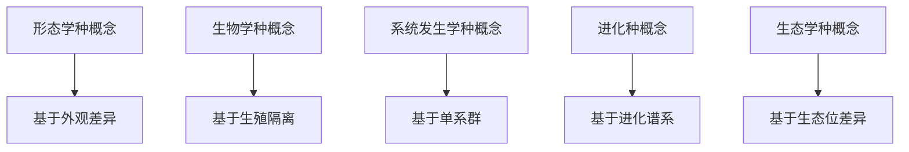
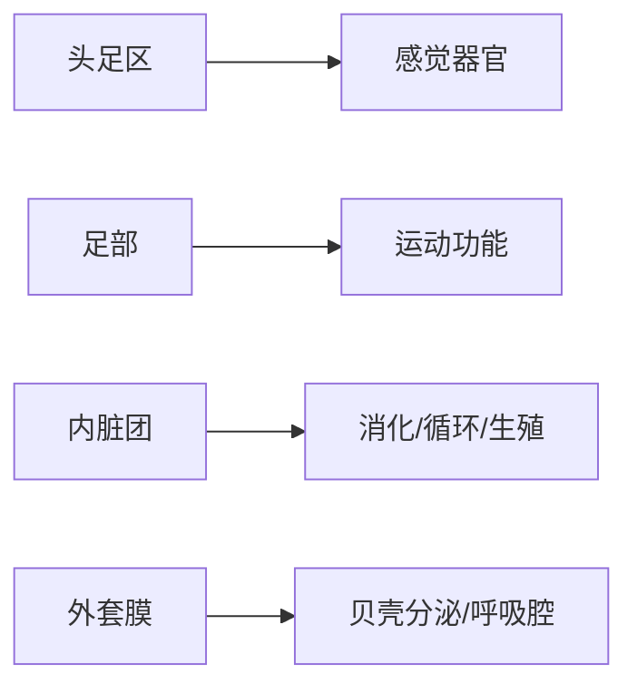

---
aliases:
  - 动物分类学
  - 系统发生学
  - 动物进化
tags:
  - biology
  - zoology
  - taxonomy
  - evolution
  - phylogeny
---

# 动物分类与进化 (Animal Classification and Evolution)

## 1 概述 (Overview)

动物分类学 (Taxonomy) 是识别、描述和命名动物物种的科学。系统发生学 (Phylogenetics) 则研究物种之间的进化关系。两者共同构成了理解动物多样性的框架。

## 2 分类学基础 (Foundations of Taxonomy)

### 2.1 林奈分类体系 (Linnaean Hierarchy)

| 等级 | 拉丁名后缀 | 举例: 智人 |
|------|-----------|-----------|
| 界 (Kingdom) | — | Animalia |
| 门 (Phylum) | — | Chordata |
| 纲 (Class) | — | Mammalia |
| 目 (Order) | — | Primates |
| 科 (Family) | -idae | Hominidae |
| 属 (Genus) | — | Homo |
| 种 (Species) | — | Homo sapiens |

### 2.2 双名法 (Binomial Nomenclature)

物种学名格式为 `Genus species`，如 *Canis lupus*（灰狼）。命名遵循国际动物命名法规 (International Code of Zoological Nomenclature, ICZN)。

### 2.3 分类学概念 (Taxonomic Concepts)

## 3 系统发生学 (Phylogenetics)

### 3.1 支序分类学 (Cladistics)

单系群 (Monophyletic Group / Clade) 包含共同祖先及其所有后代。并系群 (Paraphyletic Group) 包含共同祖先但缺失部分后代。复系群 (Polyphyletic Group) 不含最近共同祖先。

### 3.2 构建系统发生树 (Building Phylogenetic Trees)

最大简约法 (Maximum Parsimony) 寻找需要最少进化改变的树。最大似然法 (Maximum Likelihood) 基于序列进化模型：

$$
L(\theta | D) = P(D | \theta)
$$

贝叶斯推断 (Bayesian Inference) 使用后验概率：

$$
P(\theta | D) = \frac{P(D | \theta) P(\theta)}{P(D)}
$$

### 3.3 分子钟 (Molecular Clock)

分子进化速率大致恒定的假设：

$$
K = 2\mu t
$$

其中 $K$ 为序列间遗传距离，$\mu$ 为每位点每年突变率，$t$ 为分歧时间。

## 4 无脊椎动物 (Invertebrates)

### 4.1 主要门类 (Major Phyla)

| 门 (Phylum) | 物种数 | 关键特征 | 代表动物 |
|------------|-------|---------|---------|
| 多孔动物门 (Porifera) | ~9,000 | 滤食、无组织分化 | 海绵 |
| 刺胞动物门 (Cnidaria) | ~11,000 | 刺细胞、辐射对称 | 水母、珊瑚 |
| 扁形动物门 (Platyhelminthes) | ~20,000 | 两侧对称、无体腔 | 涡虫、绦虫 |
| 线虫动物门 (Nematoda) | ~25,000 | 假体腔、完整消化管 | 蛔虫 |
| 环节动物门 (Annelida) | ~22,000 | 分节、真体腔 | 蚯蚓 |
| 软体动物门 (Mollusca) | ~85,000 | 外套膜、贝壳 | 蜗牛、章鱼 |
| 节肢动物门 (Arthropoda) | >1,000,000 | 外骨骼、分节附肢 | 昆虫、蜘蛛 |
| 棘皮动物门 (Echinodermata) | ~7,000 | 次生辐射对称、水管系统 | 海星 |

### 4.2 节肢动物的演化辐射 (Arthropod Radiation)

外骨骼 (Exoskeleton) 由几丁质和蛋白质构成。蜕皮 (Ecdysis) 受蜕皮激素 (Ecdysone) 调控。昆虫的气管系统 (Tracheal System) 通过气孔 (Spiracles) 直接供氧到组织。

### 4.3 软体动物的体轴分化 (Molluscan Body Plan)

## 5 脊椎动物 (Vertebrates)

### 5.1 脊索动物门特征 (Chordate Characteristics)

脊索动物在发育某个阶段均有：
- 脊索 (Notochord)
- 背神经管 (Dorsal Hollow Nerve Cord)
- 咽鳃裂 (Pharyngeal Gill Slits)
- 肛后尾 (Post-anal Tail)

### 5.2 脊椎动物各纲 (Vertebrate Classes)

| 类群 | 出现时间 | 关键创新 | 现存种数 |
|------|---------|---------|---------|
| 无颌类 (Agnatha) | 寒武纪 | 脊椎骨雏形 | ~120 |
| 软骨鱼纲 (Chondrichthyes) | 泥盆纪 | 颌、鳍 | ~1,200 |
| 硬骨鱼纲 (Osteichthyes) | 泥盆纪 | 硬骨、鳔 | ~30,000 |
| 两栖纲 (Amphibia) | 泥盆纪 | 四肢、肺 | ~8,000 |
| 爬行纲 (Reptilia) | 石炭纪 | 羊膜卵 | ~11,000 |
| 鸟纲 (Aves) | 侏罗纪 | 羽毛、飞翔 | ~10,000 |
| 哺乳纲 (Mammalia) | 三叠纪 | 乳腺、毛发 | ~6,000 |

### 5.3 关键进化创新 (Key Evolutionary Innovations)

- **颌 (Jaws)**：由鳃弓演化而来，极大提高捕食效率
- **羊膜卵 (Amniotic Egg)**：使脊椎动物完全脱离水生环境
- **内温性 (Endothermy)**：独立的体温调节能力
- **胎生 (Viviparity)**：体内胚胎发育提高后代存活率

## 6 进化机制 (Evolutionary Mechanisms)

### 6.1 自然选择 (Natural Selection)

达尔文-华莱士理论核心：变异 (Variation) + 遗传 (Heredity) + 选择 (Selection)。

适应度 (Fitness) 的数学表达：

$$
w = \frac{N_{\text{后代}}}{N_{\text{平均}}}
$$

### 6.2 种群遗传学 (Population Genetics)

哈代-温伯格平衡 (Hardy-Weinberg Equilibrium)：

$$
p^2 + 2pq + q^2 = 1
$$

选择系数 $s$ 与适合度 $w = 1 - s$。

### 6.3 物种形成 (Speciation)

| 模式 | 地理隔离 | 基因流 | 举例 |
|------|---------|-------|------|
| 异域成种 (Allopatric) | 完全隔离 | 无 | 达尔文雀 |
| 同域成种 (Sympatric) | 无隔离 | 有 | 丽鱼科鱼类 |
| 邻域成种 (Parapatric) | 部分隔离 | 有限 | 环物种 |
| 边域成种 (Peripatric) | 小种群隔离 | 无 | 岛屿种群 |

## 7 动物地理学 (Zoogeography)

华莱士线 (Wallace Line) 分隔了东洋界 (Oriental Realm) 和澳新界 (Australasian Realm)。板块构造论解释了现代动物地理格局的成因。

## 8 现代分类学方法 (Modern Taxonomic Methods)

- **DNA 条形码 (DNA Barcoding)**：使用 COI 基因进行物种鉴定
- **系统基因组学 (Phylogenomics)**：利用全基因组数据构建系统树
- **整合分类学 (Integrative Taxonomy)**：综合形态学、分子、生态学数据
