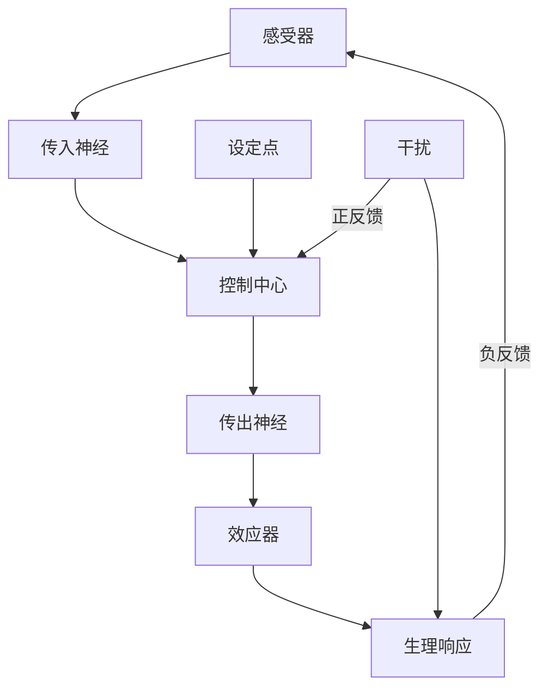
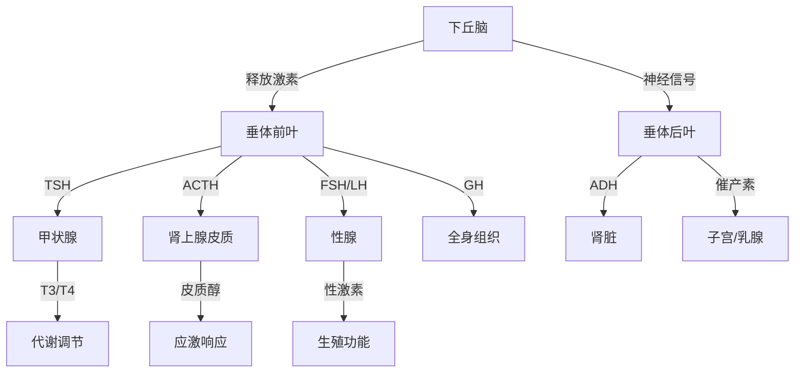

---
aliases:
  - 动物生理学
  - 动物行为学
  - 比较生理学
tags:
  - biology
  - zoology
  - physiology
  - ethology
  - animal-behavior
---

# 动物生理与行为 (Animal Physiology and Behavior)

## 1 概述 (Overview)

动物生理学研究动物机体的功能机制，动物行为学 (Ethology) 则探讨动物在自然环境中的行为模式。两者密不可分——行为通常是生理状态的表达，而生理机制又是行为的基础。

## 2 内稳态 (Homeostasis)

### 2.1 反馈调节机制 (Feedback Regulation)

### 2.2 体温调节 (Thermoregulation)

动物按体温调节方式分为：

| 类型 | 特征 | 举例 |
|-----|------|------|
| 内温动物 (Endotherm) | 代谢产热维持体温 | 鸟类、哺乳类 |
| 外温动物 (Ectotherm) | 依赖外部热源 | 爬行类、鱼类 |
| 恒温动物 (Homeotherm) | 体温恒定 | 鸟类、哺乳类 |
| 变温动物 (Poikilotherm) | 体温随环境波动 | 大多数非鸟类脊椎动物 |

基础代谢率 (Basal Metabolic Rate, BMR) 与体质量的关系：

$$
\text{BMR} = a M^{0.75}
$$

其中 $M$ 为体质量，$a$ 为物种常数。此关系即为克莱伯定律 (Kleiber's Law)。

### 2.3 渗透调节 (Osmoregulation)

细胞外液渗透压的维持通过：

$$
\pi = iCRT
$$

其中 $\pi$ 为渗透压，$i$ 为范特霍夫因子，$C$ 为溶质浓度，$R$ 为气体常数，$T$ 为绝对温度。

## 3 神经与内分泌系统 (Nervous & Endocrine Systems)

### 3.1 动作电位 (Action Potential)

神经元膜电位由 Nernst 方程描述：

$$
E_{\text{ion}} = \frac{RT}{zF} \ln \frac{[\text{ion}]_{\text{out}}}{[\text{ion}]_{\text{in}}}
$$

在哺乳动物中：

$$
E_K = -90\,\text{mV}, \quad E_{Na} = +60\,\text{mV}, \quad E_{Cl} = -70\,\text{mV}
$$

### 3.2 下丘脑-垂体轴 (Hypothalamic-Pituitary Axis)

### 3.3 激素信号转导 (Hormone Signal Transduction)

G 蛋白偶联受体 (GPCR) 信号通路：

$$
\text{激素} \xrightarrow{\text{结合}} \text{GPCR} \xrightarrow{\text{激活}} G_\alpha \xrightarrow{\text{激活}} \text{AC} \xrightarrow{\text{cAMP}} \text{PKA} \xrightarrow{\text{磷酸化}} \text{靶蛋白}
$$

## 4 循环与呼吸系统 (Circulatory & Respiratory Systems)

### 4.1 血液循环 (Blood Circulation)

心脏泵血遵循 Frank-Starling 定律：

$$
\text{SV} \propto \text{EDV} - \text{ESV}
$$

其中 SV 为每搏输出量，EDV 为舒张末期容积，ESV 为收缩末期容积。

### 4.2 气体交换 (Gas Exchange)

菲克扩散定律 (Fick's Law)：

$$
\dot{V}_{\text{gas}} = -\frac{D \cdot A \cdot \Delta P}{\Delta x}
$$

氧合血红蛋白解离曲线由 Hill 方程描述：

$$
Y = \frac{pO_2^n}{pO_2^n + P_{50}^n}
$$

其中 $n$ 为 Hill 系数，$P_{50}$ 为半饱和氧分压。

## 5 运动与行为生态 (Locomotion & Behavioral Ecology)

### 5.1 运动方式 (Locomotion Modes)

| 介质 | 运动方式 | 效率 | 示例动物 |
|------|---------|------|---------|
| 陆地 | 步行 | 低 | 哺乳类 |
| 陆地 | 奔跑 | 高 | 猎豹 |
| 陆地 | 跳跃 | 中等 | 袋鼠 |
| 空中 | 飞行 | 高 | 鸟类、蝙蝠 |
| 水中 | 游泳 | 中等 | 鱼类、鲸类 |
| 地下 | 掘洞 | 低 | 鼹鼠 |

运动能耗与速度的关系：

$$
E_{\text{met}} = a v + b
$$

### 5.2 迁徙 (Migration)

动物迁徙的导航机制包括地磁感知、太阳罗盘和星辰导航。磁感应机制可能与隐花色素 (Cryptochrome) 自由基对有关：

$$
\text{Cry} \xrightarrow{h\nu} [\text{Cry}^\bullet] \xrightarrow{B} \text{信号}
$$

### 5.3 觅食行为 (Foraging Behavior)

最优觅食理论 (Optimal Foraging Theory, OFT) 的边际值定理 (Marginal Value Theorem)：

$$
\frac{E}{T} = \frac{\int_0^{t_s} g(t) dt}{t_s + t_t}
$$

最大化能量获取率决定了动物的觅食决策。

## 6 繁殖生理 (Reproductive Physiology)

### 6.1 生殖策略 (Reproductive Strategies)

r/K 选择理论：

- r-策略 (r-selection)：个体小、寿命短、繁殖快、亲代投入少
- K-策略 (K-selection)：个体大、寿命长、繁殖慢、亲代投入多

### 6.2 激素调控 (Hormonal Regulation)

下丘脑-垂体-性腺轴 (HPG Axis) 的调控遵循脉冲式释放模式：

$$
\text{ GnRH } \xrightarrow{\text{脉冲}} \text{FSH/LH} \xrightarrow{\text{靶向}} \text{性腺} \xrightarrow{\text{性激素}} \text{负/正反馈}
$$

## 7 生物节律 (Biological Rhythms)

### 7.1 昼夜节律 (Circadian Rhythm)

核心反馈环由 Clock 和 BMAL1 蛋白驱动：

$$
\begin{aligned}
\text{Clock/BMAL1} &\xrightarrow{\text{激活}} Per, Cry \\\\
Per, Cry &\xrightarrow{\text{抑制}} \text{Clock/BMAL1}
\end{aligned}
$$

### 7.2 季节性行为 (Seasonal Behavior)

松果体褪黑素 (Melatonin) 分泌时长编码白昼长度：

$$
[\text{MLT}] \propto t_{\text{dark}}
$$

## 8 感官生理 (Sensory Physiology)

### 8.1 视觉 (Vision)

视紫红质 (Rhodopsin) 光吸收峰值：

$$
\lambda_{\text{max}} = \frac{hc}{E_{\text{min}}}
$$

不同动物视觉光谱范围不同：蜜蜂能感知紫外线，响尾蛇能感知红外线。

### 8.2 听觉与回声定位 (Hearing & Echolocation)

蝙蝠回声定位的多普勒频移效应：

$$
f' = f \frac{v + v_o}{v - v_s}
$$
